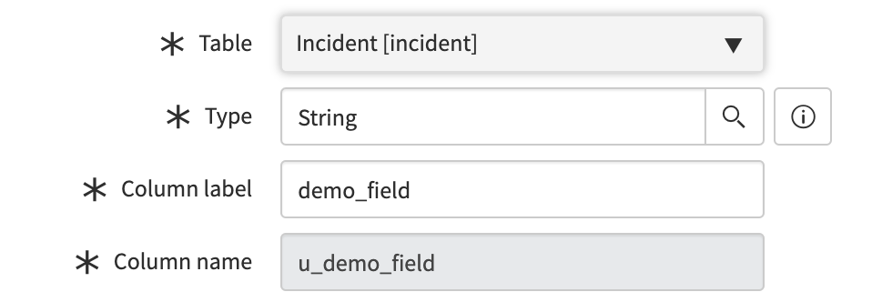

[Applied Intelligence](/docs/introduction-new-relic-ai) の一部である Incident Intelligence は、インシデントの相関性を高め、環境のノイズを低減するのに役立ちます。インシデントインテリジェンスは、すべてのインシデント、そのソース、関連イベントの概要を提供します。

## 要件 [#requirements]

まだお持ちでない方は、 [サインアップしてNew Relicアカウント](https://newrelic.com/signup) を取得してください。

Applied Intelligence のほとんどの機能を利用するには、 [フルプラットフォームのユーザーである必要があります](/docs/accounts/accounts-billing/new-relic-one-user-management/user-type) 。詳しくは、 [capabilities by user type](/docs/accounts/accounts-billing/new-relic-one-user-management/user-type/#user-type-comparison-table) をご覧ください。

## インシデント・インテリジェンスの設定 [#get-started]

インシデント・インテリジェンスを有効にするには、以下の手順に従ってください。その後、課題フィードに課題が表示されるようになります。

* [1.環境を整える（1回のみ）](#1-configure-environment).
* [2.ソースの設定](#1-configure-sources).
* [3.デスティネーションの設定](#2-configure-destinations).
* [4.パスウェイの設定](#3-configure-pathways).

## 1.環境設定（1回のみ） [#1-configure-environment]

インシデントインテリジェンスで環境を設定するには、管理者がそのためのNew Relicアカウントを選択する必要があります。このアカウントは、あなたのチームが使用しているものでなければなりません。

* **誰が環境を設定するのですか？** 管理者のみ、しかも管理者権限のあるアカウントに限ります。
* **管理者は複数の環境を設定できますか？** 親アカウントとその子アカウントにつき、1つの環境を設定できます。管理者が複数の親アカウントの権限を持っている場合は、複数の環境を設定することができます。

<Callout variant="tip">
  インシデントインテリジェンスは、クロスアカウントの製品です。つまり、どのNew Relicアカウントや外部ソースからでもデータを送信して、イベントを相関させることができます。
</Callout>

## 2.ソースの設定 [#1-configure-sources]

環境を整えた後は、インシデントソースを決定します。これがデータのインプットとなります。

以下のいずれかのソースからデータを得ることができます。

<CollapserGroup>
  <Collapser
    className="freq-link"
    id="configure-source-nr-alerts"
    title="アラート"
  >
    インシデント・インテリジェンスをアラート・バイオレーションと統合することで、モニタリングしている内容からコンテキストや相関関係を得ることができます。

    アラートからデータを取得するには

    1. **[one.newrelic.com](https://one.newrelic.com)**から、**Alerts**をクリックします。

    2. 左側の**Incident Intelligence**で、**Sources**をクリックしてから、**Alerts**をクリックします。

    3. 応用インテリジェンスに接続するポリシーを選択し、**Connect**をクリックします。

       **Sources > New Relic Alerts**で、アラートポリシーを追加、またはすでに接続しているポリシーを削除できます。

       <Callout variant="tip">
         アラートをソースとして追加しても、現在の設定や通知に影響はありません。
       </Callout>
  </Collapser>

  <Collapser
    className="freq-link"
    id="configure-algorithmia"
    title="Datarobot (旧Algorithmia)"
  >
    Incident Intelligence を Datarobot の機械学習モデルと統合することで、機械学習モデルのパフォーマンスを監視することができます。Incident Intelligence用にDatarobotを設定するには、 [統合ドキュメント](/docs/integrations/mlops-integrations/algorithmia-mlops-integration/) を参照してください。
  </Collapser>

  <Collapser
    className="freq-link"
    id="configure-aporia"
    title="アポリア（MLOps）"
  >
    Incident IntelligenceとAporiaの機械学習モデルを統合することで、機械学習モデルのパフォーマンスを監視することができます。Aporiaの統合を設定するには、 [docs](/docs/integrations/mlops-integrations/aporia-mlops-integration/) を参照してください。
  </Collapser>

  <Collapser
    className="freq-link"
    id="configure-aporia"
    title="スーパーワイズ（MLOps）"
  >
    Incident IntelligenceをSuperwiseの機械学習モデルと統合することで、機械学習モデルのパフォーマンスを監視することができます。当社のSuperwiseインテグレーションを設定するには、当社の [docs](/docs/alerts-applied-intelligence/mlops/integrations/superwise-mlops-integration/) をご覧ください。
  </Collapser>

  <Collapser
    className="freq-link"
    id="configure-source-anomalies"
    title="アノマリー"
  >
    インシデントインテリジェンスをNew Relic [Proactive Detection](/docs/alerts-applied-intelligence/applied-intelligence/proactive-detection/proactive-detection-applied-intelligence) の異常と統合することで、監視している内容からコンテキストや相関関係を得ることができます。

    New Relic Proactive Detectionのアノマリーからデータを取得するため。

    1. [one.newrelic.com](https://one.newrelic.com) から、 **Alerts& AI** をクリックします。
    2. 左側の **Incident Intelligence** の下で、 **Sources** をクリックして、 **Anomalies** をクリックします。
    3. オン（緑）に切り替えて、Applied Intelligenceに接続する構成を選択します。

    アラートポリシーを追加または削除するには、 **Alerts& AI** から、 **Sources** をクリックし、次に **Alerts** をクリックします。

    <Callout variant="tip">
      ソースとして異常を追加しても、現在のプロアクティブディテクションの設定や通知には影響しません。
    </Callout>
  </Collapser>

  <Collapser
    className="freq-link"
    id="configure-source-aws"
    title="AWS"
  >
    Incident IntelligenceをAmazon CloudWatchと統合することで、すべてのAWSサービスのインシデント管理を行うことができます。

    Amazon CloudWatchを統合するために。

    1. **[one.newrelic.com](https://one.newrelic.com)** にアクセスし、 **Alerts& AI** をクリックします。

    2. 左側の **Incident Intelligence** の下で、 **Sources** をクリックして、 **Amazon Web Services** をクリックします。

    3. URLをコピーします。

    4. [新しいAmazon SNSトピックの作成](https://docs.aws.amazon.com/sns/latest/dg/sns-getting-started.html).

    5. すべての **Alarms** の状態変更をそのトピックに転送するように CloudWatch を設定します。

       * Amazon CloudWatch UIで、 **Events> Event Pattern** をクリックします。
       * 選択 **サービス名> CloudWatch**.
       * Select **Event Type> CloudWatch Alarm State Change**.
       * **Targets> SNS Topic** を選択し、新しい Amazon SNS トピックを選択します。

    6. 新しいサブスクリプションを作成します。

       * Amazon AWS UIで、 **Create a Subscription** をクリックします。
       * 新しいAmazon SNSトピックを選択します。
       * **プロトコル> HTTPS を選択**.
       * **Endpoint** に、先ほどApplied Intelligence **Sources** からコピーしたURLを貼り付けます。
  </Collapser>

  <Collapser
    className="freq-link"
    id="configure-source-grafana"
    title="Grafana"
  >
    Incident IntelligenceとGrafanaの通知を統合することで、アプリケーションや環境全体のイベントを把握することができます。GrafanaのWebhook通知は、HTTP経由でカスタムエンドポイントに情報を送信するシンプルな方法です。

    Grafanaを新しいwebhookとして統合するために。

    1. 管理者権限でGrafanaポータルにログインし、 **Alerting** を選択します。
    2. Grafana **Notification Channels** ページで、 **New Channel> Webhook** をクリックします。
    3. **[one.newrelic.com](https://one.newrelic.com)** にアクセスし、 **Alerts& AI** をクリックします。
    4. 左側の **Incident Intelligence** の下で、 **Sources** をクリックして、 **Grafana** をクリックします。
    5. URLをコピーして、新しいGrafana webhookに貼り付けます。
  </Collapser>

  <Collapser
    className="freq-link"
    id="configure-source-pagerduty"
    title="PagerDuty"
  >
    <Callout title="有効期限（EOL）の通知">
      2021年10月をもって、Suggested Resporter、Golden Signal、Component Enrichmentなど、PagerDutyのいくつかの機能のサポートを終了しました。この移行を簡単に行う方法などの詳細については、 [Explorers Hub の記事](https://discuss.newrelic.com/t/upcoming-changes-to-capabilities-and-support-across-node-agents-suggested-pagerduty-responders-golden-signals-and-components-incident-workflows-mobile-agent-cross-application-tracing-cat-and-kubernetes-instrumentation/164481) をご覧ください。
    </Callout>

    Incident Intelligence を PagerDuty サービスに直接統合することで、PagerDuty のすべてのインシデントを取り込み、処理し、強化することができます。PagerDuty サービスを Applied Intelligence に接続しても、現在のサービスや通知に影響はありません。

    PagerDutyからデータを取得するには

    1. あなたの [PagerDuty API キー](https://support.pagerduty.com/docs/generating-api-keys) が書き込み権限を持っていることを確認してください。

    2. From **[one.newrelic.com](https://one.newrelic.com)** , click **Alerts& AI**.

    3. 左側の **Incident Intelligence** の下で、 **Sources** をクリックして、 **PagerDuty** をクリックします。

    4. あなたの [PagerDuty API キーを入力してください](https://support.pagerduty.com/docs/generating-api-keys) 。

       * キーは、書き込み権限のあるパーソナルアクセスキーまたはジェネラルアクセスキーのいずれかでなければなりません。ユーザーが作成する場合、そのユーザーはadminでなければなりません。

    5. Applied Intelligence に接続する PagerDuty サービスを選択し、 **Connect** をクリックします。

       **Sources> PagerDuty** で、サービスを追加したり、すでに接続しているサービスを削除したりすることができます。
  </Collapser>

  <Collapser
    className="freq-link"
    id="configure-source-prometheus"
    title="Prometheus Alertmanager"
  >
    Incident IntelligenceとPrometheus Alertmanagerを統合することで、Prometheusのアラートと他のソースからのイベントを受信し、相関させることができます。

    Prometheus Alertmanagerを統合する。

    1. を実行して、Alertmanagerの設定ファイルをセットアップします。

       ```
       ./alertmanager -config.file=simple.yml
       ```

    2. **[one.newrelic.com](https://one.newrelic.com)** にアクセスし、 **Alerts& AI** をクリックします。

    3. 左側の **Incident Intelligence** の下で、 **Sources** をクリックして、 **Prometheus Alertmanager** をクリックします。

    4. Prometheus Alertmanager の URL をコピーして、Alertmanager 設定ファイルの `< webhook_config>/` セクションに貼り付けます。

    5. 2つの方法のいずれかで、Prometheus Alertmanagerの設定をリロードします。

       * `SIGHUP` をプロセスに送ります。
       * HTTP `POST` リクエストを `/-/reload` エンドポイントに送信します。
  </Collapser>

  <Collapser
    className="freq-link"
    id="configure-source-rest-api"
    title="REST API"
  >
    Incident Intelligenceは、専用のREST APIインターフェイスをサポートしており、追加のシステムとの統合が可能です。このインターフェースでは、お客様のコードや他の監視ソリューションをインスツルメンテーションして、あらゆる種類のメトリックやイベントをレポートすることができます。

    * メトリクスには、CPU、メモリ、ディスク使用率などの生のデータポイントや、ビジネスKPIなどがあります。

    * イベントには、監視アラート、デプロイメントイベント、インシデント、例外、その他記述したい状態の変化などがあります。

      また、お客様自身のシステムやアプリケーションから、あらゆるタイプのデータを直接Incident Intelligenceに送信することができます。REST APIは、安全なトークンベースの認証をサポートし、入力としてJSONコンテンツを受け入れます。

      認証の詳細やAPIリファレンスの全文は、 [REST API for New Relic Applied Intelligence](/docs/rest-api-new-relic-ai) をご覧ください。
  </Collapser>

  <Collapser
    className="freq-link"
    id="configure-source-splunk"
    title="Splunk"
  >
    インシデントインテリジェンスをSplunkのログモニタリングと統合することで、以下のことが可能になります。

    * お使いの環境のログデータを検索やキーワードのレポートにご利用ください。

    * アラートや検索レポートを、他のメトリクスやインシデントと関連付けることができます。

      <Callout variant="important">
        Applied Intelligenceは、Splunk Light、Splunk Cloud、Splunk Enterpriseのバージョン6.3以上に対応しています。
      </Callout>

      Splunkからデータを取得するには

    1. **Splunk コンソール** で、関連するイベントの検索を開始します。
    2. 検索結果をアラートとして保存し、アラートの条件を設定した後、配信方法としてWebhookを選択します。
    3. **[one.newrelic.com](https://one.newrelic.com)** にアクセスし、 **Alerts& AI** をクリックします。
    4. 左側の **Incident Intelligence** の下で、 **Sources** をクリックして、 **Splunk** をクリックします。
    5. コレクターの URL をコピーして、Splunk コンソールの webhook エンドポイントに貼り付けます。
    6. オプションです。Splunk トークンを使用して、 [アラートデータを Splunk メタデータでリッチ化する](#enrich-splunk-search).
  </Collapser>

  <Collapser
    className="freq-link"
    id="enrich-splunk-search"
    title="Splunkのメタデータ"
  >
    アラートデータをSplunkのメタデータでリッチ化するには、Splunkトークンを使用します。これにより、メタデータや検索結果の最初の行の値を含む検索データを活用することができます。

    <table>
      <thead>
        <tr>
          <th style={{ width: "200px" }}>
            以下を行う場合...
          </th>

          <th>
            操作...
          </th>
        </tr>
      </thead>

      <tbody>
        <tr>
          <td>
            検索データへのアクセス
          </td>

          <td>
            フォーマット `$<フィールド名>$` を使用してください。たとえば、 `$app$` は、検索対象のアプリのコンテキストを表しています。
          </td>
        </tr>

        <tr>
          <td>
            アクセスフィールドの値
          </td>

          <td>
            検索で返された最初の結果行のフィールド値にアクセスするには、 `$result という形式を使用します。<フィールド名>$`.たとえば、ホスト値には `$result.host$` を、ソース・タイプには `$result.sourcetype$` を使用します。
          </td>
        </tr>

        <tr>
          <td>
            変数の使用
          </td>

          <td>
            Splunk の検索で **Selected fields** のいずれかを活用し、 **Selected fields** に任意のユニークなフィールドを追加して、データを変数として利用できるようにします。

            以下のフィールドには、相関エンジンへのヒントが自動的に与えられます。

            * `app`: parsed as `APPLICATION_NAME`
            * `application:`parsed as `APPLICATION_NAME`
            * `APPLICATION_NAME`: `APPLICATION_NAME と解析されます。`
            * `クラスタ`: `として解析されます CLUSTER_NAME`
            * `コンピュータ`: `と解析される HOST_NAME`
            * `Dc`: `として解析されます DATACENTER_NAME`
            * `datacenter`: `DATACENTER_NAME と解析されます。`
            * `ホスト`: `HOST_NAME と解析されます。`
            * `host_name`: `HOST_NAME と解析されます。`
            * `ホスト名：` `HOST_NAME として解析されます。`
            * `トランザクション`: `のように解析される EVENT_ID`
            * `Transaction_id`: `EVENT_ID として解析されます。`
            * `user`: `USER_NAME と解析されます。`
          </td>
        </tr>
      </tbody>
    </table>
  </Collapser>
</CollapserGroup>

## 3.配信先の設定（ServiceNowなど） [#2-configure-destinations]

ソースの設定が完了したら、次はデスティネーションの設定です。これはインシデントを表示するためのデータ出力です。

### ServiceNowの設定（例） [#configure-servicenow]

ServiceNowを宛先として使用することで、貴重な違反データを新しいServiceNowのインシデントチケットにプッシュすることができます。

<CollapserGroup>
  <Collapser
    id="servicenow-destination"
    title="ServiceNowへのデータ送信"
  >
    Incident IntelligenceがServiceNowにデータを送信するように設定するには、以下の手順に従います。

    1. **[one.newrelic.com](https://one.newrelic.com)** をクリックし、 **Alerts& AI** をクリックし、左のナビで **Incident Intelligence** をクリックし、 **Destinations** をクリックし、 **ServiceNow** をクリックします。

    2. **必須：** チャンネル名を入力してください。これは、アプライド マテリアルズの内部で、送信先を特定するために使用されます（例：Pathways）。

    3. **必須：** ServiceNowの認証情報を入力してください。

       1. チームのドメイン（これは一意でなければならない。 2つの宛先が同じドメインを持つことはできない）。
       2. ユーザー名
       3. パスワード

    4. 画面の指示に従って2ウェイ・インテグレーションを行う。

       1. この [XML ファイルを開いてダウンロードする](https://storage.cloud.google.com/newrelic-connect/workflows-proxy-production.xml) 。
       2. ServiceNowのサイドバーメニューで、 **System Definition> Business Rule** を選択します。
       3. 列のヘッダーにあるメニューアイコンをクリックし、「XMLのインポート」を選択して、ダウンロードしたXMLファイルをアップロードします。

       双方向の統合により、ServiceNowのインシデントはApplied Intelligenceの問題への変更に合わせて更新されます。

       ServiceNowのインシデントを閉じると、それに対応するNew Relicの課題も閉じられます。

       New Relicの課題が解決されると、対応するServiceNowのインシデントがクローズされます。

       ## カスタム通知メッセージ [#custom-message]

       Applied Intelligenceでは、カスタマイズセクションのインターフェースにJinja2というテンプレートフレームワークを使用しています。Valueフィールドは、 [有効な](https://cryptic-cliffs-32040.herokuapp.com/) Jinjaの構文でなければなりません。

       デフォルトでは、インターフェイスはServiceNowのデフォルトフィールドのセットを入力します。

       カスタムフィールドを追加する際には、使用するServiceNowのフィールド名を入力します。

       issue updateで選択したフィールドをスキップしたい場合は、選択した値の最後に `| skip_on_update` という文字列を追加します。

       <Callout variant="tip">
         デフォルトでは、ServiceNowは、カスタム値の先頭に `u_` を追加します。ServiceNowの属性にマッピングする場合は、カラム名の値を使用してください。
       </Callout>

       

       <figcaption>
         名前は小文字でアンダースコアで区切られている必要がありますので、ご注意ください。
       </figcaption>

       [カスタム通知メッセージ属性の説明を見るにはここをクリック](/docs/alerts-applied-intelligence/applied-intelligence/incident-intelligence/incident-intelligence-destination-examples#webhook-format) 。

       [Jinja2 Useful Syntax](/docs/alerts-applied-intelligence/applied-intelligence/incident-intelligence/incident-intelligence-destination-examples#jinja2-useful) を見るにはここをクリックしてください。
  </Collapser>
</CollapserGroup>

### その他の目的地 [#other-destinations]

他の目的地を設定することができます。

<CollapserGroup>
  <Collapser
    id="pager-duty-destination"
    title="PagerDutyへのデータ送信"
  >
    <Callout title="有効期限（EOL）の通知">
      2021年10月をもって、Suggested Resporter、Golden Signal、Component Enrichmentなど、PagerDutyのいくつかの機能のサポートを終了しました。この移行を簡単に行う方法などの詳細については、 [Explorers Hub の記事](https://discuss.newrelic.com/t/upcoming-changes-to-capabilities-and-support-across-node-agents-suggested-pagerduty-responders-golden-signals-and-components-incident-workflows-mobile-agent-cross-application-tracing-cat-and-kubernetes-instrumentation/164481) をご覧ください。
    </Callout>

    **推奨**: デスティネーションとして使用する PagerDuty サービスを新規に作成します。PagerDutyのサービスはソースとしても使用できるため、データの入力と出力を区別するのに役立ちます。

    PagerDutyのデスティネーションを作成するには

    1. **[one.newrelic.com](https://one.newrelic.com)** をクリックし、 **Alerts& AI** をクリックし、左のナビで **Incident Intelligence** をクリックし、 **Destinations** をクリックし、次に **PagerDuty** をクリックします。

    2. あなたの [PagerDuty API キーを入力してください](https://support.pagerduty.com/docs/generating-api-keys) 。

       * キーは、書き込み権限のあるパーソナルアクセスキーまたはジェネラルアクセスキーのいずれかでなければなりません。ユーザーによって作成された場合、そのユーザーはadminでなければなりません。PagerDutyのソースにAPIキーを設定している場合は、同じキーを使用することができます。

    3. Applied Intelligence に接続する PagerDuty サービスを選択し、 **Connect** をクリックします。

       準備ができたら、1つまたは複数のPagerDutyの宛先にポリシーを追加できます。また、必要に応じて、既存のサービスからポリシーを移行したり、ソースのままにしておくこともできます。

       **Destinations> PagerDuty** のページからも可能です。

    * 自分のサービスの権限を確認します。完了したら **Authorize** をクリックします。

    * PagerDutyの配信先から既存のサービスを追加・削除することができます。

    * 任意のサービスのパーミッションを編集することができます。

      PagerDutyの送信先を設定するには、以下の設定を行います。

      <table>
        <thead>
          <tr>
            <th style={{ width: "250px" }}>
              コンフィギュレーション設定
            </th>

            <th>
              説明
            </th>
          </tr>
        </thead>

        <tbody>
          <tr>
            <td>
              新しいインシデントのトリガー
            </td>

            <td>
              **必須**.相関関係にある親インシデントをトリガーすることで、問題をより早く特定することができます。
            </td>
          </tr>

          <tr>
            <td>
              インシデントタイトルの編集
            </td>

            <td>
              **必須**.インシデントのタイトルを変更すると、問題の方向性や理解がしやすくなります。
            </td>
          </tr>

          <tr>
            <td>
              新しい統合の追加
            </td>

            <td>
              **必須**.選択したサービスのインシデント作成を可能にする統合を追加します。
            </td>
          </tr>

          <tr>
            <td>
              Webhookエクステンションの追加
            </td>

            <td>
              PagerDuty のユーザアクションを New Relic に同期するための webhook エクステンションを追加しました。これにより、相関関係のある課題の状態を更新することができます。
            </td>
          </tr>

          <tr>
            <td>
              相関関係にあるインシデントの自動解決
            </td>

            <td>
              この機能を有効にすると、相関する親子のインシデントが解決され、自動的にクローズされます。
            </td>
          </tr>

          <tr>
            <td>
              PagerDutyでアクションを起こすユーザーの選択
            </td>

            <td>
              PagerDuty との深い統合を有効にする前に、ユーザを選択する必要があります。ユーザーを選択すると、そのユーザーは以下のことができるようになります。

              * **インシデントにメモを追加する（必須）**: インシデントのメモは、インシデントにコンテキストを付与するために使用されます。
              * **Acknowledge triggered incidents**: 有効にすると、Applied IntelligenceはPagerDutyで新たにトリガーされたインシデントを確認し、相関をとってから通知します。
              * **Use the original escalation policy**: 有効にすると、ソースサービスのエスカレーションポリシーが各インシデントに適用されます。
            </td>
          </tr>
        </tbody>
      </table>
  </Collapser>

  <Collapser
    id="webhook-destination"
    title="Webhookによるデータ送信"
  >
    Incident Intelligence は、イベント本文を JSON 形式で HTTPS POST で送信します。システムは、エンドポイントが成功したHTTPコード(`2xx`)を返すことを期待しています。

    Webhookでデータを送信するようにIncident Intelligenceを設定するには、以下の手順に従います。

    1. **[one.newrelic.com](https://one.newrelic.com)** をクリックし、 **Alerts& AI** をクリックし、左のナビで **Incident Intelligence** をクリックし、 **Destinations** をクリックし、次に **Webhook** をクリックします。

    2. **必須：** 固有の `webhook キーを設定する` Applied Intelligence でこの webhook 構成とその特定の設定を参照するために使用される。

    3. **必須：** Webhook のペイロードを送信する `宛先エンドポイント` を設定します。

    4. 任意のステップ

       * `カスタムヘッダーの設定` 、これは `key:value` のペアで、リクエストと一緒に送信されるヘッダーです。例： `" 認証" " ベアラ" < ベアラトークン>`
       * `カスタムペイロード` テンプレートを設定し、New Relic フィールドをマッピングして、宛先ツールの期待される名前と形式に一致させるために使用できます。
       * Configure `priority mapping` (critical, high, medium, or low), New Relic の優先度を宛先で予想される優先度にマッピングするために使用されます。

    <Callout variant="tip">
      エラーが発生すると数分間、指数関数的なバックオフで数回トリガーされるリトライ機構があります。リトライの上限に達すると、Webhookは自動的に無効になります。
    </Callout>
  </Collapser>
</CollapserGroup>

送信先テンプレート、Webhook フォーマット、JSON スキーマの例については、 [Incident Intelligence の送信先の例](/docs/new-relic-one/use-new-relic-one/new-relic-ai/incident-intelligence-destination-examples) を参照してください。

## 4.パスウェイの設定 [#3-configure-pathways]

インシデントからの通知をいつ、どこで受け取るかをコントロールするために、パスウェイを設定することができます。

**パスウェイを追加するには**

1. **[one.newrelic.com](https://one.newrelic.com)** をクリックし、 **Alerts& AI** をクリックし、左のナビで **Incident Intelligence** をクリックし、 **Pathways** をクリックし、 **Add a pathway** をクリックします。

2. クエリビルダボックスで、 `application/name` のように属性を選択します。

   * これは、PagerDutyのインシデントやNew Relicのアラート違反で利用できるすべての属性のリストから選ぶこともできますし、独自の属性を追加することもできます。

3. 論理演算子を選択します。例えば、 `は` を含みます。

4. 論理式を完成させるための具体的な値を入力します。

   * ソースで作成されたすべてのissueを含めるには、 **Send everything** を選択します。(1つのPagerDutyサービスのみですべてのインシデントを管理する場合に使用します)。
   * より複雑なロジックを構築するには、 `AND/OR` 演算子を使用します。

5. [目的地を1つまたは複数選択してください](#2-configure-destinations) 。

既存のパスウェイを編集または削除するには、「 **Pathways** 」ページでパスウェイの名前にマウスオーバーします。

## 次のステップ [#next]

インシデントのソースとデスティネーションを設定したところで、 [インシデント・インテリジェンスの使用方法について](/docs/alerts-applied-intelligence/incident-intelligence/) をご覧ください。