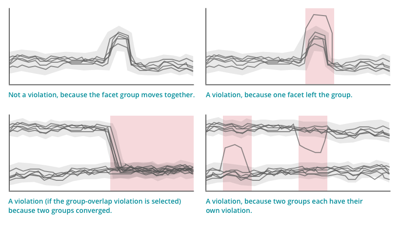

[アラート](/docs/alerts/new-relic-alerts/getting-started/introduction-new-relic-alerts) は、 [NRQL 条件](/docs/alerts/new-relic-alerts/defining-conditions/create-alert-conditions-nrql-queries) を、 [3 つのしきい値タイプ](/docs/alerts/new-relic-alerts/defining-conditions/create-alert-conditions-nrql-queries#threshold-types) ：静的、ベースライン、異常値で提供しています。このドキュメントでは、外れ値のしきい値タイプがどのように機能するかを説明し、 [使用例と NRQL クエリ](#example-use-cases) を示し、 [外れ値の条件](#create) を作成する方法を説明します。

<Callout variant="important">
  NRQL アラートは ****シンセティック モニタのアラート ポリシーには影響しません。 [たとえば、 ](http://docs.newrelic.com/docs/synthetics/synthetic-monitoring/using-monitors/alerts-synthetic-monitoring#alerts-existing-monitor)[NRQL アラートをミュートする](/docs/alerts-applied-intelligence/new-relic-alerts/alert-notifications/muting-rules-suppress-notifications) は、 ****合成モニターのアラートをミュートすることはありません。
</Callout>

## 外れ値検出とは？ [#feature]

ソフトウェアの開発や運用では、ほぼ同じ挙動をすると思われるメンバーで構成されたグループを持つことが一般的です。例：ロードバランサーを使用しているサーバーの場合、サーバーへのトラフィックは上下することがありますが、すべてのサーバーのトラフィックはかなりタイトなグループにとどまっているはずです。外れ値検出の様子は、NerdBytesのビデオ（2分51秒）でご覧いただけます。

<Video
  id="_Hh7HZViJW8"
  type="youtube"
/>

NRQLアラートの外れ値検出機能は、 [ファセット化されたNRQLクエリ](/docs/insights/nrql-new-relic-query-language/nrql-resources/nrql-syntax-components-functions#sel-facet) が返すデータを解析します。

* 指定した予想グループの数を探す
* 設定した感度と時間範囲に基づいて、外れ値（グループから逸脱した値）を探す

さらに、複数のグループを持つクエリでは、グループが同じ動作をし始めたときに通知を受けるように選択することができます。



<figcaption>
  この視覚教材は、違反のきっかけとなる状況とそうでない状況の種類を理解するのに役立ちます。
</figcaption>

この計算のルールとロジックについては、 [Outlier detection rules](#rules-logic) を参照してください。

<Callout variant="tip">
  注：この機能は、監視対象の値の過去の挙動を考慮しておらず、現在報告されているデータの中でのみ異常値を探します。過去の挙動を考慮したアラートタイプについては、 [ベースラインアラート](/docs/alerts/new-relic-alerts/defining-conditions/create-baseline-alert-conditions) を参照してください。
</Callout>

## 使用例

これらの使用例は、外れ値のしきい値タイプを使用するタイミングを理解するのに役立ちます。なお、外れ値機能は、 [`FACET` 節](/docs/insights/nrql-new-relic-query-language/nrql-resources/nrql-syntax-components-functions#sel-facet) を持つNRQLクエリが必要です。

<CollapserGroup>
  <Collapser
    id="load-balanced-servers-uneven"
    title="ロードバランスされたサーバーの負荷が不均一になった場合に通知する"
  >
    ロードバランサーは、ウェブトラフィックを5つの異なるサーバーにほぼ均等に分割します。いずれかのサーバーのトラフィックが他のサーバーに比べて著しく多くなったり少なくなったりした場合に、通知を送るように設定できます。

    クエリの例。

    ```
    SELECT average(cpuPercent) FROM SystemSample WHERE apmApplicationNames = '<var>MY-APP-NAME</var>' FACET hostname
    ```
  </Collapser>

  <Collapser
    id="load-balanced-app-misbehaving"
    title="負荷分散されたアプリケーションに誤動作するインスタンスがある場合に通知する"
  >
    ロードバランサーの後ろにあるアプリケーションインスタンスは、同様のスループット、エラーレート、および応答時間を持つ必要があります。インスタンスの状態が悪かったり、ロードバランサーの設定が間違っていたりすると、このような結果にはなりません。アプリケーションの全体的なエラー率が大きく上昇していない場合、集約されたメトリクスを使用して1つまたは2つの悪いアプリケーションインスタンスを検出することは難しいかもしれません。

    アプリのインスタンスのスループット、エラーレート、レスポンスタイムがグループの他の部分から大きく逸脱した場合に通知を設定することができます。

    クエリの例。

    ```
    SELECT average(duration) FROM Transaction WHERE appName = '<var>MY-APP-NAME</var>' FACET host
    ```
  </Collapser>

  <Collapser
    id="changes-environments"
    title="異なる環境下での変化に対応する"
  >
    あるアプリケーションが2つの異なる環境にデプロイされ、それぞれに10個のアプリケーションインスタンスがあります。一方の環境は実験的で、他方の環境よりも多くのエラーが発生します。しかし、同じ環境にあるインスタンスは、ほぼ同じ数のエラーが発生するはずです。

    あるインスタンスが、同じ環境にある他のインスタンスよりも多くのエラーが発生し始めたときに通知を設定することができます。また、2つの環境でお互いに同じ数のエラーが発生し始めたときに通知を設定することができます。
  </Collapser>

  <Collapser
    id="timezone-related-changes"
    title="タイムゾーンの変更に伴う通知"
  >
    ある企業のログインユーザー数は、4つのアプリケーションそれぞれでほぼ同じですが、その企業が運営する3つのタイムゾーンそれぞれで大きく異なります。

    いずれかのアプリケーションが、他のアプリケーションよりも特定のタイムゾーンからのトラフィックが多くなったり少なくなったりした場合に、通知を設定することができます。異なるタイムゾーンからのトラフィックが同じ場合もあるので、タイムゾーングループが重なった場合は通知しないようにアラート条件を設定します。
  </Collapser>
</CollapserGroup>

この機能の詳細については、 [Outlier rules and logic](#rules-logic) を参照してください。

## 異常値警報条件の作成 [#create]

異常値検出を使用するNRQLアラートを作成するには

1. 条件作成時に、 **Select a product** の下に、 **NRQL** を選択します。
2. **Threshold type** には、 **Outlier** を選択します。
3. 警告したい値を返す [`FACET` 句](/docs/insights/nrql-new-relic-query-language/nrql-resources/nrql-syntax-components-functions#sel-facet) を持つ [NRQL クエリを作成します。](/docs/alerts/new-relic-alerts/defining-conditions/create-alert-conditions-nrql-queries#syntax)
4. [* 返された値がどのようにグループ化されるかに応じて、 **予想されるグループの数** を設定してください。* グループの中心からのずれと、違反のきっかけとなる継続時間を調整します。](/docs/alerts/new-relic-alerts/defining-conditions/create-alert-conditions-nrql-queries#syntax)
5. [任意です。 ](/docs/alerts/new-relic-alerts/defining-conditions/create-alert-conditions-nrql-queries#syntax)[警告のしきい値](/docs/alerts/new-relic-alerts/defining-conditions/define-thresholds-trigger-alert#threshold-levels) を追加し、その偏差を設定します。
6. 残りの利用可能なオプションを設定し、保存します。

## ルールとロジック [#rules-logic]

ここでは、外れ値検出がどのように機能するか、そのルールと論理を説明します。

<CollapserGroup>
  <Collapser
    id="alert-logic"
    title="警報条件ロジックの詳細"
  >
    条件を作成した後、 [収穫サイクル](/docs/using-new-relic/welcome-new-relic/getting-started/glossary#harvest-cycle) 毎に一度、クエリが実行され、条件が適用されます。ベースラインアラートとは異なり、異常値検出では計算に過去のデータを使用せず、現在収集されているデータを使用して計算されます。

    アラートは、クエリから返されたデータを、条件作成時に選択した数のグループに分割しようとします。

    グループごとに、おおよその平均値を算出します。条件作成時に選択した許容偏差は、その平均値を中心に算出されます。グループのメンバーが許容偏差値から外れると、違反となります。

    **Trigger when groups overlap** が選択されている場合、Alerts はグループの収束を検出します。条件が2つ以上のグループを探していて、返された値がその数の異なるグループに分けられない場合は、違反となります。このような「オーバーラップ」イベントは、チャート上ではグループの帯が触れることで表現されます。

    " この機能は過去の行動を考慮していないため、データが特定のグループに"所属しているとみなされることはありません。例えば、他の値と入れ替わった値は違反の原因にはなりません。また、グループ全体が一緒に移動した場合も違反とはなりません。
  </Collapser>

  <Collapser
    id="nrql-query-rules"
    title="NRQLクエリのルールと制限"
  >
    NRQL クエリは、 [faceted query](/docs/insights/nrql-new-relic-query-language/nrql-resources/nrql-syntax-components-functions#sel-facet) である必要があります。

    返されるユニークな値の数は500以下でなければなりません。クエリがこの数以上の値を返す場合、条件は作成されません。作成された後に、クエリがこの数以上の値を返した場合、アラートは失敗します。
  </Collapser>

  <Collapser
    id="unreturned-data"
    title="返却されないデータはゼロ値"
  >
    クエリが一連の値を返す場合、実際に返された値のみが考慮されます。値が計算に利用できない場合（ハーベストサイクルの1つで収集されていたものが収集されなくなった場合を含む）、その値はゼロとしてレンダリングされ、考慮されません。つまり、返却されないゼロ値の挙動が違反の引き金になることはありません。
  </Collapser>
</CollapserGroup>