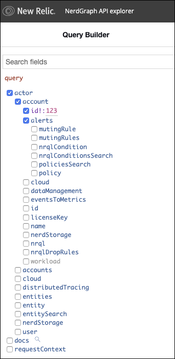

[GraphQL NerdGraph API](/docs/apis/nerdgraph/get-started/introduction-new-relic-nerdgraph) を使って、ポリシー、条件、ミューティングルールをプログラムで管理することができます。これは、New Relic One や [REST API](/docs/alerts/rest-api-alerts/new-relic-alerts-rest-api/rest-api-calls-new-relic-alerts) での管理に代わる強力な手段です。

## NerdGraphで管理できるアラート機能 [#what-you-can-do]

NerdGraphではこんなことができます。

* [ポリシーの管理](/docs/alerts/alerts-nerdgraph/nerdgraph-examples/nerdgraph-api-alerts-policies)
* [NRQL条件の使用](/docs/alerts/alerts-nerdgraph/nerdgraph-examples/nerdgraph-api-alerts-nrql-conditions)
* [通知を抑制するミューティングルールの追加](/docs/alerts/new-relic-alerts/managing-notification-channels/muting-rules-suppress-notifications)
* [通知チャネルの管理](/docs/alerts-applied-intelligence/new-relic-alerts/alerts-nerdgraph/nerdgraph-api-notification-channels/)
* [カスタマイズによる信号ロスとギャップフィリング](/docs/alerts-applied-intelligence/new-relic-alerts/alerts-nerdgraph/nerdgraph-api-loss-signal-gap-filling/)

アラートクエリやミューテーションを発見する最も簡単な方法は、NerdGraph APIエクスプローラです。

## NerdGraph APIエクスプローラ

[NerdGraph API explorer](https://api.newrelic.com/graphiql) はGraphiQLエディタで、クエリやミューテーションのプロトタイプを作ることができます。ここでは、クエリや変異のためのフィールドを見つける方法を示す例をご紹介します。

<Callout variant="tip">
  NerdGraphの一般的な情報については、 [Introduction to NerdGraph](/docs/apis/nerdgraph/get-started/introduction-new-relic-nerdgraph) を参照してください。
</Callout>

### クエリ

さまざまなクエリを調べるには、NerdGraph API エクスプローラーで `actor.account.alerts` 名前空間の下で利用可能なクエリを探します。

### 変異

さまざまな変異を調べるには、NerdGraph API エクスプローラーの **アラート** ドロップダウンを見てください。

