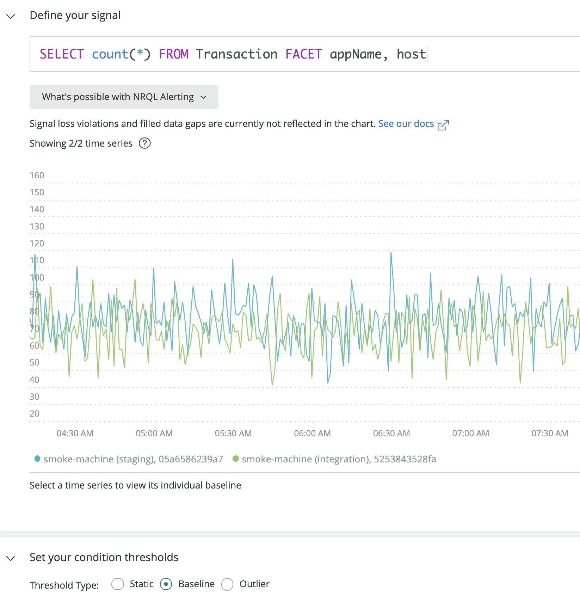

ベースライン条件を使用して、データの挙動に対応する違反[閾値](/docs/using-new-relic/welcome-new-relic/get-started/glossary#alert-threshold)を定義できます。

ベースラインアラートは、以下のような[条件](/docs/using-new-relic/welcome-new-relic/get-started/glossary#alert-condition)を作成する際に役立ちます。

* データの挙動が異常な場合にのみ通知する。
* 日次または週次のトレンドを含むデータの変化とトレンドに動的に対応する

さらに、ベースラインアラートは、既知の行動がまだ存在しない新規アプリケーションにおいて上手く機能します。

## 使用方法 [#baseline-overview]

ベースライン条件のデータソースを選択する場合（例：APMメトリック）は、そのデータの過去の値を使用して、近い将来のデータの挙動を動的に予測します。

その値について予測された将来の挙動の行は、**ベースライン** と呼ばれます。ベースライン条件UIのプレビューチャートに黒色の点線として表示されます。

ベースラインアラート条件UIを使用すると、以下のことができます。

* データソースの変動に対する条件の感度を調整する。
* 違反をトリガーする挙動を設定します（「5分間を超えて逸脱」など）。
* 条件が上方の違反、下方の違反、または両方をチェックするかどうかを設定する。

データが予測された「正常」な挙動から逸脱し、選択した基準を満たすと、通知が送信されます。

## ベースライン閾値を設定する

<figcaption>
  **[one.newrelic.com](https://one.newrelic.com) > AI & アラート > ポリシー >（ポリシーの作成または選択）> アラート条件の作成: **ベースラインアラート条件により、異常動作が検出されたときにのみ違反を生成するインテリジェントな自己調整の閾値を設定できます。
</figcaption>

ベースライン条件を作成するには、**[one.newrelic.com](https://one.newrelic.com) > AIおよびアラート > ポリシー >（ポリシーの作成または選択）> アラート条件の作成**の順に移動します。[条件](/docs/alerts/new-relic-alerts/defining-conditions/define-alert-conditions#create-condition)の作成を開始するときに、次の[データソース](#availability)のいずれかを選択します。

* NRQL: NRQL条件を作成し、ベースラインを選択
* ARM: アプリケーションメトリックベースライン
* ブラウザ: メトリックベースライン

ベースラインの閾値を設定する際のポイント：

* [ベースラインの方向](#upper-lower)を設定する際に、ベースラインの上または下で発生する違反を監視するようにします。
* プレビューチャートは、表示データの[2日もしくは7日](#days)のいずれかに設定します。（[NRQLアラート条件](/docs/alerts/new-relic-alerts/defining-conditions/create-alert-conditions-nrql-queries)には適用されません）。
* スライダーバーを使用して、プレビューチャートにベースラインの周囲のライトグレーの領域として表される **Critical**閾値の感度を調整します。ベースラインの周囲の帯域が狭いほど、感度が高くなり、より多くの違反が生成されます。
* オプション:  [**Warning**閾値](/docs/alerts/new-relic-alerts/defining-conditions/set-thresholds-alert-condition#threshold-levels)を作成します（ベースライン周辺のダークグレーの領域）。
* NRQLアラートに関しては、[認められているNRQLクエリの種類](/docs/alerts/new-relic-alerts/defining-conditions/create-alert-conditions-nrql-queries#threshold-types)。
* アラート条件が複数のアプリケーションに適用されている場合は、チャートの上のドロップダウンから使用するメトリクスを選択できます。（NRQLアラート条件には適用されません）。

## ファセットベースライン条件 [#baseline-facets]

<figcaption>
  NRQLアラート条件はファセットベースラインをサポートします。グラフの凡例で、時系列をクリックして単一のファセットにスコープを設定します。
</figcaption>

ベースライン条件に対してファセットNRQLクエリを実行すると、単一のベースラインに結果を絞り込むことができます。

<figcaption>
  **完全な時系列リストに戻る**をクリックすると、すべてのファセットの表示に戻ります。
</figcaption>

単一の時系列には、ベースライン、閾値バンド、1つ以上の違反領域（存在する場合）が表示されます。

## ベースラインの規則と設定 [#baseline-algorithm]

以下に、UIのしくみの詳細を示します。

<CollapserGroup>
  <Collapser
    id="baseline-rules"
    title="ベースラインの作成に関する規則"
  >
    ベースライン条件のアルゴリズムは、数学的に複雑です。以下に、予測能力に関する主な規則を示します。

    <table>
      <thead>
        <tr>
          <th style={{ width: "200px" }}>
            データ特性
          </th>

          <th>
            ベースラインの規則
          </th>
        </tr>
      </thead>

      <tbody>
        <tr>
          <td>
            データの存続期間
          </td>

          <td>
            ベースラインは、最初の作成時に、データの可用性とベースラインの種類によって1～4週間のデータを使用して計算されます。作成後のアルゴリズムは、より新しいデータに重みが付けられた長期間にわたるデータ変動を取り入れます。

            短期間のみ存在したデータに対しては、ベースラインが大きく変動して精度が上がらない可能性が高くなります。これは、通常の値と挙動を特定するためのデータが十分に確保されていないためです。データの履歴が収集されるに従って、ベースラインと閾値の精度は高くなります。
          </td>
        </tr>

        <tr>
          <td>
            データの整合性
          </td>

          <td>
            一定の範囲にとどまるメトリック値またはトレンドが緩やかで安定している場合は、予測の精度が高まり、ベースラインの周囲の閾値が狭くなります。変動が激しく予測が困難なデータの閾値の範囲は広くなります。
          </td>
        </tr>

        <tr>
          <td>
            周期的な変動
          </td>

          <td>
            1週間より短い周期的な変動に対して（毎週水曜日午後1時のデプロイメント、夜間レポートなど）、ベースラインアルゴリズムは周期的な変動を探して、それに対応しようとします。
          </td>
        </tr>
      </tbody>
    </table>
  </Collapser>

  <Collapser
    id="upper-lower"
    title="ベースラインの方向: 上限または下限を選択"
  >
    条件に違反する挙動は、ベースラインを超えるか（「上限」）、ベースラインを下回るか（「下限」）、またはその両方に設定できます。これは、**Baseline direction**セレクタで選択できます。

    使用例：

    * エラー率などのデータソースの場合は、一般に値が下降した場合は問題にならずに上昇した場合にのみ問題になるため、**Upper**設定を使用します。

    * スループットなどのデータソースの場合は、突然の上向きの変動はよく発生することで、突然の下向きの変動は問題の兆候を示している可能性があるため、**Lower**設定を使用します。

      以下に、それぞれのベースラインの方向の設定で、データの大きな変動がどのように扱われるかに関する例を示します。赤い領域は違反を表します。

    
  </Collapser>

  <Collapser
    id="days"
    title="チャートのプレビュー: 2日または7日を選択"
  >
    閾値を設定する場合、プレビューチャートには**2日前から**または**7日前から**を表示するオプションがあります。これらのオプションは、ベースラインを計算するために使用する期間では**なく**、プレビューの表示に使用する時間範囲を指定するだけです。ベースラインを計算するために使用する時間範囲の詳細については、[アルゴリズムの規則](#baseline-rules)をご覧ください。
  </Collapser>
</CollapserGroup>