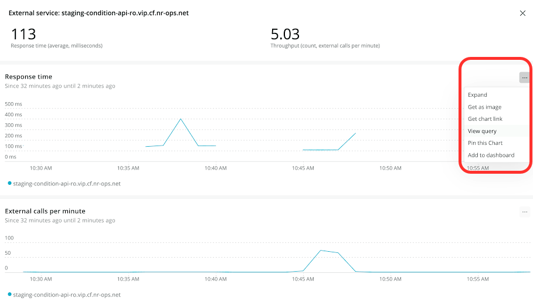

While there are various ways to create APM metric alert conditions, we recommend using NRQL because this provides additional controls, improved detection time, and consistency across all data types.

In 2021, we will be making it easier to create alert NRQL conditions from charts and queries throughout New Relic One. Until that integration is complete, please use the method described below. We'll show an example of how to create an APM external service condition using NRQL.

To set up an APM metric condition, it's a two-part process: you first need to identify the entity and then create the NRQL condition.

## Identify the entity [#identify]

Here's how to get started:

1. Go to [one.newrelic.com](https://one.newrelic.com), and click **APM** in the toolbar.
2. Find the service you’d like to alert on.
3. Click on the service.
4. In the left navigation pane, click **External services**.
5. Under **Top 20 external services**, find the service you want and click on it.

   
6. On the right side of the page, where you see graphs for **Response time** and **External calls per minute** (throughput), decide which of these two options you would like to alert on.
7. In the upper-right corner of the graph you choose, click the three dots, and select **View query**.

   <Callout variant="tip">
     If you don’t see these three dots, ensure the **Show new view** option at the top of the page is enabled.
   </Callout>

   
8. Copy the query to your clipboard.
   * If you choose response time, your query may look like this:

     
   * If you choose external calls per minute, your query may look like this:

     

When your query is on the clipboard, continue to the next section to create the NRQL alert condition.

## Create the NRQL condition [#nrql-condition]

After you generate the query, complete the following:

1. Navigate to the alert's policy where you’d like to create this condition.
2. Click **Add a condition**, select the **NRQL** tab, and click **Next, define thresholds..**.
3. In **Define your signal**, paste the query from your clipboard.
4. Remove any `LIMIT`, `SINCE...AGO`, and `TIMESERIES` clauses. These must be removed for the NRQL query syntax to be valid.

   <Callout variant="tip">
     If no results are returned, ensure you are in the correct account using the account dropdown in the upper-left corner.
   </Callout>

   
5. Fill out the remaining fields and save your condition.

See our [additional information](/docs/query-your-data/nrql-new-relic-query-language/nrql-query-tutorials/query-apm-metric-timeslice-data-nrql#timeslice-conversion) about querying APM metric timeslice data with NRQL.

If you need more help, check out these support and learning resources:

* Browse the [Explorers Hub](https://discuss.newrelic.com/) to get help from the community and join in discussions.
* Find [answers on our sites and learn how to use our support portal](/docs/using-new-relic/welcome-new-relic/get-started/find-help-use-support-portal).
* Run [New Relic Diagnostics](/docs/using-new-relic/cross-product-functions/troubleshooting/new-relic-diagnostics), our troubleshooting tool for Linux, Windows, and macOS.
* Review New Relic's [data security](/docs/security) and [licenses](/docs/licenses) documentation.
