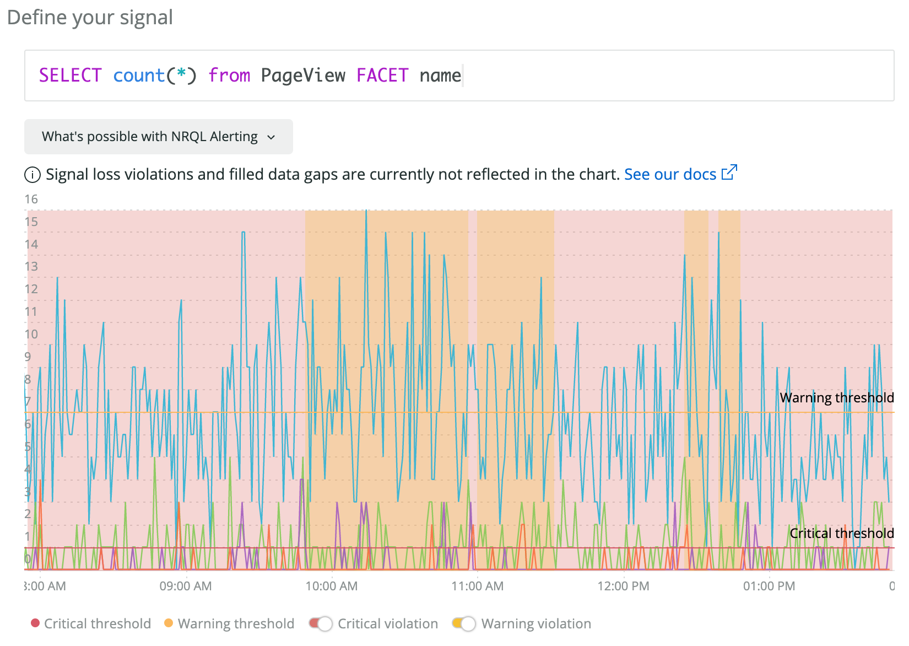
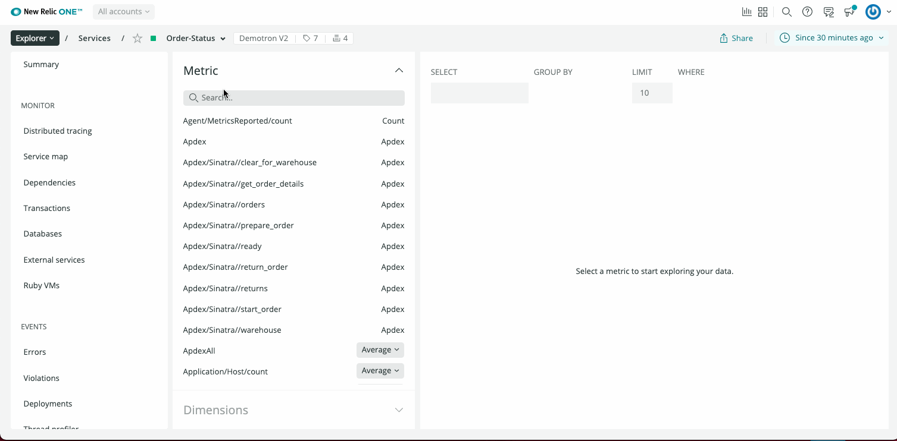
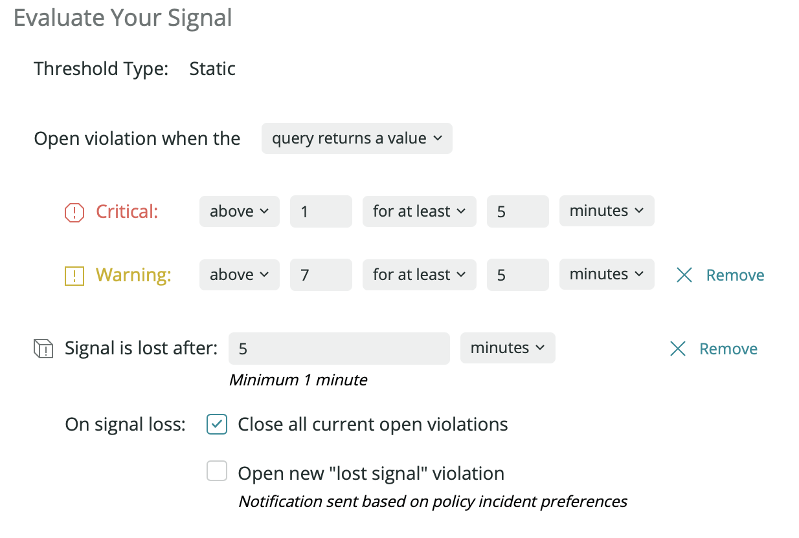
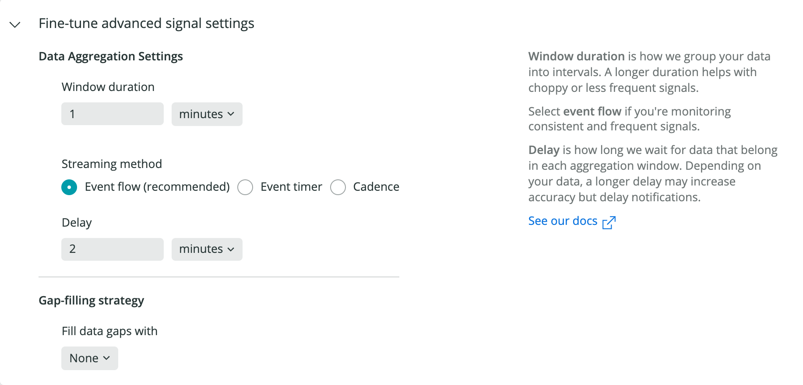

[NRQLクエリ](/docs/insights/new-relic-insights/using-new-relic-query-language/using-nrql)を使用してアラート条件を作成できます。信号を定義した後、警告とクリティカルな閾値レベルをさらに定義できます。これでアラート違反を作成するタイミングが決定されます。

この操作方法の詳細については、以下をお読みください。



<figcaption>
  **[one.newrelic.com](https://one.newrelic.com)**へ移動します。**アラートおよびAI**をクリックし、左のサイドバーで**ポリシー**をクリックしてポリシーを選択してから、**条件を追加**を選択します。**NRQL**、**次に、閾値を定義**の順にクリックします。
</figcaption>

<Callout variant="tip">
  NRQLアラート条件とストリーミングアラートに関連する主要概念の詳細については、[ストリーミングアラート：キー条件および概念](/docs/alerts-applied-intelligence/new-relic-alerts/get-started/streaming-alerts-key-terms-concepts)を参照してください。
</Callout>

## NRQLアラート条件を作成する [#create]

ポリシーのNRQLアラート条件を作成する場合は、以下の手順に従います。

* [one.newrelic.com](https://one.newrelic.com)で、ヘッダーにある**アラートおよびAI**をクリックしてから、左のサイドバーで**ポリシー**をクリックします。
* 既存のポリシーを選択、または**新しいアラートポリシー**をクリックし、[新しいポリシーを作成](/docs/alerts-applied-intelligence/new-relic-alerts/alert-policies/create-edit-or-find-alert-policy)します。
* **条件を追加**をクリックします。
* 条件を作成するときは、**製品の選択**で。**NRQL**をクリックしてから、**次に、閾値を定義**をクリックします。

既存の条件を編集すると、[評価がリセットされる](#evaluation-resets)ことがあります。

## チャートから条件を作成する [#create-chart]

チャートを使用してNRQLアラート条件を作成できます。

 <figcaption>チャートからNRQLアラート条件を作成するには、チャートメニュー <Icon name="fe-more-horizontal"/>をクリックしてから、**アラート条件の作成**をクリックします。</figcaption>

命名し、条件をカスタマイズしたら、既存のポリシーに追加または新しいポリシーを作成できます。

<Callout variant="caution">
  少数の旧チャートには、アラート条件を作成するオプションは含まれません。
</Callout>

## NRQLアラートの構文 [#syntax]

すべてのNRQLアラート条件を作成するための基本的な構文は、以下のとおりです。[`FACET`句](#facet)は、外れ値の条件タイプに必要です。これは静的およびベースラインのオプションです。

```
SELECT function(attribute)
	FROM Event
	WHERE attribute [comparison] [AND|OR ...]
```

<table>
  <thead>
    <tr>
      <th style={{ width: "300px" }}>
        **句**
      </th>

      <th>
        **メモ**
      </th>
    </tr>
  </thead>

  <tbody>
    <tr>
      <td>
        `SELECT関数（属性）`

        **必須**
      </td>

      <td>
        数字を返すサポートされている関数は、以下のとおりです。

        * `apdex`

        * `average`

        * `count`

        * `latest`

        * `max`

        * `min`

        * `percentage`

        * `percentile`

        * `sum`

        * `uniqueCount`

          <Callout variant="tip">
            多くのファセットを含むファセットアラート条件で`percentile`集計を使用すると、以下のエラーメッセージが表示される可能性があります。

            `チャートデータをフェッチ中にエラーが発生しました。`

            このエラーが表示される場合は、代わりに`average`を使用します。
          </Callout>
      </td>
    </tr>

    <tr>
      <td>
        `FROMデータ型`

        **必須**
      </td>

      <td>
        1つのデータ型のみをターゲットにできます。

        サポートされているデータ型：

        * `イベント`
        * `Metric`（RAWデータポイントが返されます）
      </td>
    </tr>

    <tr>
      <td>
        `WHERE属性 [比較] [AND|OR ...]`
      </td>

      <td>
        1つ以上の一連の条件を指定する場合は、`WHERE`句を使用します。すべての[演算子](/docs/insights/new-relic-insights/using-new-relic-query-language/nrql-reference#where-operators)がサポートされています。
      </td>
    </tr>

    <tr>
      <td id="facet">
        `FACET属性`

        **外れ値条件に必要**
      </td>

      <td>
        オプションの`FACET`句をNRQL構文に含めるかどうかは、[閾値タイプ](#threshold-types): 静的またはベースラインによって決まります。

        属性別で結果を区切り、各属性に個別のアラートを設定する場合は、[`FACET`](/docs/insights/nrql-new-relic-query-language/nrql-resources/nrql-syntax-components-functions)句を使用します。`LIMIT`句は許可されていませんが、すべてのクエリは可能な限り最大数のファセットを受け取ります。ファセットクエリは、[静的およびベースライン](/docs/alerts/new-relic-alerts/defining-conditions/create-alert-conditions-nrql-queries#threshold-types)条件には最大5000の値を、[外れ値](/docs/alerts/new-relic-alerts/defining-conditions/outlier-detection-nrql-alert)条件には最大500の値を返せます。

        <Callout variant="important">
          クエリが最大数を上回る値を返す場合、アラート条件は作成できません。条件を作成した後、クエリがこの数以上の値を返した場合、アラートは失敗します。返される値の数が少なくなるようにクエリを変更します。
        </Callout>
      </td>
    </tr>
  </tbody>
</table>

## 再フォーマット化された互換性がないNRQL [#reformatting]

チャートで使用されるNRQLの一部の要素は、アラートのストリーミングコンテキストに意味はありません。以下は、NRQLアラートクエリを再フォーマットして同じ効果をあげる最も一般的な互換性のない要素と提案のリストです。

<table>
  <thead>
    <tr>
      <th style={{ width: "300px" }}>
        **要素**
      </th>

      <th>
        **メモ**
      </th>
    </tr>
  </thead>

  <tbody>
    <tr>
      <td>
        `SINCE`および`UNTIL`
      </td>

      <td>
        例:

        ```
        SELECT percentile(largestContentfulPaint, 75) FROM PageViewTiming WHERE (appId = 837807) SINCE yesterday
        ```

        NRQL条件は決して途切れないウィンドウ表示されたクエリ結果を生成するため、ある時点までクエリを調べる`SINCE`および`UNTIL`キーワードは互換性がありません。便宜上、チャートのコンテキストから条件を作成するときに、クエリから自動的に`SINCE`および`UNTIL`を外します。
      </td>
    </tr>

    <tr>
      <td>
        `TIMESERIES`
      </td>

      <td>
        NRQLクエリでは、`TIMESERIES`句を使用して、指定期間単位の時系列としてデータを返します。

        NRQL条件の場合は、信号の同等のプロパティが集計期間ウィンドウです。
      </td>
    </tr>

    <tr>
      <td>
        `histogram()`
      </td>

      <td>
        `histogram()` 集計関数は、ヒストグラムを生成するために使用されます。

        `histogram()` はNRQLアラートとは互換性がなく、ヒストグラム集計は時系列としてフォーマット化できません。ヒストグラムの一部（95番目のパーセンタイルなど）からアラートを作成するには、[`percentile()`](/query-your-data/nrql-new-relic-query-language/get-started/nrql-syntax-clauses-functions/#functions)集計関数を使用します。
      </td>
    </tr>

    <tr>
      <td>
        複数集計関数
      </td>

      <td>
        各条件は単一の集計値のみをターゲットにできます。複数の値に同時にアラートするには、同じポリシー内の個別条件に分解する必要があります。

        元のクエリ:

        ```
        SELECT count(foo), average(bar), max(baz) from Transaction
        ```

        分解済み:

        ```
        SELECT count(foo) from Transaction

        SELECT average(bar) from Transaction

        SELECT max(baz) from Transaction
        ```
      </td>
    </tr>

    <tr>
      <td>
        `COMPARE WITH`
      </td>

      <td>
        `COMPARE WITH`句を使用して、2つの異なる時間範囲の値を比較します。このタイプのクエリはNRQLアラートとは互換性がありません。[ベースラインアラート条件](/docs/alerts-applied-intelligence/new-relic-alerts/alert-conditions/create-baseline-alert-conditions)を使用して、特定の信号の偏差を動的に検出することを推奨します。
      </td>
    </tr>

    <tr>
      <td>
        `SLIDE BY`
      </td>

      <td>
        `SLIDE BY `句は、スライディングウィンドウと呼ばれる機能をサポートしています。スライディングウィンドウを使用すると、`SLIDE BY`データは、互いに重複する時間の「ウィンドウ」に収集されます。これらのウィンドウは、移動集計（移動平均など）が狭い時間枠からの集計よりも重要である場合に、変動の多い折れ線グラフを滑らかにするのに役立ちます。

        スライディングウインドウは、NRQLアラートでは現在サポートされていません。
      </td>
    </tr>

    <tr>
      <td>
        `LIMIT:`
      </td>

      <td>
        LIMIT句を使用して、FACETクエリで返されるファセット値の最大数またはSELECT \*クエリで返される項目の最大数を管理します。

        LIMITはNRQLアラートとは互換性がありません。常に、評価はフル結果セットに対して実行されます。
      </td>
    </tr>
  </tbody>
</table>

## NRQLアラート閾値の例 [#examples]

以下に示すのは、NRQL条件の一般的な使用ケースです。これらのクエリは、静的およびベースラインの[条件タイプ](#threshold-types)に動作します。外れ値の条件タイプには、[`FACET`句](#facet)が追加で必要になります。

<CollapserGroup>
  <Collapser
    id="constrained-alerts"
    title="データの特定セグメントでアラート"
  >
    重要な顧客や一定範囲のデータなど、データの特定セグメントをターゲットとする制約付きアラートを作成します。これらの条件を定義するには`WHERE`句を使用してください。

    ```
    SELECT average(duration) FROM Transaction WHERE account_id in (91290, 102021, 20230)
    ```

    ```
    SELECT percentile(duration, 95) FROM Transaction WHERE name LIKE 'Controller/checkout/%'
    ```
  </Collapser>

  <Collapser
    id="nth-percentile"
    title="データのN番目のパーセンタイルでアラート"
  >
    データのN番目のパーセンタイルが指定の閾値に達したときにアラートを作成します。例えば、SLAサービスレベルの管理など。集計ウィンドウの期間に基づいてNRQLクエリを評価するため、期間ごとにパーセンタイル値を個別に算出します。

    ```
    SELECT percentile(duration, 95) FROM Transaction
    ```

    ```
    SELECT percentile(databaseDuration, 75) FROM Transaction
    ```
  </Collapser>

  <Collapser
    id="max-min-avg"
    title="データの最大、最小、平均でアラート"
  >
    データが最大、最小、平均に達したときにアラートを作成します。例えば、処理時間やレスポンスタイムが一定の閾値に達しないようにできます。

    ```
    SELECT max(duration) FROM Transaction
    ```

    ```
    SELECT average(duration) FROM Transaction
    ```
  </Collapser>

  <Collapser
    id="percentage"
    title="データのパーセンテージでアラート"
  >
    データの一部が特定の閾値を上回るとき、または下回るときにアラートを作成します。

    ```
    SELECT percentage(count(*), WHERE duration > 2) FROM Transaction
    ```

    ```
    SELECT percentage(count(*), WHERE httpResponseCode = '500') FROM Transaction
    ```
  </Collapser>

  <Collapser
    id="apdex"
    title="T値のApdex でアラート"
  >
    特定のトランザクションに対して、T値を適用した[Apdex](/docs/apm/new-relic-apm/apdex/apdex-measuring-user-satisfaction)でアラートを作成します。ライセンスキーは、PHP INIファイルでエージェントに対して設定されており、ディレクトリや仮想ホストごとに変更できます。

    ```
    SELECT apdex(duration, t:0.5) FROM Transaction WHERE appName like '%prod%'
    ```
  </Collapser>
</CollapserGroup>

## NRQL条件および演算のクエリ順序 [#query-order]

デフォルトで、集計ウィンドウの期間は1分ですが、必要に応じてウィンドウは変更できます。集計ウィンドウが何であろうと、New RelicはNRQL条件のクエリの関数を使用して、そのウィンドウのデータを集計します。クエリは構文解析され、以下の順序でシステムによって実行されます。

1. `FROM`句 – どのイベントタイプを取り込む必要があるのか?
2. `WHERE`句 – 何を除去できるのか?
3. `SELECT`句 – 今、フィルタリングしたデータセットから何の情報を返す必要があるのか?

### 例: 返されたnull値

これがアラート条件クエリとしましょう。

```
SELECT count(*) FROM SyntheticCheck WHERE monitorName = 'My Cool Monitor' AND result = 'FAILURE'
```

集計ウィンドウに失敗がない場合:

1. システムは、アカウント上のすべての`SyntheticCheck`イベントを取り込んで、`FROM`句を実行します。
2. 次に、モニター名と指定した結果が一致するもののみを見て、イベントをフィルタリングする`WHERE`句を実行します。
3. `FROM`および`WHERE`演算を完了後も、スキャンするイベントが残っている場合は、`SELECT`句が実行されます。イベントが残っていない場合、`SELECT`句は実行されません。

つまり、ｇ`count()`および`uniqueCount()`などの集計が、ゼロ値を返すことはありません。カウントが0の場合、`SELECT`句は無視され、データは返されず、結果値は`NULL`となります。

### 例: 返された値ゼロ

正当な数値ゼロを配信するデータソースがある場合、クエリはnull値ではなく、ゼロ値を返します。

これがアラート条件クエリとし、`MyCoolEvent`が時々ゼロ値を返せる属性としましょう。

```
SELECT average(MyCoolAttribute) FROM MyCoolEvent
```

集計ウィンドウが評価されるときに、少なくとも1つの`MyCoolEvent`のインスタンスがあり、そのウィンドウからのすべての`MyCoolAttribute`属性の平均値ゼロの場合は、`0`値が返されます。その間に`MyCoolEvent`イベントがない場合は、演算の順序により`NULL`が返されます。

<Callout variant="tip">
  このトピックの詳細については、ゼロ値対null値のトラブルシューティングに関する[ブログ投稿](https://discuss.newrelic.com/t/relic-solution-how-can-i-figure-out-when-to-use-gap-filling-and-loss-of-signal/120401)をチェックできます。
</Callout>

<Callout variant="tip">
  信号の損失を調整および[アラート条件UI](/docs/alerts-applied-intelligence/new-relic-alerts/alert-conditions/create-nrql-alert-conditions/#signal-loss)の設定のギャップを埋めて、null値がどのように取り扱われるかを判断できます。
</Callout>

<Callout variant="tip">
  `NULL`値を完全に回避するには、クエリ操作のショートカット順序を使用します。これは、`フィルター`のサブ句を使用して実行し、そのサブ句内にすべてのフィルター要素を含めます。クエリの本体が実行され、データが返されます。その際、`SELECT`句が実行され、フィルター要素が適用されます。フィルター要素に一致するデータがない場合、クエリは`0`の値を返します。次の例を見てみましょう。

  ```
    SELECT filter(count(*), WHERE result = 'SUCCESS' AND monitorName = 'My Favorite Monitor') FROM SyntheticCheck
  ```
</Callout>

## ネスト構造の集計NRQLアラート [#h2-nested-aggregation-nrql-alerts]

[ネスト構造の集計クエリ](http://docs.newrelic.com/docs/query-your-data/nrql-new-relic-query-language/nrql-query-tutorials/nested-aggregation-make-ordered-computations-single-query)は、データに対してクエリを実行する強力な方法です。ただし、注意すべき重要な制限がいくつかあります。

<CollapserGroup>
  <Collapser
    id="non-faceted_innermost_query"
    title="現在、ネスト構造の一番内側でFACETのないクエリはサポートされていません。"
  >
    `FACET`がないと、内部クエリは単一の結果を生成するため、外部クエリには何も集計されません。ネスト構造のクエリを使用している場合は、内部クエリがファセットされていることを確認してください。

    ```
    SELECT max(cpu) FROM (FROM Event SELECT min(cpuTime) as cpu) ​​​​​
    ```
  </Collapser>

  <Collapser
    id="aggregation_window_size"
    title="すべてのレベルのクエリの集計ウィンドウのサイズを同じにする必要があります。"
  >
    1分間のアラート集計ウィンドウで、内部クエリはより小さな30秒のウィンドウを2つ生成します。理論上、この2つのウィンドウは外部クエリによって集計されます。ただし、現在この機能はサポートされていません。

    ```
    SELECT max(cpu) FROM (FROM Event SELECT min(cpuTime) as cpu TIMESERIES 30 seconds)​​
    ```
  </Collapser>

  <Collapser
    id="signal_loss"
    title="ネスト構造のクエリでは、信号損失はまだサポートされていません"
  >
    信号損失の詳細については、[NerdGraph API：信号の損失とギャップの充填](/docs/alerts-applied-intelligence/new-relic-alerts/alerts-nerdgraph/nerdgraph-api-loss-signal-gap-filling)を参照してください。
  </Collapser>

  <Collapser
    id="with_metric_format"
    title="内部クエリに'WITH METRIC_FORMAT'を含むネストされたクエリは、現在サポートされていません"
  >
    内部クエリに`WITH METRIC_FORMAT`を含むネストされたクエリを使用して、NRQLアラート条件を作成することはできません。
  </Collapser>
</CollapserGroup>

## NRQL条件作成のヒント [#condition-tips]

ここに、NRQL条件の作成と使用のヒントをいくつか示します。

<table>
  <thead>
    <tr>
      <th style={{ width: "200px" }}>
        トピック
      </th>

      <th>
        ヒント
      </th>
    </tr>
  </thead>

  <tbody>
    <tr>
      <td>
        条件タイプ
      </td>

      <td>
        NRQLの条件タイプには [静的、ベースライン、外れ値](#threshold-types)が含まれます。
      </td>
    </tr>

    <tr>
      <td>
        説明を作成する
      </td>

      <td>
        NRQL条件の場合、各違反に追加されるカスタムの[説明](/docs/alerts/new-relic-alerts/defining-conditions/alert-condition-descriptions)を作成できます。これらの説明は、特定の違反に関連付けられたメタデータに基づく変数置換を強化します。

        詳細については、[説明](/docs/alerts/new-relic-alerts/defining-conditions/alert-condition-descriptions)を参照してください。
      </td>
    </tr>

    <tr>
      <td>
        クエリの結果
      </td>

      <td>
        クエリは数値を返す必要があります。条件は、返された数値とお客様が設定した閾値を比較することで評価されます。
      </td>
    </tr>

    <tr>
      <td>
        期間
      </td>

      <td>
        NRQL条件は、30秒から15分までの集計ウィンドウを15秒刻みで使用して、どのように集計されるかに基づいてデータを評価します。最良の結果を得るには、イベントフローまたはイベントタイマーの集計法を使用することを推奨します。

        ケイデンス集計法の場合、どの1分を評価するかを指定する暗黙的な`SINCE ... UNTIL`句は、[**遅延/タイマー設定**](#time)により制御されています。直近のデータは不完全なことがあるため、特に次のような場合は、3分以上前のデータのクエリをする場合があります。

        * 複数のホスト上で動作するアプリケーション。

        * `SyntheticCheck`データ: タイムアウトは3分かかる場合があるため、5分以上前のデータのクエリを推奨します。

          さらに、クエリによって生成されるデータが断続的な場合、[`クエリ結果の合計`](#sum)オプションの使用を検討してください。
      </td>
    </tr>

    <tr>
      <td>
        信号損失の閾値（信号損失検出）
      </td>

      <td>
        信号損失検出を使用すると、データ（テレメトリ信号）が失われたと見なされる時点でアラートを出力できます。サービスまたはエンティティがオンラインではなくなったか、定期的なジョブの実行に失敗した可能性を示しています。エラーカウントなどの散発的なデータ違反が、信号を受信していないときに確実に終了するためにも使用できます。
      </td>
    </tr>

    <tr>
      <td>
        高度な信号設定
      </td>

      <td>
        この設定で、場合によってはない継続的なストリーミングデータ信号の取り扱いを改善するオプションを使用できます。この設定には、集計ウィンドウの期間と遅延/タイマー、データギャップを埋めるオプションが含まれます。これらの使用の詳細については、[高度な信号設定](#advanced-signal)を参照してください。
      </td>
    </tr>

    <tr>
      <td>
        条件設定
      </td>

      <td>
        **条件設定**を使用

        * 簡潔で分かりやすい[条件名](/docs/alerts/new-relic-alerts/configuring-alert-policies/define-alert-conditions#rename-condition)を作成します。
        * 違反と通知に含まれる[条件について、カスタム違反の説明](/docs/alerts-applied-intelligence/new-relic-alerts/alert-conditions/alert-custom-violation-descriptions)を記入します。
        * インシデント対応に関する自社の手順を含めるには、ランブックのURLを追加します。この情報を[カスタム違反の説明](/docs/alerts-applied-intelligence/new-relic-alerts/alert-conditions/alert-custom-violation-descriptions)に追加することもできます。
      </td>
    </tr>

    <tr>
      <td>
        条件の制限
      </td>

      <td>
        [最大値](/docs/alerts/new-relic-alerts/getting-started/minimum-maximum-values)を参照します。
      </td>
    </tr>

    <tr>
      <td>
        稼働ステータス
      </td>

      <td>
        NRQLアラート条件の[稼働ステータス表示](/docs/alerts-applied-intelligence/new-relic-alerts/alert-conditions/view-entity-health-status-find-entities-without-alert-conditions)を適切に機能させるには、FACET句を使用して、単一のエンティティに対する各信号をスコープします（例：`FACETホスト名`または`FACETアプリケーション名`）。
      </td>
    </tr>

    <tr>
      <td>
        例
      </td>

      <td>
        詳細については、以下を参照してください。

        * [想定されるNRQL構文](#syntax)
        * [NRQL条件に関するクエリの例](#examples)
      </td>
    </tr>
  </tbody>
</table>

## 条件の編集により、条件の評価をリセットできます [#evaluation-resets]

NRQLアラート条件を特定の方法で編集する場合（詳細は以下を参照）、その評価がリセットされます。つまり、その時点までの評価がすべて失われ、その時点から評価をやり直します。これは、次の2つの方法で影響します。

* 「x分以上」の閾値の場合：評価ウィンドウがリセットされたため、違反が報告されるまで少なくともx分の遅延が発生します。
* [ベースライン条件の場合](#threshold-types)：条件を最初からやり直し、すべてのベースライン学習は失われます。

以下のアクションにより、NRQL条件の評価がリセットされます。

* クエリの変更
* 集計ウィンドウ、集計方法、集計遅延/タイマー設定の変更
* 「信号損失時の終了違反」設定の変更
* ギャップ塗りつぶし設定の変更
* ベースラインの方向の変更（該当する場合）– 高、低、または高/低
* 閾値、閾値ウィンドウ、または閾値演算子の変更

以下のアクション（および上記リストに記載されていないその他のアクション）は、評価をリセット**しません**。

* 信号損失タイムウィンドウ（有効期限）の変更
* 時刻機能の変更（「少なくとも」を「少なくとも1回」に変更する、またはその逆）
* 「信号損失時のオープン違反」設定の切り替え

## アラート条件のタイプ [#threshold-types]

NRQLアラートを作成する際、異なる条件のタイプを選択できます。

<table>
  <thead>
    <tr>
      <th style={{ width: "150px" }}>
        NRQLアラート条件のタイプ
      </th>

      <th>
        説明
      </th>
    </tr>
  </thead>

  <tbody>
    <tr>
      <td>
        静的
      </td>

      <td>
        これは、最もシンプルなNRQL条件のタイプです。数値を返すNRQLクエリに基づいた条件を作成できます。

        オプション: `FACET`句を含む。
      </td>
    </tr>

    <tr>
      <td>
        [ベースライン](/docs/alerts/new-relic-alerts/defining-conditions/create-baseline-alert-conditions)（動的）
      </td>

      <td>
        監視対象値の過去の動作に基づいた自己調整型の条件を使用します。オプションの`FACET`句など、静的タイプと同じNRQLクエリ形式を使用します。
      </td>
    </tr>

    <tr>
      <td>
        [外れ値](/docs/outlier-detection-nrql-alerts)
      </td>

      <td>
        グループの外れ値になるそのグループの動作と値を検索します。静的タイプと同じNRQLクエリ形式を使用しますが、`FACET`句が必要です。
      </td>
    </tr>
  </tbody>
</table>

## クエリ結果の合計（制限または間欠データ） [#sum]

<Callout variant="important">
  静的（基本）条件のタイプのみで使用できます。
</Callout>

クエリが間欠的、または限定的なデータを返す場合、意味のある閾値の設定が困難になる可能性があります。欠落したデータや限定的なデータがあると、誤検出または検出漏れを生じることがあります。これらの誤った通知を最小限に抑えるため、信号損失、集計期間、およびギャップ充填設定を使用できます。

この問題を回避するために、静的閾値タイプを使用する際は、セレクタを**クエリ結果の合計値**に設定できます。こうすることで、単一の収集サイクルからの値の代わりに、集計された合計数に対してアラートを設定できるようになります。1分間のデータ確認は、最長で2時間まで集計できます。移動合計の幅は選択する期間で決まり、それに従ってプレビューチャートが更新されます。

## 信号損失の閾値を設定 [#signal-loss]

信号損失は、特定の期間にわたってNRQL条件に一致するデータがない場合に発生します。信号損失の閾値期間と、閾値を超えたときに何が起こるかを設定できます。



<figcaption>
  **[one.newrelic.com](https://one.newrelic.com)**へ移動します。**アラートおよびAI**をクリックし、左のサイドバーで**ポリシー**をクリックしてポリシーを選択してから、**条件を追加**を選択します。信号損失は、NRQL 条件でのみ使用できます。
</figcaption>

これらの設定は、GraphQL API（推奨）またはREST APIを使用して管理することもできます。特定の[Graph QL APIの例](http://docs.newrelic.com/docs/alerts-applied-intelligence/new-relic-alerts/alerts-nerdgraph/nerdgraph-api-loss-signal-gap-filling)については、こちらを参照してください。

**信号損失の設定：**

信号損失の設定には、継続時間と2つの可能なアクションが含まれます。

* **信号損失の有効期限**

  * UIラベル: **信号は、以下の後で損失します。**
  * GraphQLノード: [expiration.expirationDuration](http://docs.newrelic.com/docs/alerts-applied-intelligence/new-relic-alerts/alerts-nerdgraph/nerdgraph-api-loss-signal-gap-filling)
  * 有効期限とは、ストリーミングアラートパイプラインでデータポイントを受信すると開始およびリセットされるタイマーです。「有効期限」が切れる前に別のデータポイントを受信しないと、その信号は損失したと見なされます。これは、New Relicにデータが送信されていないか、アラートパイプラインにストリーミングされる前に、NRQLクエリの`WHERE`句がそのデータを除外しているためです。ファセットクエリがある場合、各ファセットはシグナルであることに注意してください。したがって、これらのシグナルのいずれかが指定期間中に終了すると、シグナルの損失と見なされます。
  * 閾値の有効期限に関係なく、タイマーが期限切れになるとすぐに信号損失がトリガーされます。
  * 最長の有効期限は48時間です。これは、頻度の低いジョブの実行をモニタリングするときに役立ちます。最小は30秒ですが、少なくとも3〜5分に設定することを推奨します。

* **信号損失アクション**信号が損失したと見なされると、未解決の違反を閉じるか、新しい違反を開くか、またはその両方を行うことができます。

  * これにより、特定の信号に関連する未解決の違反がすべて終了します。必ずしも、条件のすべての違反が終了するとは限りません。一時的なサービスまたは散発的な信号で警告している場合は、違反が適切に終了するように、このアクションを選択することをお勧めします。この場合、GraphQLノード名は[ 「closeViolationsOnExpiration」](/docs/alerts-applied-intelligence/new-relic-alerts/alerts-nerdgraph/nerdgraph-api-loss-signal-gap-filling) です。
  * これにより、信号が損失したと見なされると、新しい違反が発生します。これらの違反は、信号の損失が原因であることを示します。インシデントプリファレンスに基づいて、通知がトリガーされます。この場合、graphQLノード名は[、「openViolationOnExpiration」](/docs/alerts-applied-intelligence/new-relic-alerts/alerts-nerdgraph/nerdgraph-api-loss-signal-gap-filling) です。
  * 両方のアクションを有効にすると、最初に未解決の違反がすべて終了します。次に、信号が損失すると、新しい違反が発生します。

UIで信号損失検出を使用して設定されたNRQLアラートを作成する場合は、以下の手順に従います。

1. ポリシーについて条件を作成するときは、**製品選択**で**NRQL**をクリックしてから、**次に、閾値を定義**をクリックします。
2. アラートする値を返す[NRQLクエリ](/docs/alerts/new-relic-alerts/defining-conditions/create-alert-conditions-nrql-queries#syntax)を作成します。
3. **閾値タイプ**には、**静的**または**ベースライン**を選択します。
4. **失われた信号の閾値を追加**をクリックし、**信号損失後**フィールドで信号の有効期限を分または秒で設定します。
5. 信号が失われたときに実行する操作を選択します。**現在未解決の違反をすべて閉じる**と**新しい「信号損失」違反を開く**のいずれかまたは両方を確認できます。これらのアクションによって、該当する状態に対して信号損失違反がどのように処理されるかが制御されます。
6. 必ず、条件に名前を付けてから保存します。

信号が戻ってくると、信号閉鎖の喪失により、

* 違反が発生します。新しく開かれた信号損失違反は、新しいデータが評価されるとすぐに閉じられます。
* それらが属する条件が期限切れになります。デフォルトでは、条件は3日後に期限切れになります。
* **現在開いているすべての違反を閉じる**オプションを使用して、違反を手動で閉じます。

<Callout variant="tip">
  信号損失検出は、ネスト型の集計またはサブクエリを使用するNRQLクエリでは機能しません。
</Callout>

## 高度な信号設定 [#advanced-signal]



<figcaption>
  NRQLアラート条件を作成すると、高度な信号設定により、[ストリーミングアラートデータ](/docs/alerts-applied-intelligence/new-relic-alerts/get-started/streaming-alerts-key-terms-concepts)を管理し、誤検出を防止できます。
</figcaption>

NRQL条件を作成する際の高度な信号設定は、次のとおりです。

* 集計ウィンドウの期間
* 遅延/タイマー
* データのギャップを埋める

この設定の内容と、相互の関係の説明を読む場合は、[ストリーミングアラートのコンセプト](/docs/alerts-applied-intelligence/new-relic-alerts/get-started/streaming-alerts-key-terms-concepts)を参照してください。設定方法の説明とヒントは、次のとおりです。

### 集計ウィンドウの期間 [#window-duration]

データが集計される前に、ストリーミング時間枠に蓄積されるデータの長さを選択する[集計ウィンドウ](/docs/alerts-applied-intelligence/new-relic-alerts/get-started/streaming-alerts-key-terms-concepts#aggregation-window)を設定できます。30秒から15分の間で設定できます。デフォルトは1分です。

<Callout variant="tip">
  ベースラインアラート条件の閾値は、集計ウィンドウの編集をサポートしていません。デフォルトでは1分が使用されます。
</Callout>

### 遅延/タイマー [#delay-timer]

[遅延/タイマー](/docs/alerts-applied-intelligence/new-relic-alerts/get-started/streaming-alerts-key-terms-concepts#delay-timer)を調整して、データの動作に合わせて[ストリーミングアラートアルゴリズム](/docs/alerts-applied-intelligence/new-relic-alerts/get-started/streaming-alerts-key-terms-concepts)を調整できます。データがまばらであるか一貫性がない場合は、イベントタイマー集計法を使用することをお勧めします。

ケイデンス集計法では、サポートされる合計レイテンシは、集計ウィンドウ期間と遅延の合計になります。

データタイプが[APMの言語エージェント](/docs/agents)から供給されており、多数のアプリケーションインスタンス（例：`Transactions`、`TransactionErrors`など）から集計されている場合は、デフォルト設定でイベントフロー法を使用することをお勧めします。

<Callout variant="important">
  AWS CloudwatchやAzureなどの[Infrastructureクラウドインテグレーション](/docs/infrastructure/infrastructure-integrations/get-started/introduction-infrastructure-integrations)から収集したデータに対してNRQL条件を作成する場合は、イベントタイマー法を使用することをお勧めします。
</Callout>

### データのギャップを埋める [#data-gaps]

ギャップの充填を使用すると、信号にデータがない場合に使用する値をカスタマイズできます。次の設定の1つを使用して、データストリームのギャップを埋めることができます。

* **なし**: デフォルト）空の集計ウィンドウでアクションを実行したくない場合は、これを選択します。評価時に、空の集計ウィンドウは閾値期間タイマーをリセットします。たとえば、すべての集計ウィンドウに5分間の閾値を超えるデータポイントが必要であり、5つの集計ウィンドウの1つが空であるという条件が設定されている場合は、条件に違反することはありません。
* **カスタム静的値**: 評価する前に空の集計ウィンドウにカスタム静的値を挿入する場合は、これを選択します。このオプションには、（APIで指定されたとおり）使用する静的値を指定する追加の必須`fillValue`パラメーターがあります。この値のデフォルトは`0`です。
* **最後の既知値**: このオプションは、評価が行われる前に最後に表示された値を挿入します。最後に表示された値の状態は2時間維持されます。

<Callout variant="tip">
  アラートシステムは、アクティブに報告された信号のギャップを埋めます。この信号の履歴は、2時間操作が行われないと失われます。ギャップを埋めるために、この非アクティブ期間の後に受信されたデータポイントは新しい信号として扱われます。

  信号損失、ギャップの充填、アクセスをリクエストする方法の詳細については、[このExplorers Hubの記事](https://discuss.newrelic.com/t/announcing-new-relic-one-streaming-alerts-for-nrql-conditions/115361)を参照してください。
</Callout>

データギャップ設定を編集するオプション：

* NRQL条件UIで、**条件設定** > **高度な信号設定** > **データギャップを埋める**の順に移動し、オプションを選択します。
* [Nerdgraph API](/docs/alerts-applied-intelligence/new-relic-alerts/alerts-nerdgraph/nerdgraph-api-loss-signal-gap-filling) (優先)を使用中の場合は、このノードはここにあります。`actor : account : alerts : nrqlCondition : signal : fillOption | fillValue`
* NerdGraphは推奨APIですが、REST APIを使用している場合、この設定は[アラートNRQL条件API](https://rpm.newrelic.com/api/explore/alerts_nrql_conditions/list)の**「信号」**セクションにあるREST APIエクスプローラーにあります。