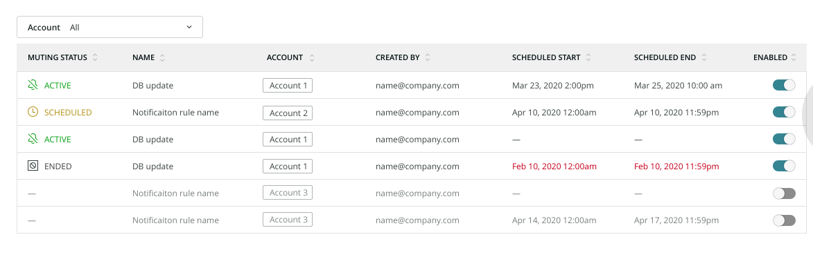
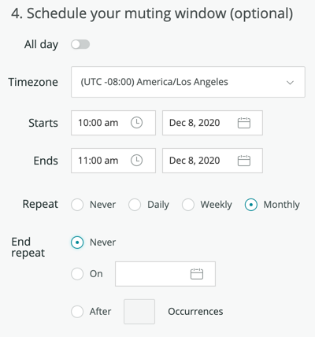
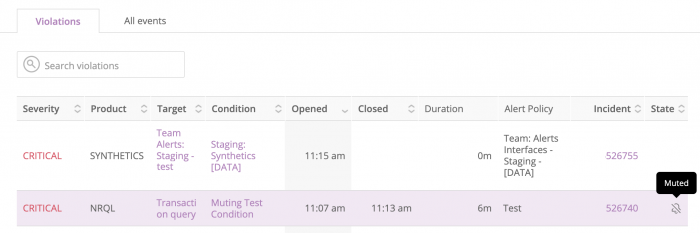

アラートは、システムに問題が発生したときに、タイムリーな通知を行います。時には、見る必要がないとわかっている通知もあります。 **ミューティングルール** を使用すると、不要なメッセージが大量に送られてくるのを防ぐことができます。

不要な通知に共通する要素を見つけたら、それらの要素を特にターゲットとするミュートルールを定義し、他の通知は通過させることができます。通知がミュートされていても、Alertsはそれらの違反に関するデータを収集します。ミューティングルールは、アラートのプロセスを妨げることなく、通知が送信される直前の時点で適用されます。

## ミューティングルールの管理 [#manage]

ミューティングルール条件とは、どの違反をミューティングの対象とするかを定義する、属性、演算子、値で構成された個々の表現の集合です。

ミュートルールの作成、有効化、無効化、管理ができます。 **[one.newrelic.com](https://one.newrelic.com)** にアクセスし、トップナビで **Alerts& AI** をクリックし、 **Muting rules** をクリックします。ミューティングルールはいつでも有効または無効にできます。

ルールは以下のいずれかのステータスを持つことができます。

* **Active**: ミューティングが有効であり、アクティブである。
* **Scheduled**: ミューティングは有効だが、まだ有効ではない（将来のスケジュールがある）。
* **終了**: ミューティングは有効ですが、もはや有効ではありません（今後の予定はありません）。
* **Inactive**: ミューティングは無効です。



<figcaption>
  **[one.newrelic.com](https://one.newrelic.com) > アラート& AI> ミューティングルール**: 複雑なミューティングルールを作成して、不要な通知の少なからぬセットを対象にすることができます。
</figcaption>

## ミューティングルールの作成 [#create]

<Callout variant="tip">
  ミューティングルールを作成する前に、 [違反通知を生成するポリシーと条件](/docs/alerts/new-relic-alerts/configuring-alert-policies/create-edit-or-find-alert-policy) を作成する必要があります。
</Callout>

ミューティングルールを作成するには、 **Muting rules** 画面で **+ Add a rule** をクリックします。ミューティングルールの名前と説明を入力し、ルールを適用するアカウントを選択します。

次に、違反フィルタを構築します。 [](/docs/alerts/new-relic-alerts/defining-conditions/violation-event-attributes)[](#sub-conditions)違反イベント属性のサブセット (具体的には accountId , conditionId , conditionName , entity.guid , nrqlEventType , nrqlQuery , policyId , policyName , runbookUrl (as conditionRunbookUrl ), tags. NAME , and targetName ) と xml-ph-0596@deepl.inter を使用できます。値は、アラートのポリシーIDや条件名など、違反属性の1つと比較することができます。 `````````````````````<>```


<figcaption>
  **[one.newrelic.com](https://one.newrelic.com) > アラート& AI> ミューティングルール**: 複雑なミューティングルールを作成して、不要な通知の少なからぬセットを対象にすることができます。
</figcaption>

## ミューティングルールの設定 [#schedule-muting-rule]

必要に応じて、ミューティングルールをスケジュールすることができます。

これを行うには、開始時刻と終了時刻を選択します。オプションで、ミューティングルールを1日中継続するように設定することもできます。

また、ミューティングルールのスケジュールにタイムゾーンを選択することもできます。デフォルトでは、ユーザー設定で選択されたタイムゾーンが使用されます。



<figcaption>
  ミューティングルールをスケジューリングするための柔軟で強力なオプション。
</figcaption>

ミューティングルールは、毎日、毎週、または毎月繰り返すようにスケジュールできます。毎週繰り返すように設定されたミューティングルールには、繰り返す曜日を選択するオプションがあります。曜日が選択されていない場合、デフォルトでは、ミューティングルールの開始が予定されている曜日に毎週繰り返されます。

<Callout variant="important">
  **Repeat** の曜日チェックボックスは、 **Starts** と **Ends** の日付フィールドを上書きします。開始日を設定し、さらに曜日を選択した場合、ミューティングルールは開始日以降の最初の日に適用されます。
</Callout>

また、特定の日付または特定の回数を選択することで、再帰の終了時期を指定することもできます。

## NerdGraphでミューティング・ルールを管理 [#manage-with-nerdgraph]

[NerdGraph](/docs/apis/nerdgraph/get-started/introduction-new-relic-nerdgraph) で、以下のクエリとミューティングルールを使用することができます。スキーマの詳細は、 [API Explorer](/docs/apis/nerdgraph/get-started/introduction-new-relic-nerdgraph#explorer) でご覧いただけます。

* `actor.account.alerts.mutingRule`: id で muting rule を取得します。
* `actor.account.alerts.mutingRules`: アカウントのミューティング・ルールのリストを取得します。
* `alertsMutingRuleCreate`: アカウントのミューティングルールを作成します。
* `alertsMutingRuleUpdate:` idとアカウントidによるミューティングルールの更新。
* `alertsMutingRuleDelete：` idとアカウントidでミューティングルールを削除します。

このドキュメント では、いくつかのサンプルクエリとミューテーション [の例を紹介しています。](#examples)

[ミューティングルールは、以下のフィールドとコンポーネントを持っています。](#examples)

<table>
  [<thead>
    <tr>
      <th style={{ width: "200px" }}>
        ミューティングルール
      </th>

      <th>
        フィールドとコンポーネント
      </th>
    </tr>
  </thead><tbody>
    <tr>
      <td>
        `id`
      </td>

      <td>
        ミューティングルールの一意の識別子。
      </td>
    </tr>

    <tr>
      <td>
        `名前` (**必須**)
      </td>

      <td>
        ミューティングルールのユーザーフレンドリーな名前を入力するテキストフィールドです。これは、ルールの一覧表示や参照の際に使用します。固有の名前である必要はありませんが、推奨されています。
      </td>
    </tr>

    <tr>
      <td>
        `説明`
      </td>

      <td>
        これは、ミューティングルールを説明するオプションのテキストフィールドです。これは、ミューティングルールのコンテキストを提供するための有用な手段となります。このデータは、管理者の表示目的でのみ使用されます。
      </td>
    </tr>

    <tr>
      <td>
        `accountId`
      </td>

      <td>
        ミューティングルールのアカウントID。ミューティングルールは、1つのアカウントで発生した違反にのみ影響します。複数のアカウントで発生した違反をミュートするには、アカウントごとにミューティングルールを作成する必要があります。
      </td>
    </tr>

    <tr>
      <td>
        `createdAt`
      </td>

      <td>
        ミューティングルールが作成されたタイムスタンプ（UTC）。
      </td>
    </tr>

    <tr>
      <td>
        `作成者`
      </td>

      <td>
        ミューティングルールを作成した人のユーザーID。
      </td>
    </tr>

    <tr>
      <td>
        `更新日時`
      </td>

      <td>
        ミューティングルールが最後に変更されたタイムスタンプ（UTC）。
      </td>
    </tr>

    <tr>
      <td>
        `更新日時`
      </td>

      <td>
        ミューティングルールを最後に変更した人のユーザーID。
      </td>
    </tr>

    <tr>
      <td>
        `enabled`
      </td>

      <td>
        ミューティングルールを有効または無効にします（ブール値）。ミューティングルールは手動で有効化、無効化する必要があります。
      </td>
    </tr>

    <tr>
      <td>
        `条件`
      </td>

      <td>
        どの違反を対象とするかを定義する、個々の表現の集合です。ミューティングルールの条件には

        * `演算子`: 条件のセットをどのように組み合わせるかを定義するブール演算子 `AND` または `OR` 。

        * `条件`: 違反行為の中の属性を対象とする個々の表現（サブ条件）のセットです。これらは、 `演算子` に基づいて一緒に評価されます。1つのミューティングルールに設定できるサブコンディションの数は最大20個です。

          サブコンディションは

        * `属性`: 違反行為の中の単一の属性です。 [Violation event attributes の一覧はこちら](/docs/alerts/new-relic-alerts/defining-conditions/violation-event-attributes) 。

        * `演算子`: 選択された違反属性を条件の値と比較するために使用される比較関数。 [サブコンディション・オペレーターのリストはこちらへ](#sub-conditions).

        * `values`: 選択された違反属性と比較するための文字列値の配列です。ミューティングルールが条件を評価する際に、必要に応じて文字列から値が強制的に抽出されます。 `IN` のように、複数の値との比較をサポートする演算子を使用する場合は、最大500個の値を使用できます。
      </td>
    </tr>

    <tr>
      <td>
        `スケジュール`
      </td>

      <td>
        `MutingRule` が違反を積極的にミュートする時間帯。

        * `startTime`: ミューティングルールの開始時期を表すデータタイムスタンプ。これは、オフセットなしのローカルのISO 8601形式です。例：「2020-07-08T14:30:00」。
        * `endTime`: ミューティング・ルールの終了時刻を表すデータタイム・スタンプです。これは、オフセットなしのローカルのISO 8601形式です。例：「2020-07-15T14:30:00」。
        * `timeZone`: ミューティングルールのスケジュールに適用されるタイムゾーンを指定します。例：「America/Los_Angeles」。See [Wikipedia's list of tz database time zones](https://en.wikipedia.org/wiki/List_of_tz_database_time_zones).
        * repeat: ミューティングルールのスケジュールが繰り返される頻度です。繰り返さない場合は、nullを使用します。オプションは、DAILY、WEEKLY、MONTHLYです。
        * endRepeat：ミューティング・ルール・スケジュールがリピートを停止する日時のスタンプです。これは、オフセットを含まないローカルのISO 8601形式です。Example: '2020-07-10T15:00:00'.注：ミューティングルールのスケジュールを終了するには、 `endRepeat` または `repeatCount` のいずれかを使用する必要があります。両方のフィールドを一緒に指定することはできません。
        * repeatCount。ミューティングルールのスケジュールが繰り返される回数です。これには元のスケジュールも含まれます。たとえば、 `repeatCount` の 2 は、1 回繰り返されます。 `repeatCount` の3は、2回繰り返されます。注：ミューティングルールのスケジュールを終了するには、 `repeatCount` または `endRepeat` のいずれかを使用できます。両方のフィールドを一緒に使用することはできません。
        * weeklyRepeatDays（ウィークリーリピートデイズ）。リピートフィールドが「WEEKLY」に設定されている場合に、ミューティングルールが繰り返し実行される曜日。例を示します。\['monday', 'wednesday'\].
      </td>
    </tr>
  </tbody>](#examples)
</table>

## [ミューティングルールの仕組み [#overview]](#examples)

[ミューティングルールは、デフォルトのアラートのライフサイクルの最後に適用され、通知を抑制する、またはミュートするためのものです。このルールは、既存のポリシーや条件を無効にするものではありません。例えば、メンテナンスウィンドウやデプロイメントなど、既知のシステム中断時に通知をミュートすることができます。システム中断の違反に対する通知がミュートされても、違反は識別されます。](#examples)

[ミューティングルールは、 ](#examples)[違反イベント](/docs/alerts/new-relic-alerts/defining-conditions/violation-event-attributes) の属性にマッチする一連の条件を使用します。ミューティング・ルールは、以下の方法を教えてくれます。

1. 違反行為が発生した後、インシデントが開始される前に、個々の違反行為を特定します。
2. デフォルトの状態を上書きして、"ミュートにすることを示します。"

現在、違反行為をミュートすることは、ミュートされた違反行為のみを含むインシデントがいかなる通知も送信しないことを除いて、通常のアラートのインシデントのライフサイクルが維持されることを意味します。

ミューティングルールは、特定の違反行為を無効にします。既存のポリシーや条件を無効にするものではありません。これにより、多数のエンティティーをカバーするポリシーや条件でカバーされる可能性のある特定のエンティティーからの違反をミュートすることができます。また、システムのサブセットのメンテナンスを行う際に、モニタリングを過度にミュートする必要がなくなります。

## ミューティング動作 [#behavior]

次の表では、ミュートされた違反によってアラートのインシデントのライフサイクルがどのように影響を受けるかを説明しています。

<table>
  <thead>
    <tr>
      <th>
        IF
      </th>

      <th>
        AND
      </th>

      <th>
        続いて
      </th>
    </tr>
  </thead>

  <tbody>
    <tr>
      <td
        colSpan={3}
        style={{ backgroundColor: "rgb(238, 238, 238)" }}
      >
        **イベント**: インシデント発生
      </td>
    </tr>

    <tr>
      <td>
        インシデントが開かれるのは、 **ではなく** のミュートされた状態の違反が原因です。
      </td>

      <td/>

      <td>
        Open incident」の通知が送信されます（デフォルト）。
      </td>
    </tr>

    <tr>
      <td>
        **が** ミュートになっている違反行為により、インシデントが発生します。
      </td>

      <td/>

      <td>
        オープンインシデント」の通知は、 **ない** が送信されます（ミュート）。
      </td>
    </tr>

    <tr>
      <td
        colSpan={3}
        style={{ backgroundColor: "rgb(238, 238, 238)" }}
      >
        **イベント**: 未解決のインシデントに追加された違反行為
      </td>
    </tr>

    <tr>
      <td>
        すでにオープンしているインシデントに、新たに **ミュート** の違反が追加される。
      </td>

      <td/>

      <td>
        通知アクションは発生しません（デフォルト）。
      </td>
    </tr>

    <tr>
      <td>
        未解決のインシデントに新しい **unmuted** の違反が追加されます。
      </td>

      <td>
        オープン・インシデント」通知 **は、** **が送信されていません。**
      </td>

      <td>
        オープンインシデント」通知 **が送られてきます** 。
      </td>
    </tr>

    <tr>
      <td>
        未解決のインシデントに新しい **unmuted** の違反が追加されます。
      </td>

      <td>
        オープンインシデント」通知 **がすでに送信されています。**
      </td>

      <td>
        通知アクションは発生しません（デフォルト）。
      </td>
    </tr>

    <tr>
      <td
        colSpan={3}
        style={{ backgroundColor: "rgb(238, 238, 238)" }}
      >
        **イベント**: インシデントクローズ
      </td>
    </tr>

    <tr>
      <td>
        インシデントがクローズされる
      </td>

      <td>
        オープンインシデント」通知 **が送信されていない。**
      </td>

      <td>
        Close incident」通知 **は送信されません** 。
      </td>
    </tr>

    <tr>
      <td>
        インシデントがクローズされる
      </td>

      <td>
        オープンインシデント」通知 **が送信されました。**
      </td>

      <td>
        Close incident」通知 **が送信されます** 。
      </td>
    </tr>

    <tr>
      <td
        colSpan={3}
        style={{ backgroundColor: "rgb(238, 238, 238)" }}
      >
        **イベント**: Incident acknowledged
      </td>
    </tr>

    <tr>
      <td>
        インシデントが認知される
      </td>

      <td>
        オープンインシデント」通知 **が送信されていない。**
      </td>

      <td>
        Incident acknowledged」通知 **は送信されません** 。
      </td>
    </tr>

    <tr>
      <td>
        インシデントが認知される
      </td>

      <td>
        オープンインシデント」通知 **が送信されました。**
      </td>

      <td>
        Incident acknowledged」通知 **が送られてきます** 。
      </td>
    </tr>
  </tbody>
</table>

## ミュートされた違反やインシデントの表示 [#ui]

未解決または解決済みのインシデントを表示すると、違反やインシデントは `Muted` と表示されます。以下のセクションでは、これらのミュートされた違反やインシデントの一部と、それらがどこにあるかを示しています。

<CollapserGroup>
  <Collapser
    id="clamshell-1"
    title="ミュートされている重大な違反のあるインシデント"
  >
    

    <figcaption>
      **[one.newrelic.com](https://one.newrelic.com)** にアクセスし、トップナビで **Alerts& A**I をクリックし、 **Incidents をクリックします。**
    </figcaption>
  </Collapser>

  <Collapser
    id="clamshell-2"
    title="ミュートになった事件"
  >
    違反やインシデントは、 **Muted** として、 **State** の欄に表示されます。

    

    <figcaption>
      **[one.newrelic.com](https://one.newrelic.com)** にアクセスし、トップナビで **アラート& A**I をクリックし、 **インシデント** をクリックし、 **インシデントを開く をクリックします。**
    </figcaption>
  </Collapser>

  <Collapser
    id="clamshell-1"
    title="違反行為のリスト、一部はミュートされている"
  >
    

    <figcaption>
      **[one.newrelic.com](https://one.newrelic.com)** にアクセスし、トップナビで **Alerts& A**I をクリックし、 **Events をクリックします。**
    </figcaption>
  </Collapser>

  <Collapser
    id="clamshell-2"
    title="アラートイベントのリスト（一部はミュートされています"
  >
    アラートイベントのリストでは、 **状態** 欄に、どのイベントがミュートされているかが表示されます。

    

    <figcaption>
      **[one.newrelic.com](https://one.newrelic.com)** にアクセスし、トップナビで **Alerts& A**I をクリックし、 **Events** をクリックし、 **All events をクリックします。**
    </figcaption>
  </Collapser>
</CollapserGroup>

### `タグを使用して、ファセットされた結果をミュートします。` [#facet-muting]

ファセット化されたクエリの結果をミュートするには、 `tags.FACETED_ATTRIBUTE` 属性を使用します。ここで、 <var>FACETED_ATTRIBUTE</var> は、NRQL を実行した属性を表します [`FACET` クエリ](/docs/query-data/nrql-new-relic-query-language/getting-started/nrql-syntax-clauses-functions#sel-facet) 。例えば、NRQL のアラート条件に `FACET host` がそのクエリに含まれている場合、 `tags.host` を使ってその `FACET` 属性をターゲットにすることができます。

NRQL 条件クエリは、複数のファセット属性を受け入れることができます。集約されたイベントやメトリック時系列の属性からフィルタリングできるようにしたい場合は、NRQL クエリ `FACET` 節にそれらの属性を追加する必要があります。例えば、 `FACET host, region, cluster`.

`タグの使用例については、` を参照してください。 [ミューティングルールの作成](#create) を参照してください。

## サブコンディション演算子 [#sub-conditions]

ミューティング・ルールを構築する際に、属性の比較に使用できる論理演算子を以下に示します。これらの使用例については、 [例](/docs/alerts/new-relic-alerts/managing-notification-channels/muting-rules-suppress-notifications#examples) を参照してください。

* `EQUALS`: 与えられた値が違反属性の値と等しい場合。
* `NOT_EQUALS`: 与えられた値が違反属性の値と等しくない場合。
* `IN`: 違反属性の値が、供給された値のリスト（最大500個）の中に存在する場合。
* `NOT_IN`: 与えられた値のリスト（最大500個）の中に違反属性の値が存在しない場合。
* `CONTAINS`: 与えられた値の文字列が違反属性値の中に存在する場合。
* `NOT_CONTAINS`: 与えられた値の文字列が違反属性値に存在しない場合。
* `ANY`: **注意：** この演算子を使った条件では、 **アカウント上のすべての** 違反行為がミュートされます。
* `IS_BLANK` ：違反属性の値がブランクの場合。Null、空の文字列など。
* `IS_NOT_BLANK`: 違反属性値が空白ではない場合。Null、空の文字列など。
* `STARTS_WITH` ：違反属性の値が、与えられた値の文字列で始まる場合。
* `NOT_STARTS_WITH` ：違反属性の値が、与えられた値の文字列で始まらない場合。
* `ENDS_WITH` ：違反属性の値が、与えられた値の文字列で終わる場合。
* `NOT_ENDS_WITH` ：違反属性の値が、与えられた値の文字列で終わらない場合。

## ミューティングの例 [#examples]

NerdGraphへのリクエストの詳細については、 [NerdGraph documentation](/docs/apis/nerdgraph/get-started/introduction-new-relic-nerdgraph) 、 [GraphQL tutorials](/docs/apis/graphql-api/tutorials) を含む。

<CollapserGroup>
  <Collapser
    id="fetch-list"
    title="アカウントのミューティングルールの取得"
  >
    アカウントのミューティングルールのリスト（名前と条件付き）を取得するには、以下の手順に従います。

    ```
    {
          actor {
            account(id: <var>YOUR_ACCOUNT_ID</var>) {
              alerts {
                mutingRules {
                  name
                  condition {
                    operator
                    conditions {
                      attribute
                      operator
                      values
                    }
                  }
                }
              }
            }
          }
        }
    ```
  </Collapser>

  <Collapser
    id="create-rule"
    title="ミューティングルールの作成"
  >
    ミューティング・ルールを作成し、ホスト・ファセットが `ホスト-1` であるNRQL条件からのミューティング違反に対して、ミューティング・ルールの `ID` を返すこと。

    ```
    mutation {
          alertsMutingRuleCreate(accountId: <var>YOUR_ACCOUNT_ID</var>, rule: {
            name: "host-1 mute rule",
            description: "Mute host-1 violations",
            enabled: true,
            condition: {
              operator: AND,
              conditions: [{
                attribute: "tags.host",
                operator: EQUALS,
                values: ["host-1"]
              }]
            }
          }) {
            id
          }
        }
    ```
  </Collapser>

  <Collapser
    id="rule-product"
    title="特定のホストや製品に対するミューティング・ルールの作成"
  >
    対象ホストが `host-1` であるか、または違反が合成監視またはモバイル監視によるものであるインフラ条件からのミューティング違反に対して、ミューティングルールを作成し、ミューティングルールの `id` を返すこと。

    ```
    mutation {
          alertsMutingRuleCreate(accountId: <var>YOUR_ACCOUNT_ID</var>, rule: {
            name: "host-1 and synthetics/mobile mute rule",
            description: "Mute host-1 and synthetics/mobile violations",
            enabled: true,
            condition: {
              operator: OR,
              conditions: [
                {
                  attribute: "targetName",
                  operator: EQUALS,
                  values: ["host-1"]
                },
                {
                  attribute: "product",
                  operator: IN,
                  values: ["SYNTHETICS", "MOBILE"]
                }
              ]
            }
          }) {
            id
          }
        }
    ```
  </Collapser>

  <Collapser
    id="rule-product"
    title="定期的なスケジュールを持つミューティングルールの作成"
  >
    これらの条件で繰り返し予定されているミューティングルールを作成するには

    * 毎週火曜日と金曜日

    * 終了日：2021年1月31日

    * ミューティング・ルールの `スケジュール` と `の ID を返す。`

      ```
      mutation {
        alertsMutingRuleCreate(
          accountId: YOUR_ACCOUNT_ID,
          rule: {
            condition: {
              conditions: {
                attribute: "conditionName", 
                operator: ANY, 
                values: "This is a condition"
              }, 
              operator: AND
            }, 
            enabled: true, 
            name: "Recur Weekly", 
            schedule: {
              startTime: "2020-12-01T12:00:00", 
              endTime: "2020-12-01T14:00:00", 
              timeZone: "America/Los_Angeles",
              repeat: WEEKLY,
              endRepeat: "2021-01-31T12:00:00", 
              weeklyRepeatDays: [TUESDAY, FRIDAY]
            }
          }
        ) {
          id
          schedule {
            endTime
            startTime
            timeZone
            repeat
            repeatCount
            endRepeat
            weeklyRepeatDays
            nextStartTime
            nextEndTime
          }
        }
      }
      ```
  </Collapser>

  <Collapser
    id="rename"
    title="ミューティングルールの名称変更と無効化"
  >
    ミューティングルールの名前を変更して無効にし、その新しい名前を返すには

    ```
    mutation {
          alertsMutingRuleUpdate(accountId: <var>YOUR_ACCOUNT_ID</var>, id: <var>MUTING_RULE_ID</var>, rule: {
            name: "updated name",
            enabled: false
          }) {
            name
          }
        }
    ```
  </Collapser>

  <Collapser
    id="delete-rule"
    title="ミューティングルールの削除"
  >
    ミューティングルールを削除するには

    ```
    mutation {
         alertsMutingRuleDelete(accountId: <var>YOUR_ACCOUNT_ID</var>, id: <var>MUTING_RULE_ID</var>) {
            id
          }
        }
    ```
  </Collapser>
</CollapserGroup>