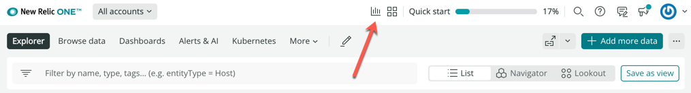
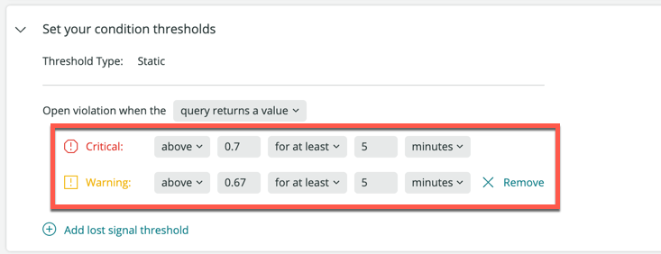

[New Relic query language (NRQL)](/docs/query-your-data/nrql-new-relic-query-language/get-started/introduction-nrql-new-relics-query-language/) を使って、アラートの条件を簡単に作成できます。

条件には、通知を受けたい内容が書かれており、必要な属性はクエリと閾値の2つだけです。クエリは、お客様にとって重要なデータを定義し、何について通知を受けるかを決定します。しきい値は、いつ通知されるかを決定します。

以下の手順で、NRQL クエリと閾値を使用して最初のアラート条件を作成します。これで、実際に使えるアラート条件ができあがります。

始める準備はできましたか？ [New Relic のアカウントをお持ちであることをご確認ください](https://newrelic.com/signup) 。無料でご利用いただけます。

## ステップ1：クエリを書く [#step1-nrql]

NRQL クエリを使って、自分の環境のパフォーマンスに関するデータを返すことができます。そして、そのクエリから条件を作成することができます。

この例では、各ホストのCPU使用率（クエリ）に対して条件を作成し、CPU使用率が0.7％（閾値）を超えた場合に通知を行います。一般的には、1％以下のしきい値を使用することはありませんが、この例ではしきい値を設定する方法を簡単に示しています。

[NRQL クエリビルダー](/docs/query-your-data/explore-query-data/query-builder/use-advanced-nrql-mode-query-data/) を UI の上部で見つけてください。

<figcaption>
  **Query your data** ボタンをクリックすると、クエリビルダが開き、NRQL クエリの作成を開始します。有効なクエリを作成したら、そこから条件を作成することができます。
</figcaption>

条件は各ホストのCPU使用率を表示します。このNRQLクエリ、または監視対象に関連した同様のものを使用して、条件を作成します。

<figcaption>
  このクエリは、環境内の平均的なCPU使用率を見つけ、それを個々のホスト名ごとに分けます（ファセット）。
</figcaption>

有効なNRQLクエリを作成したら、 **Create alert** をクリックします。

[NRQL構文の詳細](/docs/query-your-data/nrql-new-relic-query-language/get-started/introduction-nrql-new-relics-query-language/#syntax) 他の有用なクエリを作成するために。

## ステップ2： NRQLの条件に名前をつける [#step2-nrql]

NRQL条件に意味のある名前をつけてください。

## ステップ3: 条件のしきい値を設定する [#step3-nrql]

環境のパフォーマンスに関する通知を受けるタイミングを決めるために、重要度と警告のしきい値を設定します。

* アラートの状態に応じて、臨界点が必要となります。
* [警告のしきい値](/docs/alerts-applied-intelligence/new-relic-alerts/alert-conditions/set-thresholds-alert-condition/#threshold-levels) はオプションです。これらのしきい値は、クリティカルしきい値のようにインシデントを作成したり、通知したりしません。重要なしきい値がインシデントを開き、通知する場合、その後に作成された警告しきい値の違反はレポートに含まれます。

**Set your condition thresholds** セクションのこの例では、重要なしきい値（赤）は、CPU使用率が少なくとも5分間にわたって0.7%を超えたホストをチェックします。また、CPU使用率が0.67%を超えたホストが5分以上存在する場合には、警告しきい値（黄色）が追加されます。

閾値を入力すると、グラフ上に閾値の線が表示されます。

## ステップ4：ポリシーの作成

最後に、既存のポリシーに条件を追加するか、新しいポリシーを作成します。

<figcaption>
  新しいポリシーを作成する際に、ポリシー、条件、または違反ごとに違反をグループ化することができます（これにより、違反ごとにインシデントが作成されます）。これらの [インシデント設定](/docs/alerts-applied-intelligence/new-relic-alerts/alert-policies/specify-when-alerts-create-incidents/) 設定は、違反があったときに通知される頻度を決定します。
</figcaption>

## 次のステップ [#nextsteps-nrql]

これで最初の条件ができたので、 [インシデント設定](/docs/alerts-applied-intelligence/new-relic-alerts/alert-policies/specify-when-alerts-create-incidents/) と [通知チャンネル](/docs/alerts-applied-intelligence/new-relic-alerts/alert-notifications/notification-channels-control-where-send-alerts/) を設定します。

NRQL条件の詳細・概要については、 [NRQLアラート条件の作成をご覧ください。](/docs/alerts-applied-intelligence/new-relic-alerts/alert-conditions/create-nrql-alert-conditions/)