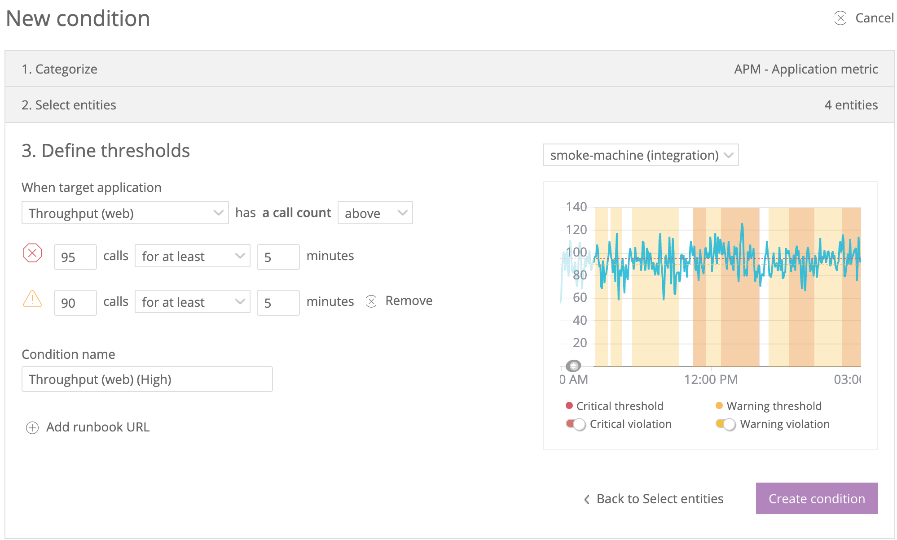

アラートでは、お客様が監視できるすべての内容に関して、堅固かつカスタマイズ可能なアラートポリシーを設定できます。主要パフォーマンスメトリクスに変動があった場合は、APM、Infrastructure、Browser、Mobile、そしてNRQLクエリを含めた当社の全製品から通知を受け取ることができます。

## 包括的なアラートソリューションの構築 [#alerting-solution]

<figcaption>
  **[one.newrelic.com](https://alerts.newrelic.com/ "新しいウィンドウにリンクが開きます。")**へ移動します。次に、**Alerts & AI > Create condition**をクリックします。これにより、アラート条件の作成時に[閾値設定UIページ](/docs/alerts/new-relic-alerts/defining-conditions/set-thresholds-alert-condition)が表示されます。
</figcaption>

お客様は、ご利用のアプリケーションおよびアーキテクチャに対する堅牢なアラートソリューションの構築のすべての部分を制御できます。

<table>
  <thead>
    <tr>
      <th style={{ width: "200px" }}>
        決定
      </th>

      <th>
        手順
      </th>
    </tr>
  </thead>

  <tbody>
    <tr>
      <td>
        何を監視するかを決定する。
      </td>

      <td>
        監視するあらゆるデータソースについて、アラート条件を設定できます。ご利用のアーキテクチャのコンポーネントが多いか少ないかに関わらず、効果的なアラートソリューションを作成できます。
      </td>
    </tr>

    <tr>
      <td>
        監視方法を定義する。
      </td>

      <td>
        どのようなデータソースの挙動が違反を発生させるのか、厳密に定義できます。以下の独自の機能が含まれています：

        * 違反および通知を発生させる回数と頻度の設定に関する、広範な管理権限。
        * 明白なパフォーマンス上の問題に関してはクリティカルな閾値を、また挙動がクリティカルに近づいた場合はオプションとして警告の閾値を設定します。
        * ご利用システムの挙動に自動的に合わせるベースラインのアラート条件。閾値の敏感度を自由に決定できます。
      </td>
    </tr>

    <tr>
      <td>
        インシデントの生成方法を決定する。
      </td>

      <td>
        インシデントプリファレンスによって通知の作成方法を管理することで、通知疲れを減らせます。たとえば、あらゆる違反に関して通知を受け取るか、一連の連続した違反に関して単一の通知を受け取るかを決定できます。
      </td>
    </tr>

    <tr>
      <td>
        通知の送信方法を決定する。
      </td>

      <td>
        メール、モバイルプッシュ通知、OpsGenie、Slackなど、多数の一般的なサービスを介したカスタマイズ可能な通知チャネルを用意しています。[Notification channels](/docs/alerts/new-relic-alerts/managing-notification-channels/notification-channels-control-where-send-alerts)から、対応サービスをご確認ください。
      </td>
    </tr>
  </tbody>
</table>

## ユニークかつインテリジェントな機能 [#features]

完全なアラートソリューションに求める標準的な管理機能に加えて、当社は以下のようなユニークで強力な機能を提供します。

<table>
  <thead>
    <tr>
      <th width={200}>
        **機能**
      </th>

      <th>
        詳細
      </th>
    </tr>
  </thead>

  <tbody>
    <tr>
      <td>
        自己制御型の監視
      </td>

      <td>
        [ベースラインのアラート条件](/docs/alerts/new-relic-alerts/defining-conditions/create-baseline-alert-conditions)では、インテリジェントかつ自己制御型の条件を作成できます。
      </td>
    </tr>

    <tr>
      <td>
        異常検知
      </td>

      <td>
        [異常挙動インジケーター](/docs/alerts/new-relic-alerts/reviewing-alert-incidents/view-violation-event-details-incidents#anomalous-behavior)は、主要データベースもしくは外部サービス活動への大きな変更から数分以内に発生する違反を自動的に検知します。
      </td>
    </tr>

    <tr>
      <td>
        グループ挙動から外れ値を検知
      </td>

      <td>
        [外れ値検知](/docs/alerts/new-relic-alerts/defining-conditions/outlier-detection-nrql-alert)を使用すると、定義済みグループの1つ以上のデータソースが、そのグループに期待する挙動から外れた場合を検知します。
      </td>
    </tr>

    <tr>
      <td>
        カスタムクエリ条件
      </td>

      <td>
        [当社のNRQLクエリ言語を使用して](/docs/insights/nrql-new-relic-query-language/using-nrql/introduction-nrql)カスタマイズされたクエリを作成し、そのクエリの経時的な偏差結果を監視します。
      </td>
    </tr>

    <tr>
      <td>
        NerdGraph API
      </td>

      <td>
        当社のGraphQL [NerdGraph API](/docs/alerts/alerts-nerdgraph/nerdgraph-examples/nerdgraph-api-examples)を利用して、アラートとインタラクションしましょう。NerdGraph APIには、最新機能が備わっているため、REST APIよりもお勧めです。
      </td>
    </tr>

    <tr>
      <td>
        Alerts REST API
      </td>

      <td>
        [REST API](/docs/alerts/rest-api-alerts/new-relic-alerts-rest-api/rest-api-calls-new-relic-alerts)を使用して、アラート設定に関する情報を返すか、アラートポリシーと条件を作成します。まずはNerdGraph APIから始めて、必要なオプションが備わっているか確認することをお勧めします。
      </td>
    </tr>

    <tr>
      <td>
        Webhook
      </td>

      <td>
        [Webhook](/docs/alerts/new-relic-alerts-beta/managing-notification-channels/customize-your-webhook-payload)をカスタマイズし、カスタムヘッダー、Basic認証、カスタムペイロードなどを定義することができます。
      </td>
    </tr>

    <tr>
      <td>
        インシデント範囲の絞り込みとロールアップ
      </td>

      <td>
        各アラートポリシーでは[3種類の違反グループ化戦略](/docs/alerts/new-relic-alerts-beta/reviewing-alert-incidents/specify-when-new-relic-creates-incidents)のいずれか1つを使用して、作成するアラートインシデントの数、そして送信される通知の数を管理できます。
      </td>
    </tr>

    <tr>
      <td>
        複数製品のイベント
      </td>

      <td>
        専用の[**Events**ページ](/docs/alerts/new-relic-alerts-beta/reviewing-events/review-events-across-products)では、ご利用のすべての製品にまたがる運用イベントが表示されます。
      </td>
    </tr>
  </tbody>
</table>

## データセキュリティとプライバシー [#security]

デフォルトでは、アラートは個人データを記録しません。さらに、New Relic Alertsは、個々のアカウントユーザーおよびアカウント構造の各アクセスレベルに対して[デフォルトのアクセス許可](/docs/alerts/new-relic-alerts/rules-limits-glossary/rules-limits-new-relic-alerts)を自動的に設定します。

セキュリティ対策の詳細については、当社の[セキュリティとプライバシーのドキュメント](/docs/using-new-relic/new-relic-security/security/security-matters-data-privacy-new-relic)を参照するか、[当社のセキュリティウェブサイト](https://newrelic.com/why-new-relic/security)をご覧ください。

## 次のステップ [#what-next]

Alertsを使い始めたばかりのユーザーおよびさらに詳しい情報を求めるユーザーは、以下をご覧ください。

* [基本プロセス](/docs/alerts/new-relic-alerts/getting-started/understand-new-relic-alerts-workflow)
* [ベストプラクティス](/docs/alerts/new-relic-alerts/getting-started/best-practices-alert-policies)