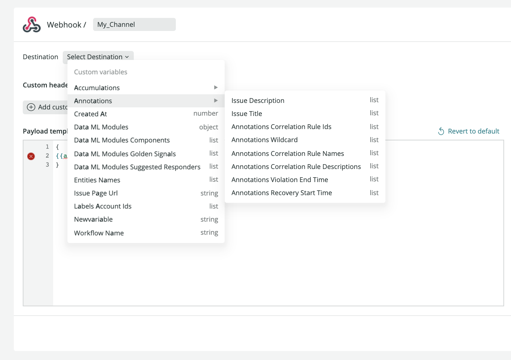

<Callout title="アーリーアクセス">
  ここで説明されている機能は早期アクセスです。アーリーアクセスプログラムに参加されていない方は、これらの機能を使用することはできません。

  関連する機能の詳細については、 [Alerts notification channels](/docs/alerts-applied-intelligence/new-relic-alerts/alert-notifications/notification-channels-control-where-send-alerts/) 、 [Incident Intelligence destinations](/docs/alerts-applied-intelligence/applied-intelligence/incident-intelligence/incident-intelligence-destination-examples/) 、 [Proactive Detection notifications](https://docs.newrelic.com/docs/alerts-applied-intelligence/applied-intelligence/proactive-detection/proactive-detection-applied-intelligence/#set-up) のドキュメントを参照してください。
</Callout>

通知メッセージのテンプレートを使うと、サードパーティの送信先に送信する前に、通知イベントデータをカスタマイズすることができます。テンプレートは、お客様のカスタム値をサードパーティの送信先で使用される値にマッピングします。

これにより、どのようなデータがどこに送信されるかを完全にコントロールすることができ、お客様が利用するサービスを十分に活用することができます。

## メッセージテンプレートの変数 [#variables]

メッセージテンプレートとは、New Relic のイベントデータをサードパーティサービスで利用可能なデータに変換するために使用するものです。変数は、サードパーティサービスのデータフィールドにマッピングされる特定の属性です。

メッセージテンプレートは、 [Handlebars](https://handlebarsjs.com/guide/) というシンプルなテンプレート言語で書かれています。メッセージテンプレート内の変数は、二重の中括弧の中に [式](https://handlebarsjs.com/guide/expressions.html) として書かれています `{{ }}` 。


<figcaption>
  通知メッセージテンプレートを使用して、New Relic の通知を外部サービスのフィールドにマッピングします。
</figcaption>

## 変数メニュー [#variables-menu]

New Relic の変数名は、メッセージテンプレートの変数メニューに記載されています。変数はサブカテゴリーに分類されています。

variables メニューで `{{` と入力して、変数のリストから選択します。入力すると、オートコンプリートで変数名が表示されます。変数の種類は右端に表示されます。これらの変数にエンリッチドデータを追加することができます。



<figcaption>
  変数メニューには、New Relic の通知フィールドを外部サービスのフィールドにマッピングする際のオプションが表示されます。
</figcaption>

## Handlebarsの構文を使う [#handlebars-syntax]

イベントで通知が発生すると、メッセージテンプレートはハンドルバー変数を使用して、通知データをサードパーティサービスが使用するフィールドにマッピングします。

Handlebars言語は、基本的な変数の置き換えに加えて、 [ネストした入力オブジェクトの評価](https://handlebarsjs.com/guide/#nested-input-objects) や、反復（ループ）や条件文などの関数など、多くの機能を備えています。Handlebarsではこれらの関数をヘルパーと呼びます。

## ヘルパー機能 [#help-functions]

私たちのメッセージテンプレートは、Handlebars [組み込みヘルパー](https://handlebarsjs.com/guide/builtin-helpers.html) をサポートしています。

さらに、あなたの役に立つかもしれない他のヘルパーも追加しました。

<CollapserGroup>
  <Collapser
    className="freq-link"
    id="json"
    title="JSON"
  >
    `{{json}}` ヘルパーは、テキストをJSON要素に変換します。

    JSON構文を使用するWebhookのペイロードを設定する場合や、JSON形式のデータを渡したい場合などに使用します。

    例えば、 `データ` という変数があるとします。

    ```json
    {
       "data":{
          "tags":["infra, team-a"]
       }
    }
    ```

    `名前` 配列を JSON 要素として取得するには、 `{{json}}` ヘルパーを使用します。

    ```handlebars
    {{json data.tags}}
    ```

    を得ることができます。

    ```json
     ["infra","team-a"]
    ```
  </Collapser>

  <Collapser
    className="freq-link"
    id="eq"
    title="平等性"
  >
    変数を比較するには、equality `{{#eq}}` ヘルパーを使用します。

    ```handlebars
    Compares variables a and b, renders 'yes' or 'no':

    {{#eq a b}} yes {{else}} no {{/eq}}

    Compares string value "a" to variable b, renders 'yes' or 'no':

    {{#eq "a" b}} yes {{else}} no {{/eq}}

    Renders 'true' or 'false':

    {{eq a b}}

    Render 'y' or 'n':

    {{eq a b yes='y' no='n'}}
    ```
  </Collapser>

  <Collapser
    className="freq-link"
    id="replace"
    title="交換"
  >
    `replace` ヘルパーは、第1パラメータのインスタンスを第2パラメータで子ブロックに置き換えます。

    `else` 節を使って、最初のパラメータのインスタンスが見つからなかった場合の動作を指定します。省略すると空の文字列が生成されます。

    例1：文中の `犬` を `猫` に置き換えます。 `The dog likes to eat`:

    ```handlebars
    {{#replace "dog" "The dog likes to eat"}}cat{{/replace}}
    ```

    を得ることができます。

    ```
      The cat likes to eat
    ```

    例2：文中の `cat` を `mouse` に置き換えます。 `The dog likes to eat`:

    ```handlebars
    {{#replace "cat" "The dog likes to eat"}}mouse{{/replace}}
    ```

    をクリックすると、空の文字列が表示されます。

    ```

    ```

    例3： `The dog likes to eat` 、 `else` 節を使って、文中の `cat` を `mouse` に置き換えます。

    ```handlebars
    {{#replace "cat" "The dog likes to eat"}}mouse{{else}}There is no cat to replace{{/replace}}
    ```

    を得ることができます。

    ```
      There is no cat to replace
    ```

    例4：文中の `dog` を `cat` に置き換える。 `The DOG likes to eat` while ignoring case:

    ```handlebars
    {{#replace "/dog/i" "The DOG likes to eat"}}cat{{/replace}}
    ```

    を得ることができます。

    ```
      The cat likes to eat
    ```

    例5：変数 `{{needle}}` を、変数 `{{replacement}}` を、変数 `{{haystack}}` に置き換えます。

    ```handlebars
    {{#replace needle haystack }}{{replacement}}{{/replace}}
    ```

    このデータを使って

    ```json
    {
      "needle": "/dog/i",
      "haystack": "The DOG likes to eat",
      "replacement": "cat"
    }
    ```

    を得ることができます。

    ```
      The cat likes to eat
    ```
  </Collapser>
</CollapserGroup>

## 使用例 [#usage-examples]

この例は、 `データ` という変数に基づいています。

```json
"data": {
    "tags":["infra, team-a"],
    "id":123456789,
    "name": "Alice",
}
```

`データ` 値には、同等の、ドット表記のフォーマットがあります。

```json
"data.tags": ["infra, team-a"]
"data.id": 123456789
"data.name": "Alice"
```

### データの検証 [#validate]

`id` と `123456789` が等しい場合、出力は `valid` となります。そうでない場合、出力は `not valid` となります。

```handlebars
{{eq data.name "Alice" yes='valid' no='not valid'}}
```

`名前` が `アリス` に等しい場合、出力は `有効` です。

### JSONを返す [#json]

`タグ` とオブジェクトのプロパティを JSON 形式で取得します。

```handlebars
{{json data.tags}}
```

そうすると、次のようなJSONが返ってきます。

```json
["infra","team-a"]
```

### 配列からの値の取得 [#array]

`tags` の配列から最初のタグを取得します。

```handlebars
{{json data.tags.[0]}}
```

これは、配列から最初の値を返すことになります。

```shell
"infra"
```

### 配列の反復処理 [#iterate-array]

配列型の変数をイテレートし、その値を文字列に集約します。

```handlebars
{{#each tags}}{{this}}{{#unless @last}}, {{/unless}}{{/each}}
```

結果には、カンマで区切られたタグが含まれます（末尾のカンマは省略されます）。

```shell
infra, team
```

同様に、 `データ` 変数を反復し、オブジェクトの値を集約して、JSON 要素を出力します。

```handlebars
{{#each (json data)}}{{this}}{{/each}}
```

これは次のようなJSONを返します。

```json
{
	"tags":["infra, team-a"],"name":"Alice","id":"123456789"
}
```

`データ` 変数をイテレートして、オブジェクトのエントリを文字列に集約します。

```handlebars
{{#each data}}{{@key}}: {{this}}{{#unless @last}}, {{/unless}}{{/each}}
```

これは次のような文字列を返します。

```shell
tags: infra,team-a, name: Alice, id: 123456789
```

### 欠落した属性の処理 [#missing-attributes]

場合によっては、ある属性が [変数メニュー](/docs/alerts-applied-intelligence/notifications/message-templates/#variables-menu) に存在しなかったり、全く存在しないこともあります。

`#if` ステートメントを使って、次のようにフォールバックを設定することができます。

```handlebars
{{#if data.type}} {{ json data.type }} {{else}}"N/A"{{/if}}
```

と入力すると、文字列 `" N/A"` が返されます。