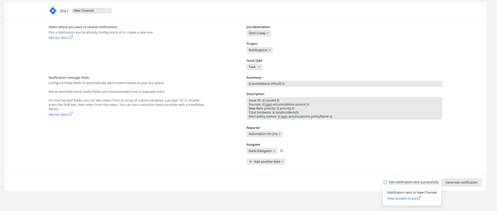
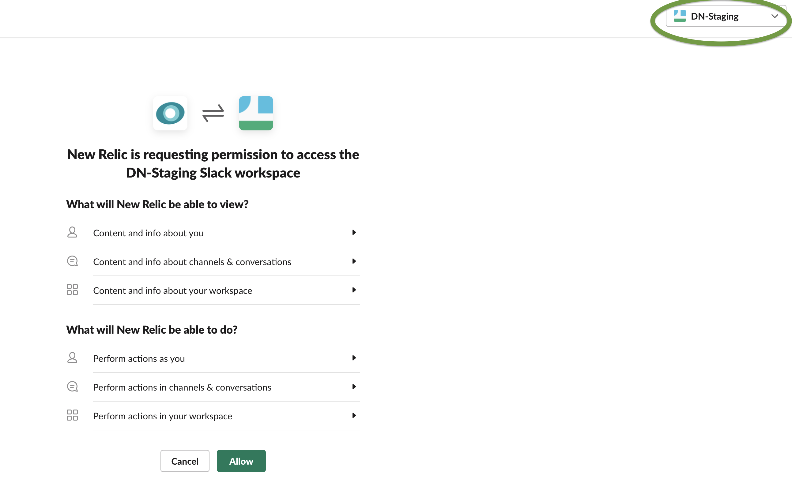

<Callout title="アーリーアクセス">
  ここで説明されている機能は早期アクセスです。アーリーアクセスプログラムに参加されていない方は、これらの機能を使用することはできません。

  関連する機能の詳細については、 [Alerts notification channels](/docs/alerts-applied-intelligence/new-relic-alerts/alert-notifications/notification-channels-control-where-send-alerts) 、 [Incident Intelligence destinations](/docs/alerts-applied-intelligence/applied-intelligence/incident-intelligence/incident-intelligence-destination-examples) 、 [Proactive Detection notifications](/docs/alerts-applied-intelligence/applied-intelligence/proactive-detection/proactive-detection-applied-intelligence/#set-up) のドキュメントを参照してください。
</Callout>

アラートとアプライド インテリジェンスの通知統合は、New Relic からの通知を送信するために使用できる特定のサービスとプラットフォームです。

## 統合内容 [#detail]

それぞれの具体的な通知機能の統合についてはこちらをご覧ください。

<CollapserGroup>
  <Collapser
    className="freq-link"
    id="jira"
    title="アトラシアン Jira"
  >
    **New RelicとAtlassian Jira(Cloud)を統合し、Jiraの課題を自動的に作成・更新することができます。**

    <Video
      type="wistia"
      id="vp5rigddko"
    />

    ## アクセス権限 [#jira-permissions]

    Jira `API-Token` からの必要なパーミッションは、 `create`, `edit`, `close` tickets です。

    双方向の同期トグルを有効にするには、提供された Jira `API-Key` に `Admin` のロールが必要です。

    ## Jiraのデスティネーションを設定する [#set-up-jira]

    Jiraの課題を作成し、JiraとNew Relicが更新情報を共有し、同期をとるようにします。

    Jiraのデスティネーションを作成するには、以下の情報を入力します。

    * **デスティネーション名：** デスティネーションを識別するためのカスタム名。

    * **Jiraアカウントのエンドポイント：** 送信先のURLです。

    * **User-name:** 接続を行うユーザーの電子メールアドレスです。

    * **API トークン：** アトラシアンアカウントから生成されたものです。

      <Callout variant="important">
        New Relic は現在、 [Atlassian-Jira Classic (企業が管理する)プロジェクトをサポートしています。](https://support.atlassian.com/jira-software-cloud/docs/what-are-team-managed-and-company-managed-projects/).
      </Callout>

      宛先を保存する前に、 **Test connection** ボタンを使って接続をテストすることをお勧めします。

      

      ### 2ウェイ・シンク [#jira-two-way]

      Jira との双方向の統合を有効にすると、課題の状態が New Relic の対応する状態と同期されます。双方向の同期を有効にするには、双方向の統合のトグルをオンにします。

      オンにすると、選択したプロジェクトについて、後の段階で Jira アカウントに [Jira Webhook](https://developer.atlassian.com/server/jira/platform/webhooks/) が作成されます。Webhook には、New Relic へのアクセス詳細 (URL および API キー) が含まれます。

      ## メッセージテンプレートの設定 [#configure-jira-message-template]

      Jira課題のテンプレートを設定するには、以下の手順で行います。

    1. デスティネーションを選択します。この段階で新しい目的地を作ることができます。

    2. 接続先への接続が成功したら、プロジェクトを選択し、使用したいJiraの課題タイプを選択します。

    3. 課題タイプが選択されると、設定されたプロジェクトのフィールドがアカウントから取得され、Jiraインスタンスに自動的にマッピングされます。

       お客様にご利用いただくために、必須項目、推奨項目、値を自動的に入力しています。必須項目は必ず値を設定してください。任意のフィールドは、その右側にある `X` マークを使って、追加または削除することができます。

       

       <figcaption>
         Jiraのメッセージテンプレートです。
       </figcaption>

       ## テスト通知の送信 [#send-jira-test]

       デフォルトのフィールド値でテスト通知をクリックすると、JIRA課題がどのように表示されるかを確認できます。

       成功すると、JIRAの課題が作成され、リンクが表示されます。
  </Collapser>

  <Collapser
    className="freq-link"
    id="servicenow"
    title="ServiceNow（インシデント・マネジメント）"
  >
    **New RelicとServiceNow Incident-Managementを統合し、インシデントを自動的に作成・更新することができます。**

    <Video
      type="wistia"
      id="6or6n8am4k"
    />

    ## 役割 [#roles-servicenow]

    統合の一環として、ServiceNowのインシデントテーブルからフィールドを取得し、その他のオプション値も取得します。以下のパーミッションが必要です。

    * `sys_dictionary`, `sys_choice`, `sys_user`, and `task` のテーブルに対する読み取り権限を持つ。

    * Read/Write permission to `incident`.

    * `caller` カラムのユーザーを取得するには、 `sys_users` テーブルの読み取りパーミッションが必要です。

      ロール `personalize_choices`, `personalize_dictionary`, `rest_service`, `itil` は、上記のパーミッションを持っています。

      双方向の統合を可能にするためには、 `api_key_credentials` テーブルに対する読み取り/書き込み権限が必要です。 `credentials_admin` と `discovery_admin` のロールがこれを提供します。

      ## デスティネーションの設定 [#set-up-service-destination]

      ServiceNowのデスティネーションを作成するには、以下の情報を入力します。

    * **デスティネーション名：** デスティネーションを識別するためのカスタム名。

    * **ドメイン：** 送信先のURLです。

    * **User-name:** ユーザーの名前です。

    * **パスワード：** ユーザーのパスワードです。

      デスティネーションを保存する前に、 **Test connection** ボタンをクリックして、接続をテストすることをお勧めします。

      

      ### 2ウェイ・シンク [#two-way-servicenow]

      ServiceNow Incidents Managementとの双方向の統合を設定することで、インシデントの状態をNew Relicの対応する状態と同期させることができます。

      双方向の統合を設定するには

    1. `2ウェイ統合` トグルをオンにします。

    2. この <a href="https://storage.googleapis.com/newrelic-notifications/snow-two-way-sync/Newrelic-Snow-Sync-Configurations.xml" download="NewRelic-SNow-Sync-Configurations.xml">XML ファイル</a> を開いてダウンロードすると、ビジネスルールのトリガーとなるイベントが New Relic One に戻ってきます。

    3. ServiceNowのサイドバーメニューで、 **System Definition> Business Rules** を選択します。

    4. いずれかのコラムヘッダーのメニューアイコンをクリックし、 **Import XML** を選択し、ダウンロードしたXMLファイルをアップロードします。

       宛先が保存されると、New Relic の API-Key が `api_key_credentials` に保存されます。このキーは、New Relic へのコールバック REST 呼び出しの一部としてヘッダーで送信されます。

       ## メッセージテンプレートの設定 [#configure-servicenow-message-template]

       接続が成功すると、ServiceNowのインシデントテーブルのカラムがアカウントから取得され、自動的にServiceNowインスタンスにマッピングされます。

       お客様にご利用いただくために、必須項目、推奨項目、値を自動的に入力しています。必須項目は必ず値を設定してください。任意のフィールドは、その右側にある `X` マークを使って、追加または削除することができます。

       

       <figcaption>
         ServiceNow-Incidentテンプレートのフィールドを選択、編集または削除します。
       </figcaption>

       ## テスト通知の送信 [#send-servicenow-test]

       **Test notification** をクリックすると、デフォルトのフィールド値を持つServiceNowインシデントが表示されます。成功すると、インシデントが作成され、リンクが表示されます。
  </Collapser>

  <Collapser
    className="freq-link"
    id="slack"
    title="スラック"
  >
    **Slackのチャンネルに通知メッセージを送信します。**

    <Video
      type="wistia"
      id="3ypdkpd7zg"
    />

    ## 前提条件 [#slack-prereqs]

    Slack ワークスペースには、 [New Relic アプリケーション](https://newrelic.slack.com/apps/AP92KQJS3-new-relic?tab=more_info) がインストールされている必要があります。このアプリケーションをユーザーが個別にインストールするには、ワークスペースの管理者による承認が必要です。

    ## Slackの宛先を設定する [#set-slack-destination]

    **ワンクリックSlack認証** をクリックしてSlackのランディングページに移動し、OAuth2認証プロセスを続行します。必要なワークスペースにサインインしていない場合は、Slack にリダイレクトされてサインインします。

    

    ワークスペース名を追加するか、関連するワークスペースを選択して、 **「続ける」** をクリックします。

    

    選択したワークスペースにサインインしている場合、New Relic が指定されたアクションを実行することを許可します。

    

    **Allow** をクリックすると、目的のページに戻ります。

    

    ## Slackのメッセージ設定 [#configure-slack-message-settings]

    宛先（ワークスペース）と、メッセージを送信するslackチャンネルを選択します。必要なワークスペースにあらかじめ定義された送信先がない場合は、新しい送信先を作成することができます。なお、プライバシー保護のため、プライベート・チャンネルを選択するには、ユーザーが一度認証を受ける必要があります。

    

    ### テスト通知の送信 [#send-slack-test]

    あらかじめ定義された例のペイロードを持つテスト通知をチャンネルに送信することができます。これにより、選択したslackチャンネルにメッセージが作成されます。

    
  </Collapser>

  <Collapser
    className="freq-link"
    id="webhook"
    title="Webhook"
  >
    **Webhook Notifierを使って、任意のエンドポイントに通知メッセージを送信します。**

    <Video
      type="wistia"
      id="feyutwgew8"
    />

    ## Webhookの宛先を設定する [#set-webhook-destination]

    Webhookの宛先を作成するには、以下のものが必要です。

    * **デスティネーション名：** 固有のデスティネーション名。

    * **URLです。** 対象となるアプリケーションのエンドポイントで、必要に応じて認証やカスタムヘッダーも含まれます。

    * **Authorization mechanism (_Optional_):**. `ベーシック認証` または `ベアラートークン` とすることができます。

      ## Webhookイベントテンプレートの設定 [#configure-webhook-event-template]

      Webhookの宛先をリストから選び、 `HTTP-POST` リクエストを設定します。

      リクエスト設定では、以下のことが求められます。

    1. テンプレートの名前を設定します。

    2. あらかじめ設定されている目的地を目的地リストから選択するか、新しい目的地を作成します。

    3. カスタムヘッダーの追加（オプション）。

    4. リクエストのペイロードを設定します。

       ## Webhookペイロードのカスタマイズ [#customize-webhook-payload]

       デフォルトのペイロードを使用することも、必要なデータを含むようにカスタマイズすることもできます。 [variablesメニュー](/docs/alerts-applied-intelligence/notifications/message-templates/#variables-menu) から変数を選び、 [handlebars構文](/docs/alerts-applied-intelligence/notifications/message-templates/#handlebars-syntax) を適用して、Webhookを充実させます。

       リクエストのcontent-typeはデフォルトでJSONであることに注意してください。したがって、ペイロードはJSONである必要があります。 [使用例](/docs/alerts-applied-intelligence/notifications/message-templates/#usage-examples) を参照してください。

       右側の **プレビュー** セクションには、テンプレートがレンダリングされた後に予想されるペイロードが表示されます。ペイロードが有効なJSONを形成していない場合は、エラーが表示され、テンプレートを保存することはできません。

       

       Webhookペイロードが有効なJSONに適合していれば、定義したWebhook宛先にテスト通知を送信できます。

       

       テスト通知を送信して、すべてが正しく接続されていることを確認することをお勧めします。
  </Collapser>

  <Collapser
    className="freq-link"
    id="email"
    title="メール"
  >
    **ユーザーにメールで通知を送る。**

    ## メール設定 [#configure-email-settings]

    1人または複数の受信者を追加します。

    * New Relic アカウントを持つユーザーは、名前やメールアドレスを検索する際にオートコンプリートで見つけることができます。

    * New Relic アカウントやメール配信リストを持っていないユーザーを追加するには、そのユーザーの完全なメールアドレスを入力します。

      すべての受信者は、宛先に変換されます。送信先ごとのメール通知は、 [notifications-log](/docs/alerts-applied-intelligence/notifications/destinations/#notifications-log) で確認できます。

      

      ### テスト通知の送信 [#email-test]

      テスト通知を送信して、メール通知が受信箱に届くことを確認します。
  </Collapser>
</CollapserGroup>