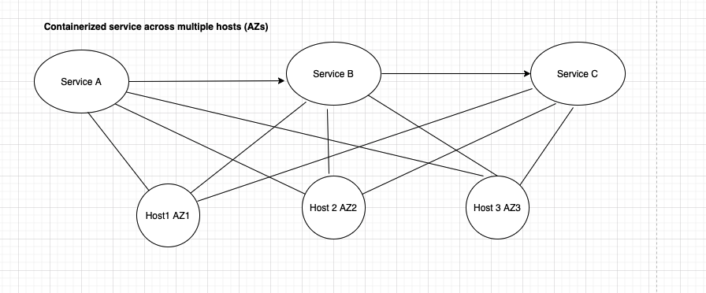

このチュートリアルでは、NerdGraph APIを使用してトポロジーを設定する方法を説明します。トポロジーの設定により、 [Applied Intelligence decisions](/docs/alerts-applied-intelligence/applied-intelligence/incident-intelligence/change-applied-intelligence-correlation-logic-decisions) のインシデントの相関性を高めることができます。

## 要件 [#requirements]

トポロジー相関図は現在限定公開されています。 [トポロジーの要件](/docs/alerts-applied-intelligence/applied-intelligence/incident-intelligence/change-applied-intelligence-correlation-logic-decisions/#topology-requirements) を参照してください。

NerdGraphをご利用いただくには、 [ユーザーキー](/docs/apis/nerdgraph/get-started/introduction-new-relic-nerdgraph/#authentication) が必要です。

## チュートリアルの概要 [#overview]

New Relic の [Applied Intelligence](/docs/alerts-applied-intelligence/new-relic-alerts/get-started/introduction-applied-intelligence/) では、インシデントの相関関係を管理するカスタム [ディシジョン](/docs/alerts-applied-intelligence/applied-intelligence/incident-intelligence/change-applied-intelligence-correlation-logic-decisions) を作成することができます。カスタムディシジョンロジックの一つとして、"トポロジーの概念を使用しています。" トポロジーとは、サービスマップ（インフラストラクチャ内のサービスやリソースが互いにどのように関連しているか）を表現したものです。

このチュートリアルでは、 [NerdGraph](/docs/apis/nerdgraph/get-started/introduction-new-relic-nerdgraph/) を使用する方法を紹介します。

* 頂点とエッジを作成してトポロジーを設定する
* 頂点・辺の削除
* トポロジーデータの取得

NerdGraphを使ってトポロジーを設定する前に、以下のことを基本的に理解しておく必要があります。

* [What Applied Intelligence decisions are](/docs/alerts-applied-intelligence/applied-intelligence/incident-intelligence/change-applied-intelligence-correlation-logic-decisions) and [how topology correlation works](/docs/alerts-applied-intelligence/applied-intelligence/incident-intelligence/change-applied-intelligence-correlation-logic-decisions/#topology).
* 実装しようとしているトポロジー構造。 [これを理解する1つの方法として、当社のサービスマップ機能](/docs/understand-dependencies/understand-system-dependencies/service-maps/introduction-service-maps/) を使用して、インフラストラクチャ内のエンティティが互いにどのように関連しているかを確認することができます。
* [NerdGraphとは](/docs/apis/nerdgraph/get-started/introduction-new-relic-nerdgraph) と [NerdGraph APIエクスプローラーの使い方](/docs/apis/nerdgraph/get-started/introduction-new-relic-nerdgraph/#explorer) クエリを実行する。

## 変異の例 [#mutations]

NerdGraphでは、リソースの作成や設定の変更などのアクションを実行するリクエストを「ミューテーション」と呼んでいます（[Learn more about NerdGraph terminology](/docs/apis/nerdgraph/get-started/introduction-new-relic-nerdgraph/#terminology) ）。

このセクションでは、 `aiTopologyCollector` mutations を使って、トポロジーの作成、編集、削除を行う方法を紹介します。

作成セクションでは、このサービスマップを表現するための頂点と辺を作成します。

 <figcaption>このチュートリアルでは、NerdGraphを使用して、これらのエンティティとその関係を表す頂点と辺を作成します。</figcaption>

### 頂点の作成 [#create-vertices]

次の変異では1つ以上の頂点が作られますが、これらの頂点は監視対象のエンティティを表し、インシデントの発生源となります。

以下のNerdGraphコールは、以下のフィールドを使用しています。

* `accountId`: あなたのNew RelicアカウントIDです。
* `name`: 頂点の名前です。この値は大文字と小文字を区別し、グラフ内で一意でなければなりません。
* `vertexClass`: 頂点クラスは、 `アプリケーション`, `ホスト`, `クラウドサービス`, `クラスタ`, または `データストア` となります。この分類により、決定ロジックは、これらの分類に一致する頂点を制限するために、トポロジーベースの相関関係を制限することができます。
* `definingAttributes`: インシデント・イベントの属性と一致する属性のセット（キー／バリュー・ペア）。これらは通常、エンティティGUIDやその他のIDなど、すべてのインシデントに表示される一意の識別子です。インシデントに、あるバーテックスの `definingAttributes` のキーと値のペアのいずれかが含まれていれば、そのバーテックスにマッチします。アトリビュートの詳細とその追加方法については、 [Add attributes](/docs/alerts-applied-intelligence/applied-intelligence/incident-intelligence/change-applied-intelligence-correlation-logic-decisions/#add-attributes) を参照してください。

例のコール。

```
mutation {
  aiTopologyCollectorCreateVertices(
  accountId: <var>NEW_RELIC_ACCOUNT_ID</var>, 
    vertices: [
    	{name: "ServiceA", vertexClass: APPLICATION, definingAttributes: [{key: "application/name", value: "ServiceA"}]}, 
    	{name: "ServiceB", vertexClass: APPLICATION, definingAttributes: [{key: "application/name", value: "ServiceB"}]}, 
    	{name: "ServiceC", vertexClass: APPLICATION, definingAttributes: [{key: "application/name", value: "ServiceC"}]}, 
    	{name: "HOST1", vertexClass: HOST, definingAttributes: [{key: "host/name", value: "HOST1"}, {key: "availability-zone", value: "us-west-2a"}, {key: "region", value: "us-west-2"}]}, 
    	{name: "HOST2", vertexClass: HOST, definingAttributes: [{key: "host/name", value: "HOST2"}, {key: "availability-zone", value: "us-west-2b"}, {key: "region", value: "us-west-2"}]}, 
    	{name: "HOST3", vertexClass: HOST, definingAttributes: [{key: "host/name", value: "HOST3"}, {key: "availability-zone", value: "us-west-2c"}, {key: "region", value: "us-west-2"}]}]) 
  {
    result
  }
}
```

### エッジの作成 [#edges]

この突然変異を利用して、頂点間の関係を表す1つ以上のエッジを作成します。

以下のNerdGraphのコールは、これらのフィールドを使用しています。

* `accountId`: あなたのNew RelicアカウントIDです。
* `fromVertexName`: エッジの始点となる頂点の名前です。
* `toVertexName`: 接続する頂点の名前です。
* `directed`: 頂点がどのようにつながっているかを示すブール値。 `true` は一方通行の関係（例えば、あるサービスが別のサービスを呼び出すなど）を示し、 `false` は .デフォルトでは、directed = `true`.

例のコール。

```
mutation {
  aiTopologyCollectorCreateEdges(
    accountId: <var>NEW_RELIC_ACCOUNT_ID</var>, 
   edges: 
    [
      {directed: true, fromVertexName: "ServiceA", toVertexName: "ServiceB"},
      {directed: true, fromVertexName: "ServiceB", toVertexName: "ServiceC"},
      {directed: false, fromVertexName: "ServiceA", toVertexName: "HOST1"},
      {directed: false, fromVertexName: "ServiceA", toVertexName: "HOST2"},
      {directed: false, fromVertexName: "ServiceA", toVertexName: "HOST3"},
      {directed: false, fromVertexName: "ServiceB", toVertexName: "HOST1"},
      {directed: false, fromVertexName: "ServiceB", toVertexName: "HOST2"},
      {directed: false, fromVertexName: "ServiceB", toVertexName: "HOST3"},
      {directed: false, fromVertexName: "ServiceC", toVertexName: "HOST1"},
      {directed: false, fromVertexName: "ServiceC", toVertexName: "HOST2"},
      {directed: false, fromVertexName: "ServiceC", toVertexName: "HOST3"},      
    ]) {
    result
  }
}
```

### 頂点の削除 [#delete-vertices]

この変異は、トポロジーグラフの頂点を削除するものである。頂点を削除すると、その頂点に接続しているすべてのエッジが削除されることに注意してください。

以下のNerdGraphのコールは、これらのフィールドを使用しています。

* `accountId`: あなたのNew RelicアカウントIDです。
* `vertexNames`: 削除したい頂点名のリストです。

例のコール。

```
mutation {
  aiTopologyCollectorDeleteVertices(
    accountId: <var>NEW_RELIC_ACCOUNT_ID</var>, 
    vertexNames: ["ServiceA", "ServiceB", "ServiceC", "HOST1", "HOST2", "HOST3"]) 
  {
    result
  }
}
```

### エッジの削除 [#delete-edges]

この変異では、トポロジーグラフの頂点を結ぶエッジが削除されます。

以下のNerdGraphのコールは、これらのフィールドを使用しています。

* `accountId`: あなたのNew RelicアカウントIDです。
* `edgeIds`: 削除したいエッジIDのリストです。

例のコール。

```
mutation {
  aiTopologyCollectorDeleteEdges(
    accountId: <var>NEW_RELIC_ACCOUNT_ID</var>, 
    edgeIds: ["d8a7971b-575d-42e9-aa13-43a50c5a7d10", "0da5cb92-0428-4890-992b-2823d037cb5e"]
  ) {
    result
  }
}
```

## クエリの例 [#queries]

NerdGraphでは、アクションを実行するミューテーションとは対照的に、データを取得するためにクエリを使用します（[用語について詳しくはこちら](/docs/apis/nerdgraph/get-started/introduction-new-relic-nerdgraph/#terminology) ）。Nerdgraphのクエリは固定ではないので、必要に応じてより多くのデータを要求したり、より少ないデータを要求したりすることができます。トポロジーデータを取得するには、 `aiTopology` クエリを使用します。

### 頂点の取得 [#retrieve-vertices]

このクエリは、トポロジーグラフの頂点のリストを返します。

```
{
  actor {
    account(id: <var>NEW_RELIC_ACCOUNT_ID</var>) {
      aiTopology {
        vertices {
          vertices {
            id
            name
            definingAttributes {
              key
              value
            }
            updatedAt
            vertexClass
          }
          count
          cursor
        }
      }
    }
  }
}
```

### リティーブ・エッジ [#retrieve-edges]

このクエリは、トポロジー・グラフのエッジのリストを返します。

```
{
  actor {
    account(id: <var>NEW_RELIC_ACCOUNT_ID</var>) {
      aiTopology {
        edges {
          edges {
            id
            toVertexName
            fromVertexName
            directed
            updatedAt
          }
          cursor
          count
        }
      }
    }
  }
}
```