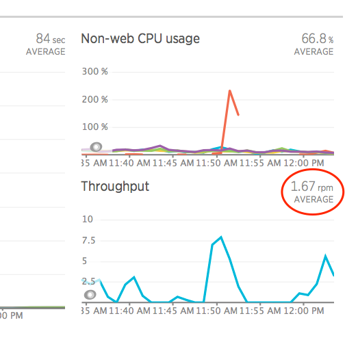

New Relic REST API (v2)を使用して、 [ウェブアプリケーション](/docs/using-new-relic/welcome-new-relic/getting-started/glossary#transaction) と [非ウェブアプリケーション](/docs/using-new-relic/welcome-new-relic/getting-started/glossary#non-web-transaction) のスループットを含む、アプリの平均スループットを取得できます。これらの値は、アプリの **APM Summary** ページの [Throughput chart](/docs/apm/applications-menu/monitoring/apm-overview-page-view-transaction-apdex-usage-data#overview_charts) に表示されます。

1. **[one.newrelic.com](http://one.newrelic.com) > APM> （アプリを選択）** にアクセスします。
2. アプリの **取引タイムチャート** タイトルをクリックして、選択してください。

## ウェブアプリのスループット [#api-call]

ある時間帯のウェブアプリケーションの平均スループット値を求めるには、一つのコマンドを使ってメトリックを取得します。 `HttpDispatcher`:`requests_per_minute`.この例では、特定の 24 時間の時間帯を表示しています。

```
curl -X GET "https://api.newrelic.com/v2/applications/<var>${APPID}</var>/metrics/data.json" \
      -H "X-Api-Key:<var>${APIKEY}</var>" -i \
      -d 'names[]=HttpDispatcher&values[]=requests_per_minute&from=<var>2014-02-21T23:59:00+00:00</var>&to=<var>2014-02-22T23:59:00+00:00</var>&summarize=true'
```

* 必ず <var>$&#x7B;APPID} に置き換えてください。</var> と <var>$&#x7B;APIKEY}を入れてください。</var> には、あなたの [アプリケーションID](/docs/apm/apis/requirements/identification-code) と [APIキー](/docs/apis/rest-api-v2/requirements/rest-api-key) を入力してください。
* [時間帯を変更するには](/docs/apm/apis/requirements/extracting-metric-data) 、 `を` から、 `を` の値に含めます。
* [デフォルトの時間帯](/docs/apm/apis/api-v2-examples/specifying-time-range-api-v2) を過去30分に保つには、 `を` から、 `を` から省略します。
* [平均値ではなく、一連のスループット値を返すには](/docs/apm/apis/requirements/calculating-average-metric-values-summarize), omit `summarize`.

ここでは、 [**APM Summary** ページ](/docs/apm/applications-menu/monitoring/applications-overview-dashboard) の **Throughput** チャートの例を示しています。New Relic REST API (v2) を使用して、ここに表示される **Throughput** の平均値を返すことができます。


## Webアプリのスループット（シングルホスト） [#api-call-web-single]

ある期間における単一のホストからの平均スループットを求めるには、一つのコマンドを使用して、メトリック `HttpDispatche`r`:requests_per_minute` を取得し、数値 <var>$&#x7B;HOST} を指定します。</var> 。ホストを特定するには、 [UIまたはREST API](/docs/apis/rest-api-v2/requirements/listing-host-instance-application-server-ids#locating_host_id) を使用してください。

この例では、特定の24時間を対象とした時間範囲を示しています。

```
curl -X GET "https://api.newrelic.com/v2/applications/<var>${APPID}</var>/hosts/<var>${HOST}</var>/metrics/data.json" \
      -H "X-Api-Key:<var>${APIKEY}</var>" -i \
      -d 'names[]=HttpDispatcher&:values[]=requests_per_minute&from=<var>2014-02-21T23:59:00+00:00</var>&to=<var>2014-02-22T23:59:00+00:00</var>&:summarize=true'
```

## 非ウェブアプリのスループット [#api-call]

任意の期間における非ウェブアプリケーションの平均スループット値を求めるには、1つのコマンドを使用してメトリックを取得します。 `OtherTransaction/all`:`requests_per_minute`.

この例では、特定の24時間を対象とした時間範囲を示しています。

```
curl -X GET "https://api.newrelic.com/v2/applications/<var>${APPID}</var>/metrics/data.json" \
      -H "X-Api-Key:<var>${APIKEY}</var>" -i \
      -d 'names[]=OtherTransaction/all&values[]=requests_per_minute&;from=2014-02-21T23:59:00+00:00&to=2014-02-22T23:59:00+00:00&summarize=true'
```

* 必ず <var>$&#x7B;APPID} に置き換えてください。</var> と <var>$&#x7B;APIKEY}を入れてください。</var> には、あなたの [アプリケーションID](/docs/apm/apis/requirements/identification-code) と [APIキー](/docs/apis/rest-api-v2/requirements/rest-api-key) を入力してください。
* [時間範囲](/docs/apm/apis/requirements/extracting-metric-data) を変更するには（この例のように）、 から `、 から の値を含めます。`
* `デフォルトの時間帯 （直近の30分）を維持するには、` から `、 から の値を省略します。`
* `平均値ではなく、一連のスループット値を返すには, omit summarize.`

`ここでは、 APM Summary ページ の非ウェブアプリの Throughput チャートの例を示しています。New Relic REST API (v2) を使用して、ここに表示される Throughput の平均値を返すことができます。



## 非ウェブアプリのスループット（シングルホスト）

単一のホストからの非ウェブアプリの、ある期間の平均スループットを取得するには、1つのコマンドを使用して、メトリック OtherTransaction:requests_per_minute を取得し、数値 <var>$&#x7B;HOST}</var> を指定します。 。ホストを特定するには、 UIまたはREST API を使用してください。

この例では、特定の24時間を対象とした時間範囲を示しています。`

```
curl -X GET "https://api.newrelic.com/v2/applications/<var>${APPID}</var>/hosts/<var>${HOST}</var>/metrics/data.json" \
      -H "X-Api-Key:<var>${APIKEY}</var>" -i \
      -d 'names[]=OtherTransaction/all&:values[]=requests_per_minute&from=<var>2014-02-21T23:59:00+00:00</var>&to=<var>2014-02-22T23:59:00+00:00</var>&:summarize=true'
```