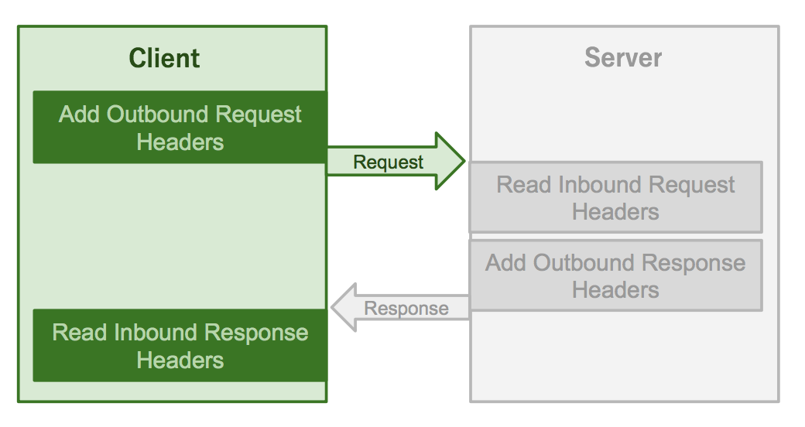

New Relic の Java エージェントは、 [Web トランザクション](/docs/apm/transactions/intro-transactions/transactions-new-relic-apm) と [バックグラウンドタスクなどの非 Web トランザクション](/docs/apm/transactions/intro-transactions/monitor-background-processes-other-non-web-transactions) の情報を収集して報告します。エージェントは、サポートされているフレームワークを自動的に計測し、アプリケーションのコードを変更する必要はありません。ただし、カスタムコードや [「Compatibility and requirements for the Java agent」](/docs/agents/java-agent/getting-started/compatibility-requirements-java-agent) のドキュメントに記載されていないフレームワークやテクノロジーに加えて、サポートされているフレームワークの実装によっては、 [カスタムインスツルメンテーション](/docs/agents/java-agent/custom-instrumentation/java-custom-instrumentation) が必要になる場合があります。

このドキュメントでは、 [Java エージェント API](/docs/agents/java-agent/custom-instrumentation/java-agent-api) を使用して、外部コール、メッセージングフレームワーク、 [クロスアプリケーショントレース](/docs/apm/transactions/cross-application-traces/cross-application-tracing) (CAT)、データストア、および Web フレームワークを計測する方法について説明します。API を使用する際に最良の結果を得るためには、 [最新の Java エージェント・リリース](/docs/release-notes/agent-release-notes/java-release-notes) を持っていることを確認してください。例題で使用されているいくつかのAPIには、Java agent 3.36.0以降が必要です。

## 外部API [#external]

**External API** は、アプリケーションが外部サービスの呼び出しを New Relic に報告できるようにするものです。この情報は、APM の [**External services** ページ](/docs/apm/applications-menu/monitoring/external-services-page) に表示されます。HTTP の外部アクティビティをレポートするには、 `ExternalParameters` のインスタンスを `HttpParameters` ビルダーを使って作成し、レポートしたいトレースされたメソッドで `reportAsExternal(ExternalParameters parameters)` を呼び出すだけです。

<CollapserGroup>
  <Collapser
    id="external-api-example"
    title="外部API"
  >
    ```
    String library = "HttpClient"; // a user-recognizable name for the library that is being used
    URI uri = request.getURI(); // the URI that is being requested
    String procedure = "execute"; // these are typically named after the method in the library that's being instrumented

    // construct external parameters
    ExternalParameters params = HttpParameters
        .library(library)
        .uri(uri)
        .procedure(procedure)
        .inboundHeaders(inboundHeaders)
        .build();

    // report the current method as doing external activity
    NewRelic.getAgent().getTracedMethod().reportAsExternal(params);
    ```
  </Collapser>
</CollapserGroup>

## 外部パラメータービルダー [#external-parameters]

`ExternalParameters` を作成するためのいくつかのビルダーがあります。

* `DatastoreParameters`
* `HttpParameters`
* `GenericParameters`
* `MessageConsumeParameters`
* `MessageProduceParameters`

これらのビルダーは、 [`TracedMethod`'s](http://newrelic.github.io/java-agent-api/javadoc/com/newrelic/api/agent/TracedMethod.html) `reportAsExternal` APIコールの入力パラメータオブジェクトを作成します。これらのパラメータ・オブジェクトは、クロス・アプリケーション・トレースによるHTTP外部呼び出しのリンク、データストアへの外部呼び出しのトレース、追加の低速クエリ処理を伴うデータストアへの外部呼び出しのトレース、さらにメッセージ・プロデューサーとコンシューマー間の呼び出しのトレースなどに使用されます。

<Callout variant="important">
  このクラスのメソッドはすべて、機密性の高い個人情報を公開する可能性があります。引数を作成する際には、URIや文字列値に特に注意してください。
</Callout>

## 分散型トレーシングAPI [#distributed-tracing]

[分散型トレーシング](/docs/distributed-tracing/) API は、New Relic Java エージェントが、New Relic Java エージェントまたは他のオープンインスツルメンテーション標準ツールによってインスツルメンテーションされたアプリケーション間のトランザクションをリンクすることを可能にします。このAPIは、エージェントがリクエストのヘッダーを読み書きできるようにするためのラッパーを使用しています。

### ヘッダーのラッパー

エージェントは、インターフェース `Headers` を使用して、リクエストに対するヘッダーの読み取り/書き込みを行います。クライアントとサーバーは、それぞれの通信フレームワークのクラスを使って、このインターフェースを実装する必要があります。例えば、以下のようになります。

<CollapserGroup>
  <Collapser
    id="headers-example"
    title="ヘッダーの実装"
  >
    ```
    class HeadersWrapper implements Headers {
        private final HttpMessage delegate;

        public HeadersWrapper(HttpMessage request) {
            this.delegate = request;
        }

        @Override
        public void setHeader(String name, String value) {
            delegate.setHeader(name, value);
        }

        @Override
        public HeaderType getHeaderType() {
            return HeaderType.HTTP;
        }

        @Override
        public String getHeader(String name) {
            return delegate.getFirstHeader(name).getValue();
        }

        @Override
        public Collection<String> getHeaders(String name) {
            return Arrays.stream(delegate.getHeaders(name))
                .map(NameValuePair::getValue)
                .collect(Collectors.toList());
        }

        @Override
        public void addHeader(String name, String value) {
            delegate.addHeader(name, value);
        }

        @Override
        public Collection<String> getHeaderNames() {
            return Arrays.stream(delegate.getAllHeaders())
              .map(NameValuePair::getName)
              .collect(Collectors.toSet());
        }

        @Override
        public boolean containsHeader(String name) {
            return Arrays.stream(delegate.getAllHeaders())
                .map(NameValuePair::getName)
                .anyMatch(headerName -> headerName.equals(name));
        }
    }
    ```
  </Collapser>
</CollapserGroup>

### ラッパーを使った分散型トレーシングの実装 [#dt-implementation]

前のセクションで説明したラッパー・オブジェクトを使って、Javaエージェントがクライアント側とサーバー側でトレースを報告することを可能にすることができます。例えば、以下のようになります。

<CollapserGroup>
  <Collapser
    id="dt-client-example"
    title="分散型トレーシング。クライアントサイド"
  >
    ```
    @Trace
    public int makeExternalCall(URI uri) throws IOException {
        HttpUriRequest request = RequestBuilder.get().setUri(uri).build();

        // Wrap the outbound Request object
        Headers outboundHeaders = new HeadersWrapper(request);

        // Obtain a reference to the current transaction
        Transaction transaction = NewRelic.getAgent().getTransaction();
        // Add headers for outbound external request
        transaction.insertDistributedTraceHeaders(outboundHeaders);

        CloseableHttpClient connection = HttpClientBuilder.create().build();
        CloseableHttpResponse response = connection.execute(request);

        return response.getStatusLine().getStatusCode();
    }
    ```
  </Collapser>
</CollapserGroup>

このサンプルコードでは、リクエストを開始したクライアント上で分散型トレーシングを使用して外部からの呼び出しを報告するようにエージェントが設定されています。これらの手順は、以下のようにまとめられます。

1. クライアントでフレームワークのクラスを使用して `Headers` を実装します。
2. `insertDistributedTraceHeaders(Headers headers)` を使用して、エージェントにアウトバウンドリクエストに適切なヘッダーを追加させます。

<CollapserGroup>
  <Collapser
    id="dt-server-example"
    title="分散型トレーシング。サーバーサイド"
  >
    ```
    @Trace(dispatcher = true)
    @Override
    public Response serve(IHTTPSession request) {
        // Obtain a reference to the current Transaction
        Transaction tx = NewRelic.getAgent().getTransaction();
        // Set the name of the current transaction
        NewRelic.setTransactionName("Custom", "ExternalHTTPServer");

        // Wrap the Request object
        Headers req = new HeadersWrapper(request);

        // Set the request for the current transaction and convert it into a web transaction
        tx.acceptDistributedTraceHeaders(TransportType.HTTP, req);

        queryDB();

        return newFixedLengthResponse("<html><body><h1>SuccessfulResponse</h1>\n</body></html>\n");
    }
    ```
  </Collapser>
</CollapserGroup>

このサンプルコードでは、エージェントはリクエストからヘッダーを読み取るように設定されています。これらの手順をまとめると以下のようになります。

1. `Headers` をフレームワークのクラスを使ってサーバーに実装します。
2. `acceptDistributedTraceHeaders(TransportType transportType, Headers headers)` を使用して、このトランザクションをコールを行ったトランザクションにリンクします。

## クロスアプリケーショントレースAPI [#cat-api]

<Callout variant="important">
  クロスアプリケーショントレースは、エージェントバージョン7.4.0では非推奨となっており、将来のエージェントバージョンでは削除されます。

  クロスアプリケーショントレーシングを使用する代わりに、[ディストリビューティッド（分散）トレーシング機能](#distributed-tracing)を使用することをお勧めします。ディストリビューティッド（分散）トレーシングはクロスアプリケーショントレーシングの機能を向上させたものであり、大規模な分散システムに適しています。
</Callout>

[クロスアプリケーショントレーシング](/docs/apm/transactions/cross-application-traces/cross-application-tracing) (CAT) API は、New Relic Java エージェントが New Relic で監視しているアプリケーション間のトランザクションをリンクさせることができます。この API は、クライアントおよびサーバーのラッパーを使用しており、エージェントはリクエストからヘッダーを読み取り、レスポンスにヘッダーを追加することができます。

[<ImageSizing width="620px" height="329px"></ImageSizing>](/sites/default/files/thumbnails/image/CAT_diagram.png)

### クライアント・ラッパー

エージェントがリクエストを開始するクライアントにアウトバウンドリクエストヘッダーを書き込むには、 `OutboundHeaders` インターフェースを使用します。例えば、以下のようになります。

<CollapserGroup>
  <Collapser
    id="outbound-header-example"
    title="OutbounderHeadersの実装"
  >
    ```
    class OutboundWrapper implements OutboundHeaders {
            private final HttpUriRequest delegate;

            // OutboundHeaders is implemented by delegating to the library's request object
            public OutboundWrapper(HttpUriRequest request) {
                this.delegate = request;
            }

            // This allows the agent to add the correct headers to the HTTP request
            @Override
            public void setHeader(String name, String value) {
                delegate.addHeader(name, value);
            }

            // New Relic CAT specifies different header names for HTTP and MESSAGE
            @Override
            public HeaderType getHeaderType() {
                return HeaderType.HTTP;
            }
        }
    ```
  </Collapser>
</CollapserGroup>

エージェントが応答を受け取るクライアントのインバウンド応答ヘッダーを読み取るためには、 `InboundHeaders` を実装してください。例えば、以下のようになります。

<CollapserGroup>
  <Collapser
    id="inbound-headers-example"
    title="InboundHeadersの実装"
  >
    ```
    class InboundWrapper implements InboundHeaders {
            private final CloseableHttpResponse responseHeaders;
            // OutboundHeaders is implemented by delegating to the library's response object
            public InboundWrapper(CloseableHttpResponse responseHeaders) {
                this.responseHeaders = responseHeaders;
            }

            // New Relic CAT specifies different header names for HTTP and MESSAGE
            @Override
            public HeaderType getHeaderType() {
                return HeaderType.HTTP;
            }

            // this allows the agent to read the correct headers from the HTTP response
           @Override
           public String getHeader(String name) {
               return responseHeaders.getFirstHeader(name).getValue();
           }
        }
    ```
  </Collapser>
</CollapserGroup>

### サーバーラッパー

エージェントがWebリクエストヘッダを取得するためには、 `ExtendedRequest` クラスを拡張する必要があります。

<CollapserGroup>
  <Collapser
    id="extendedrequest-example"
    title="ExtendedRequestクラスの拡張"
  >
    ```
    // Extend ExtendedRequest class to create a wrapper for the Request object
        class RequestWrapper extends ExtendedRequest {
            private IHTTPSession session;

            public RequestWrapper(IHTTPSession session) {
                super();
                this.session = session;
            }

            @Override
            public String getRequestURI() {
                return session.getUri();
            }

            @Override
            public String getHeader(String name) {
                return session.getHeaders().get(name);
            }

            @Override
            public String getRemoteUser() {
                return null;
            }

            @SuppressWarnings("rawtypes")
            @Override
            public Enumeration getParameterNames() {
                return Collections.enumeration(session.getParms().keySet());
            }

            @Override
            public String[] getParameterValues(String name) {
                return new String[]{session.getParms().get(name)};
            }

            @Override
            public Object getAttribute(String name) {
                return null;
            }

            @Override
            public String getCookieValue(String name) {
                return null;
            }

            @Override
            public HeaderType getHeaderType() {
                return HeaderType.HTTP;
            }

            @Override
            public String getMethod() {
                return session.getMethod().toString();
            }
        }
    ```
  </Collapser>
</CollapserGroup>

エージェントが Web レスポンスヘッダーを設定するには、 `Response` インターフェースを実装します。

<CollapserGroup>
  <Collapser
    id="response-interface-example"
    title="レスポンスインターフェースの実装"
  >
    ```
    // Implement Response interface to create a wrapper for the outgoing Response object
        public class ResponseWrapper implements com.newrelic.api.agent.Response {

            private final Response httpResponse;

            public ResponseWrapper(Response httpResponse) {
                this.httpResponse = httpResponse;
            }

            @Override
            public int getStatus() throws Exception {
                return 200;
            }

            @Override
            public String getStatusMessage() throws Exception {
                return null;
            }

            @Override
            public void setHeader(String name, String value) {
                httpResponse.addHeader(name, value);
            }

            @Override
            public String getContentType() {
                return "";
            }

            @Override
            public HeaderType getHeaderType() {
                return HeaderType.HTTP;
            }
        }
    ```
  </Collapser>
</CollapserGroup>

### ラッパーによるCAT実装 [#cat-implementation]

前のセクションで説明したラッパー・オブジェクトを使って、Javaエージェントがクライアント側とサーバー側でクロス・アプリケーション・トレーシング（CAT）を行えるようにすることができます。例えば、以下のようになります。

<CollapserGroup>
  <Collapser
    id="cat-client-example"
    title="クロスアプリケーショントレースクライアントサイド"
  >
    ```
    @Trace
         public int makeExternalCall(URI uri) throws IOException {
             String library = "HTTPClient";
             String procedure = "Execute";
             HttpUriRequest request = RequestBuilder.get().setUri(uri).build();

             // Wrap the outbound Request object
             OutboundWrapper outboundHeaders = new OutboundWrapper(request);
             // Obtain a reference to the method currently being traced
             TracedMethod tracedMethod = NewRelic.getAgent().getTracedMethod();
             // Add headers for outbound external request
             tracedMethod.addOutboundRequestHeaders(outboundHeaders);

             CloseableHttpClient connection = HttpClientBuilder.create().build();
             CloseableHttpResponse response = connection.execute(request);

             // Wrap the incoming Response object
             InboundWrapper inboundHeaders = new InboundWrapper(response);
             // Create an input parameter object for a call to an external HTTP service
             ExternalParameters params = HttpParameters
                 .library(library)
                 .uri(uri)
                 .procedure(procedure)
                 .inboundHeaders(inboundHeaders)
                 .build();

             // Report a call to an external HTTP service
             tracedMethod.reportAsExternal(params);

             return response.getStatusLine().getStatusCode();
        }
    ```
  </Collapser>
</CollapserGroup>

このサンプルコードでは、リクエストを開始したクライアントのCATを使用して外部からの電話を報告するようにエージェントが設定されています。これらの手順は、以下のようにまとめられます。

1. `OutboundHeaders` と `InboundHeaders` をフレームワークのクラスを使ってクライアントに実装します。
2. `addOutboundRequestHeaders(OutboundHeaders outboundHeaders)` を使用して、エージェントがアウトバウンドリクエストに適切なヘッダーを追加するようにします。
3. `ExternalParameters` オブジェクトを `HttpParameters` ビルダーを使って作成し、インバウンド・レスポンス・ヘッダーを提供します。
4. `reportAsExternal(ExternalParameters params)` を使って外部リクエストとして報告します。

<CollapserGroup>
  <Collapser
    id="cat-server-example"
    title="クロスアプリケーショントレースサーバーサイド"
  >
    ```
    @Trace(dispatcher = true)
        @Override
        public Response serve(IHTTPSession session) {
            // Obtain a reference to the current Transaction
            Transaction tx = NewRelic.getAgent().getTransaction();
            // Set the name of the current transaction
            NewRelic.setTransactionName("Custom", "ExternalHTTPServer");

            // Wrap the Request object
            ExtendedRequest req = new RequestWrapper(session);

            // Set the request for the current transaction and convert it into a web transaction
            tx.setWebRequest(req);

            queryDB();
            Response res = newFixedLengthResponse("<html><body><h1>SuccessfulResponse</h1>\n</body></html>\n");

            // Set the response for the current transaction and convert it into a web transaction
            tx.setWebResponse(new ResponseWrapper(res));

            // Instruct the transaction to write the outbound response headers
            tx.addOutboundResponseHeaders();

            // Mark the time when the response left the server
            tx.markResponseSent();

            return res;
        }
    ```
  </Collapser>
</CollapserGroup>

このサンプルコードでは、リクエストに応答しているサーバーのCATを使用して、エージェントが外部からの電話を報告するように設定されています。これらの手順をまとめると、以下のようになります。

1. `Response` を実装し、サーバー上のフレームワーククラスを使用して `ExtendedRequest` クラスを拡張します。

2. `setWebRequest(ExtendedRequest request)` と `setWebResponse(Response response)` を使用して、トランザクションをウェブトランザクションに変換し、エージェントにインバウンドのリクエストヘッダーとアウトバウンドのヘッダーを記録する場所を一緒に提供します。

   `setWebRequest(ExtendedRequest request)` と `setWebResponse(Response response)` の両方を一緒に使うことが重要です。なぜなら、トランザクション名はリクエストオブジェクトに依存し、レスポンスコードはレスポンスオブジェクトに依存するからです。

3. `addOutboundResponseHeaders()` を使用して、エージェントがアウトバウンド・レスポンスに適切なヘッダーを追加するようにします。

4. `markResponseSent()` を呼び出して、レスポンスの終了をマークします。

## Messaging API

メッセージングAPIは、アプリケーションがメッセージ・キュー・ブローカーとのやり取りを報告することを可能にします。 `MessageConsumerParametersMessage` と `MessageConsumerParameters` を提供することで、外部APIの上に構築されています。

このAPIは、メッセージ・ブローカー・インタラクションを識別するために必要なメトリクスを生成します。UIはこれらのメトリクスを使用して、適切なアクションとカウント（メッセージプット、またはメッセージテイク）を持つトランザクション内のセグメント、トランザクショントレース内の専用メッセージタブなど、メッセージングデータを表示します。APIにインバウンドおよびアウトバウンドヘッダを提供することで、エージェントはCATヘッダを追加し、CATメトリクスを記録することができます。これにより、UIはアプリケーション間の接続を示す [サービスマップ](/docs/data-analysis/service-maps/get-started/service-maps-visualize-monitor-your-apps-entire-architecture) を描くことができます。

<Callout variant="important">
  メッセージングAPIは、プロデューサとコンシューマの間の双方向通信に依存しています。Fire and Forgetパターンのように、プロデューサーがコンシューマーから確認応答を受け取らない場合、メッセージングAPIはメッセージキュー・ブローカーとのやり取りを正確に反映しません。
</Callout>

以下の例は、架空のJMSライブラリをインストルメント化する方法を示しています。

<CollapserGroup>
  <Collapser
    id="messaging-example"
    title="Messaging APIの実装"
  >
    ```
    public class MessageProducer {
         // instrument the method that puts messages on a queue
         @Trace
         public void sendMessageToQueue(Message message) {
              ExternalParameters messageProduceParameters =
                  MessageProduceParameters.library("JMS")
                      .destinationType(DestinationType.NAMED_QUEUE)
                      .destinationName(message.getJMSDestination())
                      .outboundHeaders(new OutboundWrapper(message))
                      .build();

              NewRelic.getAgent().getTracedMethod().reportAsExternal(messageProduceParameters);
          }
    }
    ```
  </Collapser>
</CollapserGroup>

物事を単純化するために、エージェントは、 `sendMessageToQueue` が常に名前付きキューにメッセージを置くと仮定しています。実際には、メッセージは、名前付きキュー、一時的なキュー、トピック、一時的なトピックなど、異なる宛先タイプに送ることができます。APIでは、異なる送信先タイプにメッセージを報告するために、 `NAMED_QUEUE`, `TEMP_QUEUE`, `NAMED_TOPIC`, `TEMP_TOPIC` という列挙型が用意されています。UIでは、名前付きキューや名前付きトピックの名前が表示され、一時的なキューや一時的なトピックの名前は省略されますので、適切な宛先タイプを指定することが重要です。

ライブラリが CAT ヘッダを送信できる場合は、エージェントが CAT ヘッダを追加できるように、 `OutboundHeaders` オブジェクトが API に提供されます。

<CollapserGroup>
  <Collapser
    id="message-outbound-example"
    title="CATヘッダー実装のメッセージ"
  >
    ```
    public class MessageConsumer {
        @Trace
        public Message messageReceive() {
            ExternalParameters messageConsumeParameters =
                MessageConsumeParameters.library("JMS")
                    .destinationType(DestinationType.NAMED_QUEUE)
                    .destinationName(message.getJMSDestination())
                    .inboundHeaders(new InboundWrapper(message))
                    .build();
            NewRelic.getAgent().getTracedMethod().reportAsExternal(messageConsumeParameters);
            return message;
        }
    }
    ```
  </Collapser>
</CollapserGroup>

## Datastore API

トレースされたメソッドが外部データストアの呼び出しとして報告されると、その呼び出しはAPM [Databases](/docs/apm/applications-menu/monitoring/databases-slow-queries-page) ページに表示されます。データストアは実行中のアプリケーションの外部にあるため、 `reportAsExternal(ExternalParameters params)` メソッドを使用して、メソッドはデータストアのアクティビティとして報告されます。唯一の違いは、適切な `ExternalParameters` オブジェクトを作成するために、異なるビルダー `DatastoreParameters` が使用されることです。

<CollapserGroup>
  <Collapser
    id="datstore"
    title="Datastore APIの実装"
  >
    ```
    TracedMethod tracedMethod = NewRelic.getAgent().getTracedMethod();
        tracedMethod.reportAsExternal(
            DatastoreParameters
            .product("sqlite") // the datastore vendor
            .collection("test.db") // the name of the collection (or table for SQL databases)
            .operation("select") // the operation being performed, for example "SELECT" or "UPDATE" for SQL databases
            .instance("localhost", 8080) // the datastore instance information - generally can be found as part of the connection
            .databaseName("test.db") // may be null, indicating no keyspace for the command
            .build());
    ```
  </Collapser>
</CollapserGroup>

## Datastore API。クエリが遅い [#datastore-slow-query]

このAPIコールは、 [Datastore APIコール](#datastore-api) と同じ動作を提供し、 [スロークエリ](/docs/apm/applications-menu/monitoring/databases-slow-queries-page) の情報を追跡できるように拡張しています。同じ `reportAsExternal(ExternalParameters params)` メソッドとビルダーが使用されていますが、ビルダー・メソッドが追加されています。

<CollapserGroup>
  <Collapser
    id="datastore-slow-query-example"
    title="クエリの実装が遅いデータストア"
  >
    適切な `ExternalParameters` オブジェクトを作成する方法を以下に示します。

    ```
    //Reporting a method as doing datastore activity
        TracedMethod tracedMethod = NewRelic.getAgent().getTracedMethod();
        tracedMethod.reportAsExternal(
            DatastoreParameters
            .product("sqlite") // the datastore vendor
            .collection("test.db") // the name of the collection (or table for SQL databases)
            .operation("select") // the operation being performed, for example "SELECT" or "UPDATE" for SQL databases
            .instance("localhost", 8080) // the datastore instance information - generally can be found as part of the connection
            .databaseName("test.db") // may be null, indicating no keyspace for the command
            .slowQuery(rawQuery,QUERY_CONVERTER)
            .build());

        private static QueryConverter<String> QUERY_CONVERTER = new QueryConverter<String>() {

            @Override
            public String toRawQueryString(String statement) {
                // Do work to transform raw query object to string
                return statement;
            }

            @Override
            public String toObfuscatedQueryString(String statement) {
                // Do work to remove any sensitive information here
                return obfuscateQuery(statement);
            }
        };
    ```
  </Collapser>
</CollapserGroup>

## WebFrameworksのAPI

WebFrameworks API では、エージェントが [アプリケーションに関する追加の識別情報を報告することができます。](/docs/agents/java-agent/configuration/hostname-logic-java#unique-identifier)

```
// Set the dispatcher name and version which is reported to APM.
// The dispatcherName is intended to represent the type of server that this
// application is running on such as: Tomcat, Jetty, Netty, etc.
NewRelic.setServerInfo(String dispatcherName, String version)

// Set the app server port which is reported to APM.
NewRelic.setAppServerPort(int port)

// Set the instance name in the environment.
// A single host:port may support multiple JVM instances.
// The instance name is intended to help identify a specific JVM instance.
NewRelic.setInstanceName(String instanceName)
```

<Callout variant="tip">
  これらの値は一度しか設定できません。それ以降の呼び出しには影響しません。
</Callout>

<CollapserGroup>
  <Collapser
    id="webframeworks-example"
    title="WebFrameworksのAPI実装"
  >
    ```
    public NewRelicApiClient() throws IOException, URISyntaxException {
          super(8080);

          // Set Dispatcher name and version.
          NewRelic.setServerInfo("NanoHttp", "2.3.1");

          // Set Appserver port for jvm identification
          NewRelic.setAppServerPort(8080);

          // Set JVM instance name
          NewRelic.setInstanceName("Client:8080");

          start(NanoHTTPD.SOCKET_READ_TIMEOUT, false);
          System.out.println("\nRunning on http://localhost:8080/ \n");
      }
    ```
  </Collapser>
</CollapserGroup>