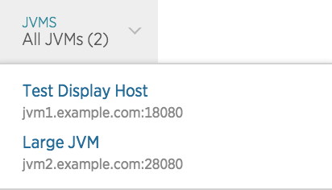

Java エージェントは、 `ホスト:ポート` の名前を JVM に自動的に割り当てます。デフォルトの名前が役に立たない場合は、 [表示名](#display-name) を設定して、New Relic UI で JVM を区別することができます。サポートされているフレームワークの場合、Java エージェントは、表示名の代わりに [インスタンス名](#instance-names) を使用します。

Java エージェントは、使用している環境に関わらず、ホスト、ポート、ディスパッチャ [によって、実行中のエージェントを一意に識別します。](#unique-identifier)

## [表示名 [#display-name]](#unique-identifier)

[APM UI のデフォルトの `host:port` ラベルが有用でない場合は、New Relic UI でその名前を ](#unique-identifier)[表示名](/docs/apm/new-relic-apm/maintenance/add-rename-remove-hosts#display_name) で装飾することができます。表示名の設定は、 [設定](/docs/agents/java-agent/configuration/java-agent-configuration-config-file) で、環境変数または **newrelic.yml** 設定ファイルで行います。環境変数の値が設定ファイルの値よりも優先されます。JVMが再起動され、Javaエージェントのレポートが再開されると、 `host:port` に加えて、以下の例のように、表示名がJVMリストに表示されます。

表示名を設定するには

* [`NEW_RELIC_PROCESS_HOST_DISPLAY_NAME`](/docs/agents/java-agent/configuration/java-agent-configuration-config-file#NEW_RELIC_PROCESS_HOST_DISPLAY_NAME) 環境変数を設定します。  
  OR
* セット [`process_host.display_name`](/docs/agents/java-agent/configuration/java-agent-configuration-config-file#display_name) **newrelic.yml**.

JVMを再起動すると、New RelicのUIに変更内容が表示されます。

<Callout variant="tip">
  また、 [システムプロパティ](/docs/agents/java-agent/configuration/java-agent-configuration-config-file#System_Properties) で表示名を設定することもできます。
</Callout>

## インスタンス名

WebSphere および WebLogic のユーザーの場合、Java エージェントは、各アクティブなアプリサーバーインスタンスのインスタンス名も報告します。これは、APM **Settings> Environment** ページで確認できます。通常、この名前はアプリサーバから提供されます。インスタンス名が設定されている場合は、New Relic UI での表示名の代わりにその名前が使用されます。

## ホスト名のロジックの優先順位 [#precedence]

複数のホスト名設定がある場合（例えば、WebSphere を使用し、 `display_name` プロパティも設定している場合）、エージェントはこの優先順位を使用します。

* `display_name` は、デフォルトの名前、および WebSphere と WebLogic のインスタンス名を上書きします。
* WebSphere と WebLogic のインスタンス名は、デフォルトの名前を上書きします。
* デフォルト（`host:port` ）の名前が最も低い優先順位となります。

## ホストとエージェント固有の識別子 [#unique-identifier]

Javaエージェントは、ホスト、ポート、ディスパッチャを使用して、同じアプリ名でレポートする複数のJVMを一意に識別します。そのため、同じサーバー上で動作する複数のエージェントは、ポートやディスパッチャ名が異なる限り、別々に報告されます。

固有の識別子は、以下の値に基づいています。

* **Host**: オペレーティングシステムから派生した、アプリの親サーバの識別子です。この値は、Javaエージェントでは設定できません。
* **ポート**: アプリサーバーに関連付けられたポートです。エージェントがポート番号を判断できない場合や、アプリがアプリサーバーで実行されていない場合は、デフォルトで **0** となります。この値はユーザーが設定できます。
* **Dispatcher Name**: アプリサーバーの名前。例えば、Apache Tomcat、Glassfish、WebLogicなどです。アクティブなアプリサーバーがない場合は、デフォルトで **Unknown** となります。