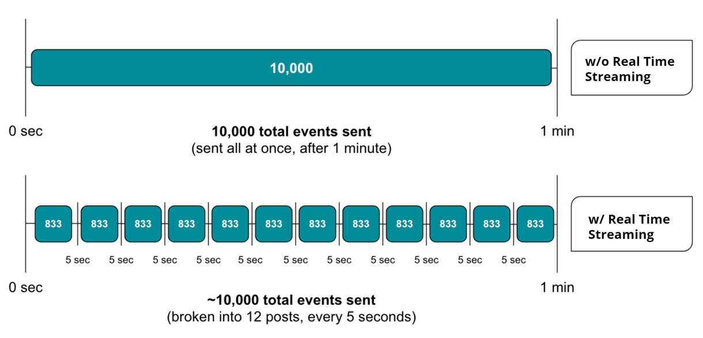

リアルタイムストリーミングでは、APM のイベントデータが 5 秒ごとに New Relic に送信されます。トランザクション、エラー、カスタムイベントなどのデータをほぼリアルタイムで照会し、視覚化することができます。ペイロードが小さくなることで、チャートの更新が速くなり、最も重要なデータの問い合わせも速くなります。

リアルタイム・ストリーミングを利用するための設定は必要ありません。必要なのは、 [APMエージェントのバージョン](#enable) が最新であることを確認するだけです。

## 重要な理由 [#benefits]

リアルタイム・ストリーミングでは、送信されるイベント数は増えません。より頻繁な投稿と、1投稿あたりのイベント数の減少の組み合わせにより、1分あたりのイベント数は、リアルタイム・ストリーミングを行わない場合とほぼ同じになります。

次の画像は、New Relic に送信されたデータを、リアルタイムストリーミングを使用した場合と使用しない場合で比較したものです。なお、10,000はイベント数の一例であり、エージェントによってはデフォルトの上限が低いものもあります。

1分間に送信できるイベント数の全体的な制限に変更はありません。また、イベント以外のデータ（スパン、トレース、メトリクス）も影響を受けず、1分ごとに送信されます。

新しいアプリのバージョンをデプロイするなど、何かが変わったときの影響を素早く把握するために、リアルタイムのストリーミングを使用します。

* 主要なパフォーマンス指標（スループット、エラーレート、チャートなど）をほぼリアルタイムで調べることができます。
* 障害発生時や異常発生時に迅速に対応。
* New Relic One を最大限に活用する [ダッシュボード](#create).
* 5秒ごとに報告されるAPMイベントにより、検出までの平均時間を短縮。

## 自動的に有効にするエージェントのバージョン [#enable]

リアルタイムストリーミングを有効にするには、 を最新の APM エージェントに更新してください。リアルタイムストリーミングを有効にするために何かを設定する必要はなく、自動的に速く報告されます

リアルタイム・ストリーミングは、すべてのAPMエージェントでサポートされています。最小限のエージェントのバージョンは以下の通りです。

* **C SDK:** [v1.3.0 以上](/docs/release-notes/agent-release-notes/c-sdk-release-notes)
* **Go:** [v2.8.0以上](/docs/release-notes/agent-release-notes/go-release-notes)
* **Java:** [v5.5.0 以上](/docs/release-notes/agent-release-notes/java-release-notes)
* **.NET：** [v8.23.107.0以上](/docs/release-notes/agent-release-notes/net-release-notes)
* **Node.js:** [v5.13.0 以上](/docs/release-notes/agent-release-notes/nodejs-release-notes)
* **PHP:** [v9.5.0.252 以上](/docs/release-notes/agent-release-notes/php-release-notes)
* **Python:** [v5.2.0.127 以上](/docs/release-notes/agent-release-notes/python-release-notes)
* **Ruby:** [v6.7.0.359 以上](/docs/release-notes/agent-release-notes/ruby-release-notes)

<Callout variant="caution">
  トランザクションイベントのレポートが [無効になっている場合](/docs/insights/use-insights-ui/manage-account-data/data-summary-page-manage-apps-reporting-insights#enable-disable) 、New Relic 全体の一部の UI 要素に影響を与える可能性があります。このデータに依存している一部のUIページでは、空のグラフが表示されることがあります。
</Callout>

## リアルタイム・ストリーミング・データの照会 [#nrql]

チャートを構築する際には、NRQL クエリに以下を含めてください。

<table>
  <thead>
    <tr>
      <th style={{ width: "250px" }}>
        NRQL句
      </th>

      <th>
        コメント
      </th>
    </tr>
  </thead>

  <tbody>
    <tr>
      <td>
        `SINCE 5分前`
      </td>

      <td>
        5 秒間のチャートの更新間隔を利用するために、NRQL クエリに [`SINCE 5 minutes ago` clause](/docs/query-data/nrql-new-relic-query-language/getting-started/nrql-syntax-components-functions#sel-since) を必ず追加してください。これは、 [チャートの更新間隔](/docs/insights/use-insights-ui/manage-dashboards/insights-chart-refresh-intervals) がタイムウィンドウに基づいているためです。
      </td>
    </tr>

    <tr>
      <td>
        `TIMESERIES` バケット
      </td>

      <td>
        時系列チャートの更新間隔を設定するには、 [`TIMESERIES` 句](/docs/query-data/nrql-new-relic-query-language/getting-started/nrql-syntax-components-functions#sel-timeseries) のオプション引数としてバケットサイズを指定することもできます。例えば、 `SINCE 30 minutes ago TIMESERIES 5 seconds` とすると、30分間のウィンドウを5秒の解像度で表示します。最大で366個のバケットを持つことができます。
      </td>
    </tr>
  </tbody>
</table>

## リアルタイムのストリーミングチャートを作成 [#create]

NRQL クエリの結果を New Relic One で可視化することができます。

1. **[one.newrelic.com](https://one.newrelic.com)** にアクセスし、ページの上部で **Query your data** を選択します。
2. [データエクスプローラー](/docs/query-your-data/explore-query-data/browse-data/introduction-data-explorer/) を使用して、チャートの作成を開始します。
3. [advanced (NRQL) mode](/docs/query-your-data/explore-query-data/query-builder/use-advanced-nrql-mode-query-data/) を選択して、クエリを絞り込みます。
4. NRQL クエリでは、 [`SINCE` と `TIMESERIES` 条項](#nrql) を調整して、5 秒間の更新間隔を利用します。