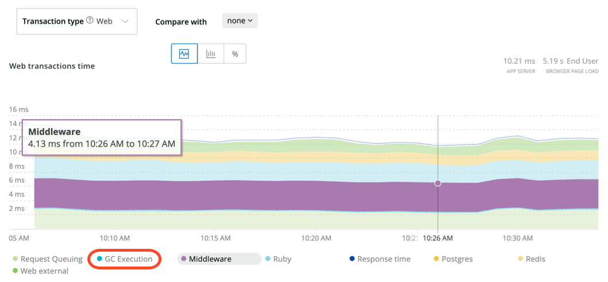

ガベージコレクション(GC)は、使用されていないデータオブジェクトを見つけ出し、そのメモリ空間を別のプロセスが使用できるように回収します。New Relic Ruby エージェントは、MRI 1.9.2 以上または Ruby Enterprise Edition 上で動作するアプリケーションのガベージコレクションに費やされた時間に関する情報を収集することができますが、アプリケーションでこの機能を明示的に有効にする必要があります。

<Callout variant="important">
  ガベージコレクションはオーバーヘッドを増加させるため、プロダクションで長時間使用することは避けてください。
</Callout>

## ガベージコレクション・インストゥルメンテーションの有効化 [#gc_setup]

この機能を有効にするには、アプリケーションの初期化で適切なコールを追加します。

* MRI 1.9.2 以上： `GC::Profiler.enable`
* Ruby Enterprise Edition: `GC.enable_stats`

Rails アプリケーションでは、この呼び出しを `config/initializers` のイニシャライザに追加するか、 `config/application.rb` ファイルに直接追加します。

## アプリ全体のGC統計情報を表示 [#gc_view]

ガベージコレクション全体の統計を見るには

1. [New Relic にログイン](https://one.newrelic.com/) 、Ruby アプリを選択し、 **Summary** にアクセスします。
2. APM **Summary** ページから、 **GC Execution** 統計情報を **Web transactions time** チャートで確認します。

<figcaption>
  **[one.newrelic.com](https://one.newrelic.com) > APM> (select a Ruby app)> Summary**: Web トランザクションのタイムチャートでは、ガベージコレクションの統計情報がラベルで表示されています。 **GC Execution**.
</figcaption>

## 詳細なGCメトリクスの表示 [#detailed]

トランザクション単位でガベージコレクションのメトリクスを見るには、 **[one.newrelic.com](https://one.newrelic.com) > APM> (select a Ruby app)> Transactions> (select a transaction)** にアクセスします。すると、GC に費やされた時間や、各トランザクションで GC が呼び出された平均回数などが表示されます。ガベージコレクションの詳細を表示するには、他のラベルを隠します。

<figcaption>
  **[one.newrelic.com](https://one.newrelic.com) > APM> (Select a Ruby app)> Transactions> (select a transaction)**: 個々のトランザクションを選択すると、平均時間や平均コール数など、GCの詳細なメトリクスが表示されます。
</figcaption>

詳細情報は以下の通りです。

<table>
  <thead>
    <tr>
      <th width={200}>
        **ガーベッジコレクションの詳細**
      </th>

      <th>
        **コメント**
      </th>
    </tr>
  </thead>

  <tbody>
    <tr>
      <td>
        ガベージコレクション時間の推移
      </td>

      <td>
        ガベージコレクションにかかる時間は通常わずかであるため、チャートにトレンドラインが表示されない場合があります。ガベージコレクション時間のトレンドを表示するには、 [の概要チャート](#gc_view) または [の詳細トランザクションメトリックス](#detailed) に移動します。次に、 **GC Execution** 以外のすべてのチャートのラベルを、各ラベルを選択して非表示にします。
      </td>
    </tr>

    <tr>
      <td>
        平均コール数
      </td>

      <td>
        各コントローラアクションのガベージコレクションコールの平均回数を表示するには、以下の手順に従います。 [APM **Summary**](/docs/apm/applications-menu/monitoring/applications-overview-dashboard) [page](/docs/apm/applications-menu/monitoring/applications-overview-dashboard) から、 **Transaction** を選択します。次に、コントローラアクションを選択し、 **App Server Breakdown** を表示します。
      </td>
    </tr>
  </tbody>
</table>