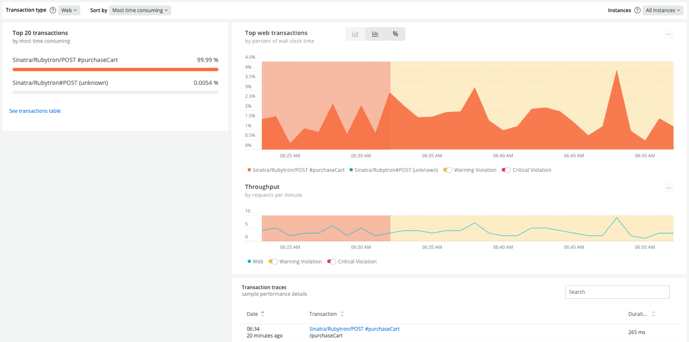

Rubyエージェントは、 [Rack](http://rack.github.io/) ミドルウェアを自動的に計測します。Rackミドルウェアの基本に慣れていない場合は、Rails on Rackガイド からリンクされている [のリソースを参照してください。また、RubyエージェントはRackミドルウェアを介していくつかの機能を提供します。](http://guides.rubyonrails.org/rails_on_rack.html#resources)

* 
* [分散型トレース](/docs/distributed-tracing/enable-configure/language-agents-enable-distributed-tracing/)
* [ブラウザ監視のためのオートインストルメント](/docs/agents/ruby-agent/features/page-load-timing-ruby)

New Relic は、Rails と Sinatra 用のこれらのミドルウェアを自動的にインストールします。

## ラックの計測器 [#instrumentation]

Rackのミドルウェアを設定する最も一般的な方法は、 `Rack::Builder` API（最も多いのは **config.ru** ）とRailsのミドルウェアスタック設定の2つです。

<CollapserGroup>
  <Collapser
    id="rack_builder"
    title="ラック::ビルダー"
  >
    **config.ru** ファイル内のミドルウェアは、 `Rack::Builder` を使って設定されます。Ruby エージェントが `Rack::Builder` からミドルウェアをインストゥルメントするには、アプリが `rack` gem のバージョン 1.1.0 以上を実行している必要があります。これは、Sinatra や pure-rack アプリケーションでのミドルウェアの最も一般的な使用方法です。
  </Collapser>

  <Collapser
    id="rails_middlewares"
    title="Railsのミドルウェア"
  >
    Railsはミドルウェアの設定に、 `Rack::Builder` の代わりに独自のクラス(`ActionDispatch::MiddlewareStack`)を使用します。Railsアプリケーションにミドルウェアを明示的に追加していなくても、Rails自体の多くのコンポーネントはミドルウェアとして実装されているので、ミドルウェアのデータはデフォルトで表示されます。

    Rubyエージェントは、 `ActionDispatch::MiddlewareStack` を介して追加されたミドルウェアを、 **Rails 3.0以降で自動的に計測します。** 。Railsによるミドルウェアの設定については、 [Ruby on Railsガイド](http://guides.rubyonrails.org/rails_on_rack.html) を参照してください。
  </Collapser>
</CollapserGroup>

## ミドルウェアデータの閲覧 [#viewing_middleware_data]

ミドルウェアのデータをAPMで見ることができます。

<CollapserGroup>
  <Collapser
    id="apm-overview"
    title="APMのサマリーページで"
  >
    アプリケーションの [APM **Summary** page](/docs/apm/applications-menu/monitoring/applications-overview-dashboard) のメインチャートには、アプリケーションのすべての Rack ミドルウェアで費やされたリクエストあたりの平均時間を示す紫色のバーがあります。

    

    <figcaption>
      **APM> (選択されたアプリケーション)> Summary:** ミドルウェアの時間は、アプリケーションのメインのOverviewチャートに紫色で表示されます。
    </figcaption>
  </Collapser>

  <Collapser
    id="apm-transactions"
    title="APM トランザクション」ページで"
  >
    また、アプリのAPMから特定のトランザクション名に対する個々のミドルウェアの時間を見ることができます [**トランザクション** ページ](/docs/apm/applications-menu/monitoring/transactions-page).

    

    <figcaption>
      **APM> (selected application)> Monitor> Transactions> (selected transaction)> Trace details:** ここでは、お客様のアプリの選択したトランザクションのミドルウェア時間の例を示します。
    </figcaption>
  </Collapser>

  <Collapser
    id="apm-trace"
    title="APMのトランザクション・トレース・サマリーで"
  >
    トランザクショントレースは、ミドルウェアの詳細なコール情報も記録します。

    

    <figcaption>
      **APM> (selected application)> Monitor> Transactions> (selected transaction trace):** 以下は、トランザクショントレースにおけるミドルウェアの詳細の例です。
    </figcaption>
  </Collapser>
</CollapserGroup>

## ラックインストルメントの無効化 [#disabling]

ラックミドルウェアをインスツルメンテーションしたくない場合は、 [`disable_middleware_instrumentation`](/docs/agents/ruby-agent/installation-configuration/ruby-agent-configuration) の設定でラックミドルウェアのインスツルメンテーションを無効にすることができます。また、 [特定のトランザクションを無視することもできます。](/docs/agents/ruby-agent/installation-configuration/ignoring-specific-transactions).

## Rubyエージェント・ミドルウェアの手動インストール [#manual]

New Relic の [クロスアプリケーショントレース](/docs/apm/traces/cross-application-traces/cross-application-tracing) 機能の Ruby エージェントの実装では、Rack ミドルウェアのインスツルメンテーションを使用して、監視対象のアプリケーション間で情報の受け渡しに必要な HTTP ヘッダーを読み書きしています。Sinatra を使用していて、上記のようにミドルウェアのインスツルメンテーションを無効にしていて、クロスアプリケーショントレースを使用したい場合は、手動で `NewRelic::Rack::AgentHooks` ミドルウェアをミドルウェアスタックに追加する必要があります。

<Callout variant="important">
  バージョン8.0.0では、クロスアプリケーショントレースは廃止され、 [分散型トレース](/docs/distributed-tracing/enable-configure/language-agents-enable-distributed-tracing/) が採用されています。この機能を有効にすると、ミドルウェアを追加することなく、すべてのラックベースのアプリに対して分散型トレーシングが自動的に設定されます。

  クロスアプリケーショントレースを継続して使用したい場合は、 [設定を更新する必要があります](/docs/agents/ruby-agent/features/cross-application-tracing-ruby#configuration) 。
</Callout>

## ラックの手動計測器 [#manual_instrumentation]

以前のバージョンの Ruby エージェントでは、 `NewRelic::Agent::Instrumentation::Rack` モジュールを用いて Rack ミドルウェアを手動でインスツルメンテーションすることができました。このインスツルメンテーションは、ミドルウェアの自動インスツルメンテーションには不要なため、Rubyエージェントのバージョン3.9.0以降では非推奨となっています。New Relic では、3.9.0 以降にアップグレードした後は、このモジュールへの参照をコードから削除することをお勧めします。