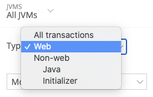
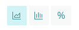

APMの**Transactions**ページは、パフォーマンスの問題を微調整したり、エラーを解決したりするのに適した[トランザクション](/docs/apm/transactions/intro-transactions/transactions-new-relic-apm)を特定するのに役立ちます。このページには、選択したアプリケーションのトランザクション**リクエスト**、[（ウォールクロックタイム](#wall_clock_time)のトップ5位のトランザクション（パーセント）、関連のある[スループット](/docs/using-new-relic/welcome-new-relic/getting-started/glossary#throughput)（1分あたりのリクエスト数（** rpm **））がリストされます。

[ウェブ以外のトランザクション](/docs/apm/transactions/intro-transactions/monitor-background-processes-other-non-web-transactions)（メッセージ処理、バックグラウンドのタスク、ウェブリクエストを処理しないその他のプロセスやジョブなど）の場合、このページにCPUとメモリ使用率のチャートが表示されます。

## トランザクションのタイプ [#tx_types]

<Callout variant="tip">
  ご利用の全てのアプリケーションおよびサービスに関する大まかな概要を得るには、[New Relicエクスプローラー](/docs/new-relic-one/use-new-relic-one/ui-data/new-relic-one-entity-explorer)を利用してください。
</Callout>

選択されたアプリケーションによっては、**Transactions**ページに[利用可能なトランザクションのタイプ](#txn-type-dropdown)から選択するためのドロップダウンが掲載されている場合があります。New Relicは、[リクエストのタイプ（](/docs/apm/applications-menu/features/request-queuing-tracking-front-end-time)ウェブトランザクション[または](/docs/using-new-relic/welcome-new-relic/getting-started/glossary#transaction)ウェブ以外のトランザクション[）によって](/docs/using-new-relic/welcome-new-relic/getting-started/glossary#non-web-transaction)処理時間を測定します。これには、以下の項目が含まれます。

* **ウェブ**：アプリケーションサーバーのリクエスト
* **ウェブ以外：**その他のリクエスト（操作、バックグラウンドタスクなど）

**Transactions**ページには、[トランザクショントレース](/docs/apm/transactions/transaction-traces/introduction-transaction-traces)と[キートランザクション](/docs/apm/transactions/key-transactions/introduction-key-transactions)へのリンクも含まれています。利用可能な情報のタイプは、選択したアプリケーション、リクエストのタイプ（ウェブまたはウェブ以外）によって異なります。

## ウォールクロックタイム [#wall_clock_time]

ウォールクロックタイムとは、時計によって記録された時間です。New Relicはすべてのトランザクションにウォールクロックタイムを使用し、すべてのトランザクションにわたってその値を合計します。

ホストは並行してリクエストを実行できるため、100%を超える割合が表示されることがあります。例えば、100％の値は、選択したすべてのトランザクションの実行時間が、ウォールクロックタイムの記録に費やされた時間と等しいことを示します。

## トランザクションを表示する [#tx_viewing]

ご使用のアプリのトランザクションリクエストに関する情報を表示するには：

1. 次のうち1つを行います。

   * **[one.newrelic.com](https://one.newrelic.com) > APM >（アプリの選択）> Monitor > Transactions**の順に移動します。
   * **[one.newrelic.com](https://one.newrelic.com) > Explorer > (アプリを選択) > Monitor > Transactions**の順に進みます。

2. 利用可能な場合：トランザクションの利用可能な[タイプ](#tx_types)の表示を変更するには、**Type**を選択します。

3. [ソート順](#sort-definitions)を選択するか、デフォルトのままにします。

4. 使用可能な場合は、[表示のタイプ](/docs/using-new-relic/user-interface-functions/view-your-data/select-chart-views)をチャート（デフォルト）、ヒストグラム、またはパーセンタイルとして選択します。

5. 追加の詳細を表示するには、トランザクション[ドリルダウン機能](#tx_functions)のいずれかを使用します。

6. ダッシュボードにチャートを追加するには、チャートの上にカーソルを移動し、その下に表示される**Add to a dashboard**リンクを選択します。

チャートの背景が薄い赤色の場合は、アラート条件の[**Critical**閾値](/docs/alerts/new-relic-alerts/defining-conditions/define-thresholds-trigger-alert)を超過している期間を示します。[New Relic Alerts](/docs/alerts/new-relic-alerts/reviewing-alert-incidents/view-violation-event-details-incidents)で[インシデントの詳細](/docs/alerts/new-relic-alerts/getting-started/introduction-new-relic-alerts)を表示するには、チャートをクリックします。

詳しくは、New Relic Oneの[中核となるUIコンポーネントの操作](/docs/new-relic-one/use-new-relic-one/get-started/new-relic-one-core-ui-components)に関するドキュメンテーションを参照してください。

## ドリルダウン機能を使用する [#tx_functions]

New Relicの標準的な[ユーザーインタフェース機能](/docs/using-new-relic/user-interface-functions/view-your-data/standard-page-functions)のいずれかを使用して、詳細情報にドリルダウンします。**Transactions**ページには、追加のドリルダウン機能があります。

<CollapserGroup>
  <Collapser
    id="txn-type-dropdown"
    title="表示されるトランザクションタイプを変更する"
  >
    

    トランザクションのリストの上に**Type**ドロップダウンが表示される場合は、目的のトランザクションタイプを選択できます。使用可能なタイプは、アプリケーションが使用するトランザクションによって異なります。
  </Collapser>

  <Collapser
    id="sort-definitions"
    title="パフォーマンス測定のタイプを選択する（ソート）"
  >
    トランザクションリストの上にある**Sort**ドロップダウンを使用すると、さまざまな測定値に応じて、トランザクションを確認できます。これにより、パフォーマンスの調整やエラーの修正に適した候補を特定することができます。

    ソートの基準：

    <table>
      <thead>
        <tr>
          <th style={{ width: "200px" }}>
            **ソートオプション**
          </th>

          <th>
            **コメント**
          </th>
        </tr>
      </thead>

      <tbody>
        <tr>
          <td>
            最も時間がかかる（デフォルト）
          </td>

          <td>
            アプリの合計使用時間の割合が最高。

            最も多くの時間を費やしたトランザクションを測定します。これは、トランザクションの回数とトランザクションの完了に要した時間を乗じることによって算出されます。トランザクションの所要時間は短い場合もありますが、高頻度で呼び出されると、このランクの最上位に表示されます。
          </td>
        </tr>

        <tr>
          <td>
            平均応答時間が最も長い
          </td>

          <td>
            特定の期間における平均応答が最も遅い、個別のトランザクションです。

            最も遅いタイプのトランザクションを測定します。トランザクションは数回呼び出すことができますが、完了時間が最長のトランザクションであれば、このランクの最上位に表示されます。
          </td>
        </tr>

        <tr>
          <td>
            Apdexの満足度が最低
          </td>

          <td>
            Webアプリケーションとサービスのレスポンスタイムに対するユーザーの不満度（[Apdex](/docs/apm/new-relic-apm/apdex/apdex-measuring-user-satisfaction)）が最も高いトランザクション。

            [不満度](/docs/apm/new-relic-apm/apdex/view-your-apdex-score#apdex-dissat)は、完璧なApdexスコア（1.0）と、`Apdex設定`に基づいたお使いのアプリケーションの[apdex_t](/docs/apm/new-relic-apm/apdex/change-your-apdex-settings)（"許容可能”）スコア間の差異です。この比率が最高（つまり最悪）のトランザクションが、このランキングの最上位に表示されます。
          </td>
        </tr>

        <tr>
          <td>
            最高のスループット
          </td>

          <td>
            これは、1分あたりの操作リクエストまたは[rpm](/docs/using-new-relic/welcome-new-relic/getting-started/glossary#throughput)として表示される**スループット**の測定値です。（ウェブスループットの場合、1分あたりのリクエストは、1分あたりのページ数（**ppm**）と呼ばれることがあります）。1分あたりのリクエスト件数が最も多いトランザクションが、このランキングのトップに表示されます。
          </td>
        </tr>
      </tbody>
    </table>

    <Callout variant="tip">
      選択したトランザクションタイプに応じて、異なるソートオプションを使用できる場合があります。
    </Callout>
  </Collapser>

  <Collapser
    id="tx-summary"
    title="トランザクションに関するサマリー情報の上にカーソルを合わせる"
  >
    

    トランザクションに関する重要な情報をすばやく表示するには、リスト内の名前の上にカーソルを重ねます。
  </Collapser>

  <Collapser
    id="tx-details"
    title="トランザクションに関する詳細情報を選択する"
  >
    

    詳細情報を表示するには、リストからトランザクションを選択して、**App performance**または**Historical performance**を選択します。[トランザクショントレースを表示](/docs/traces/viewing-transaction-traces)することもできます。
  </Collapser>

  <Collapser
    id="chart-views"
    title="さまざまなビジュアル形式でトランザクションデータを表示する"
  >
    

    **Transaction**ページの**トップ5位のトランザクション**チャートと選択したトランザクションの**App performance**ウィンドウには、次のようにデータを表示するオプションがあります。

    * [チャート](/docs/using-new-relic/user-interface-functions/view-your-data/select-chart-views)

    * [ヒストグラム](/docs/using-new-relic/user-interface-functions/view-your-data/histograms-view-data-distribution)

    * [パーセンタイル](/docs/using-new-relic/user-interface-functions/view-your-data/percentiles-compare-ranked-data)

      さらに、選択したトランザクションの**内訳**テーブルからリンクを選択して、内訳データのすべてのセグメントを表示または非表示にすることができます。
  </Collapser>

  <Collapser
    id="browser-data"
    title="対応するブラウザのリクエストデータを表示する"
  >
    ブラウザの情報を表示するには、[Browserエージェントをインストールする](/docs/new-relic-browser/browser-settings)必要があります。次に、対応する[ブラウザのリクエスト](/docs/browser/new-relic-browser/additional-standard-features/page-views-understanding-your-sites-popularity)データを表示するには、次のいずれかのオプションを使用します。

    * 使用可能な場合は、**ブラウザのドリルダウン**リンクを選択します。
    * **[one.newrelic.com](https://one.newrelic.com) > Browser >（アプリケーションを選択） > Page views**の順に移動します。
  </Collapser>

  <Collapser
    id="breakdown-table"
    title="通話回数の多いトランザクションまたは通話時間の長いトランザクションのセグメントを特定する"
  >
    

    トランザクションの**内訳テーブル**では、**Avg calls (per txn)**列に色分けされたセグメント値が含まれます。これらは、閾値を超過しているインストゥルメントされたセグメントを示します。

    * <Icon
        style={{color: 'yellow'}}
        name="fe-square"
      />

      黄色：セグメント時間は、合計トランザクションタイムの10％を超え、通話回数は10を超えています。

    * <Icon
        style={{color: 'red'}}
        name="fe-square"
      />

      赤色：セグメント時間は、合計トランザクションタイムの10％を超え、通話回数は20を超えています。
  </Collapser>
</CollapserGroup>

## すべてのトランザクションを表示する [#table_view]

使用可能なすべてのトランザクションをテーブルとして表示するには、**Show all transactions table**リンクを選択します。ここから、使用可能なオプションのいずれかを使用します。

* ソート順を変更するには、任意の列ヘッダーを選択します。
* コンマ区切りの値を含むファイルに、データをエクスポートするには、**Export as CSV**を選択します。
* 前のチャート表示に戻るには、**Back to top transactions**を選択します。

**ending now**期間のCSVテーブルは、ランタイムに計算されます。APMテーブルに表示される値よりも、わずかに高い値が表示されることがあります。

各トランザクションについて、**Show all transactions**テーブルには、以下の測定値が含まれます。

<table>
  <thead>
    <tr>
      <th style={{ width: "150px" }}>
        **測定値**
      </th>

      <th>
        **定義**
      </th>
    </tr>
  </thead>

  <tbody>
    <tr>
      <td>
        **Apdex**
      </td>

      <td>
        選択した時間帯に発生した、すべてのトランザクションの平均Apdexスコアです。

        `*`アステリスクのマークが付いたApdexスコアは、そのトランザクション名に対してエージェントが収集したサンプル数が100未満であることを示しています。これらのトランザクションのデータは、スループットがより高いトランザクションのデータに比べて精度が低くなる可能性があります。
      </td>
    </tr>

    <tr>
      <td>
        **Count**
      </td>

      <td>
        選択した時間範囲内で発生した、すべてのトランザクションの合計数です。
      </td>
    </tr>

    <tr>
      <td>
        **Avg（ms）**
      </td>

      <td>
        選択した時間範囲内で、すべてのトランザクションが費やした平均時間です。
      </td>
    </tr>

    <tr>
      <td>
        **SD（ms）**
      </td>

      <td>
        選択した時間範囲内で、すべてのトランザクションに対するすべてのタイミング測定値の標準偏差です。
      </td>
    </tr>

    <tr>
      <td>
        **Min（ms）**
      </td>

      <td>
        選択した時間範囲内で、最も速いトランザクションが費やした時間です。
      </td>
    </tr>

    <tr>
      <td>
        **Max（ms）**
      </td>

      <td>
        選択した時間範囲内で、最も遅いトランザクションが費やした時間です。
      </td>
    </tr>

    <tr>
      <td>
        **Total（ms）**
      </td>

      <td>
        選択した時間範囲内で発生した、すべてのトランザクションが費やした時間の合計です。
      </td>
    </tr>

    <tr>
      <td>
        **Total（% time）**
      </td>

      <td>
        そのタイプのすべてのトランザクションの合計時間（すべてのトランザクションが占める合計時間の割合）です。
      </td>
    </tr>

    <tr>
      <td>
        **Dissat（%）**
      </td>

      <td>
        Apdexのスコアを満たしていないトランザクションの割合。

        トランザクションをテーブルとして表示すると、不満の回答がない場合でも（つまり、0の100%は0ですが）、常に**All transactions**行にアプリケーションの合計不満度の100%が提示されるようになります。このような場合、100%はすべてのトランザクションが不満足であることを示しているわけではありません。**Dissat （%）**列のその他すべての値の合計は100%になります。
      </td>
    </tr>
  </tbody>
</table>

## 追加関数 [#more_tx_functions]

**Transactions**ページで選択したトランザクションの追加関数は次のとおりです。

<table>
  <thead>
    <tr>
      <th width={250}>
        **以下を行う場合...**
      </th>

      <th>
        **操作...**
      </th>
    </tr>
  </thead>

  <tbody>
    <tr>
      <td>
        操作やその他のバックグラウンドタスクのトランザクションを表示する
      </td>

      <td>
        **Type**を**Other transactions**（またはリストされた特定のタイプ）に変更し、特定のトランザクションを選択します。

        **Transactions**ページには、[ウォールクロックタイム](#wall_clock_time)、CPU使用率、メモリ使用量を基準に、この選択に対するトップ5位のトランザクションが表示されます。
      </td>
    </tr>

    <tr>
      <td>
        ビジネスにとって重要なトランザクションを追跡する
      </td>

      <td>
        トランザクションの名前を選択してから、[**Track as key transaction**](/docs/apm/transactions/key-transactions/introduction-key-transactions)を選択します。
      </td>
    </tr>

    <tr>
      <td>
        トランザクショントレースの詳細を表示する
      </td>

      <td>
        [トランザクショントレース](/docs/using-new-relic/welcome-new-relic/getting-started/glossary#transaction-trace)は、単一トランザクションの全体像を表します。

        1. **Transactions**ページから、[transaction trace](/docs/apm/transactions/transaction-traces/introduction-transaction-traces)を選択します。

        2. 利用可能であれば、[Summary](/docs/apm/transactions/transaction-traces/introduction-transaction-traces#find-view)、**Trace details**、または**Database queries**の**表示を選択**します。

        3. トランザクショントレースをフルスクリーン表示に拡大するには、フルスクリーン

           <Icon style={{color: '#4392AA'}} name="fe-maximize-2"/>

           アイコンを選択します。

        4. **Transactions**ページに戻るには：トランザクショントレースの名前の横にある「戻る」矢印を選択します。
      </td>
    </tr>

    <tr>
      <td>
        トランザクションセグメントを追加または表示する
      </td>

      <td>
        * トランザクションにセグメントを追加するには、[カスタムインストゥルメンテーション](/docs/agents/manage-apm-agents/agent-data/custom-instrumentation)を使用します。
        * 特定のトランザクションのセグメントを表示するには、[トランザクショントレース](/docs/apm/transactions/transaction-traces/introduction-transaction-traces)を使用します。
      </td>
    </tr>

    <tr>
      <td>
        レポートを表示する
      </td>

      <td>
        [ウェブトランザクション分析レポート](/docs/apm/reports/other-performance-analysis/web-transactions-analysis-report)をウェブトランザクションに使用して、[バックグラウンドジョブ分析レポート](/docs/apm/reports/other-performance-analysis/background-jobs-analysis-report)をウェブ以外のトランザクションに使用することができます。これにより、スループットに費やされた時間の量、トランザクションの合計時間、それを実行する平均時間、および適用可能なApdexスコアを比較することができます。
      </td>
    </tr>

    <tr>
      <td>
        すべてのトランザクショントレースを削除する
      </td>

      <td>
        <Callout variant="caution">
          [**Delete all traces**](/docs/traces/deleting-transaction-traces)を選択すると、それらを復元することはできません。
        </Callout>
      </td>
    </tr>
  </tbody>
</table>