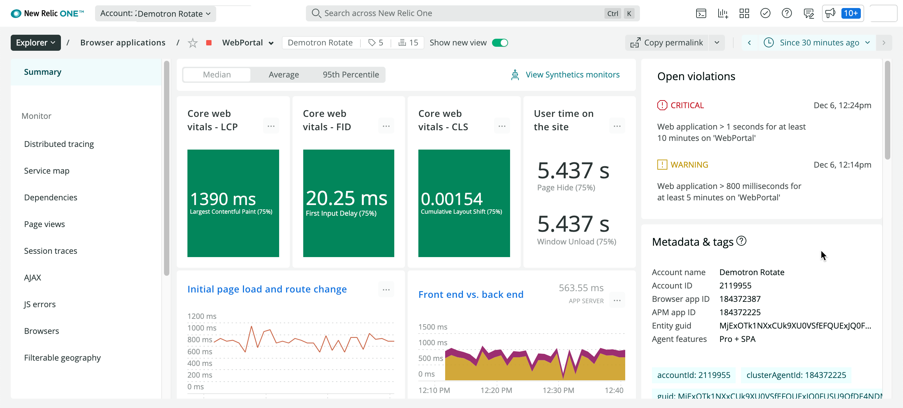

[ブラウザモニタリング](/docs/browser/new-relic-browser/getting-started/new-relic-browser)'s **Summary** ページは、アプリのリアルユーザーのブラウザパフォーマンスをまとめたものです。Summary ページは以下のように使用します。

* アプリのブラウザ側のパフォーマンスの傾向を見ることができます。
* ページロードのタイミングに関する問題の迅速なトラブルシューティング
* 他のブラウザのUIページへの移動

## サマリーページの表示 [#viewing]

アプリのブラウザパフォーマンスの概要を表示するには、次のようにします。

1. **[one.newrelic.com](https://one.newrelic.com) > Explorer> Browser applications** にアクセスします。 [エクスプローラー](/docs/new-relic-one/use-new-relic-one/core-concepts/new-relic-explorer-view-performance-across-apps-services-hosts/) を使用して、すべての [エンティティ](/docs/new-relic-one/use-new-relic-one/core-concepts/what-entity-new-relic/) 、つまり、アプリケーションやホストから任意の要素のカスタムグルーピングまで、データを報告していると特定できるものすべてにアクセスできます。
2. または、 [one.newrelic.com](https://one.newrelic.com) にアクセスし、「ブラウザ」をクリックし、 [ブラウザのインデックス](/docs/browser/new-relic-browser/getting-started/browser-apps-index) からアプリを選択します。
3. アプリの **「Summary」** ページから、 [New Relic の標準的なページ機能](/docs/data-analysis/user-interface-functions/view-your-data/standard-page-functions) を使って、詳細な情報を掘り下げることができます。

<figcaption>
  **[one.newrelic.com](https://one.newrelic.com) > ブラウザ> （アプリを選択）> Summary:** ブラウザアプリのインデックスからアプリケーションを選択した後、 **Summary** ページには、そのアプリのブラウザパフォーマンスの概要が表示されます。
</figcaption>

サマリーページには

* [Core Web Vitals ウィジェット](#core_vitals)
* [ユーザーがサイトを利用する時間](#user_time)
* [初期のページロードとルート変更のチャート](#page_load)
* [ユーザー重視のページロードタイムチャート](#user_load)
* [スループットチャート](#throughput-chart)
* [フロントエンドとバックエンドのチャート](#front_vs_back)
* [デバイスタイプ別の最初のインタラクション、ユーザーエージェント別の最初のインタラクション、JavaScriptのエラー、URL別の最初の入力の最長遅延時間](#other-charts)
* [関連するEntitiesウィジェット](#related_entities)
* [シンセティック・モニターを見る](#synthetic_monitors)

## Core Web Vitals ウィジェット [#core_vitals]

**Core Web Vitals** ウィジェットは、Google の [Core Web Vitals](/docs/browser/new-relic-browser/page-load-timing-resources/pageviewtiming-async-or-dynamic-page-details) に基づいて、ブラウザのパフォーマンスを表示します。Core Web Vitals ウィジェットには以下のものがあります。

* LCP - Largest Contentful Paint
* FID - ファーストインプットディレイ
* CLS - 累積レイアウトシフト

## ユーザーがサイトを利用する時間 [#user_time]

**ユーザーのサイト滞在時間** ウィジェットでは、ユーザーがサイトに滞在している時間を表示します。

## 初期のページロードとルート変更のチャート [#page_load]

**Initial page load and route change** チャートは、URLのロードまたはリロードに起因する従来のURL変更のロード時間を示しています。このグラフは、 [ページロードタイミングプロセス](/docs/browser/new-relic-browser/page-load-timing-resources/page-load-timing-process) の詳細とともに、 [ページロードタイムページ](/docs/browser/new-relic-browser/dashboard-details/page-views-dashboard) に掲載されています。

## ユーザー重視のページロードタイムチャート [#user_load]

**User-centric page load times** チャートは、ユーザーにとってのページのロード時間を示しています。このグラフは、 [ページロードタイミングプロセス](/docs/browser/new-relic-browser/page-load-timing-resources/page-load-timing-process) の詳細とともに、 [ページロードタイムページ](/docs/browser/new-relic-browser/dashboard-details/page-views-dashboard) に表示されます。

## スループットチャート [#throughput-chart]

**Throughput** チャートでは、ブラウザのスループットを1分あたりのページ数（ppm）で表示しています。チャートの右上に表示されている値は、選択した時間範囲の平均値です。

[SPA モニタリング](/docs/browser/single-page-app-monitoring/get-started/welcome-single-page-app-monitoring) を有効にしていて、 **Summary** ページに **SPA ロードタイム** チャートが表示されている場合、 **Throughput** チャートにも SPA データが使用されます。

<Callout variant="tip">
  Appサーバーの毎分のリクエスト数（rpm）は、ブラウザの [ページロードタイミング](/docs/browser/new-relic-browser/page-load-timing/page-load-timing-process) の毎分のページ数（ppm）とは異なる測定値を示す場合があります。
</Callout>

## フロントエンドとバックエンドのチャート [#front_vs_back]

**フロントエンドとバックエンドの比較** チャートは、connect APMサービスアプリケーションにリンクしています。APMとトレースの詳細については、 [Language agents and distributed tracing](docs/distributed-tracing/enable-configure/language-agents-enable-distributed-tracing) を参照してください。

## デバイスタイプ別の最初のインタラクション、ユーザーエージェント別の最初のインタラクション、JavaScriptのエラー、URL別の最初の入力の最長遅延時間 [#other-charts]

また、 [ページロードタイムのページ](/docs/browser/new-relic-browser/dashboard-details/page-views-dashboard) と [JavaScriptエラーのページ](/docs/browser/new-relic-browser/browser-pro-features/javascript-errors-page-examining-errors-over-time) から、これらのメトリクスの要約版を見ることができます。

* **デバイスタイプ別の最初のインタラクション**
* **ユーザーエージェントによる最初のインタラクション**
* **JavaScriptのエラー**
* **URL別の最長初回入力遅延時間**

## 関連するEntitiesウィジェット [#related_entities]

**Related Entities** ウィジェットには、ブラウザに関連するすべてのエンティティが表示されます。エンティティ間の接続について詳しく理解するには、 [Entity relationships](docs/new-relic-one/use-new-relic-one/core-concepts/what-entity-new-relic/#related-entities) をお読みください。

## シンセティック・モニターを見る [#synthetic_monitors]

 ボタンをクリックすると、 **Synthetics** のページに移動します。Syntheticsについての詳細は、 [Synthetic monitoring](docs/synthetics) をご覧ください。