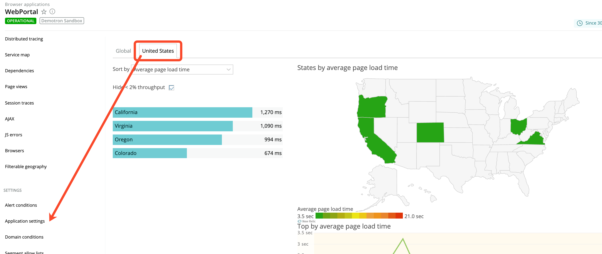

ブラウザモニタリングの「地理」ページでは、色分けされた [Apdex](/docs/apm/new-relic-apm/apdex/apdex-measuring-user-satisfaction) スコアや、エンドユーザーの体験に関するその他のパフォーマンス情報を世界に向けて発信しています。 [国や州などの特定の地域](/docs/browser/new-relic-browser/getting-started/browser-settings) を選択すると、ページロードパフォーマンスや過去のパフォーマンスに関する詳細情報にドリルダウンすることができます。

## コンテンツ [#qiklinks]

## 地域別のパフォーマンスデータを見る [#apdex-by-region]

<Callout variant="important">
  ファイアウォールは、エンドユーザーについて収集した地理的データに影響を与える可能性があります。
</Callout>

パフォーマンス情報をロケーション別に表示したり、並べ替えることができます。

<figcaption>
  **[one.newrelic.com](https://one.newrelic.com) > ブラウザ> （アプリを選択）> Geo:** このページでは、地理的な場所の色分けされたパフォーマンス情報の世界観とドリルダウンの詳細を提供しています。
</figcaption>

1. **[one.newrelic.com](https://one.newrelic.com) > ブラウザ> （アプリを選択）> ジオ> グローバル** （世界観を表現） にアクセスしてください。

   または

   **[one.newrelic.com](https://one.newrelic.com) > ブラウザ> (select an app)> ジオ> (select a location)** (for a specific location you [identified in **Browser application settings**](/docs/browser/new-relic-browser/getting-started/browser-settings) ) にアクセスします。

2. [特定のエリアにドリルダウンするには](#drilldown) 、リストから場所を選択するか、地理的な地図上で任意のエリアを選択します。

3. 選択した場所に関する追加の詳細を表示するには、 **Page load performance** または **Historical performance** のリンクを選択します。

4. **Geography** のメインページに戻るには、 **X** （閉じる）を選択します。

<figcaption>
  **[one.newrelic.com](https://one.newrelic.com) > B\*\***rowser> (select an app)> Geo> (select a location):** **Settings> Application settings\*\*から特定の場所を選択した場合、Geographyページにはその場所のパフォーマンスデータを直接見ることができるタブが含まれています。
</figcaption>

## ページ機能の利用 [#option]

当社標準の [ユーザーインターフェース機能](/docs/accounts-partnerships/education/getting-started-new-relic/new-relic-user-interface) および [ページ機能](/docs/accounts-partnerships/education/getting-started-new-relic/standard-dashboard-features) を使用して、詳細な情報にドリルダウンすることができます。

ここでは、Geographyページでの追加オプションについてまとめています。

<table>
  <thead>
    <tr>
      <th width={250}>
        **以下を行う場合...**
      </th>

      <th>
        **操作...**
      </th>
    </tr>
  </thead>

  <tbody>
    <tr>
      <td>
        パフォーマンスデータの表示方法の変更
      </td>

      <td>
        **Sort by** メニューから選択してください。
      </td>
    </tr>

    <tr>
      <td>
        表示される情報量の調整
      </td>

      <td>
        **Hide&lt;% throughput** チェックボックスを選択またはクリアします（&lt;1% for global view,&lt;2% for selected locations）。
      </td>
    </tr>

    <tr>
      <td>
        特定の場所の地図を表示する
      </td>

      <td>
        必要に応じて、これらの作業を行ってください。

        * **Geo> Global** のリストからロケーションの名前を選択します。
        * 地図上の位置を選択してください。
        * [**アプリケーション設定 から場所をあらかじめ選択している場合は、そのタブを選択します。**](/docs/browser/new-relic-browser/getting-started/browser-settings)
      </td>
    </tr>

    <tr>
      <td>
        特定の場所に関するパフォーマンス情報の概要を表示
      </td>

      <td>
        色のついた部分にマウスオーバーします。
      </td>
    </tr>
  </tbody>
</table>

## ドリルダウン詳細表示 [#drilldown]

特定の場所を選択すると、 **Page load performance** ページが表示されます。

* 平均 [ページロード時間](/docs/browser/new-relic-browser/page-load-timing/page-load-timing-process) 単位：秒
* ページビュー数と [アクティブセッション数](/docs/browser/new-relic-browser/page-load-timing/session-tracking) as pages per minute (**ppm**)
* 最近の [ブラウザの痕跡](/docs/apm/traces/browser-traces/browser-traces) 該当する場合

<figcaption>
  **[one.newrelic.com](https://one.newrelic.com) > ブラウザ> (アプリを選択)> ジオ> (場所を選択):** 特定の場所を選択した後、 **ページロードパフォーマンス** と **ヒストリカルパフォーマンス** についての具体的な詳細を見ることができます。
</figcaption>

さらに、 **Historical performance** ページでは、選択した [の期間](/docs/apm/new-relic-apm/ui-functions/time-picker-setting-time-periods-view-data) 、昨日、先週の選択した場所の比較データが表示されます。これには以下が含まれます。

* レスポンスタイム
* Apdex
* スループット（ページ/分） (**ppm**)