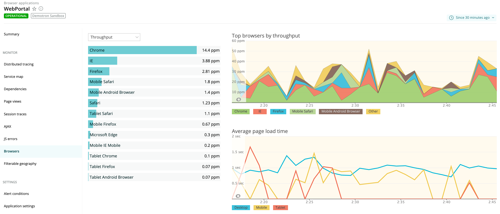

ブラウザモニタリングの **Browsers** ページでは、エンドユーザーが Google Chrome、Mozilla Firefox、Microsoft Internet Explorer、Apple Safari などのどのブラウザを使用しているかに基づいて、アプリの使用感に関する情報を提供しています。このページには以下が含まれます。

* スループット（ページ/分または **ppm** ）でのトップブラウザ
* プラットフォームタイプ別（モバイル、タブレット、デスクトップ）の平均ページロードタイム

また、ドリルダウンチャートでは、選択したブラウザの種類を Chrome 31、32、33 などのようにバージョン別に分類しています。これにより、ページロードのタイミングに関する問題が、特定のブラウザタイプやプラットフォームに関連しているのか、それとも問題がより広範囲に及んでいるのかを迅速に判断することができます。

## ブラウザの種類別表示 [#browser_procedures]

ブラウザの情報を見るには **[one.newrelic.com](https://one.newrelic.com) 、Browser> (select an app)> Browsers** をクリックします。

<figcaption>
  **[one.newrelic.com](https://one.newrelic.com) > ブラウザ> （アプリを選択）> ブラウザ：** このページでは、エンドユーザーのブラウザタイプ別のスループット（1分あたりのページ数）と平均ページロードタイムに関する情報を提供しています。
</figcaption>

標準の [ユーザーインターフェース機能](/docs/accounts-partnerships/education/getting-started-new-relic/new-relic-user-interface) および [ページ機能](/docs/data-analysis/user-interface-functions/standard-page-functions) を使用して、詳細な情報にドリルダウンすることができます。以下は、 **Browsers** ページの追加オプションの概要です。

<table>
  <thead>
    <tr>
      <th width={200}>
        **以下を行う場合...**
      </th>

      <th>
        **操作...**
      </th>
    </tr>
  </thead>

  <tbody>
    <tr>
      <td>
        指定した時間のブラウザ情報をまとめて表示
      </td>

      <td>
        チャート上の任意の場所にマウスオーバーします。
      </td>
    </tr>

    <tr>
      <td>
        チャート上のデータを隠す（または戻す）。
      </td>

      <td>
        チャートの凡例で、対応する色やタイトルを選択します。
      </td>
    </tr>

    <tr>
      <td>
        ブラウザの詳細情報を見る
      </td>

      <td>
        リストの名前やチャートの場所を選択します。
      </td>
    </tr>

    <tr>
      <td>
        詳細ウィンドウを閉じて、 **Browsers** のページに戻ります。
      </td>

      <td>
        **X** （閉じる）を選択します。
      </td>
    </tr>
  </tbody>
</table>

## 特定のブラウザの詳細表示 [#browser_details]

ドリルダウンの詳細には、バージョン別の内訳や、平均ページロード時間が含まれています。

<figcaption>
  **[one.newrelic.com](https://one.newrelic.com) > Browser> (select an app)> Browsers> (select a browser type):** この例では、特定のブラウザタイプを選択しています（Firefox）。バージョン42.0を使用しているユーザーが最も多いため、このラベル（またはその他のラベル）を凡例で非表示にすることで、他のバージョンの詳細を簡単に調べることができます。
</figcaption>

[平均ページロード時間](/docs/browser/new-relic-browser/page-load-timing/page-load-timing-process) の色分けされたセグメントは以下の通りです。

* **リクエストのキューイング** （黒）。Webサーバーとアプリケーションコードの間の待ち時間。数字が大きいほど、アプリケーションサーバーが忙しいことを示す。
* **ウェブアプリケーション** （紫）。アプリケーションコードに費やした時間。
* **ネットワーク** （茶色）。ネットワークのレイテンシー、つまりリクエストがインターネット上を往復するのにかかる時間のこと。
* **DOM処理** （黄色）。ブラウザ内で、HTMLを解析・解釈し、アセットを取得すること。ブラウザのDOMContentLoadedイベントで測定される。
* **ページのレンダリング** （青）。ブラウザの中で、HTMLの表示、インラインJavaScriptの実行、画像の読み込みを行う。ブラウザのLoadイベントで測定される。

**注：** コピー／ペースト方式で [デプロイされたアプリの場合](/docs/browser/new-relic-browser/installation-configuration/adding-apps-new-relic-browser) 、ブラウザにはウェブアプリとキューの時間が [ネットワーク](/docs/browser/new-relic-browser/page-load-timing-resources/page-load-timing-process#h3-network) の時間に含まれます。