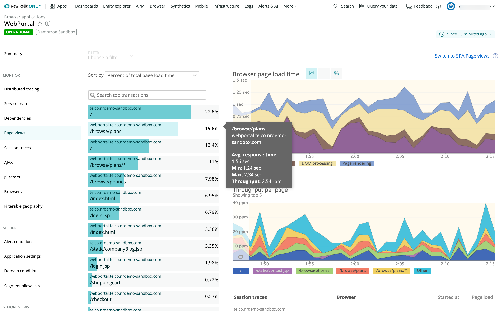
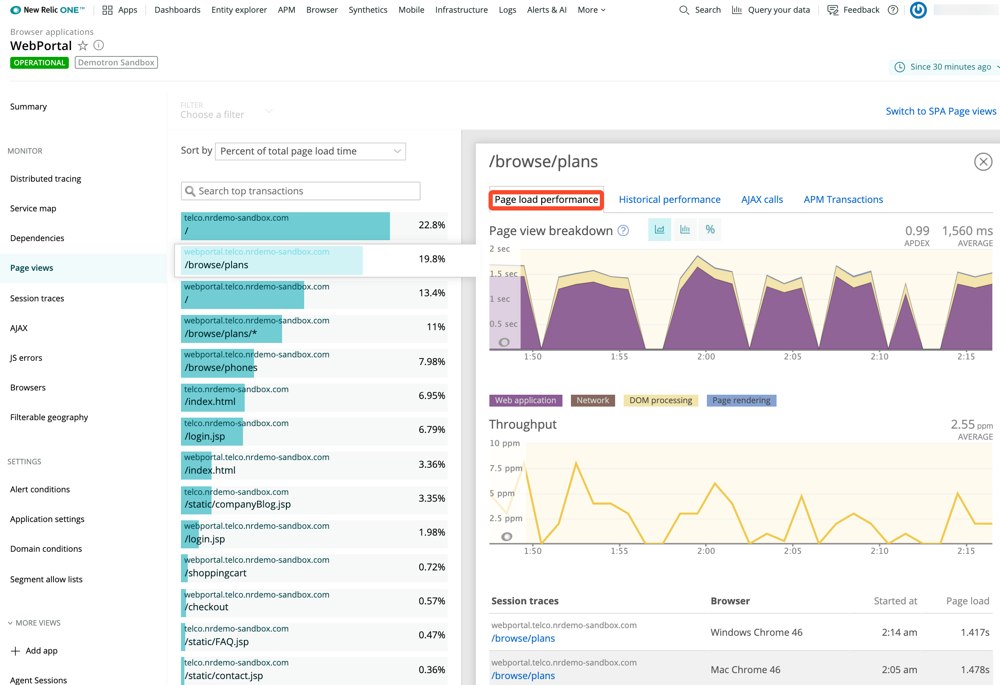

ブラウザモニタリングの **ページビュー** ページは、サイトのページのパフォーマンスを把握することができます。ソートオプションでは、ページロード時間の割合、平均ページロード時間、またはスループットで詳細を表示できます。必要に応じて、閲覧数の多いウェブページに関する詳細情報、タイミングとスループットの詳細、ブラウザトレースやセッショントレースへのリンクも利用できます。

ブラウザでは、 [シングルページアプリ（SPA）モニタリング](/docs/browser/single-page-app-monitoring/get-started/welcome-single-page-app-monitoring) も提供しています。SPAモニタリングをオプトインしている場合は、 [SPA **ページビュー** ページ](/docs/browser/single-page-app-monitoring/use-spa-data/view-spa-data-new-relic-browser) が異なります。

## サマリー情報の表示 [#dashboard]

ブラウザモニタリングでは、ページビューを [URL](/docs/browser/new-relic-browser/getting-started/url-whitelists-grouping-browser-metrics) としてリストアップしています。これにより、特定のフロントエンドのページビューを簡単に特定することができます。例えば、 `/browse/plans` 。さらに。

* APM で監視されているブラウザアプリ では、ページビューに関連したバックエンドのトランザクションを見ることができます。例えば、 `ApplicationsController#Show` のように。
* SyntheticsのモニターにもなっているURLについては、New Relicの 比較チャート機能 を使うことができます。これにより、実際のユーザー(ブラウザ)のインタラクションとSyntheticsのモニターに表示されるトレンドとの間で、ページロードタイムを直接比較することができます。

<figcaption>
  **[one.newrelic.com](https://one.newrelic.com) > ブラウザ> （アプリを選択）> ページビュー**: このページでは、ページのロードタイム、スループット、トップトランザクション、トレースなどの詳細情報を提供しています。
</figcaption>

アプリのエンドユーザーがどのページを見ているかの詳細情報を見るには

1. **[one.newrelic.com](https://one.newrelic.com) > Browser >（アプリケーションを選択） > Page views**の順に移動します。
2. [時間帯](/docs/apm/new-relic-apm/ui-functions/time-picker-setting-time-periods-view-data) やソート順を選択するか、デフォルトのままにするか。
3. 利用可能な場合は、ページロードタイミング情報の表示タイプ [を、チャート（デフォルト）、ヒストグラム、パーセンタイルから選択します。](/docs/apm/applications-menu/features/selecting-dashboard-views)
4. [* 特定の取引に関するサマリー情報を表示するには、リスト上の取引名にマウスオーバーします。](/docs/apm/applications-menu/features/selecting-dashboard-views)
5. [実際のユーザー（ブラウザ）のインタラクションと、Synthetics](/docs/synthetics/new-relic-synthetics/getting-started/introduction-new-relic-synthetics) のモニターに表示されるトレンドとの間でページロード時間を比較するには、Synthetics がモニターしているページを選択し、さらに [の比較チャート](/docs/synthetics/new-relic-synthetics/administration/compare-page-load-performance-browser-synthetics) の詳細を調べます。

## ページロードのタイミングの詳細を調べる [#page_load_timing]

**Browser page load time** [chart view](/docs/apm/applications-menu/features/selecting-dashboard-views) は、平均ページロード時間をセグメントに分けて表示しています。このチャートは、 [**サマリー** ページ](/docs/browser/new-relic-browser/getting-started/browser-overview-website-performance-glance) と [**ブラウザー** 詳細ページ](/docs/browser/new-relic-browser/additional-standard-features/browsers-problem-patterns-type-or-location) にも表示されます。

<figcaption>
  **[one.newrelic.com](https://one.newrelic.com) > Browser> (select an app)> Page views:** Browserのページロードタイムチャートでは、平均ページロードタイムをエンドユーザーの体験を示すセグメントに分けて表示しています（Real user monitoringまたはRUMと呼ばれることもあります）。
</figcaption>

[ページロードタイミング処理](/docs/browser/new-relic-browser/page-load-timing-resources/page-load-timing-process) は、色分けされた詳細を示しています。

<table>
  <thead>
    <tr>
      <th style={{ width: "200px" }}>
        ページロードタイミングのプロセス
      </th>

      <th>
        説明
      </th>
    </tr>
  </thead>

  <tbody>
    <tr>
      <td>
        リクエストキューイング（黒）
      </td>

      <td>
        Webサーバーとアプリケーションコードの間の待ち時間。大きな数値は、アプリケーションサーバーが忙しいことを示しています。
      </td>
    </tr>

    <tr>
      <td>
        Webアプリケーション（紫）
      </td>

      <td>
        アプリケーションコードに費やした時間
      </td>
    </tr>

    <tr>
      <td>
        ネットワーク（茶）
      </td>

      <td>
        ネットワークレイテンシー、つまりリクエストがインターネット上を往復するのにかかる時間のことです。

        コピー/ペースト方式で [デプロイされたアプリの場合](/docs/browser/new-relic-browser/installation-configuration/adding-apps-new-relic-browser) 、ブラウザにはウェブアプリとキューの時間が [ネットワーク](/docs/browser/new-relic-browser/page-load-timing-resources/page-load-timing-process#h3-network) の時間に含まれます。
      </td>
    </tr>

    <tr>
      <td>
        DOM処理（黄色）
      </td>

      <td>
        ブラウザの中で、HTMLを解析・解釈すること。ブラウザの `DOMContent` イベントで測定されます。
      </td>
    </tr>

    <tr>
      <td>
        ページレンダリング（青）
      </td>

      <td>
        ブラウザでは、HTMLの表示、インラインJavaScriptの実行、画像の読み込みにかかる時間です。ブラウザの `Load` イベントで測定されます。
      </td>
    </tr>

    <tr>
      <td>
        "追加" タイミングデータ
      </td>

      <td>
        [JavaScript API](/docs/browser/new-relic-browser/browser-agent-apis/manually-reporting-page-load-timing-data) を使用している場合は、"追加の" タイミングデータがこのチャートに表示されます。
      </td>
    </tr>
  </tbody>
</table>

## ページビューの詳細を見る [#view_details]

詳細な情報にドリルダウンするには、New Relic の標準的な [ユーザーインターフェースの機能](/docs/accounts-partnerships/education/getting-started-new-relic/new-relic-user-interface) を使用します。また、特定のページビューの詳細を表示するには、リストからその名前を選択します。個々のページビューを閉じて **Page views** のページに戻るには、 **X** (Close) を選択します。

一覧に表示されている各ページビューには、ドリルダウンできる詳細情報へのリンクが含まれています。

<table>
  <thead>
    <tr>
      <th style={{ width: "200px" }}>
        ページビューの詳細
      </th>

      <th>
        コメント
      </th>
    </tr>
  </thead>

  <tbody>
    <tr>
      <td>
        ページロードパフォーマンス
      </td>

      <td>
        これには、 [ページロードタイミング](#page_load_timing) ブレークダウンデータ、スループット、 [セッショントレース](/docs/browser/new-relic-browser/browser-pro-features/session-traces-exploring-webpages-life-cycle) 、 [ブラウザトレース](#other-apm-options) （利用可能な場合）が含まれます。
      </td>
    </tr>

    <tr>
      <td>
        ヒストリカルパフォーマンス
      </td>

      <td>
        これは、直近の [選択した期間](/docs/apm/new-relic-apm/ui-functions/time-picker-setting-time-periods-view-data) 、昨日、先週のレスポンスタイム、Apdex の比較、スループットを示しています。
      </td>
    </tr>

    <tr>
      <td>
        [AJAX](/docs/browser/new-relic-browser/browser-pro-features/ajax-dashboard-identifying-time-consuming-calls) コール
      </td>

      <td>
        エンドポイントの詳細情報へのリンクを持つテーブルで、エンドポイント別、平均応答時間、スループット、総コール数などのソート可能な列があります。
      </td>
    </tr>

    <tr>
      <td>
        [APM トランザクション](#other-apm-options)
      </td>

      <td>
        APMでも監視されているブラウザアプリの場合、この表には総コールタイム、平均レスポンスタイム、コールカウント、および [APM **トランザクション** ページ](/docs/apm/applications-menu/monitoring/transactions-dashboard) へのリンクが表示されます。
      </td>
    </tr>
  </tbody>
</table>

<figcaption>
  **[one.newrelic.com](https://one.newrelic.com) > ブラウザ> （アプリを選択）> ページビュー> （トランザクションを選択）：** アプリによっては、個々のトランザクションに、 **ページロードパフォーマンス** 、 **ヒストリカルパフォーマンス** 、 **AJAXコール** 、 **APMトランザクション** など、追加のドリルダウン詳細へのリンクがある場合があります。
</figcaption>

## APM監視対象アプリの追加オプションの使用 [#other-apm-options]

また、APMが監視しているブラウザアプリでは、追加機能を利用できる場合があります。これらの機能を利用するには（利用可能な場合）。選択したトランザクションの「APM Transactions」タブで、リストからAPMトランザクションを選択します。次に、以下のオプションのいずれかを選択します（APM から）。

* **Track as key transaction** ([create](/docs/apm/selected-transactions/key-transactions/creating-key-transactions) a new [key transaction](/docs/apm/selected-transactions/key-transactions/key-transactions-tracking-important-transactions-or-events))
* **Key transaction** ([view existing](/docs/apm/selected-transactions/key-transactions/viewing-key-transactions))
* **トランザクションのトレース> (選択されたトレース)** ([ビュー](/docs/apm/traces/transaction-traces/transaction-traces))