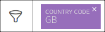

New Relic のブラウザモニタリングでは、フィルタリング可能なジオグラフィー UI ページにより、世界中のあらゆる都市、地域、国のパフォーマンス情報が色分けされたワールドビューで表示されます。フィルタリングして詳細情報を掘り下げることも、マウスを使って地図上の任意の場所を選択したり、拡大・縮小したりすることもできます。

強化された属性は、エンドユーザーのページロードタイミングに関する体験だけでなく、世界中のネットワークパフォーマンスに関する深い可視性を提供します。このレベルの視覚的な詳細は、ITやオペレーションの専門家がピアリング契約やCDNの使用に関するビジネス上の意思決定を行う際に特に役立ちます。

## 要件

* [ProまたはPro+SPAのエージェントタイプが必要です。](/docs/browser/browser-monitoring/installation/install-browser-monitoring-agent/#agent-types)

## 収集データに影響を与える要因 [#collected-data]

ページロードのタイミング情報を取得するために、エージェントは、ほとんどの（すべてではない）ブラウザがサポートしている [Navigation Timing API](/docs/browser/new-relic-browser/browser-agent-apis/navigation-timing-api) を使用しています。ブラウザが Navigation Timing API をサポートしていない場合、UI チャートとデータポイントは、DNS ルックアップ、接続、セキュアハンドシェイクなどのために受信したネットワークデータしか表示できません。これは、アプリの全体的なトラフィックの100％ではないかもしれません。

また、ファイアウォールは、エンドユーザーについて収集した地理的データに影響を与える可能性があります。

## 所在地別のパフォーマンスデータを表示 [#apdex-by-region]

<figcaption>
  **[one.newrelic.com](https://one.newrelic.com) > ブラウザ> （アプリを選択）> ブラウザアプリ> フィルタリング可能な地理：** イギリス・ロンドンの詳細情報にドリルダウンする前のマップの例です。
</figcaption>

パフォーマンス情報をロケーション別に表示したり、並べ替えることができます。

1. Go to **[one.newrelic.com](https://one.newrelic.com) > ブラウザ> （アプリを選択）> Filterable Geography**.

2. [表示するパフォーマンスデータのタイプ](#type) をドロップダウンから選択するか、デフォルトの **Average page load time** を使用してください。

3. [特定のエリアにドリルダウンするには](#functions) 、地理的なマップ上の任意のエリアにマウスオーバーするか選択するか、またはマップの右にあるリストからワースト10のロケーションを選択してください。

4. 特定のパフォーマンス指標を表示するには、ファネル

   <Icon name="fe-filter"/>

   アイコンの下にある [属性](#filter) のいずれかを選択します。

5. 比較データを表示するには、 [**Page load performance** または **Historical performance**](#comparison) 選択した場所の地理的マップの下にあるチャートを選択してください。

## 地図機能の利用 [#functions]

詳細な情報にドリルダウンするには、New Relic の標準的な [ユーザーインターフェイス関数](/docs/accounts-partnerships/education/getting-started-new-relic/new-relic-user-interface) と [ページ関数](/docs/accounts-partnerships/education/getting-started-new-relic/standard-dashboard-features) のいずれかを使用します。以下は、Filterable Geography ページの追加オプションの概要です。

<table>
  <thead>
    <tr>
      <th width={200}>
        **以下を行う場合...**
      </th>

      <th>
        **操作...**
      </th>
    </tr>
  </thead>

  <tbody>
    <tr>
      <td id="type">
        表示されるパフォーマンスデータの種類の変更
      </td>

      <td>
        ドロップダウンから選択してください。

        

        デフォルトのパフォーマンス指標は **平均ページロード時間** です。マップの凡例には、選択した期間に最もパフォーマンスが高かった地域または低かった地域の10カ所が表示されます（選択したパフォーマンス指標による）。例えば、以下のようになります。

        * **Count** を選択した場合、マップの凡例には、ページロード数の多い上位10カ所と、それぞれの平均ページロード時間が表示されます。
        * **接続設定** を選択した場合、UIはスループットの低いエリアをフィルタリングします。また、マップの凡例には、平均接続時間が最も遅い場所のトップ10と、それぞれの平均ページロード時間とカウント数が表示されます。
      </td>
    </tr>

    <tr>
      <td>
        特定の場所に関するパフォーマンス情報の概要を表示
      </td>

      <td>
        地図上の色の付いた部分にマウスオーバーしたり、リストから場所を選択したり、地図上の任意の場所を拡大・縮小したりすることができます。
      </td>
    </tr>

    <tr>
      <td>
        ある場所の詳細データを見る
      </td>

      <td>
        地図上の任意のエリアを選択します。例えば、以下のようになります。

        * カナダ」を選択した場合、地図と凡例には、各州・地域のパフォーマンスデータが色分けされて表示されます。マップの右にあるリストには、パフォーマンスの低い上位10地域が表示されます。

        * 特定の州や地域を選択すると、地図上に上位10都市のパフォーマンスデータが色分けされて表示されます。

          マップには丸で囲まれた場所が含まれており、マウスオーバーや選択することで詳細情報を見ることができます。さらに、 **Page load performance** and **Historical performance** [地図の下にあるチャート](#comparison) は、選択した場所ごとに自動的に更新されます。
      </td>
    </tr>

    <tr>
      <td>
        利用可能な属性のリストを隠す
      </td>

      <td>
        ファンネル <Icon name="fe-filter"/>のアイコンを選択します。

        
      </td>
    </tr>

    <tr>
      <td>
        大きな世界観への回帰
      </td>

      <td>
        地図上で別の場所を選択するか、または [フィルターラベルをクリアする](#filter) 地図の上にある。

        <Callout variant="tip">
          元の世界地図表示に戻るには、海の上の任意のエリアを選択します。
        </Callout>
      </td>
    </tr>
  </tbody>
</table>

## ヒートマップの詳細を見る [#heat-map]

<figcaption>
  **[one.newrelic.com](https://one.newrelic.com) > ブラウザ> （アプリを選択）> ブラウザアプリ> フィルタリング可能な地理：** フィルタリングツールとズームツールを使って、イギリスのロンドンに関する詳細な情報を掘り下げたときのマップの例です。このエリアの全体的なスループットは良好ですが（緑）、近くにある黄色のエリアや、より小さな赤やオレンジの円は、スループットの問題が様々なレベルで発生している近隣の都市を示しており、それらの都市の大きさではありません。
</figcaption>

Filterable Geographyのヒートマップは、色と円の大きさでパフォーマンスの質を識別します。

<table>
  <thead>
    <tr>
      <th style={{ width: "200px" }}>
        **ヒートマップ**
      </th>

      <th>
        **説明**
      </th>
    </tr>
  </thead>

  <tbody>
    <tr>
      <td>
        カラースケール
      </td>

      <td>
        パフォーマンスの質は、緑（最高）から黄色、オレンジ、そして赤（最悪）へと変化していきます。パフォーマンスではなく使用状況の指標を選択した場合、ヒートマップは紫色の濃淡で表示され、最も濃い色は使用状況が高いことを示しています。

        カラースケールは、アプリの特定のパフォーマンスに適応します。各エリアは、 [パーセンタイルの範囲](#ranges) 。各色のセグメントの範囲を表示するには、ヒートマップの凡例にマウスオーバーします。

        
      </td>
    </tr>

    <tr>
      <td>
        閾値
      </td>

      <td>
        ドロップダウンから選択したパフォーマンス指標の種類と、アプリが報告した最大値に基づいて、異なるしきい値が色に動的に適用されます。例えば、 **Average page load time** の緑は、0～3.3秒を示し、 **Average network time** の緑は、0～256ミリ秒を示しています。
      </td>
    </tr>

    <tr>
      <td>
        サークル
      </td>

      <td>
        マップの色付きの円を見れば、パフォーマンスに問題のあるエリアが一目瞭然です。各円の半径は、都市の大きさではなく、その都市で報告されたスループットに基づいています。

        たくさんの円が重なって見えることがあります。これは通常、交通量の多い地域を表す大都市圏の集まりを示しています。
      </td>
    </tr>
  </tbody>
</table>

## フィルター・パフォーマンス・メトリクス [#filter]

**フィルター** <Icon name="fe-filter"/>の機能は、以下のような様々なカテゴリーの属性によってデータを選択し、グループ化することができます。

ページビュー

* ジオグラフィー
* ブラウザ
* アイデンティティ
* カスタム

フィルタリングされた結果は地理的なマップ上に表示され、そこから [の標準的なマップ機能](#functions) を使ってさらに詳細を調べることができます。以下に例を示します。

<CollapserGroup>
  <Collapser
    id="example-asn"
    title={<strong>ASNのネットワーク性能が満足できない</strong>}
  >
    この例では、あなたの組織は、"My-ASN と呼ばれる自治システムの所有者とのピアリング契約を更新する準備をしています。" あなたは、継続的な停電やその他の接続問題が、あなたのサイトに対する顧客満足度に影響を与えていることを懸念しており、他の ASN とのパフォーマンスを比較したいと考えています。

    1. Go to **[one.newrelic.com](https://one.newrelic.com) > ブラウザ> （アプリを選択）> Filterable Geography**.

    2. パフォーマンスタイプのドロップダウンから、 **接続設定** を選択します。

    3. ファンネル <Icon name="fe-filter"/>のアイコンを選択します。

    4. 特定のASNのパフォーマンスを表示するには。検索ウィンドウから、 **My-ASN** と入力し、 **Filter by** の結果からこの名前を選択します。

       または

       他のASNとパフォーマンスを比較するには。From **Geography attributes> ASN organizations** 、リスト上の各組織のパフォーマンスデータを確認してから、 **Back to groupings list** を選択します。

    5. フィルターリストを閉じるには、ファンネル <Icon name="fe-filter"/>のアイコンを選択します。

    6. 標準的な手順に従って、 [マップ機能](#functions) を使用し、 [比較性能](#comparison) の詳細を表示します。

    7. フィルターを解除するには、属性名を選択します。
  </Collapser>

  <Collapser
    id="example-promo"
    title={<strong>販売促進時のページレンダリング性能</strong>}
  >
    この例では、あなたの組織が来るべき休日のために3日間の特別な販売促進を行っています。 **ホリデーマーチャンダイズ** ページは、何十枚もの新しい画像を含む大きな変更が加えられています。この販売期間中に、Androidモバイルデバイスでのページレンダリングに関するパフォーマンス問題を確認したいとします。

    1. Go to **[one.newrelic.com](https://one.newrelic.com) > ブラウザ> （アプリを選択）> Filterable Geography**.

    2. [タイムピッカー](/docs/data-analysis/user-interface-functions/time-picker-setting-time-periods-view-data) を使って、日付の範囲をプロモーション期間に変更します。

    3. パフォーマンスタイプのドロップダウンから、 **ページレンダリング** を選択します。

    4. ファンネル

       <Icon name="fe-filter"/>

       のアイコンを選択します。

    5. **Page view attributes> Page Url** から、あなたのサイトの **holiday-merchandise** ページを選択し、 **Back to groupings list** を選択します。

    6. **ブラウザの属性> ユーザーエージェント OS** から、 **Android** を選択して、 **Back to groupings list** を選択します。

    7. フィルターリストを閉じるには、ファンネル

       <Icon name="fe-filter"/>

       のアイコンを選択します。

    8. 標準的な手順に従って、 [マップ機能](#functions) を使用し、 [比較性能](#comparison) の詳細を表示します。

    9. フィルターを解除するには、その属性名を選択します。
  </Collapser>
</CollapserGroup>

## 性能比較の詳細を見る [#comparison]

**ページロードパフォーマンス** と **ヒストリカルパフォーマンス** タブのチャートは、選択したロケーションの比較パフォーマンスの詳細が自動的に更新されます。

<figcaption>
  **[one.newrelic.com](https://one.newrelic.com) > ブラウザ> (select an app)> ブラウザアプリ> Filterable Geography:** Charts on **Page Load Performance** and **Historical Performance** タブは、選択された場所の詳細が自動的に更新されます。
</figcaption>

**Page load performance** タブには2つのチャートが表示されます。 **Average page load time** チャートには以下が含まれます。

* 各セグメントの平均ページロード時間 [ページロードタイミングプロセス](/docs/browser/new-relic-browser/page-load-timing/page-load-timing-process) 単位：秒
* [リクエストのキューイング](/docs/apm/applications-menu/features/request-queuing-tracking-front-end-time) 情報（リクエストが生産システムに入ってからアプリケーションに届くまでの時間） 該当する場合

**平均ネットワーク時間** チャートには、DNSルックアップ、接続確立、セキュアハンドシェイクにかかる時間など、主要な要素が秒単位で表示されています。

<Callout variant="tip">
  チャート上の領域がゼロまたはゼロに近い状態で表示されることがあります。これは、一部のアプリケーションが既存のTCP接続を使用しており、新たな接続を確立する必要がないためです。
</Callout>

**Historical performance** タブでは、選択した [の期間](/docs/apm/new-relic-apm/ui-functions/time-picker-setting-time-periods-view-data) 、昨日、先週の選択した場所の比較データが表示されます。これには以下が含まれます。

* 平均応答時間
* スループット（ページ/分） (**ppm**)

## 利用可能なメトリクス [#metrics]

地理的なパフォーマンスデータを以下のような指標でフィルタリングし、グループ化することができます。

<table>
  <thead>
    <tr>
      <th style={{ width: "200px" }}>
        **パフォーマンス**
      </th>

      <th>
        **メトリクス**
      </th>
    </tr>
  </thead>

  <tbody>
    <tr>
      <td>
        ウェブページ
      </td>

      <td>
        * [ページロード時間](/docs/browser/new-relic-browser/page-load-timing-resources/page-load-timing-process)
        * スループット（ページ/分または **ppm**)
        * ネットワーク時間
        * 接続時間
        * 安全な接続時間
      </td>
    </tr>

    <tr>
      <td>
        ネットワーク
      </td>

      <td>
        * IPマッピングによる自律システム番号と名前（ASN）

        * SSLネゴシエーションのタイミング

        * DNSのタイミング

        * 最初のバイトまでの時間

        * ASN [緯度](/docs/insights/new-relic-insights/decorating-events/browser-default-attributes-insights#browser-asnlatitude) および [経度](/docs/insights/new-relic-insights/decorating-events/browser-default-attributes-insights#browser-asnlongitude) インターネットサービスプロバイダー（ISP）の場合

          エンドユーザーのセキュリティを確保するために、エージェントはエンドユーザーの ISP の GeoIP 情報を収集します。エージェントは、 **ないしは、** 特定のエンドユーザーの GeoIP 情報を収集します。たとえば、オレゴン州ポートランドのエンドユーザーが、オレゴン州ビーバートンにある ISP を使用している場合、GeoIP 情報はその場所をビーバートンとして表示します。
      </td>
    </tr>

    <tr>
      <td>
        ユーザーエージェント
      </td>

      <td>
        * オペレーティングシステム
        * ブラウザの名前や種類
        * ブラウザのバージョン
        * デバイスの種類
      </td>
    </tr>
  </tbody>
</table>

## 性能と使用範囲 [#ranges]

色分けされた凡例は、パフォーマンスと使用量をパーセンタイルの範囲で示しています。

<CollapserGroup>
  <Collapser
    id="performance-ranges"
    title="パフォーマンス・カラー・レンジ"
  >
    パフォーマンスのパーセンタイルカラーは、緑（最高）から赤（最悪）まで。

    <table>
      <thead>
        <tr>
          <th>
            **パフォーマンスのパーセンタイル範囲（ベストからワーストまで）**
          </th>

          <th style={{ width: "110px" }}>
            **グリーン**
          </th>

          <th style={{ width: "110px" }}>
            **黄色**
          </th>

          <th style={{ width: "110px" }}>
            **オレンジ**
          </th>

          <th style={{ width: "110px" }}>
            **レッド**
          </th>
        </tr>
      </thead>

      <tbody>
        <tr>
          <td>
            バックエンド期間
          </td>

          <td>
            0-74.9
          </td>

          <td>
            75-86.9
          </td>

          <td>
            87-94.9
          </td>

          <td>
            95+
          </td>
        </tr>

        <tr>
          <td>
            接続設定時間
          </td>

          <td>
            0-96.9
          </td>

          <td>
            97-97.9
          </td>

          <td>
            98-98.9
          </td>

          <td>
            99+
          </td>
        </tr>

        <tr>
          <td>
            DNSルックアップ期間
          </td>

          <td>
            0-96.9
          </td>

          <td>
            97-97.9
          </td>

          <td>
            98-98.9
          </td>

          <td>
            99+
          </td>
        </tr>

        <tr>
          <td>
            DOM処理時間
          </td>

          <td>
            0-74.9
          </td>

          <td>
            75-86.9
          </td>

          <td>
            87-94.9
          </td>

          <td>
            95+
          </td>
        </tr>

        <tr>
          <td>
            ネットワークの継続時間
          </td>

          <td>
            0-74.9
          </td>

          <td>
            75-86.9
          </td>

          <td>
            87-94.9
          </td>

          <td>
            95+
          </td>
        </tr>

        <tr>
          <td>
            ページロード時間
          </td>

          <td>
            0-74.9
          </td>

          <td>
            75-86.9
          </td>

          <td>
            87-94.9
          </td>

          <td>
            95+
          </td>
        </tr>

        <tr>
          <td>
            ページのレンダリング時間
          </td>

          <td>
            0-74.9
          </td>

          <td>
            75-86.9
          </td>

          <td>
            87-94.9
          </td>

          <td>
            95+
          </td>
        </tr>

        <tr>
          <td>
            キューの持続時間
          </td>

          <td>
            0-74.9
          </td>

          <td>
            75-86.9
          </td>

          <td>
            87-94.9
          </td>

          <td>
            95+
          </td>
        </tr>

        <tr>
          <td>
            セキュアハンドシェイク時間
          </td>

          <td>
            0-96.9
          </td>

          <td>
            97-97.9
          </td>

          <td>
            98-98.9
          </td>

          <td>
            99+
          </td>
        </tr>

        <tr>
          <td>
            ウェブアプリの期間
          </td>

          <td>
            0-74.9
          </td>

          <td>
            75-86.9
          </td>

          <td>
            87-94.9
          </td>

          <td>
            95+
          </td>
        </tr>
      </tbody>
    </table>
  </Collapser>

  <Collapser
    id="usage-ranges"
    title="使用色の範囲"
  >
    使用量のパーセンタイルカラーは、薄い（使用量が少ない）ものから濃い（使用量が多い）ものまで、紫色の濃淡で表示されます。

    <table>
      <thead>
        <tr>
          <th>
            **使用率のパーセンタイルの範囲（低いものから高いものまで）**
          </th>

          <th style={{ width: "110px" }}>
            **最も明るい紫色**
          </th>

          <th style={{ width: "110px" }}>
            **ライトパープル**
          </th>

          <th style={{ width: "110px" }}>
            **濃いめの紫**
          </th>

          <th style={{ width: "110px" }}>
            **ダークパープル**
          </th>
        </tr>
      </thead>

      <tbody>
        <tr>
          <td>
            ページロードカウント
          </td>

          <td>
            0-79.9
          </td>

          <td>
            80-89.9
          </td>

          <td>
            90-99.9
          </td>

          <td>
            100
          </td>
        </tr>

        <tr>
          <td>
            ユニークセッション数
          </td>

          <td>
            0-79.9
          </td>

          <td>
            80-89.9
          </td>

          <td>
            90-99.9
          </td>

          <td>
            100
          </td>
        </tr>
      </tbody>
    </table>
  </Collapser>
</CollapserGroup>