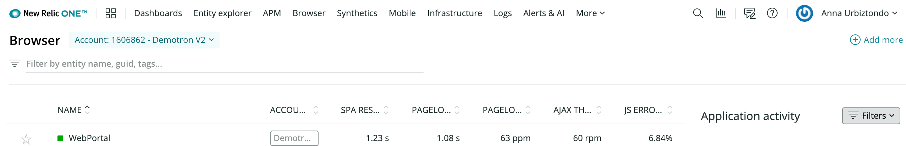

[ブラウザのモニタリングを始めるには](/docs/browser/new-relic-browser/getting-started/introduction-new-relic-browser) 、 [one.newrelic.com](http://one.newrelic.com) にアクセスし、ページの上部にあるブラウザを選択します。すでにアプリケーションを追加している場合は、ブラウザアプリケーションのインデックスが自動的に表示されます。

ブラウザのインデックスページには、ブラウザで監視している既存のアプリのリストが表示されます。 また、このページは、追加のアプリのためにブラウザエージェント [をインストールするための出発点でもあります。](/docs/browser/new-relic-browser/installation/install-new-relic-browser-agent)

## [ブラウザアプリのインデックス機能 [#index]](/docs/browser/new-relic-browser/installation/install-new-relic-browser-agent)

<figcaption>
  [ブラウザのアプリケーションインデックスには、アプリの名前、健康状態、概要情報が表示され、追加ページへの直接リンクもあります。](/docs/browser/new-relic-browser/installation/install-new-relic-browser-agent)
</figcaption>

[このインデックスには、タイムピッカーで選択した現在のタイムフレームに基づいて、お客様のアプリケーション名のリスト、色分けされた健康状態、ユーザーエクスペリエンスの概要が表示されます。これには](/docs/browser/new-relic-browser/installation/install-new-relic-browser-agent)

* 
* [ページロード時間](/docs/browser/new-relic-browser/dashboard-details/page-views-dashboard), [SPAレスポンスタイム](/docs/browser/single-page-app-monitoring/use-spa-data/view-spa-data-new-relic-browser), スループット（1分あたりのページ数）
* [AJAXのレスポンスタイム](/docs/browser/new-relic-browser/dashboard-details/ajax-dashboard) とスループット（1分あたりのリクエスト数）。
* [JavaScriptのエラー](/docs/browser/new-relic-browser/dashboard-details/javascript-errors-dashboard)

## ブラウザアプリ名 [#app-name]

[APM](/docs/apm/new-relic-apm/getting-started/welcome-new-relic-apm) でも監視されているアプリの名前は、APM での [アプリの設定から取られます。APMではなくブラウザで監視されているアプリの名前は、 ](/docs/apm/new-relic-apm/installation-configuration/naming-your-application)[ブラウザをインストールしたときに指定されたものです](/docs/browser/new-relic-browser/installation/install-new-relic-browser-agent) 。

* ブラウザアプリの [Summary page](/docs/browser/new-relic-browser/dashboard-details/browser-overview-dashboard) を表示するには : ブラウザアプリのインデックスから、アプリ名を選択します。
* ブラウザアプリの名前を変更するには：元のデプロイメント方法に基づいて、アプリの名前 [を変更する手順に従ってください。](/docs/browser/new-relic-browser/installation-configuration/rename-browser-apps)
* 

## [アプリの状態 [#status]](/docs/browser/new-relic-browser/installation-configuration/rename-browser-apps)

[色分けされた ](/docs/browser/new-relic-browser/installation-configuration/rename-browser-apps)[ヘルスインジケーター](/docs/accounts-partnerships/education/getting-started-new-relic/glossary#health-status) は、各アプリの現在の状態を示しています。

* **緑：** ブラウザの監視が有効になっており、アプリに問題はありません。
* **黄色。** 警告アラートは、アプリに重要ではない問題が発生していることを示します。例えば、エンドユーザー [Apdexスコア](/docs/apm/new-relic-apm/apdex/apdex-measuring-user-satisfaction) やエラーレートが、関連するアラートポリシーの定義された閾値を超えた場合などです。
* **赤:** 致命的な警告は、アプリで問題がエスカレートしていることを示しています。
* **グレー：** 現時点では、このアプリのデータは報告されていません。

現在の状況をすばやく把握するには、アプリのカラーステータスバーにマウスオーバーします。

## 機能一覧 [#list_functions]

ここでは、BrowserBrowser Application Indexを使用する際のヒントをご紹介します。

<table>
  <thead>
    <tr>
      <th width={200}>
        **以下を行う場合...**
      </th>

      <th>
        **操作...**
      </th>
    </tr>
  </thead>

  <tbody>
    <tr>
      <td>
        ソート順の変更
      </td>

      <td>
        任意の列の見出しを選択すると、リストが昇順または降順にソートされます。
      </td>
    </tr>

    <tr>
      <td>
        アプリのブラウザ監視の概要を表示する
      </td>

      <td>
        アプリケーション名を選択すると、そのアプリケーションの [ブラウザ **まとめ** ページ](/docs/browser/new-relic-browser/dashboard-details/browser-overview-dashboard) に移動します。
      </td>
    </tr>

    <tr>
      <td>
        特定のアプリを探す
      </td>

      <td>
        検索を狭めるには、「 **Search** 」のフィルターに1つ以上の文字を入力します。検索範囲を広げるには、フィルターを解除します。
      </td>
    </tr>

    <tr>
      <td>
        アプリのブラウザパフォーマンスの詳細を表示
      </td>

      <td>
        対応するリンクのいずれかを選択します。例えば、アプリの **Page load time** または **Page load throughput** リンクを選択すると、 [**Page views** ページ](/docs/browser/new-relic-browser/dashboard-details/page-views-dashboard) に直接アクセスできます。

        ページロードタイミングが有効になっている（アプリの健康状態が緑）にもかかわらず、ブラウザのアプリインデックスにサマリーデータが表示されていない（0ppm）場合は、最近（最大6分間）のトラフィックがないことを意味します。
      </td>
    </tr>

    <tr>
      <td>
        ブラウザアプリ一覧へ戻る
      </td>

      <td>
        ブラウザの任意のページから、 **ブラウザアプリケーション** を選択します。アプリケーション名の上にある** を選択します。**

        
      </td>
    </tr>
  </tbody>
</table>