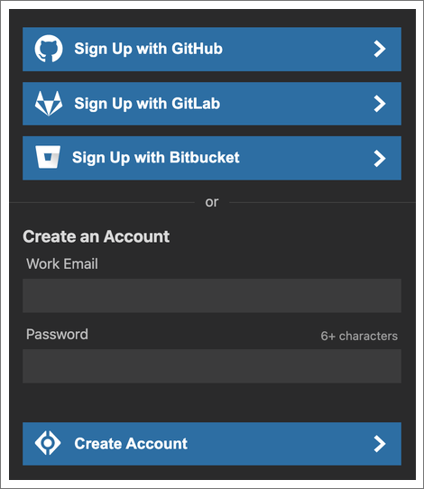

New Relic CodeStreamのコラボレーションツールを最大限に活用するには、組織を作成し、そこにチームメンバーを招待します。

まだの方は、 [無料のNew Relicアカウントにサインアップしてください](https://newrelic.com/signup) New Relic Oneのアプリケーションのスタックトレースエラーから、IDEの責任あるコード行に直接ジャンプすることができます。

## アカウントの作成 [#account]

すでにIDE [に CodeStream 拡張機能がインストールされている場合は、CodeStream ペインからサインアッププロセスを開始できます。](/docs/codestream/start-here/install-codestream)

[CodeStreamにサインアップするには2つの方法があります。CodeStreamの認証情報（Eメールアドレスやパスワードなど）を使ってサインアップすることができます。また、GitHub、GitLab、またはBitbucket（クラウド版のみ）のアカウントを使ってサインアップすることもできます。](/docs/codestream/start-here/install-codestream)

[コードホスト経由でサインアップすると、リポジトリがCodeStreamに接続されます。コードホストで使用しているメールアドレスが仕事用のメールでない場合は、代わりにCodeStream専用の認証情報を作成してください。](/docs/codestream/start-here/install-codestream)

[コードストリーム経由で登録した場合、次のステップでは、メールで送られてきたコードを入力してメールアドレスを確認します。コードは、それぞれの数字を個別に入力するのではなく、いずれかのボックスに貼り付けることができます。](/docs/codestream/start-here/install-codestream)

## [コードストリームの組織 [#organizations]](/docs/codestream/start-here/install-codestream)

[CodeStreamの組織は、あなたとあなたのチームメイトがコードを議論する場所です。Slackのワークスペースのように、社内の開発者全員が同じCodeStreamの組織に属しています。CodeStreamのアクティビティフィードは、あなたがIDEで開いているコードに関連するアクティビティを表示することで、あなたにとって関連性のあるものを維持します。](/docs/codestream/start-here/install-codestream)

[コードに関する議論は、会社全体のリソースとなる知識ベースを構築するため、CodeStreamで複数の組織を持つ理由は、本当に分離する必要がある場合のみです。例えば、本業の仕事のための組織と、自分が携わるオープンソースプロジェクトのための組織があるかもしれません。また、コンサルタントであれば、顧客ごとに異なるCodeStreamの組織に所属しているかもしれません。](/docs/codestream/start-here/install-codestream)

## [組織の作成または参加 [#create-org]](/docs/codestream/start-here/install-codestream)

[CodeStreamで組織に招待された場合、招待状が送られてきたのと同じメールアドレスでサインアップしてください。あなたは自動的にその組織に追加されます。](/docs/codestream/start-here/install-codestream)

[あなたがあなたの会社から初めてCodeStreamにサインアップした人であれば、先に新しい組織を作成することができます。そうでない場合は、あなたのメールドメインに基づいて、参加できる既存のCodeStream組織があるかもしれません。あなたの会社がすでにCodeStreamに参加していると思うが、参加できる組織が見当たらない場合は、あなたが仕事用の電子メールでサインアップしたことを確認してください。](/docs/codestream/start-here/install-codestream)

[組織を作成すると、組織の名前を聞かれます。また、仕事用のメールアドレスでサインアップした場合、そのメールアドレスのドメインを持つ人は誰でも組織に参加することができます。](/docs/codestream/start-here/install-codestream)

## [チームを招待する [#invite]](/docs/codestream/start-here/install-codestream)

[コラボレーションはチームスポーツなので、チームメイトを誘ってCodeStreamに参加してもらいましょう。](/docs/codestream/start-here/install-codestream)

[CodeStreamは、あなたがIDEで開いているリポジトリのコミット履歴に基づいて、いくつかの提案を行います。](/docs/codestream/start-here/install-codestream)

[これで、CodeStreamを使い始める準備が整いました。](/docs/codestream/start-here/install-codestream)