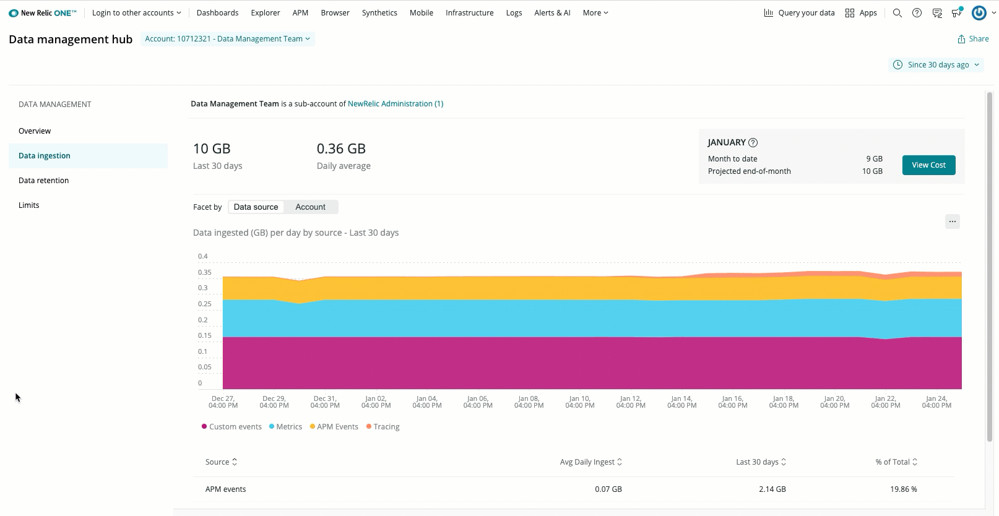

お客様のデータがNew Relicに接続されると、受信したデータを処理し、データドロップや変換ルールを適用します。そして、お客様のデータをJSONなどの標準フォーマットで表現するために必要なバイト数を計算します。 [New Relic One の価格モデル](/docs/accounts/accounts-billing/new-relic-one-pricing-users/pricing-billing) をご利用の場合、データベースに書き込まれたバイト数に応じて課金され、標準的な無料のバイト数を超えることになります。

<Callout variant="important">
  このドキュメントは、 [New Relic One の価格モデル](/docs/accounts/accounts-billing/new-relic-one-pricing-users/pricing-billing) のアカウントを対象としています。オリジナルの製品ベースの価格モデルをご利用の場合は、 [オリジナルのデータ保持](/docs/accounts/original-accounts-billing/product-based-pricing/overview-data-retention-components) をご覧ください。どちらのモデルかわからない場合は [Overview of pricing and user model](/docs/transition-guide-our-new-pricing-plan-user-model) をご覧ください。
</Callout>

**Data ingestion** ページには、Data management hub の右上で指定した期間の取り込み率が表示されます。 **Since 30 days ago** がデフォルトの設定ですが、カスタムの日付スパンを設定することもできます。

このページには、1日の平均GB数と、設定した範囲の合計が表示されます。インジェスト全体の表示とアカウントの表示を切り替えて、どのアカウントが最も多くのデータを送信しているかを確認することができます。また、このページには、現在の月間累計と月末の予測合計インジェストレートが表示されます。この情報をもとに、積極的にデータを削除したり、エージェントをオフにすることで、インジェストを管理し、コストを削減することができます。

データをどのように照会しているかを見たい場合は、楕円形のアイコンをクリックしてチャートのクエリをスライドさせ、クエリビルダで開いてください（チャートのすぐ上にあります）。また、データの使用状況をさらに詳しく知りたい場合は、使用方法のドキュメント [のサンプルクエリをご覧ください。](/docs/accounts/accounts-billing/new-relic-one-pricing-users/usage-queries-alerts#data-queries)

<figcaption>
  [**Login** のドロップダウンから、 **Manage your data** を選択し、次に **Data ingestion** を選択します。これは、 **Data ingestion** のページで、データソースとアカウントのビューがあります。](/docs/accounts/accounts-billing/new-relic-one-pricing-users/usage-queries-alerts#data-queries)
</figcaption>

## [データインジェストソース [#sources-list]](/docs/accounts/accounts-billing/new-relic-one-pricing-users/usage-queries-alerts#data-queries)

[**データインジェスト** ページでは、どのデータソースが平均的に、また特定のデータ範囲で最も多くのデータを提供しているかを説明しています。データソースについてはこちらをご覧ください。](/docs/accounts/accounts-billing/new-relic-one-pricing-users/usage-queries-alerts#data-queries)

<table>
  <thead>
    <tr>
      <th style={{ width: "200px" }}>
        請求可能なデータソース
      </th>

      <th>
        説明
      </th>
    </tr>
  </thead>
  
  <tbody>
    <tr>
      <td>
        タイムスライス（1分）とMetric:Raw
      </td>

      <td>
        メトリクスはタイムスライス + MetricRaw

        メトリックグループ： `MetricsBytes`

        メトリックのタイムスライスデータは、8日後には1時間周期に平均化されます。90日後、恒久的なメトリックデータは引き続き1時間単位で保存されます。現在は、生のメトリックデータを30日間保存しています。

        最初のインジェストボリュームに対してのみ請求されます。その後のロールアップについては請求されません。
      </td>
    </tr>

    <tr>
      <td>
        APM（トランザクションとエラー）
      </td>

      <td>
        [APMイベント](/docs/insights/insights-data-sources/default-data/apm-default-events-insights)

        メトリックグループ： `ApmEventsBytes`
      </td>
    </tr>

    <tr>
      <td>
        InfraSamples:Raw
      </td>

      <td>
        複数の [Infrastructureのイベントを含む](/docs/infrastructure/manage-your-data/data-instrumentation/default-infrastructure-events)
      </td>
    </tr>

    <tr>
      <td/>

      <td>
        インフラのホストデータ

        メトリックグループ：`InfraHostBytes`

        インフラストラクチャ・エージェントから送られてくるサーバや仮想マシンに関連する情報（ストレージやネットワークのデータを含む
      </td>
    </tr>

    <tr>
      <td/>

      <td>
        ProcessSampleに格納されているインフラストラクチャのプロセスデータ。

        メトリックグループ： `InfraProcessBytes`

        データは、Infrastructureエージェントを実行しているホスト上で実行されている各プロセスに関連するメトリクスです。この機能はデフォルトではオフになっています。
      </td>
    </tr>

    <tr>
      <td/>

      <td>
        Infrastructureインテグレーション

        メトリックグループ： `InfraIntegrationBytes`

        Dockerコンテナ、Windowsサービス、Nagiosチェック、AWS、Azure、GCPのマネージドサービスなどのクラウド統合に関連するデータなど、通常はお客様が管理するアプリケーションやサービスに関連するパフォーマンスデータ。
      </td>
    </tr>

    <tr>
      <td>
        ロギング
      </td>

      <td>
        ログと任意の `Log_<値を含む>` カスタムデータパーティションの作成

        Metric group: `LoggingBytes`

        ログレコードは、デフォルトでは `Log` イベントタイプに保存されます。カスタムデータのパーティションを追加すると、新しいイベントタイプが作成されます。このイベントタイプは常に `Log_` というプレフィックスが付き、保存されているログデータ全体の一部としてカウントされます。

        `LogExtendedRecord` では、4KB を超えるログメッセージが複数のイベントに分割され、必要に応じてつなぎ合わされて元のメッセージが表示されるため、メッセージデータのサイズが小さくなります。

        2021年9月現在、 `LogExtendedRecord` に代わって、ブロブとしてのログストレージが採用されています。blobストレージでは、NRDBはメッセージだけでなく、任意の属性に対して最大128,000バイトまで保存できます。詳細については、 [blobs documentation for logs](/docs/logs/log-management/ui-data/long-logs-blobs) をご覧ください。
      </td>
    </tr>

    <tr>
      <td>
        デフォルト
      </td>

      <td>
        [カスタムイベント](/docs/insights/insights-data-sources/custom-data/report-custom-event-data)

        Metric group: `CustomEventsBytes`
      </td>
    </tr>

    <tr>
      <td>
        モバイルエラー

        モバイル総合

        パンくず崩しイベントの軌跡

        モバイルセッション

        モバイルの例外

        モバイルクラッシュ
      </td>

      <td>
        [モバイルイベント](/docs/insights/insights-data-sources/default-data/mobile-default-events-insights)

        メトリクスグループ： `MobileEventsBytes`
      </td>
    </tr>

    <tr>
      <td>
        トレース
      </td>

      <td>
        Metric group: `TracingBytes`

        * `TracingBytes` には `Span` と OpenTelemetry の `SpanEvent` が含まれています。
        * `DistributedTraceSummary` のイベントには課金されません。
      </td>
    </tr>

    <tr>
      <td>
        ブラウザ:イベントログ

        ブラウザ

        ブラウザ：JSErrors

        PcvPerf（PageViewのタイミング）
      </td>

      <td>
        [ブラウザイベント](/docs/insights/insights-data-sources/default-data/browser-default-events-insights)

        メトリクスグループ： `BrowserEventsBytes`
      </td>
    </tr>

    <tr>
      <td>
        ラムダ
      </td>

      <td>
        サーバーレス

        指標グループ： `ServerlessBytes`
      </td>
    </tr>
  </tbody>
</table>

## [データを分解して、何が原因で摂取されたかを確認する [#facet-data-ingest]](/docs/accounts/accounts-billing/new-relic-one-pricing-users/usage-queries-alerts#data-queries)

[データインジェストを検査することで、インジェストの健全性に関する詳細な情報を得ることができます。こうすることで、ベースラインを知ることができ、インジェストのスパイクのような異常を、その原因とともにより簡単に発見することができます。](/docs/accounts/accounts-billing/new-relic-one-pricing-users/usage-queries-alerts#data-queries)

[インジェストされたデータを分解するには、 **データインジェスト** ページのチャートから始めます。データソースのバンドをY軸に、日付をX軸に見立てます。X軸の中で調査したい日付に対応する場所で、調査したいバンドをクリックします。](/docs/accounts/accounts-billing/new-relic-one-pricing-users/usage-queries-alerts#data-queries)

<figcaption>
  [この画像は、6月15日のMetricsバンドがクリックされる直前のものです。](/docs/accounts/accounts-billing/new-relic-one-pricing-users/usage-queries-alerts#data-queries)
</figcaption>

[アカウント、データソース、ファセットが選択された状態でモーダルが開きます。このページでは、いくつかのことができます。](/docs/accounts/accounts-billing/new-relic-one-pricing-users/usage-queries-alerts#data-queries)

* * ドリルダウンしたいアカウント、データソース、またはファセットを変更します。

  * 調査する日時を変更する。

  * クエリの結果をチャート形式で確認します。チャートには、ファセット・クエリの上位15件の結果が表示されます。

  * NRQL クエリを **Query builder** で開くと、使用できる追加のファセットが見つかります。

[NRQL クエリの詳細はこちら](/docs/query-your-data/nrql-new-relic-query-language/get-started/introduction-nrql-new-relics-query-language/).

### お客様のインジェストデータをどのように分解するか

UIの内容の一部は、お客様のアカウントによって異なります。この情報は、お客様のインジェストデータをどのように扱っているかをご理解いただくためのものです。

* **データインジェスト** ページのチャートは、各データインジェストソースの保存設定でカバーされる期間よりも少し長い期間のデータ使用量を示しています。インジェストソースに指定した保存期間外の日付を選択すると、利用可能なチャートデータがないというメッセージが表示されます。この問題を解決するには、より最近の日付を選択してください。
* テラバイト未満のデータを持つアカウントのデータソースを検査する場合は、24時間の取り込み量を計算し、それ以外の場合は1時間の取り込み量を計算します。
* **Data ingestion** のメインチャートに表示されるインジェスト値は、検査時に反映される値とは若干異なります。これは、ファセット計算が推定値であるためです。

## データ使用時のアラート設定 [#set-alerts]

[使用量データのクエリとアラート](/docs/accounts/accounts-billing/new-relic-one-pricing-users/usage-queries-alerts) では、越えたくないデータ取り込みの限界に近づいたときに通知を受けるためのアラートの設定方法を説明しています。例えば、アクティブなシステムではすぐに蓄積されるログに対してアラートを設定することができます。

## データインジェストの調整 [#adjust-ingest]

**データを削除することで、保管コストの削減とデータのコンプライアンスを実現**

インジェスト時にデータドロップルールを適用しているので、有用ではないデータに課金されることはありません。 [データドロップの追加ルール](/docs/accounts/accounts/data-management/drop-data-using-nerdgraph) を自分で設定する方法をご紹介します。NerdGraphを使用して、データタイプ全体をドロップしたり、データタイプからデータ属性をドロップして、NRDBに書き込まないようにします。これにより、必要なデータに焦点を当てることができ、保持コストを削減し、データベースに機密データを書き込まないようにすることができます。ログデータのドロップについては、 [ドロップフィルタルールによるデータのドロップ](/docs/logs/new-relic-logs/ui-data/drop-data-drop-filter-rules) を参照してください。

**エージェントや統合機能をオフにする**

インストールした特定のエージェントや統合機能からのデータが不要な場合は、それらのツールをアンインストール／削除することができます。手順については、エージェントまたは統合機能の特定のドキュメントを参照してください。
