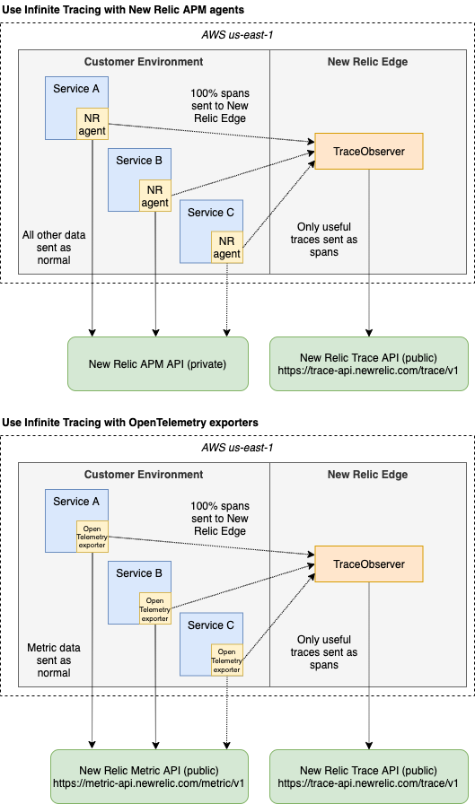

New Relicの[ディストリビューティッド（分散）トレーシング](/docs/understand-dependencies/distributed-tracing/get-started/introduction-distributed-tracing)のしくみについての技術的な詳細は、次のとおりです。

* [トレースサンプリングのしくみ](#sampling)
* [トレースデータの構造](#trace-structure)
* [トレースデータの保存方法](#trace-storage)
* [アプリケーション間でトレースコンテキストを渡す方法](#headers)

<Callout variant="tip">
  ディストリビューティッド（分散）トレーシングの設定の概要については、[概要: ディストリビューティッド（分散）トレーシングを有効にする](/docs/understand-dependencies/distributed-tracing/enable-configure/overview-enable-distributed-tracing)を参照してください。
</Callout>

## トレースのサンプリング [#sampling]

トレースのサンプリング方法は、ユーザーのセットアップ、および使用するNew Relicトレーシングツールによって異なります。たとえば、[サードパーティのテレメトリサービス](/docs/integrations/open-source-telemetry-integrations)（OpenTelemetryなど）を使って、データが当社に届く前にトレースのサンプリングが実行されている可能性があります。または、[Infinite Tracing](/docs/understand-dependencies/distributed-tracing/infinite-tracing/introduction-infinite-tracing)を使用している場合、すべてのトレースデータが当社に送信され、当社のサンプリングが使用されていると思われます。

いくつかのサンプリング戦略が利用可能です。

* [ヘッドベースのサンプリング](#head-based)（標準のディストリビューティッド（分散）トレーシング）
* [テールベースのサンプリング](#tail-based)（Infinite Tracing）
* [サンプリングなし](#no-sampling)

### ヘッドベースのサンプリング（標準のディストリビューティッド（分散）トレーシング） [#head-based]

[Infinite Tracing](#tail-based)機能を除き、当社のトレーシングツールのほとんどは、ヘッドベースのサンプリングアプローチを使用します。このアプローチでは、トレース内のすべてのスパンが到着する前に、個々のスパンにフィルターを適用します。つまり、スパンを受け入れるかどうかの決定は、フィルタリングプロセスの最初（「ヘッド」）に行われます。当社ではこのサンプリング戦略を使用して、ストレージとパフォーマンスの問題を避けながら、アクティビティの代表的なサンプルを取得します。

標準のディストリビューティッド（分散）トレーシングツールでのヘッドベースのサンプリングの実行方法の詳細を、以下に示します。

<CollapserGroup>
  <Collapser
    id="trace-origin-sampling"
    title="言語エージェント：適応サンプリング"
  >
    当社のAPM言語エージェントは適応サンプリングを使用して、システムアクティビティの代表的なサンプルを取得します。適応サンプリングのしくみは次のとおりです。

    ディストリビューティッド（分散）トレーシングでの最初のサービスについては、サンプリングする10件のリクエストが選択されます。そのサービスのスループットを使用して、リクエストのサンプリング頻度が調整されます。この点については、以下で詳細に説明します。

    ディストリビューティッド（分散）トレーシングで最初にモニターするサービスは、トレース元と呼ばれます。トレース元は、トレースが無作為になるようリクエストを選択します。この決定は、そのリクエストがタッチしたダウンストリームのサービスに伝搬されます。リクエストが完了すると、検出されたそのリクエストがタッチしたすべてのスパンが完全なトレースとしてUIで利用可能になります（ただし、[エージェント制限](#agent-limits-sampling)によってトレースが断片化する可能性があります）。

    APMエージェントでは、1分間に収集されるトランザクションの数（この数はエージェントにより異なります）と、1分間に収集されるスパンの数（エージェントインスタンス1件につき1000）が制限されています。この制限に従うため、トレース元でのトレースのデフォルト数は1分当たり10トレースとなっています。

    その期間の代表的なサンプルを取得するため、APMエージェントは、1分間に10トレースのコレクションに広がります。正確なサンプリングレートは、前の1分間のトランザクション数によって異なります。レートは、トランザクションのスループットの増減に対応します。

    たとえば、前の1分間のトランザクション数が100だった場合、エージェントはトランザクション数を同様に100と推定し、トランザクション10件当たり1件を選択してトレースします。
  </Collapser>

  <Collapser
    id="agent-limits-sampling"
    title="言語エージェント：制限とサンプリング"
  >
    ヘッドベースのサンプリングを使用するAPM言語エージェントのインスタンスには、1分当たり1000スパンの制限があります。エージェントは、ディストリビューティッド（分散）トレーシングの一環としてサンプリングされるものとして印の付いたすべてのスパンを保存しようとします。

    多くの分散型システムでは、平均的なマイクロサービスはリクエスト1件当たり10～20のスパンを生成します。この場合、エージェントスパンの限度は選択したすべてのスパンに対応し、そのサービスにはトレースの詳細が付けられます。

    ただし、サービスへの一部のリクエストでは多くのスパンが生成され、エージェントスパンの限度に達する場合があります。よって、一部のサービスについてはトレースのフル詳細がない場合があります。この点についての1つの解決策が、エージェントをカスタムインストゥルメントし、レポートするアクティビティを減らしてレポートするスパンを減らすというものです。

    トレースデータのブラウザモニタリングと、当社の言語エージェントとの違いについては、「[Browserトレース](#browser-spans)」を参照してください。
  </Collapser>

  <Collapser
    id="span-rate-limiting"
    title="トレースレートの制限"
  >
    上記のサンプリング方法でもまだトレースデータの量が多すぎる場合は、受信後にトレースをサンプリングすることで流入データを制限できます。この決定をトレースレベルで行うことによって、トレースのフラグメント化（トレースの一部のみを受け取る）を避けることができます。

    このプロセスは[適応サンプリング](#trace-origin-sampling)と同様に機能します。1分間に受け取った合計スパンが集計されます。受け取ったスパンが多すぎる場合は、次の1分間に受け取るスパンを少なくして、フローティング平均スループットレートを達成することができます。

    制限の詳細については、[New Relicのデータ使用制限とポリシー](/docs/licenses/license-information/general-usage-licenses/new-relic-data-usage-limits-policies/#all_products)を参照してください。
  </Collapser>

  <Collapser
    id="lambda-sampling"
    title="Lambdaトレースサンプリング"
  >
    当社のAWS Lambdaモニタリングは、[独自のサンプリングプロセス](/docs/serverless-function-monitoring/aws-lambda-monitoring/ui-data/understand-lambda-data-structure#data-structure)を使用します。
  </Collapser>
</CollapserGroup>

### テールベースのサンプリング（Infinite Tracing） [#tail-based]

当社の[Infinite Tracing](https://newrelic.com/products/edge-infinite-tracing)機能は、テールベースのサンプリングアプローチを使用します。「テールベースのサンプリング」では、トレース保持の決定は、トレースのすべてのスパン到着後の処理の最終時点で行われます。

Infinite Tracingでは、お使いのアプリケーションまたはサードパーティのテレメトリサービスからトレースデータを100%当社に送信でき、Infinite Tracingが最も重要なトレースデータを解明します。また、重要なトレースが保持されるようにサンプリングを設定することができます。

<CollapserGroup>
  <Collapser
    id="infinite-architecture"
    title="アーキテクチャー"
  >
    Infinite Tracingの場合は、エージェントまたはインテグレーションは、すべてのインストゥルメントされたスパンの100%をトレースオブザーバーに送信します。トレースオブザーバーは、New Relic Edgeと呼ばれるAWS上のサービスのクラスタに存在するディストリビューティッド（分散）トレーシングサービスです。

    <Callout variant="tip">
      お客様のスパンのみがトレースオブザーバーに移動します - メトリックスやカスタムイベント、トランザクショントレースなどのその他すべてのデータは通常のルートでNew Relicに送信され、ローカルサンプリングの対象となります。
    </Callout>

    データの送信先のAWSリージョンの一意のトレースオブザーバーのエンドポイントを設定します。AWSリージョン1つにつき、複数のエンドポイントをリクエストできます。エンドポイントは、特定のワークロードのトレースオブザーバーを表します。たとえば、単一のトレース（リクエスト）からのすべてのスパンは、そのエンドポイントに移動する必要があります。

    以下は2つのアーキテクチャ図です。1つは、APMエージェントを使用する場合の、もう1つはOpenTelemetryエクスポータのようなNew Relicインテグレーションを使用する場合のデータの流れを示しています。

    

    トレースオブザーバーは、そのトレースのスパンが到着している間、トレースをオープンのままにします。トレースの最初のスパンが到着すると、セッションは10秒間オープン状態となります。そのトレースの新しいスパンが到着するたびに、有効期間は10秒にリセットされます。直近10秒以内にスパンが到着していないトレースは、自動的に期限切れとなります。
  </Collapser>

  <Collapser
    id="tail-sampling-strategy"
    title="テールベースのサンプリングのアルゴリズム"
  >
    デフォルトでは、各トレースオブザーバーは3つのサンプラーにトレースを提供します。1つは期間の外れ値を探し、もう1つはエラーのあるトレースを探し、最後の1つはすべてのトレースタイプでランダムにサンプリングを試みます。各サンプラーは、基準に一致するトレースのターゲットパーセンテージを保持します。

    各サンプラーの詳細は、次のとおりです。

    <table>
      <thead>
        <tr>
          <th style={{ width: "100px" }}>
            サンプラー
          </th>

          <th>
            一致する基準
          </th>

          <th>
            ターゲットのパーセント
          </th>
        </tr>
      </thead>

      <tbody>
        <tr>
          <td>
            期間
          </td>

          <td>
            2つのアルゴリズムを使用して、期間の外れ値でトレースします。

            * ガウス（正規分布と99パーセンタイルの閾値を想定）
            * 離心率（分布がなく、クラスターに基づく閾値があると仮定）
          </td>

          <td>
            100%
          </td>
        </tr>

        <tr>
          <td>
            エラー
          </td>

          <td>
            エラーのあるスパンを少なくとも1つ含むトレース
          </td>

          <td>
            100%
          </td>
        </tr>

        <tr>
          <td>
            無作為
          </td>

          <td>
            すべてのトレース
          </td>

          <td>
            1％（これは設定可能です。[Infinite Tracing：ランダムトレースフィルター](/docs/understand-dependencies/distributed-tracing/other-requirements/infinite-tracing-random-trace-filter)）を参照してください。
          </td>
        </tr>
      </tbody>
    </table>

    一致基準がトレースと一致する場合、各サンプラーはトレースの形状を調べます。トレース形状は、ルートスパンのエンティティ名とスパン名の一意の組み合わせです。これは、リクエストのエントリポイントを使用してトレースを分離する簡単な方法です。

    形状が決定されると、サンプラーはターゲットのサンプリング パーセントに基づいてトレースを保持するか拒否するかを決定します。100％ の場合、トレースは自動的に保持されます。それより少ない場合、サンプラーが特定のトレースを保持する確率は、ターゲットのパーセントによって決まります。たとえば、ランダムトレースのデフォルトのターゲットパーセントは1であるため、これらのトレースの1％が保持されます。必要に応じて、[ランダムフィルターのパーセンテージ](/docs/understand-dependencies/distributed-tracing/other-requirements/infinite-tracing-random-trace-filter)を変更できます。

    トレースオブザーバーはスループットのパーセンテージを使用するため、選択されるトレースの数はそのスループットによって異なります。
  </Collapser>
</CollapserGroup>

### サンプリングなし [#no-sampling]

当社の一部のツールはサンプリングを使用しません。これらのツールのサンプリング詳細を、以下に示します。

<CollapserGroup>
  <Collapser
    id="browser-spans"
    title="ブラウザおよびモバイルトレースレポート"
  >
    [ブラウザモニタリングのディストリビューティッド（分散）トレーシング](/docs/browser/new-relic-browser/browser-pro-features/browser-data-distributed-tracing)および[モバイルモニタリング](/docs/mobile-monitoring/new-relic-mobile-android/get-started/new-relic-mobile-and-dt/)は、すべてのスパンをレポートします。

    当社のAPM言語エージェントは、ブラウザモニタリングおよびモバイルモニタリングと併用されることがあります。言語エージェントは[サンプリングを使用](#trace-origin-sampling)します。つまり、バックエンドスパンよりブラウザスパンおよびモバイルスパンの方が多い可能性が高く、バックエンドスパンからブラウザスパンおよびモバイルアプリスパンの接続が切断される場合があります。フロントエンドスパンとバックエンドスパンを含むトレースのクエリに関するヒントについては、[ブラウザスパンデータの検索](/docs/browser/new-relic-browser/browser-pro-features/browser-data-distributed-tracing#find-data)を参照してください。
  </Collapser>

  <Collapser
    id="trace-api"
    title="トレースのAPI"
  >
    [Infinite Tracing](/docs/understand-dependencies/distributed-tracing/infinite-tracing/introduction-infinite-tracing)を有効化していない場合は、（デフォルトの[データ制限](/docs/understand-dependencies/distributed-tracing/trace-api/trace-api-general-requirements-limits)を超えない限り）Trace APIはサンプリングを行いません。重要なトレースを当社に送信するようにTrace APIをセットアップする必要があります。
  </Collapser>
</CollapserGroup>

## トレースデータの構成方法 [#trace-structure]

ディストリビューティッド（分散）トレースの構造を理解すると以下のようなことに役立ちます。

* [トレースがUIでどのように表示されるか](/docs/apm/distributed-tracing/ui-data/understand-use-distributed-tracing-data)を理解する
* [トレースデータのクエリ](/docs/apm/distributed-tracing/ui-data/example-queries-distributed-trace-data)に役立つ

ディストリビューティッド（分散）トレーシングには木のような構造があり、一つの「親」スパンを参照する「子」スパンがあります。この図ではトレースの重要なスパン関係を示しています。

<figcaption>
  この図では、ディストリビューティッド（分散）トレーシングのスパンが相互にどのように関連しているかを示しています。
</figcaption>

この図では、以下のような重要な概念を示しています。

* **トレースのルート。**トレースにおける最初のサービスまたはプロセスは、**ルート**サービスまたはプロセスと呼ばれます。

* **プロセスの境界**。プロセスはコードの論理部分の実行を表します。プロセスの例には、バックエンドサービスまたはLambda関数が含まれます。プロセス内のスパンは、以下のどれかに分類されます。

  * **開始スパン**：プロセスの最初のスパン。
  * **終了スパン**：a)開始スパンの親である場合、または b) `http.`または`db.`属性を有し、そのため外部呼び出しを表す場合は、終了スパンと見なされます。
  * **インプロセススパン**：インターナルメソッド呼び出しまたは関数を表し、終了または開始スパンではないスパン。

* **クライアントスパン**。クライアントスパンは、別の[エンティティ](/docs/using-new-relic/welcome-new-relic/get-started/glossary#entity)または外部依存関係への呼び出しを表します。現在、以下の2つのクライアントスパンタイプがあります。

  * **データストア**。クライアントスパンに`db.` （例：`db.statement`）の属性プレフィックスがある場合ば、データストアスパンに分類されます。
  * **外部**。クライアントスパンに`http.` (例：`http.url`) の属性プレフィックスがある、または別のプロセスに子スパンがある場合は、外部スパンに分類されます。これはデータストアクエリではない外部呼び出しに対する一般的な分類です。

* **トレース持続時間**。トレースの合計持続時間は、最初のスパンの開始から最後のスパンの終了までの時間の長さで決まります。

[api.newrelic.com/graphiql](https://api.newrelic.com/graphiql)で[NerdGraph GraphiQLエクスプローラー](/docs/apis/graphql-api/tutorials/query-distributed-trace-data-using-graphql-api)を使用して、スパン関係データのクエリを行えます。

## トレースデータの保存法 [#trace-storage]

トレースデータの保存方法を理解すると[ご自分のトレースデータをクエリするのに](/docs/apm/distributed-tracing/ui-data/example-queries-distributed-trace-data)役立ちます。

トレースデータは、次のように保存します。

* `スパン`：[スパン](/docs/using-new-relic/welcome-new-relic/get-started/glossary/#span)はディストリビューティッド（分散）トレーシングの一部であるオペレーションを表します。スパンが表すオペレーションには、[ブラウザ側のインタラクション](/docs/browser/new-relic-browser/browser-pro-features/browser-data-distributed-tracing)、データストアクエリ、他のサービスの呼び出し、メソッドレベルのタイミング、[Lambda関数](/docs/serverless-function-monitoring/aws-lambda-monitoring/get-started/introduction-new-relic-monitoring-aws-lambda)が含まれます。一例として、HTTPサービスでは、スパンはHTTPリクエストの初めに作成され、HTTPサーバーがレスポンスを返した時に完了します。スパンの属性には、トレースの関係の詳細（traceId、GUIDなど）を含め、オペレーションに関する重要な情報（持続時間、ホストデータなど）が含まれています。スパン関連のデータについては、[スパン属性](/attribute-dictionary/?event=Span)を参照してください。
* `トランザクション`：トレースの[エンティティ](/docs/using-new-relic/welcome-new-relic/getting-started/glossary#alert-entity)がエージェントによってモニターされる場合、そのエンティティへのリクエストが、単一`トランザクション`イベントを生成します。トランザクションでは他のNew Relic機能と結びついたトレースデータを利用できます。トランザクション関連データについては[トランザクション属性](/attribute-dictionary/?event=Transaction)を参照してください。
* コンテキスト連動メタデータ。トレースとそのスパン間の関係についての計算を表示するメタデータを保存します。[このデータのクエリを行う](/docs/apis/graphql-api/tutorials/query-distributed-trace-data-using-graphql-api)には、[NerdGraph GraphiQLエクスプローラー](https://api.newrelic.com/graphiql) を使用します。

## アプリケーション間でトレースコンテキストを渡す方法 [#headers]

当社はW3Cトレースコンテキスト標準をサポートしているため、ネットワークやサービス間のトランザクションのトレースを簡単にします。ディストリビューティッド（分散）トレーシングが[有効](/docs/understand-dependencies/distributed-tracing/enable-configure/overview-enable-distributed-tracing)な場合、New Relicエージェントは、サービスの外部送信リクエストにHTTPヘッダーを追加します。HTTPヘッダーは、海外旅行でのパスポートのように機能します。さまざまなネットワーク、プロセス、セキュリティシステムを移動する際にソフトウェアのトレースを識別し、重要な情報を伝達します。

また、ヘッダーには、トレースID、スパンID、New RelicアカウントID、サンプリング情報などのメタデータのような、後でスパンをまとめてリンクする上で役立つ情報も含まれています。ヘッダーの詳細については、下の表を参照してください。

<table>
  <thead>
    <tr>
      <th style={{ width: "250px" }}>
        項目
      </th>

      <th>
        説明
      </th>
    </tr>
  </thead>

  <tbody>
    <tr>
      <td>
        `accountId`
      </td>

      <td>
        これは、お客様のNew RelicアカウントIDです。ただし、このIDをアカウント情報に関連付けることができるのは、アカウント管理者とNew Relic管理者だけです。
      </td>
    </tr>

    <tr>
      <td>
        `appId`
      </td>

      <td>
        これは、トレースヘッダーを生成するアプリケーションのアプリケーションIDです。`accountId`と同様に、この識別子はあなたがアカウントのユーザーでない限り、情報を提供しません。
      </td>
    </tr>

    <tr>
      <td>
        `guid`
      </td>

      <td>
        ディストリビューティッド（分散）トレーシングでは、トレース内の各作業セグメントは `span` で表され、各スパンには [`guid`](/attribute-dictionary/?event=Span&attribute=guid) 属性があります。プロセス内の最後のスパンの `guid` は、受信サービス内の作業の最初のセグメントがトレース内のデータを接続する `guid` 属性としてこの [`parentId`](/attribute-dictionary/?event=Span&attribute=parentId) を追加できるように、送信リクエストとともに送信されます。
      </td>
    </tr>

    <tr>
      <td>
        親の種類
      </td>

      <td>
        モバイル、ブラウザ、Rubyアプリなどのトレースヘッダーのソース。これは、このヘッダーがアタッチされるリクエストによってトリガーされるトランザクションの[`parent.type`](/attribute-dictionary/?event=Transaction&attribute=parent.type)属性になります。
      </td>
    </tr>

    <tr>
      <td>
        優先度
      </td>

      <td>
        サンプリング制限に達したときに、どのデータをサンプリングするかを決定するのに役立つ、ランダムに生成された優先順位の値。これは、リクエストの一部である最初のNew Relicエージェントによって設定されたフロート値であるため、トレース内のすべてのデータは同じ優先度の値を持ちます。
      </td>
    </tr>

    <tr>
      <td>
        Sampled
      </td>

      <td>
        リクエストに対してトレースデータを収集するかどうかをエージェントに指示するブール値。これはまた、収集された[すべてのスパンおよびトランザクションデータの属性](/attribute-dictionary/?event=Span&attribute=sampled)としても追加されます。このサンプリングプロセスについてさらに詳しくお読みになりたい場合は、[このガイドを参照してください](https://discuss.newrelic.com/t/distributed-tracing-troubleshooting-framework/146183)。
      </td>
    </tr>

    <tr>
      <td>
        タイムスタンプ
      </td>

      <td>
        ペイロードが作成されたときのUnixタイムスタンプ（ミリ秒単位）。
      </td>
    </tr>

    <tr>
      <td>
        `traceId`
      </td>

      <td>
        [ユニークID](/attribute-dictionary/?event=Span&attribute=traceId)（ランダムに生成された文字列）で、プロセス間およびプロセス内の境界をまたがる単一のリクエストを識別するのに使用されます。このIDでは、ディストリビューティッド（分散）トレース内のスパンをリンクできます。これは、スパンおよびトランザクションデータにも属性として追加されます。
      </td>
    </tr>

    <tr>
      <td>
        `transactionId`
      </td>

      <td>
        トランザクションイベントの[一意の識別子](/attribute-dictionary/?event=Span&attribute=transactionId)。
      </td>
    </tr>

    <tr>
      <td>
        信頼できるアカウントキー
      </td>

      <td>
        これは、ご利用のアカウントに関連付けられている他のアカウントを識別するのに役立つキーです。したがって、トレースが交差する複数のサブアカウントがある場合、トレースに含まれるデータが信頼できるソースから送信されたものであることを確認して、どのユーザーがデータにアクセスできるかを把握できます。
      </td>
    </tr>

    <tr>
      <td>
        バージョンとデータキー
      </td>

      <td>
        これにより、メジャー/マイナーバージョンが識別されるため、エージェントが現在のバージョンから重大な変更が加えられたバージョンのトレースヘッダーを受信した場合、そのヘッダーを拒否し、拒否と理由を報告できます。
      </td>
    </tr>
  </tbody>
</table>

このヘッダー情報は、ヘッダーの書式を認識しないミドルウェアまたはエージェントなどにより進捗が停止している場合を除き、トレースの各スパンとともに渡されます（図1を参照）。

<figcaption>
  図1
</figcaption>

ヘッダー伝搬の問題に対処するため、当社は、2つの標準化されたヘッダーを必要とするW3Cトレースコンテキスト仕様をサポートしています。当社の最新のW3C New Relicエージェントは、この2つの必要なヘッダーを送受信し、デフォルトで以前のNew Relicエージェントのヘッダーも送受信します。

* W3C（`traceparent`）：トレース全体（トレースID）と呼び出しサービス（スパンID）を識別するプライマリヘッダー。
* W3C（`tracestate`）：ベンダー固有の情報を伝達し、トレースされた場所を追跡する必須ヘッダー。
* New Relic（`newrelic`）：以前のNew Relicエージェントとの下位互換性を維持するために引き続き送信される、元のプロプライエタリヘッダー。

3つのヘッダーを組み合わせることで、これらのタイプのエージェントでインストゥルメントされたサービス全体にトレースを伝搬できるようになります。

* W3C New Relicエージェント
* W3C以外のNew Relicエージェント
* W3Cトレースコンテキスト対応エージェント

<Callout variant="important">
  リクエストがW3Cトレースコンテキスト対応エージェントにのみタッチする場合、New Relicヘッダーをオフにすることを選択できます。[newrelic](/docs/agents/manage-apm-agents/configuration/configure-agent)ヘッダーをオフにする詳細については、`エージェント設定`ドキュメントを参照してください。
</Callout>

以下のシナリオには、さまざまな種類の適切なヘッダ伝搬が示されています。

<CollapserGroup>
  <Collapser
    id="three-agents"
    title="シナリオ1：3つのエージェントのタイプにタッチするトレース"
  >
    ここでは、リクエストが3つの異なるエージェントのタイプにタッチする際のヘッダーのフローが示されています。

    
  </Collapser>

  <Collapser
    id="middleware-success"
    title="シナリオ2：W3C New Relicとミドルウェアでトレース"
  >
    ここでは、W3C New Relicエージェントにより一部のミドルウェアに送信されたヘッダーの組み合わせが示されています。

    
  </Collapser>

  <Collapser
    id="another-w3c-agent"
    title="シナリオ3：W3C準拠エージェントとNew Relicエージェントでトレース。"
  >
    ここでは、W3C New Relicエージェントで認められた別のベンダーからの、2つの必要なW3Cヘッダーが示されています。

    
  </Collapser>
</CollapserGroup>
