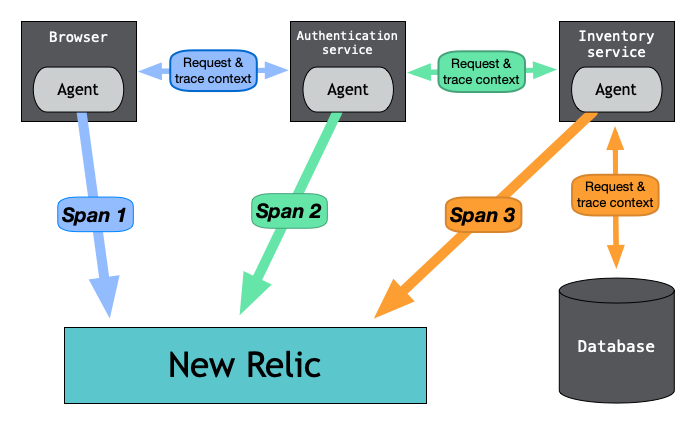

ディストリビューティッド（分散）トレーシングは、ディストリビューティッド（分散）システムを通過するサービスリクエストを追跡し、監視します。ディストリビューティッド（分散）トレーシングデータを使用すると、障害やパフォーマンスの問題をすばやく特定して修正できます。

ディストリビューティッド（分散）トレーシングは、リクエストが1つのサービスから別のサービスに送られるたびにデータを収集し、ジャーニーの各セグメントをスパンとして記録します。これらのスパンは、リクエストの各セグメントに関する重要な詳細を含んでおり、1つのトレースにまとめられます。完了したトレースには、リクエスト全体の画像が表示されます。

<figcaption>
  これは、エージェントが各サービスに費やす時間を測定するウェブトランザクションの例です。エージェントはそのタイミング情報をスパンとしてNew Relicに送信し、そこで1つのディストリビューティッド（分散）トレースに結合します。
</figcaption>

## 重要な理由

リクエストは、さまざまなマイクロサービスを通過して完了に達する可能性があります。マイクロサービスまたは機能は、複数のコンテナ、サーバーレス環境、仮想マシン、異なるクラウドプロバイダー、オンプレミス、またはこれらの任意の組み合わせに配置できます。

たとえば、実行速度の遅いリクエストが顧客のエクスペリエンスに影響する状況にあるとします。

* リクエストは複数のマイクロサービスとサーバーレス機能に分散されます。
* いくつかの異なるチームが、リクエストに関連するさまざまなサービスを所有し、監視します。
* マイクロサービスに関するパフォーマンスの問題を報告したチームはありません。

さまざまなサービスにわたるリクエスト全体のパフォーマンスを表示する方法がなければ、高いレイテンシが発生している場所と理由、および問題に対処する必要があるチームを突き止めることはほぼ不可能です。

## インストゥルメンテーション：ディストリビューティッド（分散）トレーシングの鍵

ディストリビューティッド（分散）トレーシングは、サービスのインストゥルメンテーションから開始し、分散型システム全体のデータ収集と相関を可能にします。インストゥルメンテーションとは、サービスに手動でコードを追加するか、トレースデータを自動的に追跡するエージェントをインストールするかのいずれかになります。

当社のNew Relicソリューションの多くは、多数のプログラミング言語とフレームワーク向けに、お客様のサービスを自動的にインストゥルメントします。また、オープンソースツールとオープンインストゥルメンテーションスタンダードを使用して、環境をインストゥルメントすることもできます。[Cloud Native Computing Foundation（CNCF）](https://www.cncf.io/)の一部であるOpenTelemetryは、オープンソースのインストゥルメンテーションおよびテレメトリ収集の1つの標準になりつつあります。

## New Relic UIに表示される内容

データを収集した後、データを視覚化して、サービスの依存関係、パフォーマンス、エラーや異常レイテンシなどの異常なイベントを確認できます。以下は、データを使用して実行できる操作の例です。

<table>
  <thead>
    <tr>
      <th style={{ width: "250px" }}>
        行えること
      </th>

      <th>
        説明
      </th>
    </tr>
  </thead>

  <tbody>
    <tr>
      <td>
        [異常なスパンの検知](/docs/distributed-tracing/ui-data/understand-use-distributed-tracing-ui/#anomalous-spans)
      </td>

      <td>
        代表的なパフォーマンスとの比較チャートを示した上で、一般的な行動と比較して遅いスパンは異常であるとマークされます。
      </td>
    </tr>

    <tr>
      <td>
        [エラーとログの表示](/docs/distributed-tracing/ui-data/understand-use-distributed-tracing-ui#view-your-logs)
      </td>

      <td>
        フロントエンドとバックエンドのエラーは、トレースのコンテキストで正しく表示されます。トラブルシューティングに必要なツールはすべて1か所にあります。
      </td>
    </tr>

    <tr>
      <td>
        [結果の絞り込み](/docs/distributed-tracing/ui-data/understand-use-distributed-tracing-ui/#search-for-spans)
      </td>

      <td>
        多くのデータポイントを使用してチャートを絞り込み、さまざまな方法でトレースデータを分析できます。
      </td>
    </tr>

    <tr>
      <td>
        [クエリとダッシュボードのカスタマイズ](/docs/query-your-data/nrql-new-relic-query-language/get-started/introduction-nrql-new-relics-query-language)
      </td>

      <td>
        トレースデータのカスタムクエリを作成し、カスタムデータダッシュボードを作成することもできます。
      </td>
    </tr>

    <tr>
      <td>
        [複数のアカウントにわたる表示](/docs/distributed-tracing/ui-data/understand-use-distributed-tracing-ui/#dt-launcher)
      </td>

      <td>
        New Relic Oneでは、全てのアカウントとアプリケーションにまたがるトレースの包括的なビューを表示できます。
      </td>
    </tr>

    <tr>
      <td>
        [プログラミングによるトレースのクエリ](/docs/apis/graphql-api/tutorials/query-distributed-trace-data-using-graphql-api)
      </td>

      <td>
        NerdGraph APIエクスプローラーでGraphQLを使用して、ディストリビューティッド（分散）トレーシングデータのクエリを行います。
      </td>
    </tr>
  </tbody>
</table>

## 次のステップ

検討すべきいくつかのタスクは次のとおりです。

* サービスをインストゥルメントするには、[クイックスタート](/docs/distributed-tracing/enable-configure/quick-start)をご覧ください。
* 内部で起きていることの詳細については、[ディストリビューティッド（分散）トレーシングの仕組み](/docs/distributed-tracing/concepts/how-new-relic-distributed-tracing-works)を参照してください。