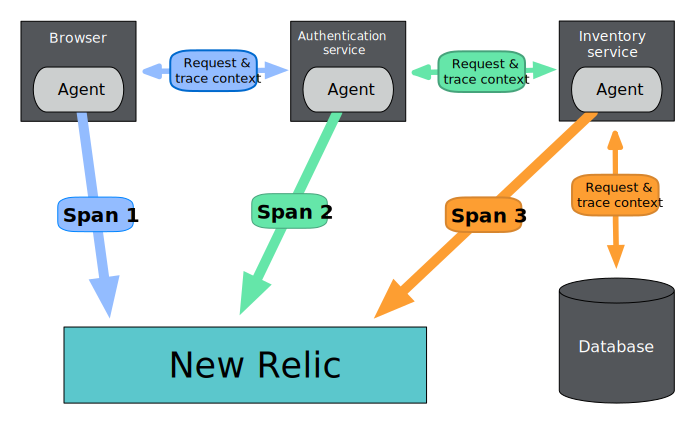

Distributed tracing tracks and observes service requests as they flow through distributed systems. With distributed tracing data, you can quickly pinpoint failures or performance issues and fix them.

Distributed tracing systems collect data as the requests go from one service to another, recording each segment of the journey as a span. These spans contain important details about each segment of the request and are combined into one trace. The completed trace gives you a picture of the entire request.

<figcaption>
  Here is an example a web transaction where agents measure the time spent in each service. Agents then send that timing information to New Relic as spans where they are combined into one distributed trace.
</figcaption>

## 重要な理由

A request might pass through various microservices to reach completion. The microservices or functions could be located in multiple containers, serverless environments, virtual machines, different cloud providers, on-premises, or any combination of these.

For example, let's say that you're in a situation where a slow-running request affects the experience of a set of customers:

* The request is distributed across multiple microservices and serverless functions.
* Several different teams own and monitor the various services that are involved in the request.
* None of the teams have reported any performance issues with their microservices.

Without a way to view the performance of the entire request across the different services, it’s nearly impossible to pinpoint where and why the high latency is occurring and which team should address the issue.

## Instrumentation: The key to distributed tracing

Distributed tracing starts with the instrumentation of your services to enable data collection and correlation across the entire distributed system. Instrumention means either manually adding code to services or installing agents that automatically track trace data.

Many of our New Relic solutions automatically instrument your services for a large number of programming languages and frameworks. You can also use open source tools and open instrumentation standards to instrument your environment. OpenTelemetry, part of the [Cloud Native Computing Foundation (CNCF)](https://www.cncf.io/), is becoming the one standard for open source instrumentation and telemetry collection.

## What you can see in the New Relic UI

After the data is collected, you can visualize it to see service dependencies, performance, and any anomalous events such as errors or unusual latency. Here are some examples of what you can do with your data:

<table>
  <thead>
    <tr>
      <th style={{ width: "250px" }}>
        What you can do
      </th>

      <th>
        説明
      </th>
    </tr>
  </thead>

  <tbody>
    <tr>
      <td>
        [Detect anomalous spans](/docs/distributed-tracing/ui-data/understand-use-distributed-tracing-ui/#anomalous-spans)
      </td>

      <td>
        Spans that are slow in comparison to typical behavior are marked as anomalous, with charts comparing them to typical performance.
      </td>
    </tr>

    <tr>
      <td>
        [See your errors and logs](/docs/distributed-tracing/ui-data/understand-use-distributed-tracing-ui#view-your-logs)
      </td>

      <td>
        Frontend and backend errors appear right in the context of your traces. Everything you need to troubleshoot is in one place.
      </td>
    </tr>

    <tr>
      <td>
        [Filter results](/docs/distributed-tracing/ui-data/understand-use-distributed-tracing-ui/#search-for-spans)
      </td>

      <td>
        You can filter charts using many data points, so you can analyze trace data in different ways.
      </td>
    </tr>

    <tr>
      <td>
        [Customize queries and dashboards](/docs/query-your-data/nrql-new-relic-query-language/get-started/introduction-nrql-new-relics-query-language)
      </td>

      <td>
        You can create custom queries of your trace data and create custom data dashboards.
      </td>
    </tr>

    <tr>
      <td>
        [See data across accounts](/docs/distributed-tracing/ui-data/understand-use-distributed-tracing-ui/#dt-launcher)
      </td>

      <td>
        See a global view of traces from across all your accounts and applications in New Relic One.
      </td>
    </tr>

    <tr>
      <td>
        [Query traces programmatically](/docs/apis/graphql-api/tutorials/query-distributed-trace-data-using-graphql-api)
      </td>

      <td>
        Query distributed trace data by using GraphQL in our NerdGraph API explorer.
      </td>
    </tr>
  </tbody>
</table>

## Next steps

Here are some tasks to consider:

* To instrument your services, check out our [Quick start](/docs/distributed-tracing/enable-configure/quick-start).
* To learn more about what's happening under the hood, see [How distributed tracing works](/docs/distributed-tracing/concepts/how-new-relic-distributed-tracing-works).