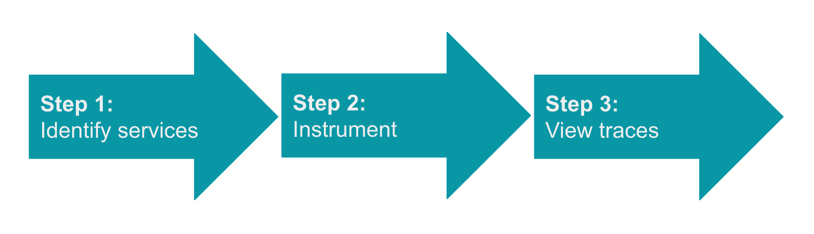
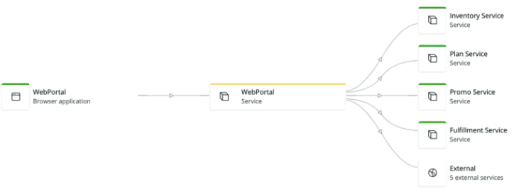

import clogo from './images/clogo.png'

import gologo from './images/gologo.png'

import javalogo from './images/javalogo.png'

import dotnetlogo from './images/dotnetlogo.png'

import nodejslogo from './images/nodejslogo.png'

import pythonlogo from './images/pythonlogo.png'

import phplogo from './images/phplogo.png'

import rubylogo from './images/rubylogo.png'

import browserlogo from './images/browserlogo.png'

import mobilelogo from './images/mobilelogo.png'

import awslambdalogo from './images/awslambdalogo.png'

import kamonlogo from './images/kamonlogo.png'

import opentelemetrylogo from './images/opentelemetrylogo.png'

import awsxraylogo from './images/awsxraylogo.png'

import zipkinlogo from './images/zipkinlogo.png'

import newreliclogo from './images/newreliclogo.png'

ディストリビューション・トレースを設定するには、以下の3つの一般的なステップを行います。

1. **Identify services:** このリクエストを完了するために使用されているエンドポイント、サービス、言語、システムを特定して書き留めます（この情報は次のステップで必要になります）。以下のような環境図があれば、それを使ってリクエストを処理するサービスのリストを作成することができます。

2. **サービスをインストゥルメントする：** トレースデータを送信できるように、指定した各サービスをインストゥルメントします。APM エージェントのように、サービスを自動的にインスツルメンテーションするツールもあれば、サービスに何らかのコードを挿入する必要があるツールもあります。インスツルメンテーションの手順については、以下のアイコンをクリックしてください。

   <TechTileGrid>
     <TechTile
       name="APM: C"
       to="/docs/distributed-tracing/enable-configure/language-agents-enable-distributed-tracing"
       icon={}
     />

     <TechTile
       name="APM: Golang"
       to="/docs/distributed-tracing/enable-configure/language-agents-enable-distributed-tracing"
       icon={}
     />

     <TechTile
       name="APM: Java"
       to="/docs/distributed-tracing/enable-configure/language-agents-enable-distributed-tracing"
       icon={}
     />

     <TechTile
       name="APM: .NET"
       to="/docs/distributed-tracing/enable-configure/language-agents-enable-distributed-tracing"
       icon={}
     />

     <TechTile
       name="APM: Node.js"
       to="/docs/distributed-tracing/enable-configure/language-agents-enable-distributed-tracing"
       icon={}
     />

     <TechTile
       name="APM: PHP"
       to="/docs/distributed-tracing/enable-configure/language-agents-enable-distributed-tracing"
       icon={}
     />

     <TechTile
       name="APM: Python"
       to="/docs/distributed-tracing/enable-configure/language-agents-enable-distributed-tracing"
       icon={}
     />

     <TechTile
       name="APM: Ruby"
       to="/docs/distributed-tracing/enable-configure/language-agents-enable-distributed-tracing"
       icon={}
     />

     <TechTile
       name="Browser monitoring"
       to="/docs/browser/new-relic-browser/browser-pro-features/browser-data-distributed-tracing"
       icon={}
     />

     <TechTile
       name="Mobile monitoring"
       to="/docs/mobile-monitoring/new-relic-mobile-android/get-started/new-relic-mobile-and-dt/"
       icon={}
     />

     <TechTile
       name="AWS Lambda Functions"
       to="/docs/serverless-function-monitoring/aws-lambda-monitoring/enable-lambda-monitoring/"
       icon={}
     />

     <TechTile
       name="Kamon"
       to="/docs/integrations/open-source-telemetry-integrations/kamon/kamon-reporter"
       icon={}
     />

     <TechTile
       name="OpenTelemetry"
       to="/docs/integrations/open-source-telemetry-integrations/opentelemetry/opentelemetry-quick-start"
       icon={}
     />

     <TechTile
       name="X-Ray"
       to="/docs/integrations/amazon-integrations/aws-integrations-list/aws-x-ray-monitoring-integration"
       icon={}
     />

     <TechTile
       name="Zipkin format: custom integration"
       to="/docs/understand-dependencies/distributed-tracing/trace-api/report-zipkin-format-traces-trace-api"
       icon={}
     />

     <TechTile
       name="New Relic format: custom integration"
       to="/docs/understand-dependencies/distributed-tracing/trace-api/report-new-relic-format-traces-trace-api"
       icon={}
     />
   </TechTileGrid>

3. **トレースの表示：** サービスをインストルメントした後、アプリケーションでトラフィックを発生させ、 [New Relic UI](https://one.newrelic.com/launcher/distributed-tracing.launcher) にアクセスしてトレースデータを確認します。