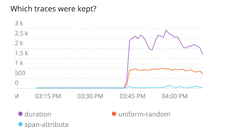

New Relic Edgeアプリでは、トレースオブザーバーの監視機能を提供しており、トレースオブザーバーのサンプリング動作についてさらに詳しく知ることができます。このオプション機能では、トレースオブザーバーが見ているトレースの量と保持しているトレースの量が表示されます。トレースオブザーバーのメトリクスは、選択したアカウントに書き込まれ、New Relic Edgeアプリやクエリービルダーで見ることができます。

モニタリングを有効にすると、トレースオブザーバーのメトリクスは、New Relic アカウント階層のどのアカウントにも書き込めるようになります。これにより、メトリクスの可視性をコントロールすることができます。モニタリングを有効にする前に、どのアカウントがトレースオブザーバーのメトリクスを受け取るかを決める必要があります。

<Callout variant="tip">
  この機能を有効にすると、若干の追加月額料金が発生します。例えば、現在の料金モデルでは、以下の条件で1.6セントの追加月額料金が発生します。

  * メトリクスの数2
  * レートです。10秒ごと
  * 属性の数2-5
</Callout>

## トレースオブザーバーの監視を有効にする [#enable-monitoring]

New Relic Edge アプリのトグルをクリックすることで、トレースオブザーバーのモニタリングをオンにすることができます。トレースオブザーバーモニタリングを有効にするとすぐに、トレースオブザーバーメトリクスがキャプチャされ、アプリ内に表示されるか、クエリビルダで表示することができます。トレースオブザーバーメトリクスは遡及されず、トレースオブザーバーモニタリングが有効な場合にのみ取得されます。

1. Go to [one.newrelic.com](one.newrelic.com) **> Apps> Your apps> New Relic Edge**.
2. アカウントセレクターを使用して、トレースオブザーバーのメトリクスに使用するアカウントを選択します。
3. 有効にするには、 **Trace observer monitoring** のトグルをクリックします。

## トレースオブザーバーの監視アカウントを切り替える [#switch-accounts]

トレースオブザーバーのメトリクスを受け取るアカウントを変更したい場合は、New Relic Edge アプリで変更することができます。

1. Go to **Apps> Your apps> New Relic Edge**.
2. アカウントセレクターを使って、トレースオブザーバーのメトリクスを書き込むアカウントに切り替えます。
3. トグルをクリックすると、トレースオブザーバーの監視が無効になります。
4. トグルをクリックすると、現在のアカウントでトレースオブザーバーのモニタリングが再び有効になります。

<Callout variant="tip">
  トレースオブザーバーの監視が有効または無効になると、変更があったアカウントに `NrAuditEvent` が書き込まれます。このイベントは、トレースオブザーバーに加えられた変更を追跡するのに役立ちます。
</Callout>

## トレース・オブザーバー・メトリクスの表示 [#view-metrics]

モニタリングアカウントにアクセスできる人は、Edgeアプリまたはクエリビルダでトレースオブザーバーのメトリクスを見ることができます。

監視アカウントにアクセスできない場合、Edgeアプリでトレースオブザーバーのメトリクスを確認したり、これらのメトリクスに対してNRQLクエリを実行したりすることはできません。以下は、アクセス権がない場合の表示内容です。


### Edgeアプリで見る [#view-in-edge]

トレースオブザーバーのモニタリングをオンにすると、トレースオブザーバーのメトリクスがEdgeアプリに追加されます。

* メインのトレースオブザーバーリストに2つのカラムが追加されました。

  * **Traces Seen**: 過去 60 分間にトレースオブザーバーが見たトレースの数。
  * **Traces Kept**: 保持されたトレースの数と割合。

* 画面の右側に新しいペインが追加されます。

  * **モニタリングアカウント**: 右ペインの上部にある、トレースオブザーバーのメトリクスが書き込まれるアカウントです。

  * **How many traces were kept?** (top chart)。 **Traces Kept** と同じ情報を表示していますが、これが時系列でどのように見えるかを示しています。サンプリングの大きさや傾向を見ることができます。

    

  * **どのような痕跡が残されていたのか？** （下の図）。どのカテゴリーのトレースが保存されたかを示します。このチャートは、さまざまなタイプのInfinite Tracingフィルターによってトレースがキャプチャされたかどうかを示しています。

    * 持続時間（スロートレース）
    * 無作為
    * スパン属性フィルター（エラーなどの指定した属性を持つトレース）

    

  ### クエリビルダでの表示

  メトリクスをプログラムで表示したい場合は、NRQLクエリの例をいくつか紹介します。これらの例は、Edgeアプリの2つのチャートを再現しています。

  **どれだけの痕跡を残したか？** （トップチャート）。

  ```
  FROM Metric SELECT sum(monitoring.trace.opened.session.count) AS 'Traces seen', sum(monitoring.trace.sampled.count) AS 'Traces kept' WHERE account = <var>INSERT_THE_MONITORING_ACCOUNT_ID</var> TIMESERIES
  ```

  **どのような痕跡を残したのか？** （下の図）。

  ```
  FROM Metric SELECT sum(monitoring.trace.sampled.count) WHERE account = <var>INSERT_THE_MONITORING_ACCOUNT_ID</var> AND newRelic.traceFilter.type IS NOT NULL FACET newRelic.traceFilter.type LIMIT 3 TIMESERIES
  ```