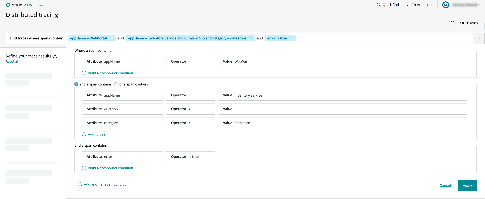
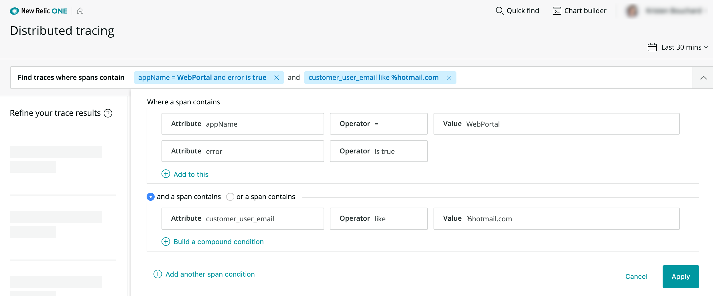
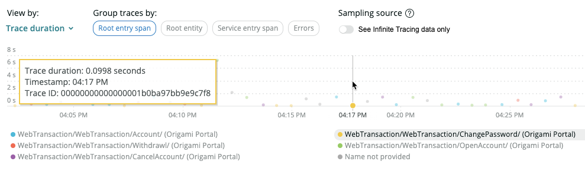
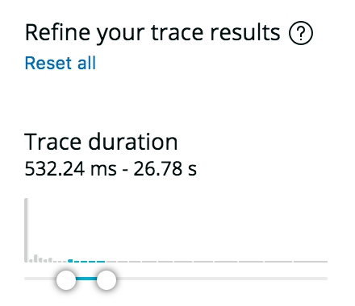
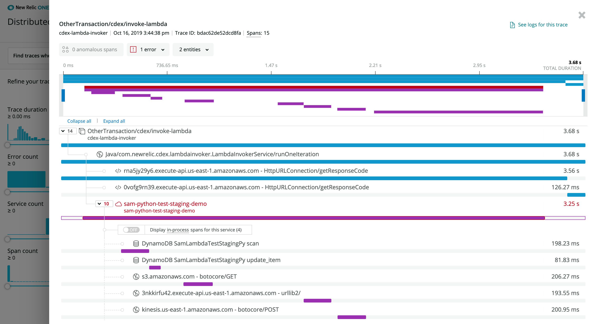
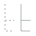
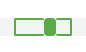
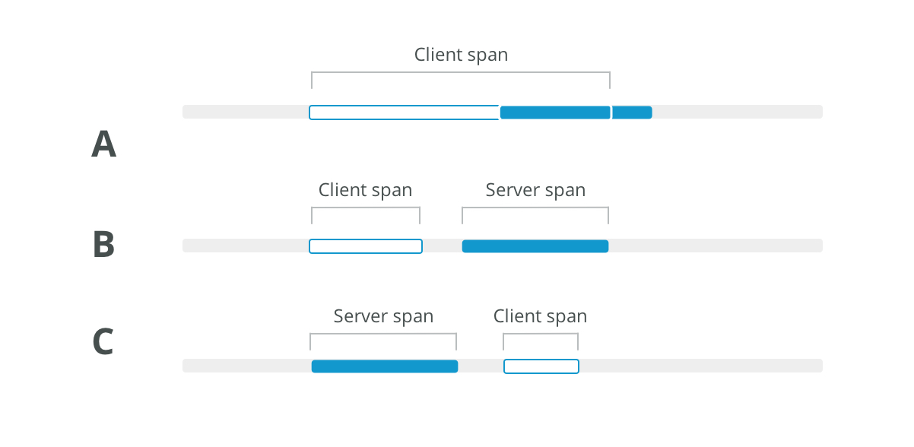

[Distributed tracing](/docs/apm/distributed-tracing/getting-started/introduction-distributed-tracing) helps you monitor and analyze the behavior of your distributed system. After you enable distributed tracing, you can use our UI tools to search for traces and analyze them.

For example, let's say you are an engineer troubleshooting errors in a complex transaction spanning many services. Here's what you can do in our UI:

1. Open the [distributed tracing UI page](#open-dt-ui).
2. [Sort through your traces](#search-for-spans) using a filter to find that specific request and show only traces containing errors.
3. On the [trace details page](#trace-details), you review the span along the request route that originated the error.
4. Noting the error class and message, navigate to the service from its span in the trace so you can see that the error is occurring at a high rate.

Read on to explore the options in the distributed tracing UI.

## Open the distributed tracing UI [#open-dt-ui]

Here's how you can access the distributed tracing UI, depending on the type of search you want to do:

<CollapserGroup>
  <Collapser
    id="entity-explorer"
    title="View traces for a specific service"
  >
    The **New Relic Explorer** and **APM** are two menu options that help you navigate to a specific service so you can see traces that include that service.

    1. **[one.newrelic.com](https://one.newrelic.com/)**に移動します。
    2. Click **Explorer** or **APM** in the top menu bar.
    3. Filter to the service you enabled for distributed tracing by typing the service name, and then press Enter.
    4. 左側のナビゲーションの**モニター**セクションで、**ディストリビューティッド（分散）トレーシング**をクリックします。
  </Collapser>

  <Collapser
    id="dt-launcher"
    title="View traces across all accounts"
  >
    If you want to view traces from across all accounts you have access to, go to [one.newrelic.com](https://one.newrelic.com/), click **Browse data**, and then **Traces**.

    <Callout variant="tip">
      If you don't have access to accounts for some services in a trace, we'll [obfuscate some details for those services](/docs/understand-dependencies/distributed-tracing/troubleshooting/missing-trace-data#account-access).
    </Callout>
  </Collapser>
</CollapserGroup>

## Find traces that are useful [#search-for-spans]

We have a variety of tools to help you find traces and spans so you can resolve issues. The opening distributed tracing page is populated with a default list of traces, and you can quickly refine this list using these tools:

* [Query bar](#query-bar)
* [Trace groups](#trace-groups)
* [Scatter plot chart](#scatter-plot)
* [Filters](#left-pane-filters)
* [Interactive histograms](#histograms)

<Callout variant="tip">
  In addition to these tools, you can also use other options mentioned in [Query distributed trace data](/docs/apm/distributed-tracing/ui-data/example-insights-queries-distributed-trace-data).
</Callout>

### Filter using the query bar [#query-bar]

The **Find traces** query bar is a quick way to narrow your search for traces. You can either start typing in the query bar or use the dropdown to create a compound query.

Query returns are based on [span](/docs/using-new-relic/welcome-new-relic/getting-started/glossary#span) attributes, not on trace attributes. You define spans that have certain criteria, and the search displays traces that contain those spans.

If you use a multi-attribute filter, it is affected by first attribute selected. Distributed tracing reports on two types of data: transaction events and spans. When you select an attribute in the filter, the data type that attribute is attached to dictates the available attributes. For example, if you filter on an attribute that is attached to a transaction event, only transaction event attributes are available when you attempt to add filter on additional attribute values.

Queries for traces are similar to [NRQL](/docs/insights/nrql-new-relic-query-language/using-nrql/introduction-nrql) (our query language). Here are the main exceptions:

* String values don't require quote marks (for example, you can use either `appName = MyApp` or `appName = 'MyApp'`)
* The `like` operator doesn’t require `%` (for example, you can use either `appName like product` or `appName like %product%`).

<Callout variant="tip">
  Some queries that return a large number of results may return false positives. The trace list limits these incorrect results to 10% of the returned results. False positives may also result in histogram chart results that are not displayed in the trace list.
</Callout>

Here are two query bar examples:

<CollapserGroup>
  <Collapser
    id="query-example-1"
    title="Find traces that touch two services"
  >
    The query in the image below finds traces that:

    1. Pass through both WebPortal and Inventory Service applications

    2. Have an Inventory Service datastore call that takes longer than 500 ms

    3. Contains an error in any [span](/docs/using-new-relic/welcome-new-relic/getting-started/glossary#span).

       

       <figcaption>
         Go to **[one.newrelic.com](http://one.newrelic.com) > Apps > Distributed tracing**
       </figcaption>
  </Collapser>

  <Collapser
    id="query-example-2"
    title={<>Find error spans using the <InlineCode>like</InlineCode> operator</>}
  >
    The query in the image below finds traces that:

    1. Contain spans that pass through the WebPortal application and where an error occurred on any span in the WebPortal application

    2. Contain spans where the `customer_user_email` attribute contains a value ending with `hotmail.com` anywhere in the trace.

       

       <figcaption>
         Go to **[one.newrelic.com](http://one.newrelic.com) > Apps > Distributed tracing**
       </figcaption>
  </Collapser>
</CollapserGroup>

### Trace groups [#trace-groups]

The default view of distributed tracing shows traces grouped by the same root entry span. In other words, traces are grouped by the span where New Relic began recording the request. You can slide the toggle **Group similar traces** to turn this on and off.

With trace groups you get a high-level view of traces so you can understand request behavior for groups of similar traces. This helps you understand dips or spikes in trace count, duration, and errors.

When you click on one of the trace groups, you get all the standard details in context of the specific trace group you selected.

### Filter using the scatter plot [#scatter-plot]

The trace scatter plot is a quick way to search for outlying traces. This is available on the opening page of distributed tracing if you turn off the **Group similar traces** toggle at the top of the page.

In the scatter plot, you can move the cursor across the chart to view trace details and you can click individual points to get details:

Here's how you can control what's displayed in the scatter plot:

1. In the **View by** dropdown, select the duration type:

   * **Back-end duration**
   * **Root span duration**
   * **Trace duration**

2. In **Group traces by**, select one of these options:

   * **Errors**: Group by whether or not traces contain errors.
   * **Root service**: Group by the name of the first service in traces. In a trace where Service A calls Service B and Service B calls Service C, the root service would be Service A.
   * **Root entry span**: Group by the root transaction, which is the root service's endpoint. In a trace where Service A calls Service B and Service B calls Service C, the root entry span is Service A's endpoint. For example: "Service A - GET /user/%".
   * **Service entry span**: Group by the span name of the service currently being viewed in APM. For example, for a trace where Service A calls Service B and Service B calls Service C, if you're viewing Service B in APM and select this grouping, the traces will be represented by their Service B span names. If a service has multiple spans in a trace, this grouping option will use that service's first entry point.

### Filters [#left-pane-filters]

In the left pane, you can filter traces by multi-span traces, specific entities, or error types. Once you select a filter, only traces associated with that specific type are displayed. This makes it much easier to view the traces you're most interested in so you can find and fix issues faster.

### Trace histograms [#histograms]

The histogram charts give you a quick understanding of trace distribution for important values, such as duration. Click **Show filters** at the bottom of the left pane to display the histograms. When you move the histogram sliders, they change the data displayed in the scatterplot or the trace group charts.

For example, you can drag the **Trace duration** chart slider to show only traces over 500 ms, as shown in the histogram example below.

<Callout variant="important">
  Some queries that produce many results may result in false positives in histograms. This could manifest as histograms showing trace results that are not in the trace list.
</Callout>

## Trace details UI page [#trace-details]

When you select a trace from the trace list, you see that trace's timeline and spans:

<figcaption>
  **[one.newrelic.com](https://one.newrelic.com) > APM > (select an application) > Monitor > Distributed tracing > (select a trace) > (select a span)**: See the spans in a trace. Examine individual span details and see notifications for spans with anomalous behavior.
</figcaption>

The UI indicates some span properties with icons:

<table id="span-types">
  <thead>
    <tr>
      <th style={{ width: "130px" }}>
        Span property
      </th>

      <th style={{ width: "110px" }}>
        Indicator
      </th>

      <th>
        説明
      </th>
    </tr>
  </thead>

  <tbody>
    <tr>
      <td>
        Service
      </td>

      <td>
        
      </td>

      <td>
        This icon represents a span that's a service's entry point.
      </td>
    </tr>

    <tr id="in-process">
      <td>
        In-process
      </td>

      <td>
        
      </td>

      <td>
        This icon represents an [in-process span](#in-process), which is a span that takes place within a process (as opposed to a cross-process span). Examples: middleware instrumentation, user-created spans.
      </td>
    </tr>

    <tr>
      <td>
        データストア
      </td>

      <td>
        
      </td>

      <td>
        This icon represents a span call to a datastore.
      </td>
    </tr>

    <tr>
      <td>
        External
      </td>

      <td>
        
      </td>

      <td>
        This icon represents category representing a call to an external service made via HTTP.
      </td>
    </tr>

    <tr>
      <td>
        Browser app
      </td>

      <td>
        
      </td>

      <td>
        This icon represents a [browser application span](/docs/browser/new-relic-browser/browser-pro-features/browser-data-distributed-tracing).
      </td>
    </tr>

    <tr>
      <td>
        Lambda
      </td>

      <td>
        
      </td>

      <td>
        This icon represents a span from a [Lambda function](/docs/serverless-function-monitoring/aws-lambda-monitoring/get-started/introduction-new-relic-monitoring-aws-lambda).
      </td>
    </tr>
  </tbody>
</table>

Some spans will have additional indicators:

<table id="span-types-table">
  <thead>
    <tr>
      <th style={{ width: "130px" }}>
        Span property
      </th>

      <th style={{ width: "110px" }}>
        Indicator
      </th>

      <th>
        説明
      </th>
    </tr>
  </thead>

  <tbody>
    <tr id="connecting-lines">
      <td>
        Type of connection
      </td>

      <td>
        
      </td>

      <td>
        Solid lines indicate a direct parent-child relationship; in other words, one process or function directly calling another. A dotted line indicates a non-direct relationship. For more on relationships between spans, see [Trace structure](/docs/understand-dependencies/distributed-tracing/get-started/how-new-relic-distributed-tracing-works#trace-structure).
      </td>
    </tr>

    <tr>
      <td>
        エラー
      </td>

      <td>
        
      </td>

      <td>
        A span with an error. See [How to understand span errors](#error-tips).
      </td>
    </tr>

    <tr>
      <td>
        Anomalous
      </td>

      <td>
        
      </td>

      <td>
        This icon represents the detection of an [anomalous span](#anomalous-spans).
      </td>
    </tr>

    <tr>
      <td>
        Orphaned spans
      </td>

      <td>
        
      </td>

      <td>
        Some spans may be "orphaned," or separated, from the trace. These spans will appear at the bottom of the trace. For more details, see [Fragmented traces](#fragmented-traces).
      </td>
    </tr>

    <tr>
      <td>
        Multiple app names
      </td>

      <td>
        
      </td>

      <td>
        When beside a span name, this represents an entity that has had [multiple app names set](/docs/agents/manage-apm-agents/app-naming/use-multiple-names-app). Select this to see all app names it reports to. To search trace data by alternate app names, use the `appName` attribute.
      </td>
    </tr>

    <tr>
      <td>
        Client/server time difference
      </td>

      <td>
        
      </td>

      <td>
        If a span's duration indicator is not completely colored in (like in this example), it means that there is a time discrepancy between the server-side duration and the client-side duration for that activity. For details on this, see [Client/server time difference](#client-server-time).
      </td>
    </tr>
  </tbody>
</table>

For more on the trace structure and how span properties are determined, see [Trace structure](/docs/understand-dependencies/distributed-tracing/get-started/how-new-relic-distributed-tracing-works#trace-structure).

## Span details pane [#span-details]

When you select a span, a pane opens up with span details. These details can be helpful for troubleshooting performance issues. Details include:

* Performance charts
* Span [attributes](/docs/using-new-relic/welcome-new-relic/get-started/glossary#attribute)
* The span's data source
* [Anomalous span details](#anomalous-spans)
* The [span's full name](#prettified-span-names)

What a span displays is based on its span type. For example, a datastore span's `name` attribute will contain the datastore query.

## View related logs [#view-your-logs]

If you are using our [logs in context](/docs/logs/enable-log-management-new-relic/configure-logs-context/configure-logs-context-apm-agents) feature together with our [log management](/docs/logs/log-management/get-started/get-started-log-management), you can see any logs that are linked to your traces:

1. Go to the trace details page by clicking on a trace.
2. Click **See logs** in the upper-right corner.
3. For details related to an individual log message, click directly on the message.

## Additional UI details [#rules-limits]

Here are some additional distributed tracing UI details, rules, and limits:

<CollapserGroup>
  <Collapser
    id="error-tips"
    title="How to understand span errors"
  >
    Span-level errors show you where errors originated in a process, how they bubbled up, and where they were handled. Every span that ends with an exception is shown with an error in the UI and contributes to the total error count for that trace.

    Here are some general tips about understanding span errors:

    * Spans with errors are highlighted red in the distributed tracing UI. You can see more information on the **Error Details** pane for each span.

    * All spans that exit with errors are counted in the span error count.

    * When multiple errors occur on the same span, only one is written to the span in this order of precedence:

      * A `noticeError`
      * The most recent span exception

      This table describes how different span errors are handled:

      <table>
        <thead>
          <tr>
            <th style={{ width: "200px" }}>
              Error type
            </th>

            <th>
              説明
            </th>
          </tr>
        </thead>

        <tbody>
          <tr>
            <td>
              Spans ending in exceptions
            </td>

            <td>
              An exception that leaves the boundary of a span results in an error on that span and on any ancestor spans that also exit with an error, until the exception is caught or exits the transaction. You can see if an exception is caught in an ancestor span.
            </td>
          </tr>

          <tr>
            <td>
              Notice errors
            </td>

            <td>
              Errors noticed by calls to the agent `noticeError` API or by the automatic agent instrumentation are attached to the currently executing span.
            </td>
          </tr>

          <tr>
            <td>
              Response code errors
            </td>

            <td>
              Response code errors are attached to the associated span, such as:

              * Client span: External transactions prefixed with `http` or `db`.

              * Entry span: In the case of a transaction ending in a response code error.

                The response code for these spans is captured as an attribute `httpResponseCode` and attached to that span.
            </td>
          </tr>
        </tbody>
      </table>
  </Collapser>

  <Collapser
    id="anomalous-spans"
    title="Anomalous spans"
  >
    If a span is displayed as anomalous in the UI, it means that the following are both true:

    * The span is more than two standard deviations slower than the average of all spans with the same name from the same service over the last six hours.
    * The span's duration is more than 10% of the trace's duration.
  </Collapser>

  <Collapser
    id="client-server-time"
    title="Client span duration: time differences between client and server spans"
  >
    When a process calls another process, and both processes are instrumented by New Relic, the trace contains both a client-side representation of the call and a server-side representation. The [client span](/docs/understand-dependencies/distributed-tracing/get-started/how-new-relic-distributed-tracing-works#trace-structure) (calling process) can have time-related differences when compared to the server span (called process). These differences could be due to:

    * Clock skew, due to system clock time differences

    * Differences in duration, due to things like network latency or DNS resolution delay

      The UI shows these time-related differences by displaying an outline of the client span in the same space as the server span. This span represents the duration of the client span.

      It isn't possible to determine every factor contributing to these time-related discrepancies, but here are some common span patterns and tips for understanding them:

      

    1. When a client span is longer than the server span, this could be due to latency in a number of areas, such as: network time, queue time, DNS resolution time, or from a load balancer that we cannot see.
    2. When a client span starts and ends before a server span begins, this could be due to clock skew, or due to the server doing asynchronous work that continues after sending the response.
    3. When a client span starts after a server span, this is most likely clock skew.
  </Collapser>

  <Collapser
    id="fragmented-traces"
    title="Fragmented traces"
  >
    Fragmented traces are traces with missing spans. When a span is missing or has invalid parent span IDs, its children spans become separated from the rest of the trace, which we refer to as "orphaned." Orphaned spans appear at the bottom of the trace, and they will lack connecting lines to the rest of the trace. Types of orphaned span properties indicated in the UI:

    * **No root span.** Missing the root span, which is the first operation in the request. When this happens, the span with the earliest timestamp is displayed as the root.

    * **Orphaned span.** A single span with a missing parent span. This could be due to the parent span having an ID that doesn't match its child span.

    * **Orphaned trace fragment.** A group of connected spans where the first span in the group is an orphan span.

      This can happen for a number of reasons, including:

    * **Collection limits.** Some high-throughput applications may exceed collection limits (for example, [APM agent collection limits](#1k-limit), or API limits). When this happens, it may result in traces having missing spans. One way to remedy this is to turn off some reporting, so that the limit is not reached.

    * **Incorrect instrumentation.** If an application is instrumented incorrectly, it won't pass trace context correctly and this will result in fragmented traces. To remedy this, examine the data source that is generating orphan spans to ensure instrumentation is done correctly. To discover a span's data source, select it and examine its span details.

    * **Spans still arriving**. If some parent spans haven't been collected yet, this can result in temporary gaps until the entire trace has reported.

    * **UI display limits.** Orphaned spans may result if a trace exceeds the [10K span display limit](#1k-limit).
  </Collapser>

  <Collapser
    id="account-access"
    title="Trace details obfuscated based on account access"
  >
    If you don’t have access to the New Relic accounts that monitor other services, some of the span and service details will be obfuscated in the UI. Obfuscation can include:

    * Span name concealed by asterisks

    * Service name replaced with New Relic account ID and app ID

      For more information on the factors affecting your access to accounts, see [Account access](/docs/accounts/accounts-billing/account-structure/factors-affecting-access-features-data/#account-access).
  </Collapser>

  <Collapser
    id="1k-limit"
    title="Span limits and sampling"
  >
    See [Sampling](/docs/apm/distributed-tracing/getting-started/how-new-relic-distributed-tracing-works#sampling).
  </Collapser>

  <Collapser
    id="prettified-span-names"
    title="Incomplete span names in waterfall view"
  >
    When viewing the span waterfall, span names may be displayed in an incomplete form that is more human-readable than the complete span name. To find the complete name, select that span and look for the **Full span name**. Knowing the complete name can be valuable for querying that data with NRQL.
  </Collapser>

  <Collapser
    id="span-counts"
    title="Missing spans and span/service count discrepancies"
  >
    A trace may sometimes have (or seem to have) missing spans or services. This can manifest as a discrepancy between the count of a trace's spans or services displayed in the [trace list](#trace-list) and the count displayed on the [trace details](#trace-details) page.

    Reasons for missing spans and count discrepancies include:

    * An APM agent may have hit its [1K span collection limit](#1k-limit).

    * A span may be initially counted but not make it into a trace display, for reasons such as network latency or a query issue.

    * The UI may have hit its [10K span display limit](#1k-limit).

      All spans collected, including those not displayed, can be [queried with NRQL](/docs/apm/distributed-tracing/ui-data/example-insights-queries-distributed-trace-data).
  </Collapser>
</CollapserGroup>