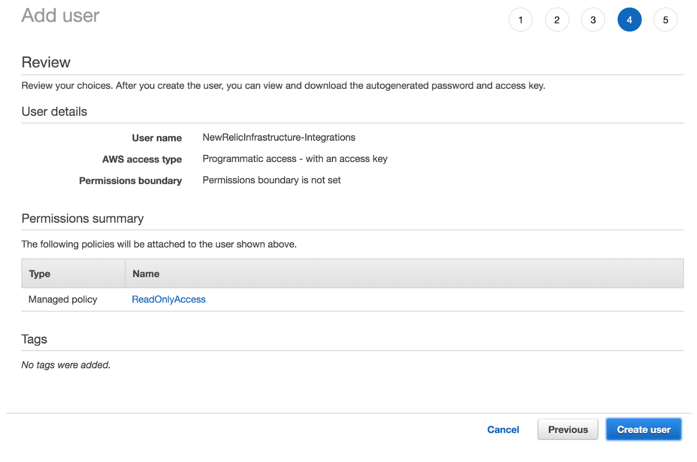

AWS GovCloud (US) [リージョンは、米国（連邦、州、地方機関）、教育機関、およびサポートするエコシステムの特定の規制ニーズに対応するために設計されています。このリージョンは、機密データや規制対象のワークロードをクラウドでホスティングするために設計された分離されたAWSリージョンで、お客様が米国政府のコンプライアンス要件をサポートするのに役立ちます。 ](https://aws.amazon.com/govcloud-us/)[利用可能なAWSサービスのセット](https://aws.amazon.com/govcloud-us/details/) は、AWSエコシステムのサブセットです。

New Relic は、お客様の最も重要なサービスを GovCloud 上に展開する自信を与え、 [New Relic One](/docs/new-relic-one/use-new-relic-one/get-started/introduction-new-relic-one) からお客様のエコシステム全体を監視・観測することを可能にします。

<Callout variant="important">
  AWS CloudWatchのメトリックストリーム機能は、GovCloudのリージョンでは利用できません。
</Callout>

## 要件 [#requirements]

要件は、以下のとおりです。

* GovCloud を接続する前に、New Relic に接続した AWS アカウントを [しておく必要があります。](/docs/integrations/amazon-integrations/get-started/connect-aws-infrastructure)

* 

* [当社の ](/docs/integrations/amazon-integrations/get-started/connect-aws-infrastructure)[AWS Lambda monitoring](/docs/serverless-function-monitoring/aws-lambda-monitoring/get-started/introduction-new-relic-monitoring-aws-lambda) を使用している場合 : 当社の `newrelic-log-ingestion` は、 [AWS Serverless Application Repository](https://aws.amazon.com/serverless/serverlessrepo/) for AWS GovCloud には配備されていないので、手動でインストールする必要があります。手順については、 [Enable Lambda monitoring](/docs/serverless-function-monitoring/aws-lambda-monitoring/get-started/enable-new-relic-monitoring-aws-lambda#connect-aws) を参照してください。

* GovCloudでサポートされているAWSの統合。

  * [ALB/NLB](/docs/integrations/amazon-integrations/aws-integrations-list/aws-albnlb-monitoring-integration)
  * [APIゲートウェイ](/docs/integrations/amazon-integrations/aws-integrations-list/aws-api-gateway-monitoring-integration)
  * [オートスケーリング](/docs/integrations/amazon-integrations/aws-integrations-list/aws-auto-scaling-monitoring-integration)
  * [CloudTrail](/docs/integrations/amazon-integrations/aws-integrations-list/aws-cloudtrail-monitoring-integration)
  * [ダイレクトコネクト](/docs/integrations/amazon-integrations/aws-integrations-list/aws-direct-connect-monitoring-integration)
  * [DynamoDB](/docs/integrations/amazon-integrations/aws-integrations-list/aws-dynamodb-monitoring-integration)
  * [EBS](/docs/integrations/amazon-integrations/aws-integrations-list/aws-ebs-monitoring-integration)
  * [EC2](/docs/integrations/amazon-integrations/aws-integrations-list/aws-ec2-monitoring-integration)
  * [Elasticsearch](/docs/integrations/amazon-integrations/aws-integrations-list/aws-elasticsearch-monitoring-integration)
  * [ELB(クラシック)](/docs/integrations/amazon-integrations/aws-integrations-list/aws-elb-classic-monitoring-integration)
  * [EMR](/docs/integrations/amazon-integrations/aws-integrations-list/aws-emr-monitoring-integration)
  * [IAM](/docs/integrations/amazon-integrations/aws-integrations-list/aws-iam-monitoring-integration)
  * [ラムダ](/docs/integrations/amazon-integrations/aws-integrations-list/aws-lambda-monitoring-integration)
  * [RDS](/docs/integrations/amazon-integrations/aws-integrations-list/aws-rds-monitoring-integration)
  * [Redshift](/docs/integrations/amazon-integrations/aws-integrations-list/aws-redshift-integration)
  * [ルート53](/docs/integrations/amazon-integrations/aws-integrations-list/aws-route-53-monitoring-integration)
  * [S3](/docs/integrations/amazon-integrations/aws-integrations-list/aws-s3-monitoring-integration)
  * [SNS](/docs/integrations/amazon-integrations/aws-integrations-list/aws-sns-monitoring-integration)
  * [SQS](/docs/integrations/amazon-integrations/aws-integrations-list/aws-sqs-monitoring-integration)
  * [ステップ機能](/docs/integrations/amazon-integrations/aws-integrations-list/aws-step-functions-monitoring-integration)

## AWS GovCloudとNew Relicの接続

New Relic AWSインテグレーションでAmazonデータの受信を開始するには、AmazonアカウントをNew Relicに接続します。

1. Obtain [your credentials](#govcloud-credentials).
2. **[one.newrelic.com](https://one.newrelic.com) > インフラストラクチャー> GovCloud** に移動します。
3. **Add AWS GovCloud account** をクリックします。
4. AWSアカウントに名前を付け、アカウントに接続するための認証情報を入力し、 **Submit** をクリックします。
5. New Relic インフラストラクチャ インテグレーションで監視する Amazon Web サービスを選択し、 **Save** をクリックします。

## New Relic用のGovCloudクレデンシャルを取得する方法 [#govcloud-credentials]

1. [IAMコンソール](https://console.amazonaws-us-gov.com/iam/home#/users) から、 **Add user** をクリックします。

2. For **User name**, type **NewRelicInfrastructure-Integrations**.For **Select AWS access type**, select as **Programmatic access**.

   

   <figcaption>
     **AWS IAMコンソール> ユーザーの追加**: **NewRelicInfrastructure-Integrations** をユーザーとして追加します。
   </figcaption>

3. ポリシーを添付します。 **ReadOnlyAccess** を検索し、 **ReadOnlyAccess** という名前のポリシーのチェックボックスを選択し、 **「Next」をクリックします。Tags** をクリックします（タグの追加はオプション）。また、 [独自のマネージドポリシー](/docs/integrations/amazon-integrations/getting-started/integrations-managed-policies) を作成し、監視したいAWSサービスに応じてNew Relicに付与する権限を制限することもできます。

   

   <figcaption>
     **AWS IAMコンソール> Add user> Set permissions**: select **ReadOnlyAccess**.
   </figcaption>

4. **Tags** ページで、 **Next をクリックします。レビュー** を行います。ユーザーの詳細サマリーを確認し、 **をクリックします。 ユーザーの作成**

   

   <figcaption>
     **AWS IAMコンソール> Add user> Set permissions> Tags> Review**: 新しいユーザー情報が正確であることを確認します。
   </figcaption>

5. ユーザーが正常に作成されるはずです。 **Download .csv** ボタンをクリックしてユーザーのセキュリティ認証情報をダウンロードし、 **Close** をクリックします。