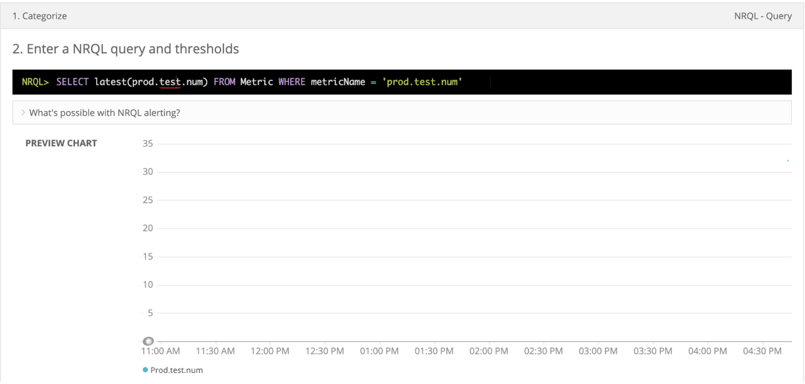

StatsD の統合により、 [StatsD](https://github.com/statsd/statsd)-format data を New Relic に簡単に取り込むことができます。また、データに任意のタグ（キーと値のペア）を追加することもできます。メトリクスが New Relic に取り込まれると、 [データを照会したり、](#find-use-data) カスタムチャートやダッシュボードを作成することができます。

StatsDインテグレーションを試してみませんか？ [New Relicアカウントを作成してください](https://newrelic.com/signup) 無料でご利用いただけます。クレジットカードは必要ありません。

## 要件

この統合では、データを取り込むために、 [Metric API](/docs/data-ingest-apis/get-data-new-relic/metric-api/introduction-metric-api) と [Event API](/docs/insights/insights-data-sources/custom-data/introduction-event-api) を使用しています。これらのAPIを使用するには、 [ライセンスキー](/docs/apis/intro-apis/new-relic-api-keys/#ingest-license-key) が必要です。

この統合では、Metric API [の要件とデータ制限](/docs/data-ingest-apis/get-data-new-relic/metric-api/metric-api-limits-restricted-attributes) を遵守しています。デフォルトのレート制限は100,000データポイント/分（DPM）です。メトリクスの欠落や100K DPM以上の送信があると思われる場合は、 [Request data changes](/docs/data-ingest-apis/get-data-new-relic/metric-api/metric-api-limits-restricted-attributes#accounts-asterisk) を参照してください。お客様のアカウントがレート制限にかかっているかどうかを確認するには、 [`NrIntegrationError` イベント](/docs/telemetry-data-platform/manage-data/nrintegrationerror) の以下の NRQL クエリを実行してください。

```
SELECT count(*) FROM NrIntegrationError 
  WHERE newRelicFeature ='Metrics' 
  FACET category, message
  LIMIT 100 since 1 day ago
```

## インストール

ここでは、標準的なインストールの方法を説明します。KubernetesでStatsDを動作させたい場合は、 [Kubernetes install](#kubernetes) をご覧ください。

StatsDインテグレーションをインストールするには、以下のコマンドを実行し、 [New RelicアカウントID](/docs/accounts/install-new-relic/account-setup/account-id) と [New Relicライセンスキー](#requirements) を含めます。これにより、 `gostatsd` が使用するTOML設定ファイルが生成されます。

```
docker run \
  -d --restart unless-stopped \
  --name newrelic-statsd \
  -h $(hostname) \
  -e NR_ACCOUNT_ID=<var>YOUR_ACCOUNT_ID</var> \
  -e NR_API_KEY=<var>NEW_RELIC_LICENSE_KEY</var> \
  -p 8125:8125/udp \
  newrelic/nri-statsd:2.0.0
```

お客様のアカウントが、EUのデータセンター地域 [](/docs/using-new-relic/welcome-new-relic/get-started/introduction-eu-region-data-center)にある場合は、上記のコマンドに以下を追加してください。

```
-e NR_EU_REGION=true \
```

インストール後は

* オプションを行う [追加設定](#configure)
* [指標の定義](#metric-format)
* [カスタムタグの追加](#add-tags) データに
* [アラートの作成](#alerts)

### Kubernetesへのインストール [#kubernetes]

ここでは、デプロイメントとサービスオブジェクトのためのKubernetesマニフェストの例を紹介します。

<CollapserGroup>
  <Collapser
    id="k8s-manifest-examples"
    title="Kubernetesのマニフェストの例"
  >
    以下は、Kubernetes環境にStatsDを導入し、 `newrelic-statsd` という名前のStatsDサービスを作成するためのKubernetesマニフェストの例です。 [のアカウントID](/docs/accounts/install-new-relic/account-setup/account-id) と [のライセンスキー](/docs/apis/intro-apis/new-relic-api-keys/#ingest-license-key) を入れる必要があります。

    **deployment.yml**:

    ```
    apiVersion: apps/v1
    kind: Deployment
    metadata:
      name: newrelic-statsd
      namespace: tooling
      labels:
        app: newrelic-statsd
    spec:
      selector:
        matchLabels:
          app: newrelic-statsd
      replicas: 2
      revisionHistoryLimit: 2
      template:
        metadata:
          labels:
            app: newrelic-statsd
        spec:
          containers:
          - name: newrelic-statsd
            image: newrelic/nri-statsd:2.0.0
            env:
            - name: NR_ACCOUNT_ID
              value: "<var>NEW_RELIC_ACCOUNT_ID</var>"
            - name: NR_API_KEY
              value: "<var>NEW_RELIC_LICENSE_KEY</var>"
    ```

    **service.yml**:

    ```
    apiVersion: v1
    kind: Service
    metadata:
      name: newrelic-statsd
      namespace: tooling
      labels:
        app: newrelic-statsd
    spec:
      type: ClusterIP
      ports:
      - name: newrelic-statsd
        port: 80
        targetPort: 8125
        protocol: UDP
      selector:
        app: newrelic-statsd
    ```

    設定の詳細については、 [Kubernetes の設定](#k8s-config) を参照してください。
  </Collapser>
</CollapserGroup>

## 設定

[インストール手順](#install) で、環境変数を指定して `nri-statsd` を実行すると、TOML 設定ファイルが生成されます。さらに、これらの設定オプションを設定することができます。

<table>
  <thead>
    <tr>
      <th style={{ width: "200px" }}>
        設定オプション
      </th>

      <th>
        説明
      </th>
    </tr>
  </thead>

  <tbody>
    <tr>
      <td>
        `期限切れのインターバル`

        _文字列_
      </td>

      <td>
        この時間内にメトリックが更新されない場合、そのメトリックの報告を停止します。デフォルトは `5m` です。

        フラッシュインターバルの間に値が更新された場合にのみメトリクスを送信したい場合は、 `1ms` に設定します。メトリクスを失効させない場合は、 `0` に設定します。
      </td>
    </tr>

    <tr>
      <td>
        `パーセンテージスレッショルド`

        _整数のリスト_
      </td>

      <td>
        メトリクスの集約に使用するパーセンタイルを指定します。デフォルト： `90`.
      </td>
    </tr>

    <tr>
      <td>
        `metrics-addr`

        _文字列_
      </td>

      <td>
        メトリクスをリッスンするアドレスを示します。デフォルト： `:8125`.
      </td>
    </tr>
  </tbody>
</table>

<Callout variant="tip">
  StatsD統合を使用してFedRAMPコンプライアンスを確保するには、カスタム構成で以下のエンドポイントを定義する必要があります。

  ```
  address = 'https://gov-insights-collector.newrelic.com/v1/accounts/  <var>$NR_ACCOUNT_ID</var>/events'
  ```

  ```
  address-metrics = 'https://gov-infra-api.newrelic.com/metric/v1'
  ```
</Callout>

ここでは、デフォルトの設定を上書きして設定をカスタマイズする例を紹介します。

<CollapserGroup>
  <Collapser
    id="config-example"
    title="カスタム設定の例"
  >
    ```
    # Specify after how long do we expire metrics, default:5m
    expiry-interval = '1ms'

    # percent-threshold specify a list of percentiles for metrics aggregation, default:90
    percent-threshold = [90, 99]

    backends='newrelic'
    [newrelic]
    # flush types supported: metrics,  insights, infra
    flush-type = 'metrics'
    transport = 'default'
    address = 'https://insights-collector.newrelic.com/v1/accounts/$<var>NR_ACCOUNT_ID</var>/events'
    address-metrics = 'https://metric-api.newrelic.com/metric/v1'
    api-key = '<var>NEW_RELIC_LICENSE_KEY</var>'
    ```

    **タイマーサブメトリクスの無効化**

    デフォルトでは、 `nri_statsd` タイマーメトリクスについて、標準偏差、平均値、中央値、合計値、フラッシュ間隔の下限値、上限値を計算します。これらのメトリクスを無効にしたい場合は、 `disabled-sub-metrics` 設定セクションを追加し、無効にしたいメトリクスに対して `true` を設定することで可能になります。以下にその例を示します。

    ```
    # disabled-sub-metrics configuration section allows disabling timer sub-metrics
    [disabled-sub-metrics]
    # Regular metrics
    count=false
    count-per-second=false
    mean=false
    median=false
    lower=false
    upper=false
    stddev=false
    sum=false
    sum-squares=false

    # Percentile metrics
    count-pct=false
    mean-pct=false
    sum-pct=false
    sum-squares-pct=false
    lower-pct=false
    upper-pct=false
    ```
  </Collapser>

  <Collapser
    className="freq-link"
    id="docker-config"
    title="Docker: デフォルトの設定を上書きする"
  >
    コンテナ内で実行中にデフォルトの `nri-statsd` の設定を上書きするには、コンテナ内に設定ファイルをマウントします。

    以下のテンプレートは、お客様の状況に応じて適宜採用してください。

    例:

    ```
    backends='newrelic'
    flush-interval='10s'

    [newrelic]
    # flush types supported: metrics,  insights, infra
    flush-type = 'metrics'
    transport = 'default'
    address-metrics = 'https://metric-api.newrelic.com/metric/v1'
    api-key = '<var>NEW_RELIC_LICENSE_KEY</var>'
    ```

    ファイルを適切なパスにマウントした状態でコンテナを実行するには

    ```
    docker run \
      ...
      -v ${PWD}/nri-statsd.toml:/etc/opt/newrelic/nri-statsd.toml \
      ...
      newrelic/nri-statsd:2.0.0
    ```
  </Collapser>

  <Collapser
    className="freq-link"
    id="k8s-config"
    title="Kubernetes: デフォルトの設定を上書きする"
  >
    Kubernetesで稼働している `nri-statsd` を設定するには、 `configMap` を使用し、 `configMap` をコンテナにマウントするのが最適な方法です。(これは、Dockerで設定ファイルをマウントするのと同様のプロセスです)。

    例:

    ```
    apiVersion: v1
    kind: ConfigMap
    metadata:
      name: nri-statsd-config
      namespace: default
    data:
      nri-statsd.toml: |
        backends='newrelic'
        flush-interval='10s'

        [newrelic]
        # flush types supported: metrics,  insights, infra
        flush-type = 'metrics'
        transport = 'default'
        address = 'https://metric-api.newrelic.com/metric/v1'
        api-key = '$<var>NEW_RELIC_LICENSE_KEY</var>'
    ```

    configMap を使用するには、デプロイメント仕様テンプレートでボリュームを宣言し、コンテナ仕様で `volumeMount` を宣言します。

    例:

    ```
    apiVersion: apps/v1
    kind: Deployment
    spec:
      template:
        spec:
        containers:
          ....
          volumeMounts:
            - mountPath: /etc/opt/newrelic/
              name: nri-statsd-config
        volumes:
          - name: nri-statsd-config
            configMap:
              name: nri-statsd-config
    ```
  </Collapser>
</CollapserGroup>

## メトリックフォーマット

インテグレーションは、 [StatsD プロトコル](https://github.com/statsd/statsd) を使用してメトリクスを受信します。オプションで、サンプルレートを設定したり、タグを追加することができます。

ここでは、私たちが使用しているメトリックデータのフォーマットを紹介します。

```
<metric name>:<value>|<type>|@<sample rate>|#<tags>
```

ここでは、これらの分野について説明します。

<table>
  <thead>
    <tr>
      <th style={{ width: "150px" }}>
        フィールド名
      </th>

      <th>
        説明
      </th>
    </tr>
  </thead>

  <tbody>
    <tr>
      <td>
        &lt;メトリック名>  
        `文字列`
      </td>

      <td>
        **必須です。** メトリックの名前。
      </td>
    </tr>

    <tr>
      <td>
        &lt;値>  
        `文字列`
      </td>

      <td>
        **必須です。** [メトリックタイプ](#metric-types) 。

        * `c` = カウンター
        * `g` = ゲージ
        * `ms` = タイマー
      </td>
    </tr>

    <tr>
      <td>
        @&lt;サンプルレート>  
        `float`
      </td>

      <td>
        **単純なカウンターやタイマーカウンターのオプション** 。多くのメトリクスを送信する必要がある場合、サンプリングを使用してネットワーク・トラフィックを削減することができます。ただし、データの分解能が低下するという欠点があります。

        サンプルレートが `1` 以下の場合の例： `0.1` に設定した場合、カウンターは10回に1回の割合で測定値を送信することになります。
      </td>
    </tr>

    <tr>
      <td>
        \#&lt;tags>  
        `string`
      </td>

      <td>
        **オプションです。** メトリクスに付けられたタグは、属性（キーと値のペア）に変換されます。タグ付けオプションの詳細については、 [Tags](#add-tags) を参照してください。
      </td>
    </tr>
  </tbody>
</table>

## メトリックのタイプ

ここでは、メトリクスの種類とそのフォーマットをご紹介します。

<CollapserGroup>
  <Collapser
    id="counter"
    title="カウンター"
  >
    カウンターは、あるイベントの発生回数を測定するものです。例えば、レポート間隔ごとのキャッシュヒット数や、レポート間隔ごとのスレッド作成数などです。

    カウンタは、その値に符号を加えることで、同じフラッシュ間隔の間にインクリメントまたはデクリメントすることができます。以下の例では、カウンターの値は `2` となります。

    ```
    counter:4|c
     counter:-2|c
    ```

    フラッシュのたびに、現在のカウント値が送信され、 `0` にリセットされます。カウントが更新されない場合は、次のフラッシュ時に `0` という値が送信されます。 [`expiry-interval`](#configure) to `1ms` を設定することで、この動作を無効にすることができます。

    ここでは、10回に1回の割合でサンプリングされているカウンターの例を紹介します。

    ```
    counter:4|c@0.1
    ```
  </Collapser>

  <Collapser
    id="gauge"
    title="ゲージ"
  >
    ゲージは、時間の経過とともに増加または減少する可能性のある値を表します。ゲージの例としては、温度、CPU使用率、メモリなどがあります。以下にその例を示します。

    ```
    temperature:40|g
    ```

    ゲージが更新されない場合、次のフラッシュ時に以前の値が送信されます。 [`expiry-interval`](#configure) を `1ms` に設定することで、この動作を無効にすることができます。
  </Collapser>

  <Collapser
    id="timer"
    title="タイマー"
  >
    タイマーメトリックタイプは、タイミングデータを測定します。

    デフォルトでは、 `nri_statsd` タイマーメトリクスについて、標準偏差、平均値、中央値、合計値、フラッシュ間隔の下限値、上限値を計算します。これらは、以下の形式でサブメトリクスとして送信されます。

    ```
    <metric_base_name>.std_dev 
    <metric_base_name>.median
    <metric_base_name>.summary
    <metric_base_name>.sum_squares
    <metric_base_name>.mean
    <metric_base_name>.per_second
    ```

    設定されたパーセンタイルは、以下のメトリクスを生成します。パーセンタイルのしきい値は、タグとして付けられます。

    ```
    <metric_base_name>.sum_squares.percentiles
    <metric_base_name>.sum.percentiles
    <metric_base_name>.count.percentiles
    <metric_base_name>.upper.percentiles
    <metric_base_name>.mean.percentiles
    ```

    パーセンタイルのしきい値は、 [`percent-threshold`](#configure) 設定オプションで微調整できます。これらは、 [`disabled-sub-metrics` 設定セクション](#config-example) で制御できます。
  </Collapser>
</CollapserGroup>

## タグ（属性）の追加 [#add-tags]

データにタグを追加することができます。タグは [属性](/docs/using-new-relic/welcome-new-relic/get-started/glossary#attribute) （キーと値のペア）として保存されます。タグの追加には2つのオプションがあります。

* すべてのメトリクスに適用されるデフォルトのタグを追加します。これらは、すべてのメトリクスに適用されます。これらは固定されており、時間が経っても変化しません。
* メトリクスレベルのタグを追加します。このタグは特定のメトリクスに適用され、2回のサブミットの間に値を変更することができます。

<CollapserGroup>
  <Collapser
    id="tags-nri-statsd"
    title="すべてのメトリクスに適用されるデフォルトタグの追加"
  >
    メトリクスやイベントにタグを追加するには、 [起動コマンド](#install) で環境変数を定義します。

    ここでは、2つのタグを作成する例を紹介します。

    ```
    -e TAGS="environment:production region:us"
    ```

    [起動コマンド](#install) で使用されている環境変数を示します。

    ```
    docker run \
      -d --restart unless-stopped \
      --name newrelic-statsd \
      -h $(hostname) \
      -e NR_ACCOUNT_ID=<var>YOUR_ACCOUNT_ID</var> \
      -e NR_API_KEY=<var>NEW_RELIC_LICENSE_KEY</var> \
    <mark>  -e TAGS="environment:production region:us" \ </mark>
      -p 8125:8125/udp \
      newrelic/nri-statsd:2.0.0
    ```
  </Collapser>

  <Collapser
    id="tags-app-code"
    title="メトリックレベルのタグの追加"
  >
    [メトリックフォーマット](#metric-format) を定義する際に、このフォーマットを使用してタグを追加することができます。

    ```
    <bucket name>:<value>|<type>|#<tags>
    ```

    この例では、 `< tags>` は、タグのコンマ区切りリストです。タグのフォーマットは次のとおりです。 `simple` or `key:value`.
  </Collapser>
</CollapserGroup>

以下は、カスタムタグを含む [NRQL](/docs/query-data/nrql-new-relic-query-language/getting-started/introduction-nrql) クエリの例です。

```
SELECT count(*) FROM Metric WHERE environment = 'production'
```

## アラートの作成 [#alerts]

[NRQLのアラート条件](/docs/alerts/new-relic-alerts/defining-conditions/create-alert-conditions-nrql-queries) を使ってStatsDのデータにアラートを出すことができます。

<CollapserGroup>
  <Collapser
    id="alert-example"
    title="アラート例"
  >
    この手順では、サンプルデータの送信から、そのデータを使ったアラート条件の作成までを行います。

    まず、このデータをNew RelicのStatsDコンテナに送ります。

    ```
    echo "prod.test.num:32|g" | nc -v -w 1 -u localhost 8125
    ```

    次に、このクエリを使用して、 [NRQL アラート条件](/docs/alerts/new-relic-alerts/defining-conditions/create-alert-conditions-nrql-queries) を作成します。

    ```
    SELECT latest(prod.test.num) FROM Metric WHERE metricName = 'prod.test.num'
    ```

    このNRQLのアラート条件を作成しているイメージは以下の通りです。送られてきたサンプルデータは、チャートの右上にある青い点で表されていることに注目してください。

    

    それでは、これらの設定でアラート条件を作成します。

    

    NRQL のアラート条件を作成する際には、必ず **条件名** を設定してください。

    50を超える値のメトリックが送信された場合、インシデントが作成され、通知されます。このインシデントは24時間後に自動的にクローズされます。アラートが機能していることをテストするには、次のコマンドを実行します。

    ```
    echo "prod.test.num:60|g" | nc -v -w 1 -u localhost 8125
    ```
  </Collapser>
</CollapserGroup>

## データの検索と使用 [#find-use-data]

データを照会するには、New Relic の [クエリオプション](/docs/using-new-relic/data/understand-data/query-new-relic-data) を使用します。例えば、 [NRQL](/docs/query-data/nrql-new-relic-query-language/getting-started/introduction-nrql) のようなクエリを実行します。

```
SELECT count(*) FROM Metric WHERE metricName = 'myMetric' and environment = 'production'
```

`メトリック` データタイプの問い合わせ方法については、「 [メトリックデータの問い合わせ](/docs/data-ingest-apis/get-data-new-relic/metric-api/view-query-you-metric-data) 」を参照してください。

## ソースコードのチェック [#source-code]

このインテグレーションは、オープンソース・ソフトウェアです。つまり、 [そのソースコードを閲覧して](https://github.com/newrelic/nri-statsd/ "新しいウィンドウにリンクが開きます。") 改良を送ったり、独自のフォークを作成して構築することができます。