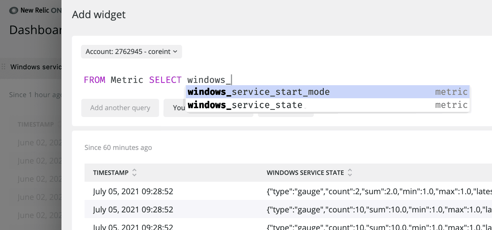

<Callout title="ベータ版機能">
  この機能は現在オープンベータ版で、2021年9月にリリースされた [0.3.0](https://github.com/newrelic/nri-winservices/releases/tag/v0.3.0-beta) からのバージョンにのみ適用されます。 詳細は [私たちの投稿](https://discuss.newrelic.com/t/introducing-new-open-beta-version-of-the-windows-services-integration/160162) をご確認ください。
</Callout>

New Relic の Windows サービス統合は、お客様の Windows ホストで実行されているサービスに関するデータを収集し、弊社のプラットフォームに送信します。各サービスの状態や開始モードの確認、どのホストがサービスを実行しているかの確認、サービスに対するアラートの設定などが可能です。

当社の統合は、 [Windows インフラストラクチャ エージェント](/docs/infrastructure/install-configure-manage-infrastructure/windows-installation/install-infrastructure-windows-server-using-msi-installer) にバンドルされています。New Relic で Windows ホストを監視している場合は、統合を有効にするだけで、Windows サービスのデータを New Relic のプラットフォームに取り込むことができます。

## 重要な理由 [#value]

[Windows のサービス](https://docs.microsoft.com/en-us/dotnet/framework/windows-services/introduction-to-windows-service-applications) は、Unix や Linux のデーモンに相当する Windows のサービスであり、グラフィカルなインターフェイスなしに起動、停止、一時停止、再起動が可能な長時間稼働の実行ファイルです。Windows インフラストラクチャを監視する際には、どのサービスが有効であるか、またはその状態や健全性を知ることが重要です。

Windowsサービスとの連携により、以下のことが可能になります。

* すべてのWindowsサービス、その [状態](#state) （実行中、停止中など）、 [開始モード](#startmode) （自動、手動など）、サービス [メタデータ](#metadata) を含めてチェックします。
* どのホストが特定のWindowsサービスを実行しているかを確認できます。
* [](#set-alerts)New Relic を使って監視している Windows サービスに基づいてアラートを設定します。
* [ダッシュボード](/docs/dashboards/new-relic-one-dashboards/get-started/introduction-new-relic-one-dashboards) を作成して、Windows サービスを追跡します。



<figcaption>
  **[one.newrelic.com](https://one.newrelic.com) > Dashboards**: Windowsサービス統合メトリクスを使用して、サービスのテーブルを作成することができます。
</figcaption>

## 互換性および要件 [#requirements]

当社の統合は、New Relic エージェントがサポートするすべての Windows バージョン [に対応しています。](/docs/infrastructure/new-relic-infrastructure/getting-started/compatibility-requirements-new-relic-infrastructure)

[New Relic インフラストラクチャ エージェント](/docs/infrastructure/install-configure-manage-infrastructure) **バージョン 1.12.1 以上** がサポート対象のホストにインストールされている必要があります。x86 Windows 版はまだサポートされていません。

## インストールと有効化 [#install]

Windowsサービス統合をインストールするには

1. ディレクトリをintegrationsフォルダに変更します。

   ```
   cd C:\Program Files\New Relic\newrelic-infra\integrations.d\
   ```

2. サンプルの設定ファイルのコピー：

   ```
   copy winservices-config.yml.sample winservices-config.yml
   ```

3. `winservices-config.yml` ファイルを [構成設定](#config) の説明に従って編集し、保存します。

### インテグレーションの更新 [#update]

Windows サービス統合は、インフラストラクチャ モニタリング エージェントにバンドルされています。統合機能をアップデートするには、 [エージェント](/docs/infrastructure/install-configure-manage-infrastructure/update-or-uninstall/update-infrastructure-agent#update) を最新版にアップデートしてください。

## インテグレーションの設定 [#config]

統合を有効にするには、 `winservices-config.yml` を編集して保存します。

* `exporter_bind_address:` and `exporter_bind_port のコメントを外します。`
* `include_matching_entitiesに監視したいサービスの名前を追加します。`

デフォルトでは、サービスは含まれません。サービスを含めたりフィルタリングしたりするには、 `include_matching_entities:` を編集する必要があります。

また、設定オプションの [`inventory_source`](/docs/integrations/integrations-sdk/file-specifications/host-integrations-newer-configuration-format#inventory_source) は、統合に対応していません。

ここでは、Windowsサービス統合の構成例をご紹介します。

<CollapserGroup>
  <Collapser
    id="example"
    title="winservices-config.yml"
  >
    ```
    integrations:
    - name: nri-winservices
    config:
      # IP address and port used by the Prometheus exporter to bind the server.
      # 
      # exporter_bind_address: 127.0.0.1
      # exporter_bind_port: 9182

      # To include services, create a list of filters to be applied to the service names.
      # Services that find a match with any of the matching lists are included. By default,
      # no service is included.
      #
      # Currently, only windowsService.name metadata is supported for filtering.
      # Prepend "regex" to indicate that the pattern is a regular expression.
      #
      include_matching_entities:
        windowsService.name:
          # - regex ".*"
          # - "newrelic-infra"

      # Time between consecutive metric collection of the integration.
      # It must be a number followed by a time unit (s, m or h), without spaces.
      #
      scrape_interval: 30s

    # Timeout used by the agent to restart the integration if no heartbeats are
    # sent from the integration. Heartbeats are sent every 5s, so this timeout
    # shouldn't be less than that.
    #
    timeout: 60s

    # Since this is a long-running integration, interval is ignored. To
    # configure the interval period for collecting and sending data, edit
    # the scrape_interval parameter.
    #
    # interval:
    ```

    詳しくは、 [on-host integration configurationの一般的な構造についてのドキュメント](/docs/integrations/integrations-sdk/file-specifications/host-integration-configuration-overview) をご覧ください。
  </Collapser>
</CollapserGroup>

## アラートの設定 [#set-alerts]

NRQL の条件を使って Windows サービスのアラートを [作成すると、監視したいサービスの状態変化を通知することができます。以下に、Windows サービスデータを使用したアラート条件の 2 つの例を示します。](/docs/alerts/new-relic-alerts/defining-conditions/create-alert-conditions-nrql-queries)

<CollapserGroup>
  <Collapser
    id="service"
    title="サービスが実行されていない"
  >
    ```
    SELECT count(*) FROM Metric WHERE metricName = 'windows_service_state' AND state != 'running' AND service_name = 'lfsvc' FACET entity.name
    ```
  </Collapser>
  
  <Collapser
    id="start-mode"
    title={<>Start mode is <InlineCode>auto</InlineCode>, but current state is not <InlineCode>running</InlineCode></>}
  >
    ```
    FROM Metric SELECT count(*) WHERE start_mode='auto' AND state!='running' FACET service_name
    ```
  </Collapser>
</CollapserGroup>

## 使用方法 [#process]

Windows ホストからデータを取得するために、私たちの Windows サービス統合では、[Prometheus exporter for Windows](https://github.com/prometheus-community/windows_exporter) の縮小版を使用しています。これは、エージェント構成で指定されたポートで Prometheus メトリクスを公開します。このインテグレーションは、これらのメトリクスを収集し、エンティティに変換し、フィルタリングした後、New Relic に送信します。


<figcaption>
  Windows サービスインテグレーションは、Windows Prometheus エクスポーターを使用して [Service Functions](https://docs.microsoft.com/en-us/windows/win32/services/service-functions) データを収集します。その後、データの変換とフィルタリングを行い、New Relic にデータを送信します。
</figcaption>

## メトリックデータ [#metrics]

Windowsサービス統合では、以下のデータを提供しています。

<table>
  <thead>
    <tr>
      <th>
        メトリック
      </th>

      <th>
        説明
      </th>
    </tr>
  </thead>

  <tbody>
    <tr>
      <td>
        `windows_service_start_mode`
      </td>

      <td>
        サービスの開始モード。可能な値は次のとおりです。

        * `ブート`
        * `システム`
        * `オート`
        * `マニュアル`
        * `無効`
      </td>
    </tr>

    <tr>
      <td>
        `windows_service_state`
      </td>

      <td>
        サービスの状態です。可能な値は

        * `を停止しました。`
        * `スタート・ペンディング`
        * `ストップ・ペンディング`
        * `ランニング`
        * `保留継続`
        * `ポーズペンディング`
        * `一時停止`
        * `不明`
      </td>
    </tr>
  </tbody>
</table>

旧ベータ版から移行した場合、メトリック名が変更されています。その違いは

<table>
  <thead>
    <tr>
      <th>
        旧メトリック
      </th>

      <th>
        新しいメトリック
      </th>
    </tr>
  </thead>

  <tbody>
    <tr>
      <td>
        `windowsService.service.startMode`
      </td>

      <td>
        `windows_service_start_mode`
      </td>
    </tr>

    <tr>
      <td>
        `windowsService.service.state`
      </td>

      <td>
        `windows_service_state`
      </td>
    </tr>

    <tr>
      <td>
        `windowsService.service.status`
      </td>

      <td>
        `が削除されました。`
      </td>
    </tr>
  </tbody>
</table>

## メタデータ [#metadata]

Windows サービスインテグレーションは、以下のメタデータを New Relic に送信します。

* `display_name`: サービススナップインで表示されるサービスの名前。

* `service_name`: サービスのユニークな識別子。

* `process_id` ：サービスのプロセス識別子。

* `run_as`: サービスが実行されるアカウント名。サービスの種類によって、アカウント名の形式は `DomainName\Username` または `Username@DomainName` (UPN)となります。この値は、 `StartName` `Win32_Service` クラスの属性から取得しており、 `NULL` とすることができます（この場合、ラベルは空の文字列として報告されます）。

  <Callout variant="important">
    `StartName` 属性が `NULL` の場合、サービスは `LocalSystem` のアカウントでログオンします。カーネルまたはシステムレベルのドライブでは、 `DWDOMAdmin` のように、サービス名に基づいてI/Oシステムが作成したデフォルトのオブジェクト名で実行されます。
  </Callout>

旧ベータ版から移行した場合、メタデータの名称が変更されています。その違いは

<table>
  <thead>
    <tr>
      <th>
        古いメタデータ
      </th>

      <th>
        新しいメタデータ
      </th>
    </tr>
  </thead>

  <tbody>
    <tr>
      <td>
        `windowsService.displayName`
      </td>

      <td>
        `display_name`
      </td>
    </tr>

    <tr>
      <td>
        `windowsService.entityName`
      </td>

      <td>
        `entity.name`
      </td>
    </tr>

    <tr>
      <td>
        `windowsService.hostname`
      </td>

      <td>
        `ホスト名`
      </td>
    </tr>

    <tr>
      <td>
        `windowsService.name`
      </td>

      <td>
        `サービス名`
      </td>
    </tr>

    <tr>
      <td>
        `windowsService.processId`
      </td>

      <td>
        `プロセスID`
      </td>
    </tr>

    <tr>
      <td>
        `windowsService.runAs`
      </td>

      <td>
        `run_as`
      </td>
    </tr>
  </tbody>
</table>

## ソースコード [#open-source]

Windowsサービス統合は、オープンソースソフトウェアです。つまり、 [そのソースコードを閲覧したり](https://github.com/newrelic/nri-winservices/) や [改良点を送ったり](https://github.com/newrelic/nri-winservices/blob/master/CONTRIBUTING.md) したり、自分でフォークを作ってビルドしたりすることができます。詳細については、 [README](https://github.com/newrelic/nri-winservices/blob/master/README.md) をご覧ください。
