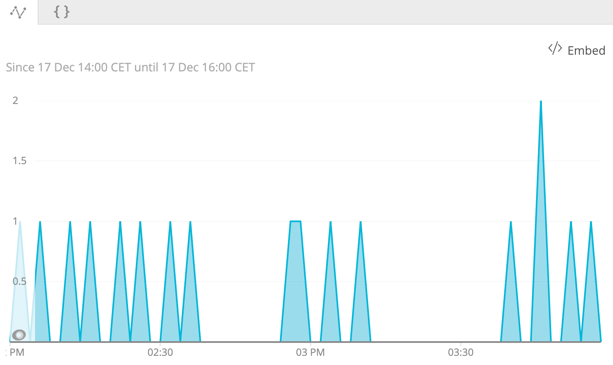

## 問題

AWS、Azure、またはGCPとの統合を設定し、メトリクスを監視しています。しかし、メトリクスデータのチャートにギャップがあることに気づきました。

<figcaption>
  このスクリーンショットでは、ギャップのあるメトリックデータのチャートが表示されています。
</figcaption>

## 解決策

ここでは、メトリクスデータにギャップが見られる可能性のあるメトリクスのリストを紹介します。これらの指標にアラートを設定することは、偽陽性を引き起こす可能性があるため、可能な限り避けてください。

<CollapserGroup>
  <Collapser
    id="aws"
    title="アマゾン（AWS）の場合"
  >
    <table>
      <thead>
        <tr>
          <th>
            インテグレーション
          </th>

          <th>
            プロバイダー
          </th>

          <th>
            イベントタイプ
          </th>

          <th>
            メトリック
          </th>
        </tr>
      </thead>

      <tbody>
        <tr>
          <td rowSpan={3}>
            SNS
          </td>

          <td>
            `SnsTopic`
          </td>

          <td>
            `QueueSample`
          </td>

          <td>
            `provider.subscriptionsConfirmed`
          </td>
        </tr>

        <tr>
          <td>
            `SnsTopic`
          </td>

          <td>
            `QueueSample`
          </td>

          <td>
            `provider.subscriptionsPending`
          </td>
        </tr>

        <tr>
          <td>
            `SnsTopic`
          </td>

          <td>
            `QueueSample`
          </td>

          <td>
            `provider.subscriptionsDeleted`
          </td>
        </tr>

        <tr>
          <td>
            EFS
          </td>

          <td>
            `EFSファイルシステム`
          </td>

          <td>
            `BlockDeviceSample`
          </td>

          <td>
            `provider.lastKnownSizeInBytes`
          </td>
        </tr>

        <tr>
          <td rowSpan={7}>
            ECS
          </td>

          <td>
            `EcsCluster`
          </td>

          <td>
            `ComputeSample`
          </td>

          <td>
            `provider.registeredContainerInstancesCount`
          </td>
        </tr>

        <tr>
          <td>
            `EcsCluster`
          </td>

          <td>
            `ComputeSample`
          </td>

          <td>
            `provider.activeServicesCount`
          </td>
        </tr>

        <tr>
          <td>
            `EcsCluster`
          </td>

          <td>
            `ComputeSample`
          </td>

          <td>
            `プロバイダ.pendingTasksCount`
          </td>
        </tr>

        <tr>
          <td>
            `EcsCluster`
          </td>

          <td>
            `ComputeSample`
          </td>

          <td>
            `provider.runningTasksCount`
          </td>
        </tr>

        <tr>
          <td>
            `EcsService`
          </td>

          <td>
            `ComputeSample`
          </td>

          <td>
            `provider.pendingCount`
          </td>
        </tr>

        <tr>
          <td>
            `EcsService`
          </td>

          <td>
            `ComputeSample`
          </td>

          <td>
            `provider.runningCount`
          </td>
        </tr>

        <tr>
          <td>
            `EcsService`
          </td>

          <td>
            `ComputeSample`
          </td>

          <td>
            `provider.destroyedCount`
          </td>
        </tr>

        <tr>
          <td rowSpan={2}>
            DynamoDB
          </td>

          <td>
            `DynamoDbTable`
          </td>

          <td>
            `DatastoreSample`
          </td>

          <td>
            `provider.itemCount`
          </td>
        </tr>

        <tr>
          <td>
            `DynamoDbTable`
          </td>

          <td>
            `DatastoreSample`
          </td>

          <td>
            `provider.tableSizeBytes`
          </td>
        </tr>

        <tr>
          <td>
            オートスケーリング
          </td>

          <td>
            `AutoScalingInstance`
          </td>

          <td>
            `AutoScalingInstanceSample`
          </td>

          <td>
            `healthStatus`
          </td>
        </tr>

        <tr>
          <td rowSpan={3}>
            ビリング
          </td>

          <td>
            `BillingBudget`
          </td>

          <td>
            `FinanceSample`
          </td>

          <td>
            `provider.actualAmount`
          </td>
        </tr>

        <tr>
          <td>
            `Billingbudget`
          </td>

          <td>
            `FinanceSample`
          </td>

          <td>
            `provider.predictiveAmount`
          </td>
        </tr>

        <tr>
          <td>
            `BillingBudget`
          </td>

          <td>
            `FinanceSample`
          </td>

          <td>
            `provider.limitAmount`
          </td>
        </tr>
      </tbody>
    </table>
  </Collapser>

  <Collapser
    id="azure"
    title="Microsoft Azure"
  >
    <table>
      <thead>
        <tr>
          <th>
            インテグレーション
          </th>

          <th>
            プロバイダー
          </th>

          <th>
            イベントタイプ
          </th>

          <th>
            メトリック
          </th>
        </tr>
      </thead>

      <tbody>
        <tr>
          <td rowSpan={4}>
            SQL
          </td>

          <td>
            `AzureSqlDatabase`
          </td>

          <td>
            `AzureSqlDatabaseSample`
          </td>

          <td>
            `databaseSizeCurrentBytes`
          </td>
        </tr>

        <tr>
          <td>
            `AzureSqlDatabase`
          </td>

          <td>
            `AzureSqlDatabaseSample`
          </td>

          <td>
            `データベースサイズ制限バイト`
          </td>
        </tr>

        <tr>
          <td>
            `AzureSqlServer`
          </td>

          <td>
            `AzureSqlServerSample`
          </td>

          <td>
            `dtuCurrent`
          </td>
        </tr>

        <tr>
          <td>
            `AzureSqlServer`
          </td>

          <td>
            `AzureSqlServerSample`
          </td>

          <td>
            `dtuLimit`
          </td>
        </tr>
      </tbody>
    </table>
  </Collapser>

  <Collapser title="Google Cloud Platform (GCP)">
    <Callout variant="tip">
      現在、データギャップの原因となるGCPの測定基準を見直しています。
    </Callout>
  </Collapser>
</CollapserGroup>

<Callout variant="tip">
  このリストは完全ではありません。現在、データギャップの原因となるメトリクスの全リストを見直しています。
</Callout>

## 原因

メトリクスの中には、通常のクラウドプロバイダーのAPI（CloudWatch、Stackdriver、Azure Monitor）には存在しないものがあり、代わりにサービスAPIから取得されます。各クラウドサービスプロバイダーは、データを処理してサービスと対話する固有のサービスAPIを持っています。たとえば、あるメトリックがAWS CloudWatchに存在しない場合、New RelicはAWS ECSのサービスAPIからメトリックをフェッチします。