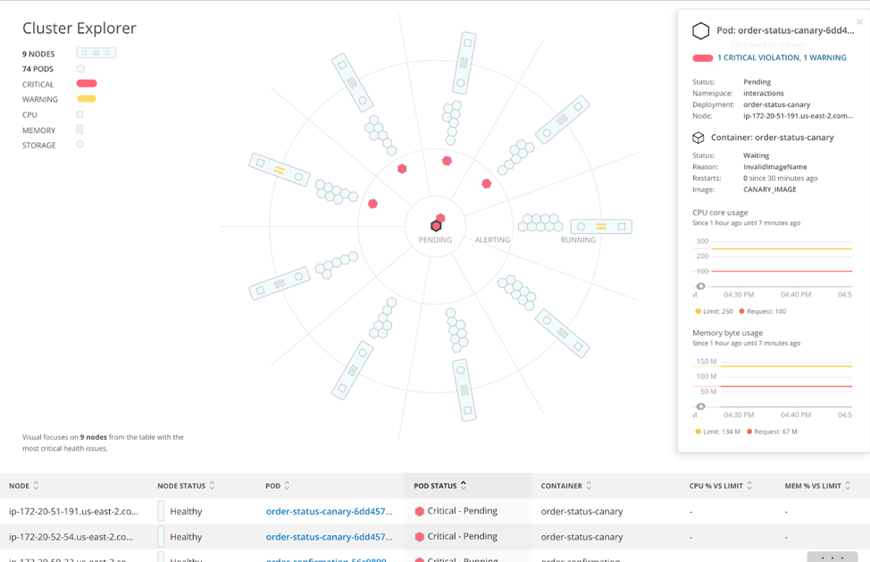

import amazonlinux from './images/amazonlinux.png'

import centos from './images/centos.png'

import dockerLogoCrop from './images/docker-logo-crop.png'

import debian from './images/debian.png'

import redHatNew2 from './images/red-hat-new2.png'

import suse from './images/suse.png'

import ubuntu from './images/ubuntu.png'

import windows from './images/windows.png'

New Relicでは、クラウドや専用ホストで実行しているサービスや、オーケストレーションされた環境で実行しているコンテナなど、フレキシブルでダイナミックなインフラストラクチャ全体のオブザーバビリティを提供します。すべてのホストの健全性とパフォーマンスを、アプリケーションのコンテキストやログ、設定変更と関連付けることができます。

Infrastructureモニタリングを使用して、現在の運用チームは、データセンターや数千ものAmazonやGoogle Cloud、Azureインスタンスなどの複雑なハイブリッドシステムの完全なオブザーバビリティを実現します。

<figcaption>
  New Relic Oneのインフラストラクチャに関する**Hosts**ページには、システム、ネットワーク、プロセス、およびストレージのパフォーマンス指標が表示されます。
</figcaption>

## Infrastructureモニタリングソリューション [#infrastructure-solutions]

当社には、幅広いInfrastructureモニタリングソリューションがあります。概要は次のとおりです。

* Linux、macOS、Windowsオペレーティングシステム用の[Infrastructureエージェント](/docs/infrastructure/install-infrastructure-agent/get-started/install-infrastructure-agent)。
* [Kubernetes](/docs/kubernetes-pixie/kubernetes-integration/installation/kubernetes-integration-install-configure)と[Pixie](/docs/kubernetes-pixie/auto-telemetry-pixie/get-started-auto-telemetry-pixie)インテグレーション。
* Amazon、Azure、Google Cloud Platform向け[クラウドインテグレーション](/docs/infrastructure/infrastructure-integrations/get-started/introduction-infrastructure-integrations/#cloud-integrations)。
* [Prometheusのインテグレーション](/docs/infrastructure/prometheus-integrations/get-started/send-prometheus-metric-data-new-relic)。
* MySQL、NGINX、Cassandra、Kafkaなどのサービス向けの[オンホストインテグレーション](/docs/infrastructure/infrastructure-integrations/get-started/introduction-infrastructure-integrations/#on-host-integrations)（いくつか例を挙げます）。オンホストインテグレーションのほとんどは、Infrastructureエージェントとともにインストールされ、それと連携してデータを送信します。

## クイック・スタート：ガイド付きインストールを使用 [#quick]

最も手っ取り早い方法は、当社のガイド付きインストールを使用することです。このインストールでは、[Infrastructureモニタリングエージェント](/docs/infrastructure/install-infrastructure-agent/get-started/install-infrastructure-agent)をインストールし、ご使用の環境でアプリケーションとログソースを検出します。

<ButtonGroup>
  <ButtonLink
    role="button"
    to="https://one.newrelic.com/launcher/nr1-core.explorer?pane=eyJuZXJkbGV0SWQiOiJucjEtY29yZS5saXN0aW5nIn0=&cards[0]=eyJuZXJkbGV0SWQiOiJucjEtaW5zdGFsbC1uZXdyZWxpYy5ucjEtaW5zdGFsbC1uZXdyZWxpYyIsImFjdGl2ZUNvbXBvbmVudCI6IlZUU09FbnZpcm9ubWVudCIsInBhdGgiOiJndWlkZWQifQ=="
    variant="primary"
  >
    ガイド付きインストール
  </ButtonLink>

  <ButtonLink
    role="button"
    to="https://one.eu.newrelic.com/launcher/nr1-core.explorer?pane=eyJuZXJkbGV0SWQiOiJucjEtY29yZS5saXN0aW5nIn0=&cards[0]=eyJuZXJkbGV0SWQiOiJucjEtaW5zdGFsbC1uZXdyZWxpYy5ucjEtaW5zdGFsbC1uZXdyZWxpYyIsImFjdGl2ZUNvbXBvbmVudCI6IlZUU09FbnZpcm9ubWVudCIsInBhdGgiOiJndWlkZWQifQ=="
    variant="primary"
  >
    EUガイド付きインストール
  </ButtonLink>
</ButtonGroup>

ガイド付きインストールは、ほとんどの設定と連動します。ただし、ご希望にそえない場合は、以下のオプションをご確認ください。

## 実行可能なデータでMTTRを短縮する [#why-it-matters]

リアルタイムのメトリクスと解析により、ホストパフォーマンスの変化を設定の変更と関連付けて考察することで、[平均解決時間](https://newrelic.com/devops/how-to-reduce-mttr)（MTTR）を短縮できます。**インベントリ**ページでは、エステート全体を検索し、特定のパッケージ、設定ファイル、または起動スクリプトが含まれるホストを正確に特定できます。

<figcaption>
  New Relic Oneの**Inventory**ページでは、エステートのすべてのインフラストラクチャ[エンティティ](/docs/new-relic-one/use-new-relic-one/core-concepts/what-entity-new-relic)が表示されます。
</figcaption>

**Events**ページでは、設定の変更、再起動、SSHセッション、その他の[重要なイベント](/docs/infrastructure-events-page#types)の変更を追跡できます。リアルタイムフィードで、インフラストラクチャ全体の変更ログを提供します。当社のソリューションは5秒以内に[安全に](/docs/infrastructure/new-relic-infrastructure/getting-started/infrastructure-security)データを収集・表示するため、モニタリングが現実から遅れを取ることはありません。

<figcaption>
  New Relic Oneの**EEvents**ページには、ホストで発生している事象すべてのリアルタイムフィードが含まれます。
</figcaption>

Infrastructureモニタリングツールを使用して、次のことも行えます。

* [データのクエリ](/docs/using-new-relic/data/understand-data/query-new-relic-data)を行い、[インフラストラクチャイベント](/docs/default-infrastructure-events-attributes)を掘り下げて分析し、チームと共有可能な[カスタムダッシュボード](/docs/dashboards/new-relic-one-dashboards/get-started/introduction-new-relic-one-dashboards)を構築する。
* サーバー側かアプリケーション側かによらず、問題がどこで発生しても、[InfrastructureモニタリングとのAPMデータ接続](/docs/infrastructure/new-relic-infrastructure/data-instrumentation/new-relic-apm-data-infrastructure)により、パフォーマンスの問題のトラブルシューティングを行う。
* 関連性のあるInfrastructureチャートから直接、[アラート設定を作成、表示、または更新](/docs/add-edit-or-view-host-alert-information)します。たとえば、アラート条件を[報告しないホスト](/docs/infrastructure/new-relic-infrastructure/configuration/create-infrastructure-host-not-reporting-condition)を作成できます。

## インフラストラクチャおよびアプリデータのログを表示 [#logs-context]

ログとインフラストラクチャのデータを統合して、トラブルシューティングをより簡単かつ迅速にできます。[コンテキストのログ](/docs/logs/logs-context/configure-logs-context-apm-agents/)では、Kubernetesクラスタなど、インフラストラクチャデータのログを表示することもできます。必要な数の設定ファイルを追加できます。これらのファイルは、ログメタデータを当社のプラットフォームにプッシュするソースとして機能します。

エラーとトレースに関連するログメッセージをアプリケーションのUIで直接表示することもできます。New Relic Oneで別のUIページに切り替える必要はありません。詳細については、[ログ転送のドキュメント](/docs/logs/forward-logs/forward-your-logs-using-infrastructure-agent/)を参照してください。

## Infrastructureエージェントをインストールする [#install]

弊社のオープンソースInfrastructureエージェントは、バックグラウンドで動作する[軽量な](/docs/infrastructure/new-relic-infrastructure/getting-started/agent-performance-overhead)実行可能ファイルで、オペレーティングシステムからデータを収集します。

[ガイド付きインストール](#quick)を使用しない場合、Infrastructureエージェントをインストールする最も簡単な方法は、[パッケージマネージャ](/docs/infrastructure/install-configure-manage-infrastructure/linux-installation/install-infrastructure-linux-using-package-manager)（Linux）または[MSIインストーラ](/docs/infrastructure/install-configure-manage-infrastructure/windows-installation/install-infrastructure-windows-server-using-msi-installer)（Windows）を使用することです。インストールアシスタントを使用することもできます：

<TechTileGrid>
  <TechTile
    name="Amazon Linux"
    to="https://one.newrelic.com/nr1-core/tucson/plg-instrument-everything&state=17f97073-d0d5-7a83-28af-13e3115dc508"
    icon={}
  />

  <TechTile
    name="CentOS"
    to="https://one.newrelic.com/nr1-core/tucson/plg-instrument-everything&state=e9e347c9-813c-abfd-1d33-2c1cb1326195"
    icon={}
  />

  <TechTile
    name="Container (Docker)"
    to="https://one.newrelic.com/nr1-core/tucson/plg-instrument-everything&state=38a2cea3-0472-0fe7-d9df-6a897777731d"
    icon={}
  />

  <TechTile
    name="Debian"
    to="https://one.newrelic.com/nr1-core/tucson/plg-instrument-everything&state=0d9d2431-ed10-c3aa-d815-d824923f05db"
    icon={}
  />

  <TechTile
    name="RHEL"
    to="https://one.newrelic.com/nr1-core/tucson/plg-instrument-everything&state=c7061991-0944-1d6a-56e2-27f576d3cd43"
    icon={}
  />

  <TechTile
    name="SLES"
    to="https://one.newrelic.com/nr1-core/tucson/plg-instrument-everything&state=bcf5d183-bbad-01e4-dd82-b8dca2274d82"
    icon={}
  />

  <TechTile
    name="Ubuntu"
    to="https://one.newrelic.com/nr1-core/tucson/plg-instrument-everything&state=3255499e-7daa-e169-4154-1f5c24fd8043"
    icon={}
  />

  <TechTile
    name="Windows"
    to="https://one.newrelic.com/nr1-core/tucson/plg-instrument-everything&state=a72d02fa-4e70-3f8d-641a-d208d6844939"
    icon={}
  />
</TechTileGrid>

上記のリンクを使用するには、New Relicアカウントにログインする必要があります。

まだNew Relicアカウントがない、またはステップごとの手順に従いたい場合は、チュートリアルを参照して[Linux](/docs/infrastructure/install-configure-manage-infrastructure/linux-installation/install-infrastructure-linux-using-package-manager) \| [Windows](/docs/infrastructure/new-relic-infrastructure/installation/install-infrastructure-windows-server) \| [Elastic Beanstalk](/docs/infrastructure/new-relic-infrastructure/installation/install-infrastructure-agent-aws-elastic-beanstalk) \| [Ansible](/docs/infrastructure/new-relic-infrastructure/config-management-tools/configure-new-relic-infrastructure-using-ansible) \| [Chef](/docs/infrastructure/new-relic-infrastructure/config-management-tools/configure-new-relic-infrastructure-using-chef) \| [Puppet](/docs/infrastructure/new-relic-infrastructure/config-management-tools/configure-new-relic-infrastructure-puppet)用のエージェントをインストールしてください。

## Infrastructureサービスインテグレーション [#aws]

Infrastructureインテグレーションにより、一般的な多くのサービスやシステムのメトリクスにアクセスできます。当社のインテグレーションには、以下が含まれます。

* クラウドプラットフォームインテグレーション：[Amazon](/docs/infrastructure/amazon-integrations/aws-integrations-list)、[Google Cloud Platform](/docs/integrations/google-cloud-platform-integrations)、[Microsoft Azure](/docs/infrastructure/microsoft-azure-integrations/azure-integrations-list)。
* [Kubernetesインテグレーション](/docs/kubernetes-pixie/kubernetes-integration/installation/kubernetes-integration-install-configure)と[Pixieインテグレーション](/docs/kubernetes-pixie/auto-telemetry-pixie/get-started-auto-telemetry-pixie)。
* NGINX、Cassandra、MySQLなど、当社の[オンホストインテグレーション](/docs/infrastructure/host-integrations/host-integrations-list)は、Infrastructureエージェントと連携して機能します。
* [New Relic Flex](/docs/introduction-new-relics-flex-integration)と独自のインテグレーションを構築します。

<figcaption>
  New Relic Oneの**[Kubernetesクラスタエクスプローラー](/docs/integrations/kubernetes-integration/cluster-explorer/kubernetes-cluster-explorer)**は、大規模なKubernetesの実行に関連する問題に対する革新的な優れた解決策を提供します。
</figcaption>

## ホストの絞り込み [#filter-sets]

[フィルターセット](/docs/scopes-organize-your-infrastructure)を使用すると、最も重要な基準に基づいてホストを整理できます。ホストのフィルタリングは地理的な場所、ホスト名、またはLinuxディストリビューションなどの任意の[Infrastructure属性](/docs/default-infrastructure-events-attributes)別に行うことができます。

地域やインスタンスのタイプなどの[Amazon属性](/docs/default-infrastructure-events-attributes#aws-ec2-attributes)で絞り込みを行い、[カスタム属性](/docs/meatballs-configuring-your-agent#attributes)を追加して、どのチームが、実行しているホストやサービスを管理するかなど、一意のメタデータを定義することもできます。

## Infrastructureデータを詳しく調べる

New Relic Oneで、[Infrastructureデータのクエリと可視化](/docs/using-new-relic/data/understand-data/query-new-relic-data)を行えます。

* [Infrastructureイベント](/docs/infrastructure/manage-your-data/data-instrumentation/default-infrastructure-events)のサンプリングと検索を行い、収集しているデータについて完全に理解する。
* [データエクスプローラー](/docs/query-your-data/explore-query-data/data-explorer/introduction-data-explorer)で、データを視覚的に把握する。
* [NRQL](/docs/insights/nrql-new-relic-query-language/using-nrql/introduction-nrql)を使用して、データに対してSQLのようなクエリを作成するか、またはPromQLスタイルのクエリを使用してデータのクエリを行います。
* [ダッシュボード](/docs/dashboards/new-relic-one-dashboards/get-started/introduction-new-relic-one-dashboards)を使用して、高度なデータ可視化やデータのコンテキスト化を行い、システムがどうなっているかをリアルタイムで理解する。