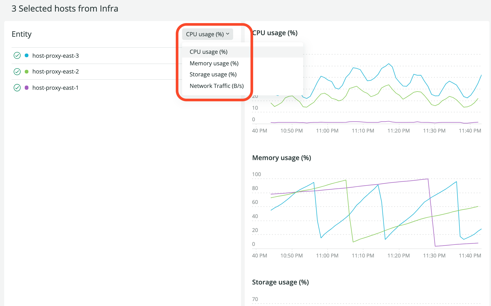
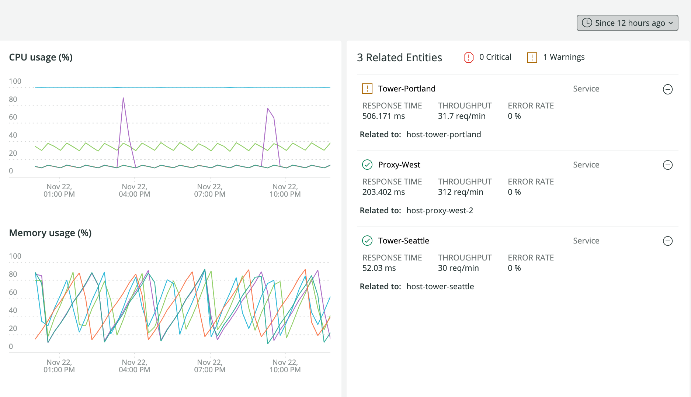

2021年11月に行ったインフラ監視ツールのリニューアルでは、ユーザーが [New Relic One プラットフォームを利用する際の方法に一貫性を持たせました](/docs/new-relic-one/use-new-relic-one/get-started/introduction-new-relic-one/) 。

これまでは、トップナビゲーションバーのインフラストラクチャーの項目をクリックすると、 [のエクスプローラー](/docs/new-relic-one/use-new-relic-one/core-concepts/new-relic-explorer-view-performance-across-apps-services-hosts/) の外に出てしまい、ナビゲーターやルックアウトなどの機能が利用できませんでした。現在は、「インフラストラクチャー」または「ホスト」をクリックすると、すべてのホスト [エンティティのリスト](/docs/new-relic-one/use-new-relic-one/core-concepts/what-entity-new-relic/) が「エクスプローラー」の **リストビューに表示され、 **インフラストラクチャーのイベントが「アクティビティストリーム」** に表示されます。今回のリリースでは、インベントリの表示に変更はありません。**

**<Callout variant="tip">
  レガシーインターフェースにアクセスするには、UIのトグルを使用します。

  お客様の主要なインフラデータのフローと可視化を更新しましたが、新しいツールに慣れるまでの時間を考慮して、従来の機能は一切削除していません。ホストのレガシービューには、上部のインフラナビのドロップダウンから引き続きアクセスできます。
</Callout>始める準備はできましたか？ [New Relic のアカウントをお持ちであることをご確認ください](https://newrelic.com/signup) 。無料でご利用いただけます。## 新しいインフラのUIにアクセス [#access-new-ui]新しいインフラストラクチャの監視を確認します。 [one.newrelic.com](https://one.newrelic.com) にアクセスし、上部ナビバーの **Infrastructure** をクリックし、 **Hosts (New)** を選択してください。または、 **エクスプローラー** にアクセスし、 **Hosts** を選択します。インフラストラクチャーエクスプローラーのリストビューは、これらのパネルで構成されています。* **あなたのシステムのエンティティー** を左に表示しています。

* **Estate View** パネルを中央に配置しました。

  * 一度に最大25のエンティティを選択して一緒に分析する機能を提供します。観察したいホストを選択して、 **View Selected** ボタンを押すと、新しい [解析用のナードレット](#infra-analysis-nerdlet) に移動します。
  * リストビューでは、リスト内のエンティティ名をクリックすることで、個々のエンティティサマリーに直接ジャンプすることができます。

* **活動の流れ** 右側。### エンティティは、ゴールデンメトリクスに基づいて表示されます。 [#infra-entity-golden-metrics]新しいエンティティリストには、New Relic 全体で見られるようになってきた [ゴールデンメトリクス](/docs/apis/nerdgraph/examples/golden-metrics-entities-nerdgraph-api-tutorial/) が搭載されています。これらのインフラストラクチャのエンティティタイプのLookoutの表示を選択すると、同じメトリクスのセットが表示されます。これらの新しいメトリクスは、旧 UI の従来のサマリーメトリクスに代わるものです。### ソートとフィルタリングが改善されたビュー [#infra-entity-filter]列の値をソートする際に、エンティティ数が2,000未満という制限がなくなりました。ただし、10,000以上のエンティティがある場合は、パフォーマンスに若干の影響があります。並び替えだけでなく、エンティティのメトリック値をフィルタリングして、注意が必要なエンティティを正確に絞り込むことができます。例えば、CPUの値が80%以上のエンティティのみにフィルタリングできるようになり、そのエンティティに問題があるかどうかを迅速に特定できるようになりました。現時点では、フィルタリングは1列に限定されていますが、将来のリリースでは複数列に拡張される予定です。### 新しいナードレットが深いインフラ分析を提供 [#infra-analysis-nerdlet]エンティティリストビューで目的のエンティティを選択した後、 **View Selected** をクリックすると、そのエンティティのセットに関する分析パネルがスライドアウトで表示されます。データのパネルは3枚あります。**左パネル。選択されたエンティティのリスト**上のドロップダウンで、これらのエンティティの主要な測定基準を切り替えます。エンティティの行にカーソルを合わせると、エンティティの詳細情報が表示されます。* **View Logs** をクリックすると、そのログがコンテキスト情報として新しいタブで表示されます。
* ホストの場合のみ、 **マップ** アイコンを使用して、特定のホストエンティティのオートマップ機能を起動します。このビューでは、スタック内の他のエンティティに対するホストの関係が視覚的に表示されます。* ****虫眼鏡 「View summary 」と書かれたアイコンを選択すると、その個別エンティティのサマリーページにリダイレクトされます。****
* 左パネルでエンティティを選択すると、そのエンティティのラインも各チャート上でハイライト表示されます。
* **eye** のアイコンをクリックして、リストからエンティティを非表示にします。左側のパネルでエンティティの非表示を選択した場合、それらは中央のパネルのチャートから削除されます。**中央のパネル。ゴールデンメトリクスの比較チャート**ゴールデン・メトリクスの比較チャートは、選択されたエンティティのゴールデン・メトリクス・シグナル [を表しています。](https://github.com/newrelic/entity-definitions)[* 左パネルでエンティティの非表示を選択した場合は、チャートから削除されます。
* 左パネルでエンティティがハイライトされている場合、各チャートでもそのエンティティのラインがハイライトされます。あるいは、ラインをハイライトすると、そのエンティティも左でハイライトされます。
* 各チャートのデータポイントには、詳細を示すツールチップが表示されます。**右パネル。関連企業**](https://github.com/newrelic/entity-definitions)[New Relicで関係性を理解することは複雑ですが、問題を解決しようとするときには非常に強力です。あるホストが誤動作していて、それが他にどのような影響を与えているのかを、多くのクリックをせずに知りたいと想像してみてください。 ](https://github.com/newrelic/entity-definitions)[related entities](/docs/new-relic-one/use-new-relic-one/core-concepts/what-entity-new-relic/#related-entities) パネルでは、左パネルで選択したものに関連するエンティティが表示され、それらのエンティティに共通するゴールデンシグナルを確認することができます。接続されているAPMサービスのレスポンスタイムの低下、スループットの低下、エラーレートの上昇などが一目でわかります。* 新しいビューに初めて入ると、関連するエンティティのパネルが、それらのエンティティのアラートステータスでソートされて表示されます。致命的な違反をしているサービスがあれば、それが一番上に表示されます。
* 左側のパネルでエンティティにカーソルを置くと、その項目に関連する関連エンティティが右側にハイライト表示されます。また、左側の項目をクリックすると、右側のパネルがソートされ、関連するエンティティが右側の列の一番上に表示されます。**