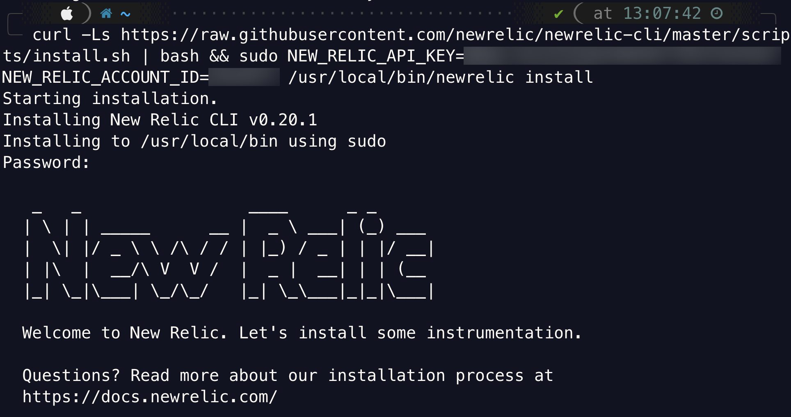
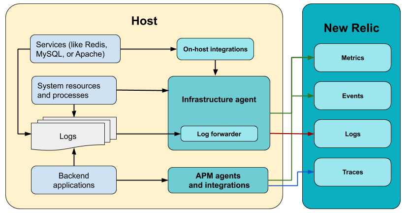

import amazonlinux from './images/amazonlinux.png'

import centos from './images/centos.png'

import dockerLogoCrop from './images/docker-logo-crop.png'

import debian from './images/debian.png'

import redHatNew2 from './images/red-hat-new2.png'

import suse from './images/suse.png'

import ubuntu from './images/ubuntu.png'

import otherlinux from './images/otherlinux.png'

import windows from './images/windows.png'

import macOSX from './images/mac-osx-logo.png'

New Relic のインフラストラクチャモニタリングエージェントは、 [軽量の](/docs/infrastructure/new-relic-infrastructure/getting-started/infrastructure-agent-performance-overhead) 実行ファイルで、 [お客様のホストに関するデータを収集します](/docs/infrastructure/manage-your-data/data-instrumentation/default-infrastructure-events) 。また、 [当社のオンホスト統合](/docs/integrations/infrastructure-integrations/get-started/introduction-infrastructure-integrations) からのデータを New Relic に転送したり、 [ログデータ](/docs/logs/enable-log-monitoring-new-relic/enable-log-monitoring-new-relic/forward-your-logs-using-infrastructure-agent) をログ分析に利用したりします。

インフラストラクチャ・モニタリング・エージェントは、現在、多くの Linux ディストリビューション、Windows、および macOS 上で動作します。エージェントをインストールして展開するには、セットアップやニーズに応じて複数の方法があります。このドキュメントでは、インフラストラクチャ・モニタリング・エージェントの仕組みとインストール方法について説明します。

## クイック・スタート：ガイド付きインストールを使用 [#quick]

Infrastructureモニタリングエージェントを最も迅速に使い始めるには、ガイド付きインストールを使用します。当社のガイド付きインストールでは、インフラストラクチャエージェントをインストールするだけでなく、ご使用の環境で実行中のアプリケーションやログソースも検出します。どれをインストゥルメントすべきかが推奨されます。

始める準備はできましたか？インストールする前に、New Relic のアカウントが必要です。以下のボタンのいずれかをクリックして、お試しください。

<ButtonLink
  data-tessen="stitchedPathLinkClick"
  role="button"
  to="https://newrelic.com/signup"
  variant="primary"
>
  アカウントの取得
</ButtonLink>

<ButtonGroup>
  <ButtonLink
    role="button"
    to="https://one.newrelic.com/launcher/nr1-core.explorer?pane=eyJuZXJkbGV0SWQiOiJucjEtY29yZS5saXN0aW5nIn0=&cards[0]=eyJuZXJkbGV0SWQiOiJucjEtaW5zdGFsbC1uZXdyZWxpYy5ucjEtaW5zdGFsbC1uZXdyZWxpYyIsImFjdGl2ZUNvbXBvbmVudCI6IlZUU09FbnZpcm9ubWVudCIsInBhdGgiOiJndWlkZWQifQ=="
    variant="primary"
  >
    ガイド付きインストール
  </ButtonLink>

  <ButtonLink
    role="button"
    to="https://one.eu.newrelic.com/launcher/nr1-core.explorer?pane=eyJuZXJkbGV0SWQiOiJucjEtY29yZS5saXN0aW5nIn0=&cards[0]=eyJuZXJkbGV0SWQiOiJucjEtaW5zdGFsbC1uZXdyZWxpYy5ucjEtaW5zdGFsbC1uZXdyZWxpYyIsImFjdGl2ZUNvbXBvbmVudCI6IlZUU09FbnZpcm9ubWVudCIsInBhdGgiOiJndWlkZWQifQ=="
    variant="primary"
  >
    EUガイド付きインストール
  </ButtonLink>
</ButtonGroup>

このガイド付きインストールは、ほとんどのセットアップに対応しています。しかし、ニーズに合わない場合は、 [以下の他の方法を参照してください。](#install) インフラストラクチャの監視を始めましょう。

エージェントを実行できる場所の詳細については、 [互換性と要件](/docs/infrastructure/infrastructure-monitoring/get-started/compatibility-requirements-infrastructure-agent) ページをご確認ください。

<Callout variant="important">
  [New Relic One UI](https://one.newrelic.com) を使用してエージェントをインストールした場合、 [Infrastructure status API](https://github.com/newrelic/infrastructure-agent/blob/master/docs/status_api.md) がデフォルトで有効になります。
</Callout>

## インフラストラクチャ・モニタリング・エージェントのインストール [#install]

### Linux [#Linux]

New Relic のアカウントをまだお持ちでない場合は、ガイド付きインストールは機能しません。手動で手続きを行いたい場合は、 [チュートリアル](/docs/infrastructure/install-infrastructure-agent/linux-installation/install-infrastructure-monitoring-agent-linux/) をご覧ください。

### Windows Serverと10 [#Windows]

New Relic のアカウントをお持ちでない場合、ガイド付きインストールは機能しません。MSI インストーラーを使って手動で手順を進めたい場合は、 [チュートリアル](/docs/infrastructure/install-configure-manage-infrastructure/windows-installation/install-infrastructure-windows-server-using-msi-installer) をご覧ください。

### その他のインストールシナリオ [#others]

インフラストラクチャ・モニタリング・エージェントは、いくつかの設定管理ツールやデプロイツールを使ってプログラム的に導入することができます。

* <ImageSizing width="32px" height="32px" verticalAlign="middle"></ImageSizing>

  [Ansible](/docs/infrastructure/new-relic-infrastructure/config-management-tools/configure-new-relic-infrastructure-using-ansible)

* <ImageSizing width="32px" height="32px" verticalAlign="middle"></ImageSizing>

  [Chef](/docs/infrastructure/new-relic-infrastructure/config-management-tools/configure-new-relic-infrastructure-using-chef)

* <ImageSizing width="32px" height="28px" verticalAlign="middle"> </ImageSizing>

  [Docker](/docs/infrastructure/install-infrastructure-agent/linux-installation/docker-container-infrastructure-monitoring) (コンテナとしてインストール)

* <ImageSizing width="32px" height="32px" verticalAlign="middle"></ImageSizing>

  [Elastic Beanstalk](/docs/infrastructure/install-infrastructure-agent/config-management-tools/install-infrastructure-agent-aws-elastic-beanstalk)

* <ImageSizing width="32px" height="32px" verticalAlign="middle"></ImageSizing>

  [Puppet](/docs/infrastructure/new-relic-infrastructure/config-management-tools/configure-new-relic-infrastructure-puppet)

Infrastructreは、macOS [にも導入できます。](/docs/infrastructure/install-infrastructure-agent/macos-installation/install-infrastructure-monitoring-agent-macos/) 。

## 1つのエージェント、多くの機能 [#overview]

インフラ監視エージェントは、有効化されたホスト（オンプレミスまたは仮想化）のシステムリソースおよびプロセスに関するパフォーマンスおよびヘルスデータを収集します。同時に、次の2種類のデータのフォワーダーとしても機能します。コアサービスのメトリクスは、 [オンホスト統合](/docs/integrations/host-integrations/getting-started/introduction-host-integrations) 、 [ログ](/docs/logs/enable-log-monitoring-new-relic/enable-log-monitoring-new-relic/forward-your-logs-using-infrastructure-agent) によって収集されます。

ホスト上で実行されているコアサービスに関するデータを収集したい場合は、まず [インフラストラクチャ監視エージェント](#install) をインストールし、次に [オンホスト統合をインストールまたは有効にする](/docs/integrations/host-integrations/installation/install-infrastructure-host-integrations) が必要です。

<figcaption>
  インフラ監視エージェントとその統合機能は、システムやコアサービスからデータを収集します。また、 [ログを](/docs/logs/enable-log-monitoring-new-relic/enable-log-monitoring-new-relic/forward-your-logs-using-infrastructure-agent) New Relic に転送することもできます。バックエンドのアプリケーションメトリクス（APM）は、別の [言語エージェント](/docs/agents) によって収集されます。それぞれのインテグレーションとフォワーダーが [異なるデータタイプ](/docs/using-new-relic/data/understand-data/new-relic-data-types) を New Relic データベース (NRDB) にフィードしていることに注目してください。
</figcaption>

## ソースコードのチェック [#source-code]

インフラストラクチャ・モニタリング・エージェントは、オープンソース・ソフトウェアです。つまり、 [そのソースコードを閲覧することができます。](https://github.com/newrelic/infrastructure-agent) 、 [改良点を送信することができます。](https://github.com/newrelic/infrastructure-agent/blob/master/CONTRIBUTING.md) また、自分でフォークを作成してビルドすることもできます。詳細については、 [README](https://github.com/newrelic/infrastructure-agent/blob/master/README.md) をご覧ください。

## 次のステップ

インフラストラクチャー・モニタリング・エージェントのインストールが完了したら

* [エージェントを設定する方法](/docs/infrastructure/install-configure-infrastructure/configuration/configure-infrastructure-agent) または [コンフィグテンプレートを編集する方法](https://github.com/newrelic/infrastructure-agent/blob/master/assets/examples/infrastructure/newrelic-infra-template.yml.example) をご覧ください。
* [オン・ホスト・インテグレーション](/docs/integrations/host-integrations/getting-started/introduction-host-integrations) （例えば、Apache や MySQL）をインストールします。
* [インフラストラクチャエージェントを使用したログフォワーディングの有効化](/docs/logs/enable-new-relic-logs/1-enable-logs/forward-your-logs-using-new-relic-infrastructure).
* [エージェントの管理方法を学ぶ](/docs/infrastructure/install-infrastructure-agent/manage-your-agent) 。