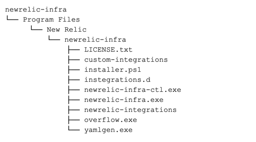

Windows用インフラストラクチャ・エージェントのカスタム・インストール・プロセスでは、インストールのすべての側面をカスタマイズすることができます。ファイルシステム上の好きな場所にファイルやフォルダを置くことができます。

この方法では、 **インストールを完全に制御することができます** 。適切なフォルダにファイルを配置し、適切な設定値を提供し、エージェントにすべての適切な権限を持たせる責任があります。

インストールする前に、 [互換性と要件を確認してください](/docs/infrastructure/install-infrastructure-agent/get-started/requirements-infrastructure-agent) 。

## エージェントのインストール [#windows-manual-install]

エージェントをインストールするには

1. パッケージ化されたエージェントファイル [のダウンロード](https://download.newrelic.com/infrastructure_agent/binaries/windows/) 。

2. ファイルを解凍します。

3. ファイルが以下のような構造で解凍されることを確認してください。

   

4. [サービススクリプトのインストール](#install-service-script).

**オプションで** 、できます。

* [設定ファイルの場所の変更](#change-config-file).
* [プラグインディレクトリの設定](#configure-plugin).
* [エージェントディレクトリの設定](#agent-directory).
* [ログファイルの設定](#log-file).

<Callout variant="important">
  [バージョン 1.4.0](/docs/release-notes/infrastructure-release-notes/infrastructure-agent-release-notes/new-relic-infrastructure-agent-140) の時点で、インフラストラクチャエージェントパッケージには、実行中のエージェントのトラブルシューティングに役立つ `newrelic-infra-ctl` バイナリが追加されています。このバイナリは、エージェントの実行には必要ありませんが、パスに追加することをお勧めします。詳細については、 [troubleshooting a running infrastructure agent](/docs/infrastructure/install-configure-manage-infrastructure/manage-your-agent/troubleshoot-running-agent) に関するドキュメントを参照してください。
</Callout>

## サービススクリプトのインストール [#install-service-script]

インストールを進めるためには、サービスを作成する必要があります。ZIPファイルに同梱されているファイルを参考に確認してください。

```
C:\Program Files\New Relic\newrelic-infra\installer.ps1
```

## 設定ファイル [#change-config-file]

インフラストラクチャエージェントは、エージェントの動作を設定するために、通常 `newrelic-infra.yml` という名前の設定ファイルに依存します。このファイルは、エージェントと同じフォルダに置かれます。

[コンフィグファイルのテンプレート](/docs/infrastructure/new-relic-infrastructure/configuration/infrastructure-config-file-template-newrelic-infrayml) に基づいて、新しいコンフィグファイルを作成することができます。詳細については、 [エージェントの設定方法](/docs/infrastructure/new-relic-infrastructure/configuration/configure-infrastructure-agent) を参照してください。

### 設定ファイルの保存場所の変更

デフォルトでは、設定ファイルは `C:GRAM FILES\New Relic-infra\newrelic-infra.yml` にあります。

設定ファイルの場所を変更するには

1. コマンドを実行する `regedit.exe`.

2. `Computer_HKEY_LOCAL_MACHINE_SYSTEM#CurrentControlSet#Services#newrelic-infra#ImagePath` のフォルダーを参照してください。

3. `ImagePath` キーを取得します。エージェントのバイナリがデフォルトのパスにある場合は、 `C:Program Files\New Relic\Newrelic-infra.exe` からキーを探します。

4. `-config` フラグを使用して、設定ファイルの新しい場所をキーに追加します。

   ```
   C:\Program Files\New Relic\newrelic-infra\newrelic-infra.exe -config c:\config.yaml
   ```

## プラグインディレクトリの設定 [#configure-plugin]

インフラストラクチャエージェントでは、Kubernetes、AWS、MySQL、Redis、Kafkaなどの一般的なサービスからのデータを監視・報告する [インテグレーション](/docs/infrastructure/host-integrations/get-started/introduction-host-integrations) をインストールすることができます。各インテグレーションには独自の設定ファイルがあり、デフォルトでは `integration-name-config.yml` という名前になっています。

この設定ファイルは、あらかじめ定義された場所 `C:Program Files\New Relic\Newrelic-infra\integrations.d` に置かれます。初期化時には、エージェントはこの設定ファイルを読み込みます。

統合設定ファイルの定義済みの場所を上書きするには、次のいずれかの方法を使用します。

* その場所を `NRIA_PLUGIN_DIR` 環境変数に設定します。
* `newrelic-infra.yml` 設定ファイルの `plugin_dir` フィールドを使ってカスタムパスを設定します。
* `newrelic-infra` のバイナリを実行する際に `-plugin_dir` を使って、コマンドライン引数として渡します。

## エージェントディレクトリの設定 [#agent-directory]

エージェントは、インストールされた [インテグレーション](/docs/infrastructure/host-integrations/get-started/introduction-host-integrations) 、キャッシングデータ（インベントリ）などを実行するために、独自に定義されたディレクトリを必要とします。デフォルトの場所は `C:Program Files\New Relic\newrelic-infra\` です。

エージェントディレクトリは、以下のような構造と内容になっています。

* `LICENSE`: New Relic インフラストラクチャエージェントのライセンスを含むテキストファイル。
* `custom-integrations`: インストールされた [custom integrations](/docs/integrations/integrations-sdk/getting-started/introduction-infrastructure-integrations-sdk) を格納するディレクトリ。
* `newrelic-integrations`: [New Relic official integrations を格納するディレクトリ](/docs/infrastructure/host-integrations/get-started/introduction-host-integrations).

また、エージェントはデータを保存するために `app_data_dir` という別のフォルダを使用します。デフォルトでは、 `C:ProgramData\New Relic\newrelic-infra\` を指しています。

エージェントディレクトリの定義済みの場所を上書きするには、次のいずれかの方法を使用します。

* その場所を `NRIA_AGENT_DIR` 環境変数に設定します。
* `newrelic-infra.yml` 設定ファイルの `agent_dir` フィールドを使ってカスタムパスを設定します。
* `newrelic-infra` のバイナリを実行する際に `-agent_dir` を使ってコマンドライン引数として渡します。

## ログファイルの設定 [#log-file]

デフォルトでは、エージェントは `C:Program Files\New Relic\newrelic-infra\newrelic-infra.log` にログファイルを保存します。

ログファイルの定義済みの場所を上書きするには、次のいずれかの方法を使用します。

* 場所は `NRIA_LOG_FILE` 環境変数に設定します。
* `newrelic-infra.yml` 設定ファイルの `log_file` フィールドを使ってカスタムパスを設定します。
* `newrelic-infra` のバイナリを実行する際に、 `-log_file` を使って、コマンドライン引数として渡します。

## 次のステップ [#what-next]

次の設定も可能です。

* [カスタムアトリビュート](/docs/infrastructure/install-infrastructure-agent/configuration/infrastructure-agent-configuration-settings/#custom-attributes) を追加して、インフラストラクチャデータに注釈を付けます。
* [](/docs/integrations/amazon-integrations/get-started/connect-aws-new-relic-infrastructure-monitoring/)サーバーがAmazon EC2でホストされている場合は、AWSアカウントを接続します。
* その他 [New Relic のインフラ統合](/docs/integrations/infrastructure-integrations/get-started/introduction-infrastructure-integrations/) を追加して、外部サービスからデータを収集する。
* 手動で [起動、停止、再起動、またはエージェントの状態を確認](/docs/infrastructure/install-infrastructure-agent/manage-your-agent/start-stop-restart-infrastructure-agent/#windows).