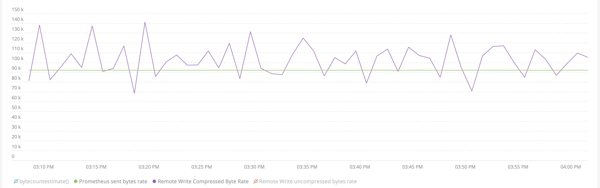
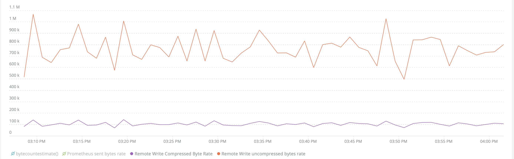

Prometheus のリモートライトからの請求バイトのサイズは、New Relic に送信されるバイトよりも大きくなることがあります。この違いに驚かないためにも、データ圧縮が課金バイトにどのように影響するかを確認することをお勧めします。

## データ圧縮 [#data-compression]

Prometheus のリモート書き込みデータが New Relic に送信される際には、 [圧縮された状態で](https://prometheus.io/docs/prometheus/latest/storage/#remote-storage-integrations) (高速でロスレスな送信のため)送信されます。インジェストされたデータは圧縮解除され、 [エンティティ合成](/docs/new-relic-one/use-new-relic-one/core-concepts/what-entity-new-relic/#entity-synthesis) などの New Relic の機能で適切に使用できるように装飾されます。圧縮されたバイトレートと圧縮されていないバイトレートには差があることが予想されますが、Prometheus Remote Write データの潜在的な差は、New Relic の [課金モデル](/docs/accounts/accounts-billing/new-relic-one-pricing-billing/new-relic-one-pricing-billing/#usage-calculation) のために重要です。

お客様のデータを取り込むのに必要な計算量と、New Relicに保存されたデータのサイズに基づいて請求されます。解凍プロセスとデータ変換の結果、最終的に保存される非圧縮のバイト数は、圧縮されたバイト数の約15倍になることがあります。

例えば、実際のトラフィックをシミュレートする際に収集した時系列データのサンプリングに基づいて、次のように表示されます。

```
~124 GB/day compressed data sent = ~1.86TB uncompressed data stored
```

以下は、Prometheus の読み書きデータが我々のシステムを通過する際のバイトレートの変化をシミュレーションしたものです。このケースでは、ローカルのPrometheusサーバーがローカルのnode-exporterをリモートで書き込んだデータを取り込むことでメトリクスが生成されました。


Prometheusの送信バイト数が、データポイントを解凍する直前に我々が記録したリモートライトの圧縮バイト数とほぼ一致していることに注目してほしい。リモートライトの圧縮バイト数のばらつきが大きくなっているのは、分散システムでのデータ処理の性質によるものだと考えられます。



データポイントが解凍されると、5～10倍の拡大率が、データ解凍の直前と直後に測定した「リモートライトの圧縮データバイトレート」と「リモートライトの非圧縮バイトレート」の差に反映されます。



最後に、データが変換され、エンリッチメントが実行されると、リモートライトの圧縮されていないバイト数と `bytescountestimate()` の差が以下のように見られます。記載されている `bytecountestimate()` は、保存される前のデータの最終状態のバイト数を表しています。

と圧縮されていないバイトの比較")

Prometheusの読み書きデータが通過する可能性のあるデータ変換/追加について理解を深めるために、Prometheusサーバーが報告する指標である `prometheus_remote_storage_bytes_total` の比較を示します。

1つ目はPrometheusが提供する表現、2つ目はNRQLクエリの対応です。

Prometheusサーバーの表現。

```
"prometheus_remote_storage_bytes_total" {
	"instance=""localhost:9090"
	"job=""prometheus"
	"remote_name=""5dfb33"
	"url=""https://staging-metric-api.newrelic.com/prometheus/v1/write?prometheus_server=foobarbaz"
}
23051
```

NRQLクエリの表現

```
"endTimestamp": 1631305327668,
"instance:" "localhost:9090",
"instrumentation.name": "remote-write"
"instrumentation.provider": "prometheus",
"instrumentation.source": "foobarbaz",
"instrumentation.version": "0.0.2",
"job": "prometheus",
"metricName": "prometheus_remote_storage_bytes_total",
"newrelic.source": "prometheusAPI",
"prometheus_remote_storage_bytes_total",
"newrelic.source": "prometheusAPI",
"prometheus_remote_storage_bytes_total": {
	"type": "count",
	"count": 23051
},
"prometheus_server": "foobarbaz",
"remote_name": "5dfb33",
"timestamp": 1631305312668,
"url": "https://staging-metric-api.newrelic.com/prometheus/v1/write?prometheus_server=foobarbaz"
}
```

<Callout variant="tip">
  上記の例は、基本的なコンセプトを説明するために単純化した比較であり、ラベリングや特徴的なメトリクスを平均よりも軽く使用しています。実際のバージョンでは、より複雑であるため、少し違って見えるでしょう。
</Callout>

## NRQLクエリ [#nrql-queries]

バイト数の情報を収集するには、以下のNRQLクエリをお試しください。

New Relicに保存されている推定バイト数を表示します。

```
FROM Metric SELECT rate(bytecountestimate(), 1 minute) AS 'bytecountestimate()' WHERE prometheus_server = <var>INSERT_PROMETHEUS_SERVER_NAME</var> SINCE 1 hour ago TIMESERIES AUTO
```

New Relicに送られるバイトをPrometheusがモニタリング。

```
FROM Metric SELECT rate(sum(prometheus_remote_storage_samples_bytes_total), 1 minute)  AS 'Prometheus sent bytes rate' WHERE prometheus_server = <var>INSERT_PROMETHEUS_SERVER_NAME</var> SINCE 1 hour ago TIMESERIES  AUTO 
```

## 外部参照 [#references]

圧縮とエンコーディングについて説明しているPrometheusやGitHubのドキュメントへの外部リンクを紹介します。

* [Prometheus referencing Snappy Compression being used in encoding](https://prometheus.io/docs/prometheus/latest/storage/#overview): 読み取りプロトコルと書き込みプロトコルは、どちらも HTTP 上で snappy-compressed protocol buffer encoding を使用しています。このプロトコルはまだ安定した API とはみなされておらず、将来的には、Prometheus とリモートストレージ間のすべてのホップが HTTP/2 をサポートしていると安全に想定できるようになった時点で、HTTP/2 上の gRPC を使用するように変更される可能性があります。
* [Prometheus Protobufリファレンス](https://github.com/prometheus/prometheus/blob/main/prompb/types.proto#L58-L64)