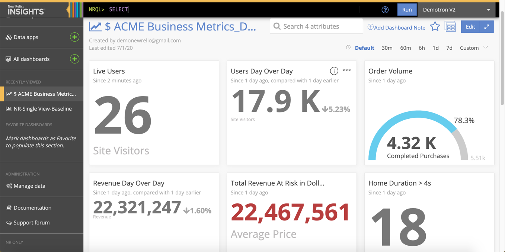

import { Link } from 'gatsby'

<Callout variant="important">
  クエリやチャート作成をさらに行いやすくするには、[New Relic Oneに移行](/docs/new-relic-one/use-new-relic-one/core-concepts/transition-new-relic-one-insights)します。
</Callout>

Insightsは、ソフトウェア分析のための[New Relic One](/docs/new-relic-one/use-new-relic-one/get-started/introduction-new-relic-one)のリソースの1つです。Insightsで次のことを行えます。

* フロントエンドサービスやバックエンドサービス、インフラストラクチャ、デジタルカスタマーエクスペリエンスを含むエコシステム全体でデータを収集する。
* ビジネスについてデータから分かることについて理解する。

InsightsやNew Relic Oneの他のクエリツールを使用して、パフォーマンスやビジネスデータのクエリや可視化を行います。

<LandingPageTileGrid>
  <LandingPageTile
    title="始めてみましょう。"
    icon="fe-check-square"
  >

    * [Insightsの機能](/docs/insights/using-insights-ui/getting-started/introduction-new-relic-insights)について知る。
    * [NRQL構文](/docs/query-data/nrql-new-relic-query-language/getting-started/introduction-nrql)の基本情報とクエリツールの使用方法に関する情報を取得する。
  </LandingPageTile>

  <LandingPageTile
    title="データを扱う。"
    icon="fe-search"
  >

    * エコシステム全体で[データのクエリ](/docs/insights/event-data-sources)を行う。
    * [データ辞書](https://docs.newrelic.co.jp/attribute-dictionary)を使用して、イベントや属性の詳細、その他のデータオブジェクトを詳しく調べる。
  </LandingPageTile>

  <LandingPageTile
    title="データを可視化。"
    icon="fe-bar-chart-2"
  >

    * さまざまな[チャートやダッシュボード](/docs/insights/use-insights-ui/manage-dashboards/create-edit-insights-dashboards)を作成し共有する。
    * [カスタムデータ](/docs/insights/insights-data-sources/custom-data)をクエリに追加し、顧客のコンテキストにビジネスの優先事項や想定される結果を含める。
  </LandingPageTile>
</LandingPageTileGrid>

<Button
  role="button"
  as={Link}
  to="/docs/insights/table-of-contents"
  variant="normal"
>
  すべてのInsightドキュメントを表示
</Button>
