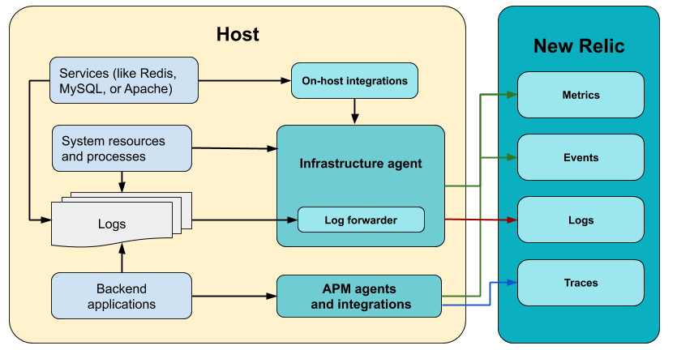

New Relicの[オンホストインテグレーション](/docs/integrations/host-integrations/getting-started/introduction-host-integrations)は、MySQLやApache、Redisなど、ホストで実行しているコアサービスからデータを収集するタイプのInfrastructureインテグレーションです。

セットアップとニーズに応じて、複数の方法でオンホストインテグレーションをインストールできます。すべてのインストール方法と、いつ使用するのが適切かの概要は以下のとおりです。

## 必要なもの [#what-need]

オンホストサービスからデータを収集するには、次の2つのものが必要です：[Infrastructureエージェント](/docs/infrastructure/install-infrastructure-agent/get-started/install-infrastructure-agent)と[オンホストインテグレーション](/docs/integrations/host-integrations/getting-started/introduction-host-integrations)。すべてのオンホストインテグレーションで、Infrastructureエージェントが[ホストにインストールされている](/docs/infrastructure/install-infrastructure-agent/get-started/install-infrastructure-agent)必要があります。システムのデータ収集の他に、エージェントはインテグレーションのデータのフォワーダーとして機能し、[ログ](/docs/logs/enable-log-monitoring-new-relic/enable-log-monitoring-new-relic/forward-your-logs-using-infrastructure-agent)を転送できます。



Infrastructureエージェントとそのインテグレーションは、システムとコアサービスからデータを収集し、New Relicに[ログを転送](/docs/logs/enable-log-monitoring-new-relic/enable-log-monitoring-new-relic/forward-your-logs-using-infrastructure-agent)できます。バックエンドアプリケーションメトリックス（APM）は、別の[APMエージェント](/docs/agents)が収集します。各インテグレーションとフォワーダーがNew Relicデータベース（NRDB）でどのように異なるデータタイプをフィードするかに注意してください。

## インストレーション方法を選択 [#install]

サービスは単一の物理ホストやVM、KubernetesやECSでオーケストレーションされたコンテナで実行できます。どのようなセットアップでも、当社のオンホストインテグレーションは御社の環境に対応し、適切なインストール方法を選択するだけで、データをNew Relicに送信できます。

### オーケストレーションされた環境でサービスを実行している [#orchestrated]

コンテナ化されオーケストレーションされた環境でサービスを実行している場合、次のシナリオを選択します：

*  [Kubernetes にオンホスト インテグレーションをインストールする](/docs/integrations/kubernetes-integration/link-apps-services/monitor-services-running-kubernetes)
*  [ Amazon ECS でオンホストインテグレーションをインストール](/docs/integrations/host-integrations/host-integrations-list/monitor-services-running-amazon-ecs)（EC2 起動タイプ）

オンホスト インテグレーションとECS、 Kubernetes インテグレーションは一緒に実行できます。詳細については、[Kubernetes インテグレーションの概要](/docs/integrations/kubernetes-integration/get-started/introduction-kubernetes-integration)と[ECSインテグレーションの概要](/docs/integrations/elastic-container-service-integration/get-started/introduction-amazon-ecs-integration)をご覧ください。

### オンプレミスまたは単一のVMでサービスを実行している [#standard]

オーケストレーションなしで、またはオンプレミスでサービスを実行している場合、次のシナリオを選択します：

<CollapserGroup>
  <Collapser
    id="windows"
    title={<>MSIファイルを使用してインストール（ Windows Server）</>}
  >
    Windows Server で実行されるサービスのインテグレーションは、.MSI インストーラまたは公式の zip ファイルを使用してインストールできます。MSI インストールをお勧めします。

    1. 最新の .MSI インストーラ イメージは当社の[リポジトリ](http://download.newrelic.com/infrastructure_agent/windows/integrations/)からダウンロードします。
    2. アドミニストレーターのアカウントで、絶対パスを使用してインストールスクリプトを実行します。

       ```
       msiexec.exe /qn /i <var>PATH\TO\integration-name.msi</var>
       ```
    3. `C:\Program Files\New Relic\newrelic-infra\integrations.d\integration-name-config.yml.sample` を `integration-name-config.yml` に変更して、ニーズに応じて変更します。
    4. [Infrastructure エージェントを再起動します](https://docs.newrelic.co.jp/docs/infrastructure/new-relic-infrastructure/configuration/start-stop-restart-check-infrastructure-agent-status)。
  </Collapser>

  <Collapser
    id="apt"
    title={<>aptでインストールする（Debian、Ubuntu）</>}
  >
    `apt`を使用してInfrastructureのオンホストインテグレーションをインストールするには、次の手順を実行します：

    1. まだ無い場合は、ご利用のオペレーティングシステムに合わせた [Infrastructureエージェント](/docs/infrastructure/install-infrastructure-agent/get-started/install-infrastructure-agent-new-relic)をインストールしてください。
    2. コマンドラインから、以下を実行してください。

       ```
       sudo apt-get update
       ```
    3. 以下のコマンドを実行します。コマンドの<var>INTEGRATION_FILE_NAME</var>は、インテグレーションのファイル名を表します。詳細については、[インテグレーションのドキュメント](/docs/integrations/host-integrations/host-integrations-list)をご覧ください。

       ```
       sudo apt-get install <var>INTEGRATION_FILE_NAME</var>
       ```
    4. [特定のオンホストのインテグレーション](/docs/infrastructure/host-integrations/host-integrations-list)に関しては、追加のインストール手順に従ってください。
  </Collapser>

  <Collapser
    id="yum"
    title={<>yumでインストールする（Amazon Linux、CentOS、RHEL）</>}
  >
    `yum`を使用してインテグレーションパッケージをインストールするには、次の手順を実行します：

    1. まだ無い場合は、ご利用のオペレーティングシステムに合わせた [Infrastructureエージェント](/docs/infrastructure/install-infrastructure-agent/get-started/install-infrastructure-agent-new-relic)をインストールしてください。
    2. コマンドラインから、以下を実行してください。

       ```
       sudo yum -q makecache -y --disablerepo='*' --enablerepo='newrelic-infra'
       ```
    3. 以下のコマンドを実行します。コマンドの<var>INTEGRATION_FILE_NAME</var>は、インテグレーションのファイル名を表します。詳細については、[特定のオンホスト インテグレーションのドキュメント](/docs/infrastructure/host-integrations/host-integrations-list)をご覧ください。

       ```
       sudo yum install <var>INTEGRATION_FILE_NAME</var>
       ```
    4. [特定のオンホストのインテグレーション](/docs/infrastructure/host-integrations/host-integrations-list)に関しては、追加のインストール手順に従ってください。
  </Collapser>

  <Collapser
    id="zypper"
    title={<>Zypperでインストール（SLES）</>}
  >
    以下の手順に従い、zypper でオンホストのインテグレーションをインストールしてください。

    1. New Relic Infrastructureがまだ無い場合は、ご利用のオペレーティングシステムに合わせた [Infrastructureエージェント](/docs/infrastructure/install-infrastructure-agent/get-started/install-infrastructure-agent-new-relic)をインストールしてください。
    2. コマンドラインから、以下を実行してください。

       ```
       sudo zypper -n ref -r newrelic-infra
       ```
    3. 以下のコマンドを実行します。コマンドの<var>INTEGRATION_FILE_NAME</var>は、インテグレーションのファイル名を表します。詳細については、[インテグレーションのドキュメント](/docs/integrations/host-integrations/host-integrations-list)をご覧ください。

       ```
       sudo zypper -n install <var>INTEGRATION_FILE_NAME</var>
       ```
    4. [特定のオンホストのインテグレーション](/docs/infrastructure/host-integrations/host-integrations-list)に関しては、追加のインストール手順に従ってください。
  </Collapser>

  <Collapser
    id="tarball"
    title={<>tarball からインストール（その他の distros）</>}
  >
    <Callout variant="tip">
      [ディストリビューションパッケージマネージャを使用して、Infrastructureエージェント](/docs/infrastructure/install-configure-manage-infrastructure/linux-installation/install-infrastructure-linux-using-package-manager)と[オンホストインテグレーション](/docs/integrations/host-integrations/installation/install-host-integrations-built-new-relic)をインストールすることをお勧めします。[エージェントを手動でインストールする](/docs/infrastructure/install-configure-manage-infrastructure/linux-installation/tarball-manual-install-infrastructure-linux)場合は、用意されているtarファイルからオンホストインテグレーションをインストールすることもできます。
    </Callout>

    手動のインストールプロセスは、自動化されていません。手動インストールを選択した場合、異なるファイルを正しいフォルダに入れると共に、エージェントがすべてのインテグレーションを実行する権限を保有していることを確認する必要があります。

    Tarファイルからインテグレーションをインストールするには：

    1. [tarball リポジトリ](https://download.newrelic.com/infrastructure_agent/binaries/linux/amd64/ "新しいウィンドウにリンクが開きます。")からパッケージ化されたインテグレーション ファイルをダウンロードします。
    2. エージェントがインテグレーションの定義、設定、および実行ファイルを見つけることができるように、当社の[インテグレーションのファイル構造と配置ルール](https://docs.newrelic.co.jp/docs/integrations/integrations-sdk/getting-started/integration-file-structure-activation)に従ってTarファイルを解凍します。
    3. 定義ファイルを含むバイナリを[エージェントディレクトリ](https://docs.newrelic.co.jp/docs/infrastructure/install-configure-manage-infrastructure/linux-installation/tarball-manual-install-infrastructure-linux#agent-directory)の`newrelic-integrations`または`custom-integrations`に配置します。
    4. インテグレーションの設定ファイルを[プラグインディレクトリ](https://docs.newrelic.co.jp/docs/infrastructure/install-configure-manage-infrastructure/linux-installation/tarball-manual-install-infrastructure-linux#configure-plugin)の下に配置します。

    `nrjmx`ツールが必要なインテグレーションについては、次の追加の指示に従います:

    #### New Relic JMX ツールの使用 [#nrjmx]

    一部のインテグレーション（[JMX](/docs/integrations/host-integrations/host-integrations-list/jmx-monitoring-integration)、[Cassandra](/docs/integrations/host-integrations/host-integrations-list/cassandra-monitoring-integration)、[Kafka](/docs/integrations/host-integrations/host-integrations-list/kafka-monitoring-integration)など）には、`nrjmx`ツールが必要です。インテグレーションでこのツールが必要な場合は、[当社のリポジトリ](https://download.newrelic.com/infrastructure_agent/binaries/linux/noarch/)からダウンロードして解凍します。

    <Callout variant="important">
      `nrjmx`には、Java 8またはそれ以降が必要です。
    </Callout>

    JMXインテグレーションバージョン2.3.3以上、およびCassandraインテグレーションバージョン2.3.0では、`nrjmx`ツールは依存関係として含まれています。このため、パッケージマネージャを使用する場合、`nrjmx`ツールを手作業でインストールする必要はありません。

    `nrjmx`がすでにインストールされており、`nri-jmx`をインストールする場合、当社の JMX はすでにインストールされたバージョンを保持します。`nrjmx`がまだインストールされていない場合、最新の`nrjmx`リリースを取得します。

    `nrjmx`のデフォルトの場所は`/usr/bin/nrjmx/*`です。別の場所にインストールするには、`NR_JMX_TOOL`環境変数に新しいパスを設定します。
  </Collapser>
</CollapserGroup>

## エージェントの更新 [#upgrade]

オンホストインテグレーションが最新の状態であり続けるよう、通常の手順に従い[オンホストのインテグレーションパッケージをアップデートしてください](/docs/infrastructure/host-integrations/installation/update-infrastructure-host-integration-package)。

## その他のヘルプ [#support]

さらに支援が必要な場合は、これらのサポートと学習リソースを確認してください：

* [Explorers Hub](https://discuss.newrelic.com/)を参照して、コミュニティから支援を受け、ディスカッションに参加してください。
* [当社のサイトで回答を見つけ、サポートポータルの使用方法について学びます](/docs/using-new-relic/welcome-new-relic/get-started/find-help-use-support-portal)。
* Linux、Windows、およびmacOSのトラブルシューティングツールである[New Relic Diagnosticsを実行します](/docs/using-new-relic/cross-product-functions/troubleshooting/new-relic-diagnostics)。
* New Relicの[データセキュリティ](/docs/security)と[ライセンス](/docs/licenses)ドキュメントを見直してください。
