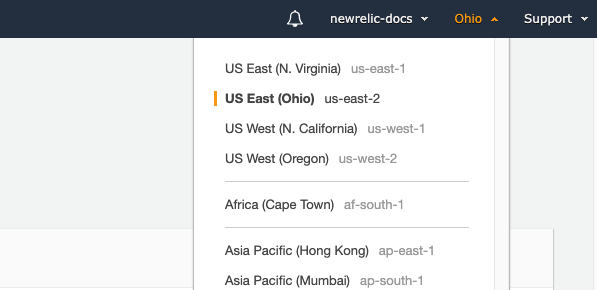

[Amazon S3 バケット](https://aws.amazon.com/s3/) を、弊社の AWS Lambda 関数 `NewRelic-log-ingestion-s3` を使って New Relic に送信することができます。これは、AWS Serverless アプリケーションリポジトリから簡単にデプロイできます。

S3バケットからNew Relicにログを転送することで、ログデータの収集、処理、探索、問い合わせ、アラートなどのログ管理機能が強化されます。

## ラムダ関数のインストール [#install-function]

S3のログをNew Relicに転送するLambda関数をインストールすること。

1. [New Relic のライセンスキーがあることを確認してください](/docs/accounts/install-new-relic/account-setup/license-key) 。
2. [AWS Serverless Application Repository](https://serverlessrepo.aws.amazon.com/applications) をブラウザで開きます。
3. S3バケットと同じリージョンにLambdaがインストールされていることを確認します。 
4. `newrelic` を検索してチェック **Show apps that create custom IAM roles or resource policies** を検索してチェック `NewRelic-log-ingestion-s3`.
5. `NewRelic-log-ingestion-s3` の詳細をクリックし、 **Deploy** をクリックします。
6. **Application settings** にスクロールして、New Relic のライセンスキーを入力します]。
7. Lambda 関数の環境変数として `logtype` を指定することで、New Relic のログ解析機能を利用することができます。詳しくは、 [Built-in parsing rulesets](/docs/logs/new-relic-logs/ui-data/new-relic-logs-parsing-built-rules-custom-parsing#built-in-rules) をご覧ください。
8. アプリがカスタムIAMロールを作成することを確認して、「 **Deploy」をクリックします。**
9. 関数がデプロイされたら、 [Lambdaトリガーを作成します](#create-trigger).

### Serverless Frameworkを使った手動インストール [#serverless-install]

[Serverless](https://www.npmjs.com/package/serverless) Frameworkを使って、ターミナルから手動でLambdaをインストールし、設定することができます。Linuxでない場合は、 [Docker](https://docs.docker.com/get-docker/) を最初にインストールして、それを実行しておいてください。

```
# Clone the repository
git clone https://github.com/newrelic/aws_s3_log_ingestion_lambda.git
# Install <a href="https://www.npmjs.com/package/serverless">Serverless</a> and the repo dependencies
npm install -g serverless
npm install
# Set the New Relic License Key env variable
export LICENSE_KEY=<var>YOUR_NEWRELIC_LICENSE_KEY</var>
# Set the logtype (optional)
export LOG_TYPE=<var>YOUR_LOGTYPE</var>
# Set the S3 bucket name
export S3_BUCKET_NAME=<var>YOUR_S3_BUCKET_NAME</var>
# The S3 subdirectory (optional)
export S3_PREFIX=<var>YOUR_S3_SUBDIRECTORY</var>
# Choose a name for your new Serverless Framework service
export SERVICE_NAME=<var>YOUR_SERVICE_NAME</var>
# Deploy the function, specifying the same region as your S3 bucket listed above
serverless deploy --region <var>YOUR_AWS_REGION</var>
```

## AWSでのLambdaトリガーの作成 [#create-trigger]

ログをNew Relicにストリーミングするには、Lambdaにトリガーを取り付けます。

1. 左側のメニューで「 **Functions** 」をクリックします。
2. 以前に作成した `NewRelic-s3-log-ingestion` 関数を探して選択します。
3. **Designer** の下で、 **Add Triggers** をクリックし、ドロップダウンから **S3** を選択します。
4. New Relicに送信したいログが入っているS3バケットを選択します。
5. オプションで、 [プレフィックスとサフィックス](https://aws.amazon.com/blogs/compute/amazon-s3-adds-prefix-and-suffix-filters-for-lambda-function-triggering/) を設定します。これは、ログがサブディレクトリにある場合に便利です。
6. **Enable trigger** のチェックボックスにチェックを入れ、 **Add** trigger を追加します。

Lambda関数をテストするには、関数の設定で設定したS3バケットに新しいログファイルをアップロードし、 [ログデータを見る](#find-data) 。

## 制限 [#limitations]

* サポートされているログファイルの最大サイズは、非圧縮で35MBです。
* サポートされている個々のログラインの最大サイズは0.25MBです。
* 暗号化されたログファイルには対応していません。

## ログデータの閲覧 [#find-data]

すべての設定が正しく行われ、データが収集されていれば、この2つの場所にデータログが表示されるはずです。

* [New Relic Logs UI](https://one.newrelic.com/launcher/logger.log-launcher)
* New Relic tools for running [NRQL queries](/docs/chart-builder/use-chart-builder/choose-data/use-advanced-nrql-mode-specify-data).

例えば、次のようなクエリを実行することができます。

```
SELECT * FROM Log
```

## トラブルシューティング [#troubleshooting]

ログフォワーダーの設定で問題が発生した場合は、以下のトラブルシューティングをお試しください。

<CollapserGroup>
  <Collapser
    className="freq-link"
    id="config-overlap"
    title="コンフィグレーションのオーバーラップ"
  >
    Lambda関数をデプロイする際に、このエラーが発生することがあります。

    ```
    An error occurred when creating the trigger: Configurations overlap. Configurations on the same bucket cannot share a common event type.
    ```

    この問題を解決するには、バケットが同じタイプの別のイベントを持っていないことを確認します。あなたのS3バケットは、 **の複数のインスタンスを持つことはできません。 All object create events**.
  </Collapser>

  <Collapser
    className="freq-link"
    id="cannot-connect"
    title="Docker デーモンに接続できない"
  >
    Serverlessを使用して、自分のマシンからLambda関数をデプロイすると、このエラーが発生することがあります。

    ```
    Error: docker: Cannot connect to the Docker daemon at unix:///var/run/docker.sock. Is the docker daemon running?
    ```

    これは、Dockerが起動していないか、正しく設定されていないことを意味している可能性があります。Serverlessを使ってLambda関数をデプロイする際には、Dockerがマシン上で動作していることを確認してください。
  </Collapser>

  <Collapser
    className="freq-link"
    id="no-data"
    title="データが表示されない"
  >
    当社のログ管理機能を有効にしてもデータが表示されない場合は、当社の [標準的なログのトラブルシューティング手順](/docs/logs/log-management/troubleshooting/no-log-data-appears-ui/) に従ってください。
  </Collapser>
</CollapserGroup>

## 次のステップ [#what-next]

[New Relic One UI](/docs/logs/log-management/ui-data/use-logs-ui/) を使って、プラットフォーム全体のロギングデータを調べることができます。

* [logs in context](/docs/logs/enable-log-management-new-relic/configure-logs-context/configure-logs-context-apm-agents/) の機能を使ってログを転送することで、アプリケーションとプラットフォームの両方のパフォーマンスデータをより深く把握することができます。
* [アラートの設定](/docs/alerts-applied-intelligence/new-relic-alerts/alert-conditions/create-alert-conditions/).
* [データのクエリ](/docs/query-your-data/explore-query-data/get-started/introduction-querying-new-relic-data/) と [ダッシュボードの作成](/docs/query-your-data/explore-query-data/dashboards/introduction-dashboards/).