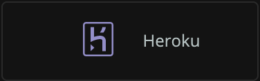

ログデータがすでにHerokuのビルトイン [Logplex](https://devcenter.heroku.com/articles/logplex) ルーターによって監視されている場合は、私たちの統合を利用して、New Relicでログデータを転送し、エンリッチすることができます。この統合は、 [Heroku Syslog drains](https://devcenter.heroku.com/articles/log-drains#syslog-drains) を使用しています。

HerokuのログをNew Relicに転送することで、ログ管理機能が強化され、ログデータの収集、処理、探索、クエリ、アラートなどが可能になります。

## Heroku Syslog drainの作成 [#create-syslog-drain]

ログ管理機能を有効にするには、まずHeroku Syslog drainを作成します。

1. New Relic のユーザーアカウントに、 [Admin ロール](/docs/accounts/original-accounts-billing/original-users-roles/users-roles-original-user-model/#roles) が割り当てられていることを確認してください。

2. [Heroku CLI](https://devcenter.heroku.com/articles/heroku-cli#download-and-install) をダウンロードしてインストールします。

3. Heroku CLIを使用してSyslog drainを作成し、ログをストリームするアプリケーションに添付します。 `YOUR_APP_NAME` をHerokuアプリケーションの名前に置き換えます。

   ```
   $ heroku drains:add syslog+tls://newrelic.syslog.nr-data.net:6515 -a <var>YOUR_APP_NAME</var>
   ```

4. 以下のコマンドを実行し、Heroku Syslog [drain token](https://devcenter.heroku.com/articles/log-drains#drain-tokens) を `token` 属性からコピーします。

   ```
   $ heroku drains -a <var>YOUR_APP_NAME</var>--json

   ```

   ```
   {
   "addon": null,
   "created_at": "2018-12-04T00:59:46Z",
   "id": "906262a4-e151-45d2-b35a-a2dc0ea9e688",
   "token": "d.f14da5dc-106b-468d-b1bd-bed0ed9fa1e7",
   "updated_at": "2018-12-04T00:59:47Z",
   "url": "syslog+tls://newrelic.syslog.nr-data.net:6515
   }
   ```

## Heroku Syslog drainの登録 [#register-syslog]

次に、新しく作成したHeroku Syslog drainをNew Relicに登録する必要があります。

1. [New Relic Logs](https://one.newrelic.com/launcher/logger.log-launcher) にログインし、 **Add more data sources** をクリックします。

   

2. **Heroku** **Log ingestion** の下のタイルをクリックします。

   

3. HerokuアプリケーションのログをストリーミングするNew Relicアカウントを選択し、 **Continue** をクリックします。

4. **Heroku drain token** の欄に、新しく作成したHeroku drain tokenを貼り付けます。

5. **Add Heroku drain log** をクリックして登録を完了します。

<Callout variant="important">
  Herokuは現在、Logplexから送信されるログのフォーマットのカスタマイズをサポートしていません。詳しくは、 [Heroku's log format documentation](https://devcenter.heroku.com/articles/logging#log-format) をご覧ください。
</Callout>

## ログデータの閲覧 [#find-data]

すべての設定が正しく行われ、データが収集されていれば、この2つの場所にデータログが表示されるはずです。

* [New Relic Logs UI](https://one.newrelic.com/launcher/logger.log-launcher)
* NRQL クエリを実行するための New Relic ツール [NRQL クエリを実行するための New Relic ツール](/docs/chart-builder/use-chart-builder/choose-data/use-advanced-nrql-mode-specify-data) 。例えば、以下のようなクエリを実行することができます。

```
SELECT * FROM Log
```

当社のログ管理機能を有効にしてもデータが表示されない場合は、当社の [標準的なログのトラブルシューティング手順](/docs/logs/log-management/troubleshooting/no-log-data-appears-ui/) に従ってください。

## 次のステップ [#what-next]

[New Relic One UI](/docs/logs/log-management/ui-data/use-logs-ui/) を使って、プラットフォーム全体のロギングデータを調べることができます。

* [logs in context](/docs/logs/enable-log-management-new-relic/configure-logs-context/configure-logs-context-apm-agents/) の機能を使ってログを転送することで、アプリケーションとプラットフォームの両方のパフォーマンスデータをより深く把握することができます。
* [アラートの設定](/docs/alerts-applied-intelligence/new-relic-alerts/alert-conditions/create-alert-conditions/).
* [データのクエリ](/docs/query-your-data/explore-query-data/get-started/introduction-querying-new-relic-data/) と [ダッシュボードの作成](/docs/query-your-data/explore-query-data/dashboards/introduction-dashboards/).