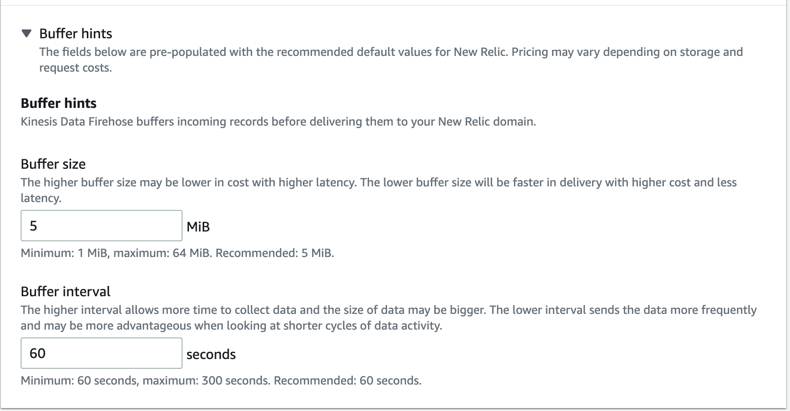

ログデータがすでに [Amazon CloudWatch Logs](https://docs.aws.amazon.com/AmazonCloudWatch/latest/logs/WhatIsCloudWatchLogs.html) によって監視されている場合、当社の Kinesis Data Firehose 統合を使用して、New Relic でログデータを転送し、エンリッチすることができます。Kinesis Data Firehose は、当社のプラットフォームを含むさまざまな宛先にデータをリアルタイムにストリーミングできるサービスです。

CloudWatch LogsやKinesisストリームに対応した他のログをNew Relicに転送することで、ログデータの収集、処理、探索、問い合わせ、アラートなどのログ管理機能を強化することができます。

## New Relic の配信ストリームを作成します。 [#create-delivery-stream]

Kinesis Data FirehoseからNew Relicにログを転送するために。

1. [New Relic のライセンスキーがあることを確認してください](/docs/apis/intro-apis/new-relic-api-keys/#ingest-license-key) 。

2. 手順に従い、 [Amazon Kinesis Data Firehose の配信ストリームを作成](https://docs.aws.amazon.com/firehose/latest/dev/basic-create.html) 、配信先として New Relic を選択します。AWSマネジメントコンソールで、 **Amazon Kinesis** にアクセスします。

3. **Kinesis Data Firehose** を選択し、 **Create delivery stream** をクリックします。

4. ストリームの名前を入力し、データソースを選択します。

5. 送信先を選択する際、 **サードパーティパートナー** をクリックし、 **New Relic をクリックします。**

   

6. **HTTP エンドポイント URL** の下で、ドロップダウンから **New Relic logs - US** を選択します。

   **注**: EUにログを送信するには、このセクションの残りの手順を完了してから、 [EUアカウントの設定手順](#configure-eu-stream) に進んでください。

7. [ライセンスキー](/docs/apis/intro-apis/new-relic-api-keys/#ingest-license-key) を **API キー** フィールドに貼り付けます。

8. `1 MiB` `Buffer hints/Buffer size` でバッファサイズを設定してください。なお、 `Buffer hints` のセクションは、デフォルトでは折りたたまれています。より詳しい説明は、 [the buffer settings section](#buffer-settings) をご覧ください。

9. 残りのメタデータの設定を行い、確認します。

AWSマネジメントコンソールで追加したオプションのキー/バリューペアは、New Relicで使用できる属性/バリューペアになります。

Kinesis Data Firehoseは、各HTTPコールにこれらのキー・バリュー・ペアを含みます。これらの [Kinesis Firehose Parameters](https://docs.aws.amazon.com/firehose/latest/dev/create-destination.html#create-destination-new-relic) は、目的地を特定して整理するのに役立ちます。

## EUのアカウントにログを送信するようにストリームを設定する [#configure-eu-stream]

EUのデータセンターでNew Relicアカウントをお持ちの方。

1. 標準的な手順に従って、 [デリバリーストリームを作成する](#create-delivery-stream).

2. ストリームが作成されたら、 [Amazon Kinesis Console](https://console.aws.amazon.com/kinesis/) に移動し、 **Delivery streams** をクリックします。

3. 新しく作成した配信ストリームの名前をクリックして、 **Configuration** タブを選択します。

4. **Destination settings** セクションの横で、 **Edit** をクリックします。

5. **HTTPエンドポイントのURL** の値をEUアカウント用のFirehoseエンドポイントに更新してください。

   ```
   https://aws-api.eu.newrelic.com/firehose/v1
   ```

6. **Save changes** をクリックすると、ストリームが更新されます。

## ログデータの閲覧 [#find-data]

すべての設定が正しく行われ、データが収集されていれば、この2つの場所にデータログが表示されるはずです。

* [New Relic Logs UI](https://one.newrelic.com/launcher/logger.log-launcher)
* NRQL クエリを実行するための New Relic ツール [NRQL クエリを実行するための New Relic ツール](/docs/chart-builder/use-chart-builder/choose-data/use-advanced-nrql-mode-specify-data) 。例えば、以下のようなクエリを実行することができます。

```
SELECT * FROM Log
```

当社のログ管理機能を有効にしてもデータが表示されない場合は、当社の [標準的なログのトラブルシューティング手順](/docs/logs/log-management/troubleshooting/no-log-data-appears-ui/) に従ってください。

## バッファ構成の特記事項 [#buffer-settings]

AWSのLogsに当社のKinesis Firehoseインテグレーションを選択すると、ウィザードは画面の下に `Buffer hints` 、という小さなセクションを隠します。このセクションには、 `Buffer size` と `Buffer interval` という2つの非常に重要な設定オプションが含まれています。



デフォルト値は、 `Buffer size` が 5 MiB で、 `Buffer interval` が 60 seconds です。つまり、Firehose はログが 5 MiB のデータを含むか、最後に New Relic にフラッシュされてから 60 秒経過するまでログを蓄積します。 **これらのデフォルト設定は New Relic には適していないため、** 、 **1 MiB を `Buffer size`** に使用することを強くお勧めします。

なぜこれを推奨するのか？New Relic は、Logs API への個々の HTTP リクエストに対して、最大で [1 MiB](/docs/logs/log-api/introduction-log-api/#limits) のペイロードを受け入れます。一定の60秒の蓄積期間中に、蓄積されたログのサイズが1MiBを超えた場合、 `413` HTTPエラーでそれらのログを拒否します。

## 次のステップ [#what-next]

[New Relic One UI](/docs/logs/log-management/ui-data/use-logs-ui/) を使って、プラットフォーム全体のロギングデータを調べることができます。

* [logs in context](/docs/logs/enable-log-management-new-relic/configure-logs-context/configure-logs-context-apm-agents/) の機能を使ってログを転送することで、アプリケーションとプラットフォームの両方のパフォーマンスデータをより深く把握することができます。
* [アラートの設定](/docs/alerts-applied-intelligence/new-relic-alerts/alert-conditions/create-alert-conditions/).
* [データのクエリ](/docs/query-your-data/explore-query-data/get-started/introduction-querying-new-relic-data/) と [ダッシュボードの作成](/docs/query-your-data/explore-query-data/dashboards/introduction-dashboards/).