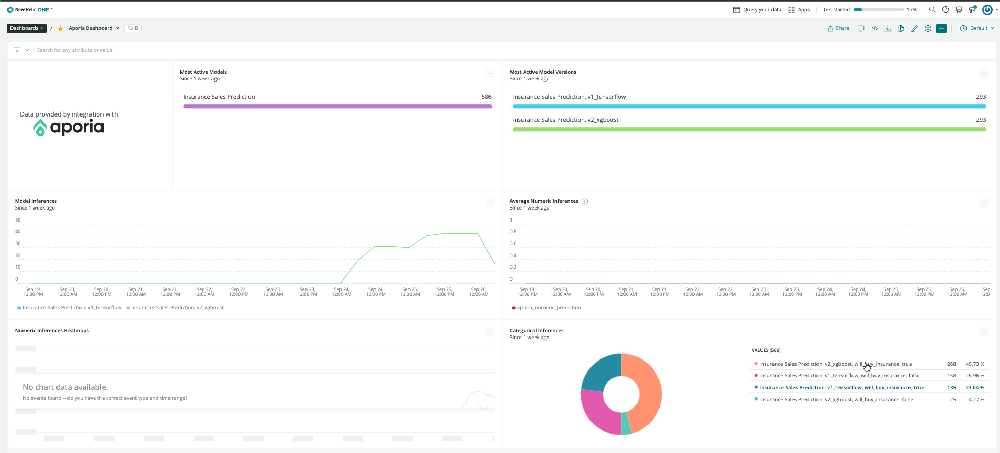
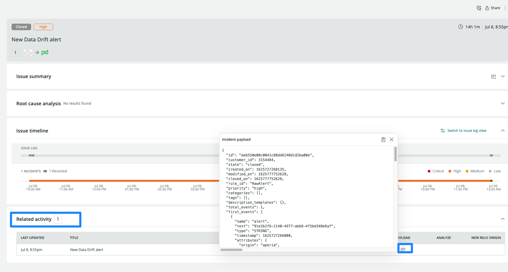

Aporiaは、データサイエンスチームが運用中の機械学習モデルを監視するための、速くて簡単で安全な方法です。Aporiaを使えば、チームはカスタマイズ可能な独自のモニターを数分で構築し、データドリフト、予期せぬバイアス、データ整合性の問題、パフォーマンスの低下などの問題を早期に発見するためのライブアラートを受け取ることができます。また、Aporiaには、さらなる調査と根本原因の分析を可能にする調査ツールボックスがあります。 [Aporiaについての詳細はこちら](https://www.aporia.com).

Aporiaは現在、New Relicとの統合により、 [MLOps](/docs/alerts-applied-intelligence/mlops/get-started/intro-mlops/) インフラストラクチャの完全なモデル管理を提供しており、推論調査を示すNew Relic内のカスタマイズされたダッシュボードを提供しています。

## AporiaとNew Relicの統合 [#integrate-aporia]

Aporiaでは、Aporiaのモニターが生成したアラートをNew Relicのインシデント・インテリジェンス・エンジンと予測データに接続することで、モデルの総合的なモニタリング・ダッシュボードをNew Relicで作成することができます。

1. **Aporiaのコンソールにログイン**: 左側のナビバーで **Integrations** をクリックし、 **New Relic** を選択します。
2. **New Relic のアカウントにログインします。** Log into **[one.newrelic.com](https://one.newrelic.com)** and click on **Explorer**.上部の角にあるメインナビゲーションメニューで、 **+Add more data** をクリックします。
3. **Aporia をクリック:** 検索バーで **Aporia** と入力するか、MLOps Integration セクションにスクロールダウンして **Aporia アイコンをクリック** 。
4. **Select your account ID:** Aporiaに統合させたいアカウントIDを選択してください。
5. **Get an API key:** Aporiaのアイコンをクリックしたら、ステップ1に従って **Select** or **Create API key**, under **Prediction data**.新しいAPIキーを作成するか、既存のAPIキーを使用する必要があります。
6. **Get an Auth Token:** オプションとして、Aporia からのメトリックアラートを New Relic に送ってインテリジェントな相関を取ることもできます。これを行うには、 **Model quality metric alerts** の下にある **Copy icon** をクリックしてauth tokenをコピーします。
7. **Aporiaにキーとトークンを貼り付けます:** 今度はAporiaのダッシュボードに行き、New Relic Integrationの画面の下で、 **New Relic insert token** の下にキーを貼り付けます。Auth Tokenもコピーした場合は、このキーを **New Relic Incident Intelligence Token** にペーストします。貼り付けたら、 **Save** をクリックします。
8. **Verify tokens:** Aporiaのダッシュボードで、 **Verify tokens** ボタンをクリックして、キーとトークンの両方が正常に動作していることを確認します。 **緑の** チェックマーク、または **赤の** エラーマークが表示され、ステータスを示すはずです。

## Aporiaで機械学習モデルを監視する

New Relic と Aporia を統合したことで、 [ダッシュボード](/docs/query-your-data/explore-query-data/dashboards/introduction-dashboards/) Aporia が作成した自動チャートを使ってデータを監視することができます。

1. **Go to the integration dashboard:** トークンを確認し、統合が正しく設定されていることを確認したら、New Relic統合ダッシュボードに戻り、 **See your data** をクリックします。これにより、New RelicでAporiaに報告されたデータを表示する自動生成ダッシュボードにリダイレクトされます。
2. **Aporiaのダッシュボードを分析する** New Relicに登録されたAporiaのダッシュボードには6つのチャートがあります。

* **Most active models** チャートには、選択したタイムフレームで予測を報告したさまざまなモデルが表示されます。
* **Most active model versions** チャートには、選択した時間枠で予測を報告したさまざまなバージョンが表示されます。
* **Model inferences** グラフには、各モデルとバージョンについて報告されたユニークな予測の数が表示されます。
* **Average numeric inferences** チャートには、各モデルとバージョンで報告された平均値の数値予測が表示されます。
* **Numeric inferences heatmaps** チャートには、各モデルとバージョンについて報告された数値予測のヒストグラムが表示されます。
* **Categorical inferences** チャートには、各モデルおよびバージョンで報告されたカテゴリー別予測の異なる固有値とその頻度が表示されます。

3. **Filter data:** **...** ボタンをクリックし、 **Edit** をクリックします。右のナビバーで、 **User as filter** の下で、 **Filter the current dashboard** を有効にし、 **Save** をクリックします。
4. **アラート通知の設定：** ダッシュボードをいくつか作成したら、データにアラートを出すことができます。チャートから NRQL アラート条件を作成するには、チャートウィジェットをクリックし、 **Create alert condition** をクリックします。条件に名前を付けてカスタマイズしたら、それを既存のポリシーに追加したり、新しいポリシーを作成することができます。

5. **Get notified:** アラート条件を作成したら、どのように通知するかを選択できます。通知チャンネルの設定方法については、 [のドキュメントを参照してください](/docs/alerts-applied-intelligence/new-relic-alerts/alert-notifications/notification-channels-control-where-send-alerts/) 。
6. **インシデントを相関させる：** 通知に加えて、Incident Intelligenceを使用してインシデントを相関させることができます。 [決定事項を使用してインシデントを相関させる方法については、ドキュメントを参照してください](/docs/alerts-applied-intelligence/applied-intelligence/incident-intelligence/change-applied-intelligence-correlation-logic-decisions/) 。

