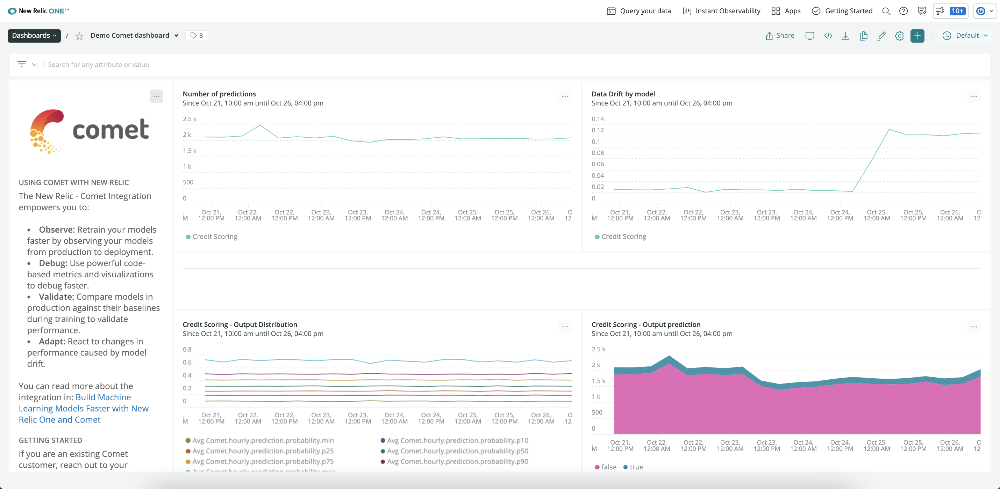

[Comet](https://www.comet.ml/site/) は、 [MLOps](/docs/alerts-applied-intelligence/mlops/get-started/intro-mlops/) プラットフォームで、機械学習モデルにフルスタックの観測可能性を拡張し、モデルのパフォーマンスに基づいて本番のパフォーマンスベースラインを確立することができます。Cometの統合により、機械学習メトリクスをNew Relicと統合することができ、機械学習のライフサイクル全体にわたってデータを継続的に監視することができます。これにより、モデルの最適なパフォーマンスを確保し、より良いビジネス成果を達成することができます。

## CometとNew Relicの統合 [#integrate-comet]

New Relic の Comet インテグレーションを使用すると、より優れた精度の機械学習モデルの構築に役立つデータやインサイトを取得できるだけでなく、チーム全体の生産性、コラボレーション、可視性を向上させることができます。

連携を設定するには、以下の手順で行います。

1. **New Relic のアカウントにログイン**: **[one.newrelic.com](https://one.newrelic.com)** をクリックし、 **Explorer** をクリックします。上の方にあるメインナビゲーションメニューで、 **+Add more data** をクリックします。
2. **Comet** をクリック : 検索バーに **Comet** と入力するか、「MLOps Integration」セクションまでスクロールダウンして **Comet** アイコンをクリックします。
3. **Cometに統合させたいアカウントID** を選択してください。
4. **API キーの選択または作成**: Comet と統合するには、 [New Relic ライセンスキーが必要です](/docs/apis/intro-apis/new-relic-api-keys/#ingest-license-key) 。 **Real time training metric** のセクションで既存の API キーを作成または選択します。

5. **Comet へのお問い合わせ**: 統合を設定し、Comet で Model Production Monitoring ダッシュボードを表示するための次のステップとして、 [Comet へのお問い合わせ](mailto:sales@comet.ml) が必要となります。Cometチームは、統合プロセスの各ステップを説明し、すべてのセットアップを行います。

6. **インサイトを見る**: 統合の設定が完了したら、機械学習モデルのパフォーマンスを専用の [New Relic One ダッシュボード](/docs/query-your-data/explore-query-data/dashboards/introduction-dashboards/) で追跡することができます。このダッシュボードは Comet のチームによって自動的に生成されます。

