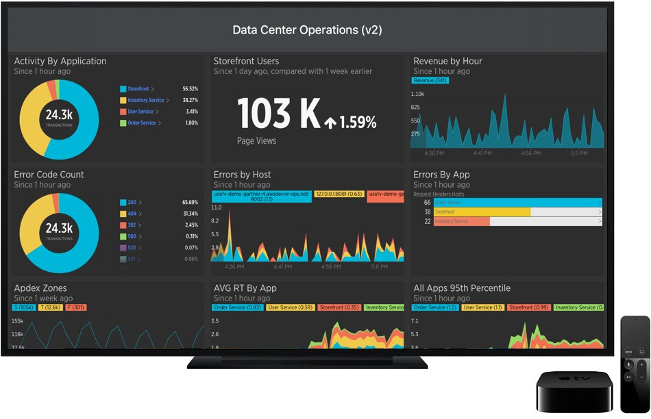

Apple TV用のNew Relicアプリは、 [New Relic Dashboards](/docs/query-your-data/explore-query-data/dashboards/introduction-dashboards) のデータに簡単にアクセスできます。これは例えば、重要なデータをキオスクや会議室など、チームや顧客にデータの傾向を見てもらいたい場所に表示するのに便利です。

<figcaption>
  **New Relic for Apple TV**: アカウントのダッシュボード、お気に入りのダッシュボード、またはデータアプリを検索して表示し、スライドショーを作成してディスプレイ上で循環させることができます。
</figcaption>

## 互換性および要件 [#compatibility-requirements]

New Relic Apple TV アプリをインストールして使用するには、 [Apple TV (第 4 世代)](https://www.apple.com/apple-tv-4k/) が必要です。お客様のアカウントタイプに応じて、追加のログイン要件が適用される場合があります。

<table id="account-reqs">
  <thead>
    <tr>
      <th width={200}>
        **New Relicのアカウントタイプ**
      </th>

      <th>
        **要件**
      </th>
    </tr>
  </thead>

  <tbody>
    <tr>
      <td>
        New Relicのパートナーアカウントをお持ちの方
      </td>

      <td>
        パートナーアカウントは、 [パートナー認証プロセス](/docs/mobile-monitoring/new-relic-mobile-apps/mobile-app-features/authentication-partner-saml-sso-accounts) を完了した後、iPhoneアプリ を通じてApple TVアプリ [にログインする必要があります。](#log-in-via-iphone)

        
      </td>
    </tr>

    <tr>
      <td>
        [SAML-SSOが有効なアカウントを持つユーザー](/docs/mobile-apps/new-relic-mobile-apps/authentication-alerts/user-settings-authentication)
      </td>

      <td>
        Apple TVアプリ [にiPhoneアプリ](#log-in-via-iphone) からログインする必要があります。
      </td>
    </tr>

    <tr>
      <td>
        既存のユーザー
      </td>

      <td>
        New Relic のユーザー名とパスワードでログインします。ダッシュボード、ウィジェット、アカウントは、サインインすると New Relic メニューに表示されます。
      </td>
    </tr>
  </tbody>
</table>

## インストールとログイン [#install-log-in]

[お客様のアカウントタイプによっては、追加のログイン要件](#account-reqs) が適用される場合があります。 [New Relic Apple TV アプリのリリースノート](/docs/release-notes/mobile-apps-release-notes/new-relic-tvos-release-notes) を見て、最新バージョンであることを確認してください。

New Relic Apple TVアプリをインストールしてログインすること。

1. [Apple TVアプリストア](https://support.apple.com/guide/tv/find-apps-atvb5a7dd799/tvos) からアプリをダウンロードしてください。

2. New Relic のユーザー名とパスワードでログインします。

   または

   [New Relic iPhone アプリ](/docs/mobile-apps/new-relic-mobile-apps/ios-app/introduction-ios-mobile-app) の認証情報を使用して、 **New Relic iPhone アプリ> Accounts settings> TV アイコン** を選択し、画面に表示されるコードを入力してログインします。\[#log-in-via-iphone] (英語)

## アプリの特徴 [#features]

New Relic Apple TV アプリは、New Relic One ウェブサイトで作成したダッシュボードを閲覧したり、ダッシュボードのスライドショーを作成することができるコンパニオンアプリです。情報はリアルタイムで更新されるため、常に最新のイベントや指標にアクセスすることができます。機能は以下の通りです。

<table>
  <thead>
    <tr>
      <th width={200}>
        機能
      </th>

      <th>
        説明
      </th>
    </tr>
  </thead>

  <tbody>
    <tr>
      <td>
        スライドショーの実行
      </td>

      <td>
        任意のダッシュボードをスライドショーに追加し、ユーザーが設定した間隔で各ダッシュボードを循環させることができます。
      </td>
    </tr>

    <tr>
      <td>
        ダッシュボードの表示とドリルダウン
      </td>

      <td>
        * すべてのアカウントやお気に入りのダッシュボードを検索・表示できます。

        * ダッシュボードの各ウィジェットを展開すると、詳細が表示されます。

        * ダークモードに切り替える。ライトモードからダークモードに切り替えるには

          * Apple TVでSiriを起動し、 **ダークモード** と言ってください。

          または

          * **「設定」> 「一般」> 「外観」** に移動し、 **「暗」** を選択します。 tvOS 11 以降では、日没と日の出の時刻に合わせて、暗モードと明モードを自動的に切り替えることができます。
      </td>
    </tr>

    <tr>
      <td>
        アカウントの切り替え
      </td>

      <td>
        ユーザー名に関連するどのアカウントにも切り替えることができます。アカウントを切り替えるには

        1. メインメニューから、ユーザー名を選択します。
        2. リストからアカウントを選択します。
      </td>
    </tr>

    <tr>
      <td>
        ユーザー切り替え
      </td>

      <td>
        あなたのユーザー名に関連するすべてのNew Relicアカウントとダッシュボードが自動的に表示されます。

        * デバイスからログアウトするには： **メインメニュー> （選択したユーザー名）> ログアウト**.
        * ユーザーを切り替えるにはログアウトしてから、新しいアカウントでログインします。
      </td>
    </tr>
  </tbody>
</table>

## データプライバシー [#privacy]

トラブルシューティングを容易にするために、New Relicのモバイルアプリでは、お客様に関する以下の情報のみを記録しています。

* 名字と名前を含む、New Relic アカウントに関連付けられたユーザーの電子メールアドレス (認証のみを目的とする)
* IPアドレス
* デバイスID

詳細については、当社の[モバイルデータプライバシーおよびセキュリティについてのドキュメント](/docs/mobile-monitoring/new-relic-mobile/get-started/security-mobile-apps)を参照してください。